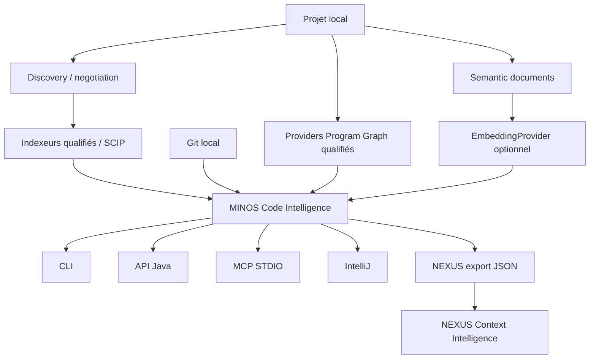

# MINOS — Code Intelligence Engine

**MINOS** construit une connaissance structurée, persistante, interrogeable et explicable d’un codebase.

Il répond notamment à des questions comme :

- où est défini ce symbole ?
- qui l’utilise, l’appelle, l’étend ou l’implémente ?
- de quoi dépend-il ?
- quels tests lui sont liés ?
- quelle est l’architecture observée du projet ?
- quelles sont les dépendances réelles entre modules et comment les visualiser ?
- quels éléments peuvent être potentiellement impactés par une modification ?
- quelles relations entre dépôts sont réellement prouvables ?
- quelles zones ont récemment changé dans Git ?
- quels chemins de programme avancés sont réellement disponibles selon les capacités du provider ?
- quels résultats supplémentaires apporte le retrieval sémantique/hybride lorsqu'il est activé ?

MINOS est **local-first**, **agnostique du langage**, indépendant des fournisseurs d’IA et découplé des formats d’indexation externes par une couche de normalisation.

## Architecture générale



MINOS n’est ni un chatbot ni un LLM. Il produit des **faits de code, dérivations explicables et vues structurées** consommables par des développeurs, outils, agents et moteurs de contexte. La couche sémantique reste optionnelle et ses scores restent `HEURISTIC`.

## État courant

**C0 à M20 sont terminés, validés et livrés sur `main`.**

**M21 a terminé ses gates locaux S1/S3→S9.** Son seul volet encore ouvert est S2/CI, explicitement gelé jusqu’en août 2026. Le tree M21 localement qualifié a été intégré dans `develop` via PR #75.

**M22 — Advanced Provider Intelligence est terminé, validé exact-head et fusionné dans `develop` via PR #77.** Le provider Java `minos-java-source-v1` fournit CFG, def-use, flux interprocéduraux bornés et primitives de sécurité sous capacités/provenance explicites.

**M23 — Semantic Retrieval 2.0 est terminé, validé exact-head et fusionné dans `develop` via PR #79.** Le profil canonique qualifié utilise `minos-local-ollama` / `embeddinggemma` / 768 dimensions. Le scan cosine exact reste le backend autorisé conformément à `KEEP_CURRENT_M20_BACKEND`.

**M24 — Polyglot Expansion est en cours sur `m24-polyglot-expansion` via l’issue #81 et la Draft PR #82.** M24 évalue C/C++, C#, Go et Rust derrière les SPI/provider contracts existants. Aucun nouveau provider n'est promu avant les preuves exact-head Windows + Linux ; une discovery réussie ne vaut pas support d’indexation.

Voir :

- [`docs/STATUS.md`](docs/STATUS.md) — état courant et preuves de promotion ;
- [`docs/ROADMAP.md`](docs/ROADMAP.md) — roadmap produit M0→M27 ;
- [`docs/roadmap/M21_EXECUTION.md`](docs/roadmap/M21_EXECUTION.md) — consolidation post-M20 ;
- [`docs/roadmap/M22_EXECUTION.md`](docs/roadmap/M22_EXECUTION.md) — Advanced Provider Intelligence ;
- [`docs/roadmap/M23_EXECUTION.md`](docs/roadmap/M23_EXECUTION.md) — Semantic Retrieval 2.0 ;
- [`docs/roadmap/M24_EXECUTION.md`](docs/roadmap/M24_EXECUTION.md) — Polyglot Expansion ;
- [`docs/user/polyglot-providers.md`](docs/user/polyglot-providers.md) — prérequis, installation et limitations des providers polyglottes ;
- [`docs/generated/product-facts.md`](docs/generated/product-facts.md) — facts calculables courants.

## Providers polyglottes — M24

Les quatre cibles M24 sont évaluées avec une disposition explicite et des capabilities exhaustives :

| Écosystème | Provider/indexeur | Version M24 | État avant qualification finale |
|---|---|---:|---|
| C / C++ | `scip-clang` | `0.4.0` | `EXPERIMENTAL`, runtime M24 Linux x86_64 uniquement |
| C# | `scip-dotnet` | `0.2.14` | `EXPERIMENTAL`, installation locale MINOS, .NET SDK 10+ |
| Go | `scip-go` | `0.2.7` | `EXPERIMENTAL`, installation locale MINOS |
| Rust | `rust-analyzer scip` | `0.3.2989` / 2026-07-27 | `EXPERIMENTAL`, toolchain opérateur |

Les symboles/références SCIP ne prouvent pas CFG, def-use, data-flow ou sécurité. Les capacités avancées M22 restent spécifiques aux providers qui les démontrent réellement.

Guide complet : **[Providers polyglottes M24](docs/user/polyglot-providers.md)**.

## Installer MINOS sous Windows

L’utilisateur normal **ne clone pas le dépôt MINOS et ne lance pas Maven**.

Une GitHub Release Windows expose :

```text
MINOS-<version>-windows-x64-setup.exe
MINOS-<version>-windows-x64-setup.exe.sha256
minos-<version>-windows-x64.zip
minos-<version>-windows-x64.zip.sha256
```

Le `setup.exe` est le canal recommandé. Le ZIP reste le canal portable / automatisation / diagnostic.

Voir **[Installation PROD Windows](docs/user/production-installation.md)**.

## Utilisation après installation

```powershell
minos.cmd --version
minos.cmd doctor
minos.cmd providers --format json
minos.cmd tools install scip-java
minos.cmd project add N:\workspace-dev\my-project --name my-project
minos.cmd index my-project --dry-run
minos.cmd index my-project
minos.cmd search my-project GreetingPort --format json
```

Le parcours normal ne demande plus de préparer `index.scip` manuellement : MINOS découvre le projet, négocie le provider, vérifie son runtime, calcule la portée d’indexation, exécute le provider, normalise, stage puis promeut le snapshot.

Pour exercer explicitement un provider M24 encore expérimental pendant sa qualification :

```powershell
minos.cmd index my-project --provider scip-go --force-full --format json
```

L'override est un opt-in explicite ; la négociation automatique n'invente pas une qualification.

## Retrieval sémantique learned local — M23

Le sémantique reste **désactivé par défaut**. `local-hash` reste un provider déterministe de référence, explicitement non learned.

Profil canonique M23 :

```powershell
$env:MINOS_SEMANTIC_PROVIDER='ollama'
$env:MINOS_SEMANTIC_MODEL='embeddinggemma'
$env:MINOS_SEMANTIC_DIMENSIONS='768'
$env:MINOS_SEMANTIC_ENDPOINT='http://127.0.0.1:11434/api/embed'
```

MINOS ne télécharge aucun modèle. Le provider intégré refuse les endpoints non-loopback. Les résultats sémantiques restent `HEURISTIC` et ne deviennent jamais des relations de code. Voir [`docs/developer/semantic-retrieval-2.md`](docs/developer/semantic-retrieval-2.md).

## Visualiser le graphe d'architecture

**Guide utilisateur détaillé : [Visualiser le graphe d'architecture MINOS](docs/user/architecture-graph.md).**

```powershell
minos.cmd architecture my-project --format json
minos.cmd architecture my-project --format mermaid |
  Set-Content .\architecture.mmd -Encoding utf8
minos.cmd architecture my-project --format dot |
  Set-Content .\architecture.dot -Encoding utf8
```

Les rendus utilisent uniquement les arêtes réellement présentes dans le snapshot actif.

## Développer MINOS depuis les sources

Prérequis :

```text
Java 24
Maven 3.9.x via Maven Wrapper
Git
Python pour les gates documentaires/qualité
```

Sous Windows :

```powershell
.\mvnw.cmd clean verify
```

La porte locale finale M24 est :

```powershell
.\scripts\m24\run-final.ps1 -ExpectedHead <sha>
```

Sous Linux :

```bash
./scripts/m24/run-final.sh <sha>
```

La qualification M24 rejoue Maven/JaCoCo et les régressions historiques pertinentes, exerce les providers réels applicables, contrôle stable identity/provenance, release Windows et IntelliJ sur Windows, puis revérifie exact HEAD + worktree propre. **Aucune GitHub Actions / CI n'est utilisée comme gate en juillet 2026.**

La version de développement est :

```text
0.2.0-SNAPSHOT
```

Le packaging produit notamment :

```text
target/minos-code-intelligence-0.2.0-SNAPSHOT-all.jar
```

Le launcher du checkout `minos.cmd` recherche automatiquement le shaded JAR courant :

```powershell
.\minos.cmd --help
.\minos.cmd doctor
```

## MCP

Le serveur natif est lancé avec :

```powershell
minos.cmd mcp
```

**MCP STDIO — 23 tools read-only.** Les tools avancés restent capability-honest ; la couche sémantique n'est jamais présentée comme une relation structurale.

## Documentation

- [Guide utilisateur](docs/user/README.md)
- [CLI](docs/user/cli.md)
- [Providers polyglottes](docs/user/polyglot-providers.md)
- [Plugin IntelliJ](docs/user/intellij-plugin.md)
- [API Java](docs/user/java-api.md)
- [MCP](docs/user/mcp.md)
- [NEXUS](docs/user/nexus.md)
- [Dépannage](docs/user/troubleshooting.md)
- [Documentation développeur](docs/developer/README.md)
- [ADR](docs/adr/README.md)
