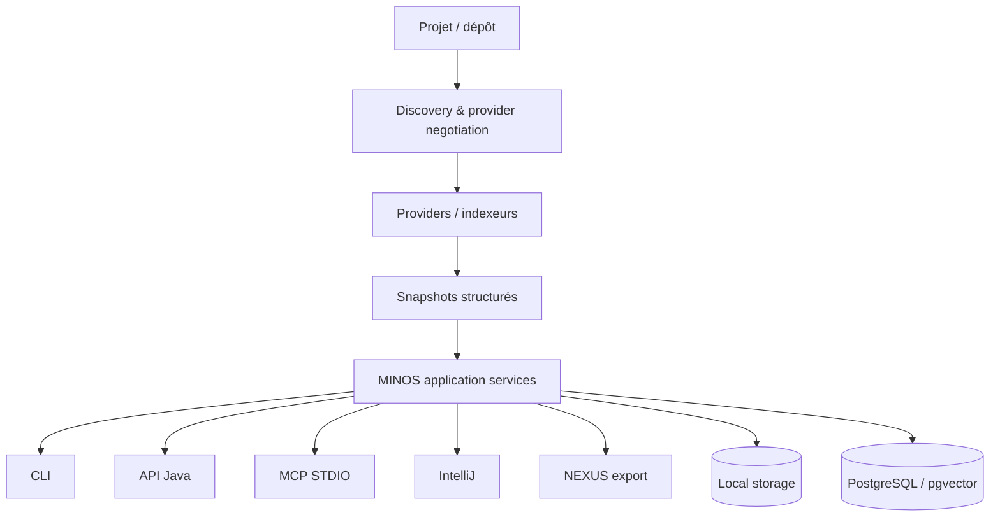

# MINOS — Code Intelligence Engine

**MINOS** construit une connaissance structurée, persistante, interrogeable et explicable d'un codebase pour les développeurs, outils et agents IA.

MINOS est **local-first**, multi-langages, indépendant des fournisseurs d'IA et capability-honest : une capacité absente ou non qualifiée n'est jamais présentée comme acquise.

## État courant

```text
C0 → M30                         ✅ terminés / intégrés
MINOS 1.0.0                      ✅ publiée le 1er août 2026 / immuable
MINOS 1.0.1                      ✅ publiée le 9 août 2026 / immuable
M29 #107                         ✅ CLOSED / PR #108 merged
M30                              ✅ PR #110 + promotion #111 merged
hardening #113/#117              ✅ merged
readiness 1.0.1 #118/#119        ✅ merged / qualifiée
correctifs installateur #122–127 ✅ merged / qualifiés
#98 sandbox OS worker réelle     ✅ CLOSED / qualifiée Linux + Windows
```

La release **1.0.1** corrige le runtime Windows 1.0.0, intègre le backend Docker autonome M29, l'installateur avancé M30, PostgreSQL/pgvector et Ollama, puis applique le hardening sécurité/CI/release issu de l'audit complet.

Tag publié et immuable :

```text
v1.0.1 → f762025d66e33c40324c811079f1527d122f90f9
```

Release : [MINOS v1.0.1](https://github.com/FTurleque/minos-code-intelligence/releases/tag/v1.0.1).

La publication finale a été effectuée après validation utilisateur réelle du setup Windows. Le workflow transactionnel a reconstruit le candidat exact, rejoué le Plugin Verifier IntelliJ et les smokes Windows, publié **10 assets**, puis re-téléchargé et vérifié les **5 paires payload/SHA-256**.

Voir [`docs/STATUS.md`](docs/STATUS.md), [`docs/ROADMAP.md`](docs/ROADMAP.md) et [`docs/releases/1.0.1.md`](docs/releases/1.0.1.md).

## Capacités principales

MINOS sait notamment :

- découvrir projets, modules, langages et systèmes de build ;
- négocier et exécuter des providers/indexeurs qualifiés ;
- maintenir des snapshots structurés persistants ;
- rechercher symboles, occurrences, références et relations ;
- analyser architecture, dépendances, impact, tests liés et ProgramGraph ;
- exploiter Git et des workspaces multi-dépôts ;
- proposer un retrieval sémantique/hybride local optionnel ;
- importer des observations runtime partielles ;
- exposer le moteur via CLI, API Java, MCP STDIO, IntelliJ et export NEXUS ;
- exécuter le MCP en natif Windows ou dans le backend Docker autonome M29 ;
- stocker localement ou dans PostgreSQL/pgvector ;
- utiliser `disabled | local-hash | ollama` comme provider sémantique.

## Architecture

Le reactor Maven contient les modules métier, runtime/provider/storage et surfaces publiques, avec `minos-app` comme composition root. La documentation architecture détaillée est sous [`docs/architecture/`](docs/architecture/README.md).



## Installation Windows 1.0.1

Le parcours utilisateur normal ne nécessite pas de cloner le dépôt, ni d'installer Java pour exécuter MINOS. Le setup embarque son runtime Java.

Le wizard propose deux niveaux :

```text
Standard — recommandé
Avancée
```

En mode avancé, trois axes restent indépendants :

```text
runtime MCP   : native | docker | none
stockage      : local | postgresql
sémantique    : disabled | local-hash | ollama
```

### Mode MCP

Le choix est exclusif :

```text
MCP natif Windows — recommandé
MCP Docker — isolation renforcée
Ne pas configurer maintenant
```

Si Docker est explicitement sélectionné mais indisponible, le wizard bloque. Il n'existe aucun fallback silencieux vers le natif.

Tous les clients IA utilisent toujours le même point d'entrée :

```text
command = <installation>\app\minos.exe
args    = mcp
env     = MINOS_HOME=<data-root>
```

Le routage `native|docker` reste derrière `minos.exe mcp` ; changer de backend ne réécrit pas les clients.

### Clients IA détectés

La page d'intégration expose séparément :

- GitHub Copilot — JetBrains / IntelliJ ;
- GitHub Copilot CLI ;
- Claude CLI / Claude Code ;
- Claude Desktop ;
- OpenAI Codex CLI ;
- OpenAI Codex Desktop.

Une case n'est activable que lorsque son intégration est réellement détectée. Le faux launcher `copilot` de VS Code est rejeté. Codex CLI et Codex Desktop sont présentés séparément mais utilisent une seule intégration MINOS nommée : le wizard interdit de sélectionner les deux simultanément.

### PostgreSQL / pgvector et Ollama

En Docker, MINOS peut gérer PostgreSQL/pgvector et Ollama sur le réseau interne du runtime avec volumes persistants. Aucun port public n'est nécessaire au query plane.

En mode natif, PostgreSQL et Ollama sont des services externes/localement existants fournis par l'utilisateur. Une base PostgreSQL externe non-loopback doit utiliser `sslmode=verify-full`; les credentials restent séparés de l'URL JDBC. MINOS ne prétend pas installer un binaire Ollama natif.

La page **Résumé de l'installation** indique avant le lancement : programme/data roots, backend MCP, stockage, provider sémantique, clients IA sélectionnés et composants Docker réellement gérés.

Guide complet : [`docs/user/production-installation.md`](docs/user/production-installation.md).

## Runtime Windows corrigé

Le runtime 1.0.1 est calculé depuis le fat JAR final :

```text
fat JAR
→ jdeps JDK 24
→ modules racines
→ jpackage
→ runtime/bin/java --list-modules
→ assertion java.xml
```

Cela corrige le défaut 1.0.0 `NoClassDefFoundError: org/w3c/dom/Node` sans modifier le tag 1.0.0.

## Sécurité et gates de release

Le hardening post-audit impose notamment :

- Jackson 2 et Jackson 3 sur des versions corrigées ;
- scan OSV bloquant sur les dépendances ;
- PostgreSQL/pgvector réel obligatoire sur le gate Linux ;
- CI sur PR puis sur les HEAD intégrés de `develop`/`main` ;
- JaCoCo étendu aux responsabilités M29/M30 ;
- handshake MCP réel sur ZIP et setup installé ;
- build + Plugin Verifier IntelliJ ;
- smoke install/handshake/uninstall du setup Windows ;
- publication fail-closed sur provenance, tag, release, assets et checksums.

## Développement

Pré-requis principaux : JDK 24 et Maven Wrapper du dépôt.

```powershell
.\mvnw.cmd clean verify
```

Sur Linux/macOS :

```bash
./mvnw clean verify
```

La qualification Linux exige en plus un Docker utilisable pour les tests PostgreSQL/pgvector.

## Documentation

- état : [`docs/STATUS.md`](docs/STATUS.md)
- roadmap : [`docs/ROADMAP.md`](docs/ROADMAP.md)
- architecture : [`docs/architecture/README.md`](docs/architecture/README.md)
- ADR : [`docs/adr/README.md`](docs/adr/README.md)
- installation Windows : [`docs/user/production-installation.md`](docs/user/production-installation.md)
- Docker runtime : [`docs/user/docker-runtime.md`](docs/user/docker-runtime.md)
- release 1.0.1 : [`docs/releases/1.0.1.md`](docs/releases/1.0.1.md)

## Sandbox worker OS

L'issue **#98** est **fermée / completed** depuis le **9 août 2026**. La sandbox worker réelle est qualifiée sur Linux (`bubblewrap`/namespaces/`prlimit`) et Windows (AppContainer + Job Object). `DENY` reste fail-closed lorsqu'une primitive OS qualifiée n'est pas disponible.

## Licence

MINOS Code Intelligence est un logiciel **propriétaire source-available**. La visibilité publique du dépôt donne accès au code source mais ne transforme pas MINOS en logiciel open source, libre ou dans le domaine public.

Aucun droit général d'utilisation, d'exécution, de déploiement, de modification, de redistribution ou de commercialisation n'est accordé sans autorisation écrite préalable du titulaire des droits, sous réserve des droits imposés par la loi ou les conditions contraignantes de GitHub.

Voir [`LICENSE`](LICENSE) pour les conditions complètes et [`CONTRIBUTING.md`](CONTRIBUTING.md) pour la politique de contribution.
