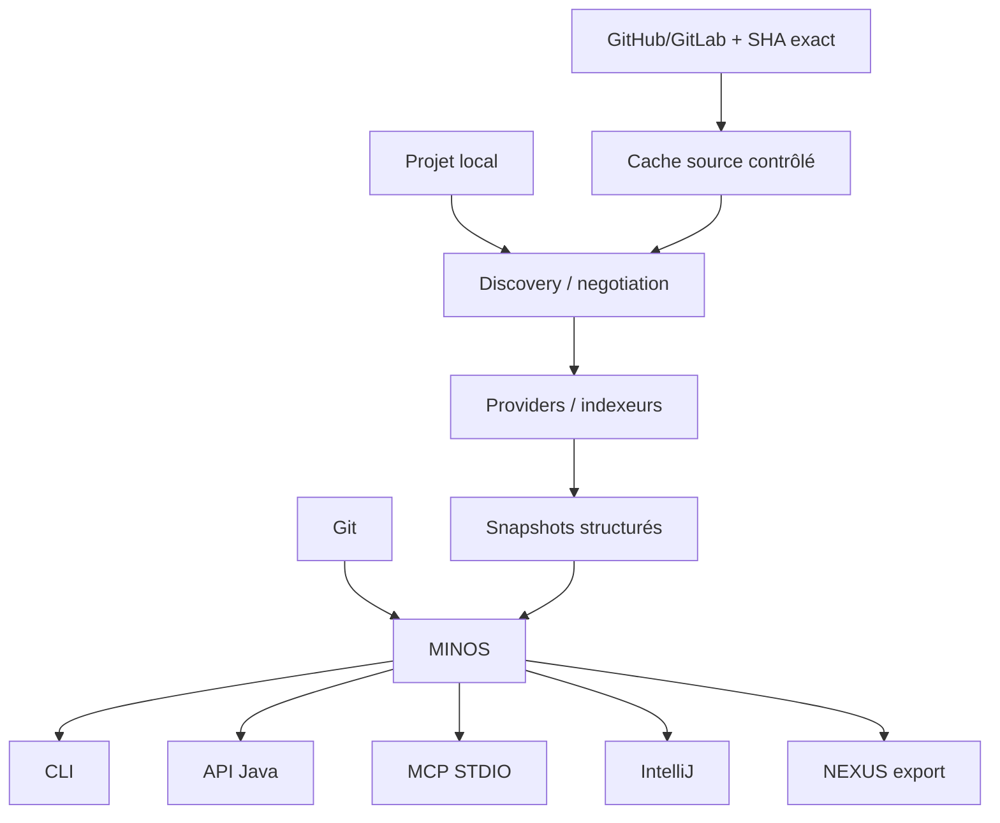

# MINOS — Code Intelligence Engine

**MINOS** construit une connaissance structurée, persistante, interrogeable et explicable d'un codebase pour les développeurs, outils et agents IA.

MINOS est **local-first**, agnostique du langage, indépendant des fournisseurs d'IA et capability-honest : une capacité absente ou non qualifiée n'est jamais présentée comme acquise.

## État courant

```text
C0 → M28                         ✅ terminés / intégrés sur main
MINOS 1.0.0                      ✅ publiée le 1er août 2026
main/tag v1.0.0                  1adbc45339efe37cd26d1937025bfa69d7b57811
M21 #73                          ✅ CLOSED / completed
M28 #93                          ✅ CLOSED / completed
PR de promotion #102             ✅ MERGED
#98 sandbox OS worker réelle     🚧 OPEN
MINOS 1.0.1                      🚧 correctif Windows en préparation, NON PUBLIÉ
```

La release 1.0.0 reste immuable. Un défaut du runtime Java embarqué Windows a été découvert après publication : le MCP natif peut échouer avec `NoClassDefFoundError: org/w3c/dom/Node` parce que l'image `jpackage` 1.0.0 ne contient pas tous les modules JDK requis.

Le candidat **1.0.1** corrige le packaging via `jdeps`, ajoute un handshake MCP réel aux gates de release, restaure le Wizard de détection des clients MCP et isole les smoke tests du setup. Voir [`docs/releases/1.0.1.md`](docs/releases/1.0.1.md).

## Ce que MINOS sait faire

- découvrir projets, modules, langages et systèmes de build ;
- négocier et exécuter des providers/indexeurs qualifiés ;
- maintenir des snapshots structurés persistants ;
- rechercher symboles, occurrences, références et relations ;
- analyser architecture, dépendances et impact ;
- relier des tests par signaux explicables ;
- exploiter Git et des workspaces multi-dépôts ;
- fournir un `ProgramGraph` avancé lorsque le provider le prouve : CFG, def-use, flux interprocéduraux bornés et primitives de sécurité ;
- proposer un retrieval sémantique/hybride local optionnel ;
- indexer des révisions distantes immuables avec provenance ;
- importer des observations runtime partielles ;
- offrir un contrôle Team/Hosted embarqué, local-first et explicitement non-SaaS ;
- exposer le moteur via CLI, API Java, MCP STDIO, IntelliJ et export NEXUS.

## Architecture



## Installation Windows

Le parcours utilisateur normal ne nécessite pas de cloner le dépôt MINOS.

Une release complète publie :

```text
MINOS-<version>-windows-x64-setup.exe
MINOS-<version>-windows-x64-setup.exe.sha256
minos-<version>-windows-x64.zip
minos-<version>-windows-x64.zip.sha256
minos-<version>.cdx.json
minos-<version>.cdx.json.sha256
MINOS-<version>-THIRD-PARTY-NOTICES.txt
MINOS-<version>-THIRD-PARTY-NOTICES.txt.sha256
```

Le guide utilisateur autoritatif est : **[Installation PROD Windows](docs/user/production-installation.md)**.

### Candidat Windows 1.0.1

À partir du candidat 1.0.1, le setup affiche une page dédiée :

```text
Intégrations MCP natives
Connecter le MCP natif MINOS à vos clients IA détectés
```

Clients pris en compte :

- GitHub Copilot — JetBrains / IntelliJ ;
- GitHub Copilot CLI, uniquement si sa capability MCP est réellement disponible ;
- Claude Code ;
- Claude Desktop ;
- OpenAI Codex CLI ou Codex Desktop/config utilisateur.

Un faux launcher `copilot` provenant de VS Code ne suffit plus à rendre la case disponible.

## Correctif runtime 1.0.1

Le runtime Windows est maintenant calculé depuis le JAR final :

```text
fat JAR
→ JDK 24 jdeps --print-module-deps
→ modules racines calculés
→ jpackage --add-modules <liste>
→ runtime/bin/java --list-modules
→ contrôle des modules + assertion java.xml
```

La release ne se contente plus de vérifier `minos --version`. Elle exige un vrai handshake MCP sur les artefacts Windows :

```text
initialize
→ notifications/initialized
→ tools/list
→ tools MINOS attendus
```

Le setup automatisé de smoke utilise un AppId distinct et ne doit pas toucher le PATH, Docker ni les états MCP d'une installation MINOS réelle.

## Utilisation rapide

Après installation :

```powershell
minos.cmd --version
minos.cmd doctor
minos.cmd providers --format json
minos.cmd tools install scip-java
minos.cmd project add C:\workspace\my-project --name my-project
minos.cmd index my-project
minos.cmd search my-project GreetingPort --format json
minos.cmd architecture my-project --format mermaid
```

Le parcours d'indexation normal est :

```text
discovery
→ provider negotiation
→ runtime check
→ indexation
→ normalisation
→ staging
→ promotion du snapshot
```

## MCP natif

Le MCP Windows natif est lancé par :

```text
command = <installation>\app\minos.exe
args    = mcp
env     = MINOS_HOME=%LOCALAPPDATA%\MINOS\data
```

Les intégrations installées par MINOS conservent un état d'ownership et des sauvegardes afin de ne pas écraser ou supprimer les configurations tierces qu'elles ne possèdent pas.

Guide : [`docs/user/mcp.md`](docs/user/mcp.md).

## Providers polyglottes

M24 a ajouté des providers C/C++, C#, Go et Rust derrière les mêmes contrats de discovery/capabilities. Leur présence ne signifie pas que toutes les capacités avancées M22 sont disponibles : les claims restent provider-specific et evidence-gated.

Guide : [`docs/user/polyglot-providers.md`](docs/user/polyglot-providers.md).

## Remote / Distributed Indexing

M25 matérialise et indexe des révisions distantes immuables avec SHA complet, provenance et bundle vérifié.

La disposition sécurité reste explicite :

```text
network DENY sans backend OS prouvé → fail-closed
untrusted code                      → unsupported
sandbox OS claim                    → prohibited
```

La vraie sandbox OS Windows/Linux reste suivie par **#98**.

Guide : [`docs/user/remote-indexing.md`](docs/user/remote-indexing.md).

## Runtime Intelligence

M26 accepte des observations runtime partielles corrélées au snapshot statique exact. Leur absence ne prouve jamais l'absence d'exécution.

Guide : [`docs/user/runtime-intelligence.md`](docs/user/runtime-intelligence.md).

## Team / Hosted Mode

M27 apporte un contrôle tenant embarqué et opt-in : RBAC, workspaces partagés, chiffrement AES-256-GCM, audit chaîné, rétention et rotation de clés.

Cela reste une capacité **EMBEDDED_LOCAL_FIRST**, pas un SaaS opéré.

Guide : [`docs/user/team-hosted-mode.md`](docs/user/team-hosted-mode.md).

## Développement depuis les sources

Prérequis principaux :

```text
JDK 24
Maven Wrapper du dépôt
Git
Python 3 pour plusieurs gates/outils
```

Build Maven :

```powershell
.\mvnw.cmd clean verify
```

La version de développement courante est :

```text
1.0.1-SNAPSHOT
```

### Construire localement le candidat Windows 1.0.1

Le runner prévu pour la validation avant publication est :

```powershell
.\scripts\release\build-local-windows-candidate.ps1 -Version 1.0.1
```

Il :

- exige un worktree propre ;
- construit la distribution ;
- vérifie les intégrations/preflight ;
- dérive et contrôle le runtime Java ;
- lance un handshake MCP réel sur la distribution ;
- produit le ZIP et le `setup.exe` de production ;
- n'installe pas automatiquement le setup de production ;
- ne crée aucun tag ;
- ne publie aucune release ;
- ne déclenche aucun workflow GitHub Actions.

Artefact attendu :

```text
target\dist\MINOS-1.0.1-windows-x64-setup.exe
```

La vérification visuelle du Wizard et la connexion réelle du MCP dans Copilot restent obligatoires avant autorisation de publication.

## Documentation

- état courant : [`docs/STATUS.md`](docs/STATUS.md) ;
- roadmap : [`docs/ROADMAP.md`](docs/ROADMAP.md) ;
- M28 final : [`docs/roadmap/M28_EXECUTION.md`](docs/roadmap/M28_EXECUTION.md) ;
- release 1.0.0 : [`docs/releases/1.0.0.md`](docs/releases/1.0.0.md) ;
- candidat 1.0.1 : [`docs/releases/1.0.1.md`](docs/releases/1.0.1.md) ;
- installation Windows : [`docs/user/production-installation.md`](docs/user/production-installation.md) ;
- facts générés : [`docs/generated/product-facts.md`](docs/generated/product-facts.md).

Les documents de `docs/history/` et les roadmaps d'exécution anciennes peuvent contenir des versions/états historiques. Ils ne constituent pas l'état courant du produit.

## Licence

MINOS Code Intelligence est un logiciel **propriétaire source-available**. La visibilité publique du dépôt donne accès au code source mais ne transforme pas MINOS en logiciel open source, libre ou dans le domaine public.

Aucun droit général d'utilisation, d'exécution, de déploiement, de modification, de redistribution ou de commercialisation n'est accordé sans autorisation écrite préalable du titulaire des droits, sous réserve des droits imposés par la loi ou les conditions contraignantes de GitHub.

Voir [`LICENSE`](LICENSE) pour les conditions complètes et [`CONTRIBUTING.md`](CONTRIBUTING.md) pour la politique de contribution.
