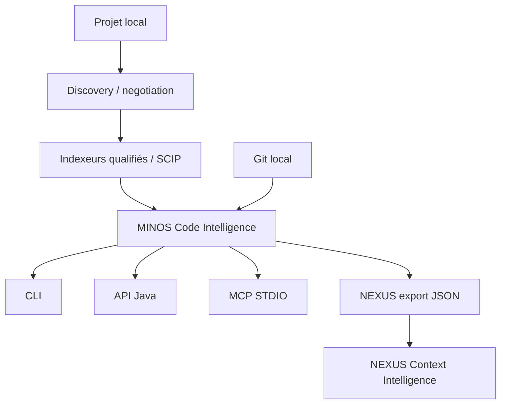

# MINOS — Code Intelligence Engine

**MINOS** construit une connaissance structurée, persistante, interrogeable et explicable d’un codebase.

Il répond notamment à des questions comme :

- où est défini ce symbole ?
- qui l’utilise, l’appelle, l’étend ou l’implémente ?
- de quoi dépend-il ?
- quels tests lui sont liés ?
- quelle est l’architecture observée du projet ?
- quels éléments peuvent être potentiellement impactés par une modification ?
- quelles relations entre dépôts sont réellement prouvables ?
- quelles zones ont récemment changé dans Git ?

MINOS est **local-first**, **agnostique du langage**, indépendant des fournisseurs d’IA et découplé des formats d’indexation externes par une couche de normalisation.

## Architecture générale



MINOS n’est ni un chatbot ni un LLM. Il produit des **faits de code, dérivations explicables et vues structurées** consommables par des développeurs, outils, agents et moteurs de contexte.

## État courant

C0 à M13 sont terminés et livrés.

**M14 est en cours de qualification** : l’implémentation structurelle de l’indexation autonome et de l’installation native Windows est présente sur sa branche/PR de travail, mais elle ne sera déclarée livrée qu’après validation exacte du head, replays providers réels et packaging Windows.

Voir :

- [`docs/STATUS.md`](docs/STATUS.md) — état livré ;
- [`docs/ROADMAP.md`](docs/ROADMAP.md) — roadmap produit ;
- [`docs/roadmap/M14_EXECUTION.md`](docs/roadmap/M14_EXECUTION.md) — progression détaillée M14.

## Utilisation cible M14

Après installation :

```powershell
minos.cmd --version
minos.cmd doctor
minos.cmd tools install scip-java
minos.cmd project add N:\workspace-dev\my-project --name my-project
minos.cmd index my-project --dry-run
minos.cmd index my-project
minos.cmd search my-project GreetingPort --format json
```

Le parcours normal ne demande plus de préparer `index.scip` manuellement : MINOS découvre le projet, négocie le provider, vérifie son runtime, calcule la portée d’indexation, exécute le provider, normalise, stage puis promeut le snapshot.

L’import d’un artefact SCIP explicite reste disponible pour le diagnostic :

```powershell
minos.cmd import-scip my-project `
  --file N:\temp\index.scip `
  --provider external-provider
```

## Développer MINOS depuis les sources

### Prérequis

```text
Java 24
Maven 3.9.x via Maven Wrapper
Git
```

Sous Windows PowerShell :

```powershell
.\mvnw.cmd clean verify
```

La version de développement M14 est actuellement :

```text
0.2.0-SNAPSHOT
```

Le packaging produit notamment un shaded JAR :

```text
target/minos-code-intelligence-0.2.0-SNAPSHOT-all.jar
```

Le launcher du checkout `minos.cmd` recherche automatiquement le shaded JAR courant :

```powershell
.\minos.cmd --help
.\minos.cmd doctor
```

## Distribution Windows native

M14 introduit un build de distribution :

```powershell
.\scripts\release\build-windows-distribution.ps1 -Version 0.2.0
```

Sorties :

```text
target/dist/minos-0.2.0-windows-x64.zip
target/dist/minos-0.2.0-windows-x64.zip.sha256
```

Le ZIP contient une app-image `jpackage` avec le runtime Java nécessaire à MINOS, les launchers CLI/MCP et un installateur PowerShell.

Voir [Installation PROD Windows](docs/user/production-installation.md).

## Capacités CLI

### Projet, runtime et index

```text
doctor
tools list / install / verify
project add
project list
project inspect / inspect
index
import-scip
index-status
```

### Code Intelligence

```text
search
find-symbol
get-source
find-usages
find-implementations
find-callers
find-callees
dependencies
dependents
related-tests
architecture
impact
```

### Intégrations

```text
API Java M11/M12
MCP STDIO — 15 tools read-only
Git Intelligence via JGit
Workspaces multi-repositories
nexus-export — contrat JSON M13
```

## MCP

Le mode natif M14 vise :

```text
command = <installation>\minos.cmd
args    = mcp
```

Docker reste un mode MCP durci optionnel : pas de réseau, filesystem read-only et projets read-only. Il n’est pas le moteur principal de compilation/indexation des projets.

## Documentation

### Utilisateur

- [Guide utilisateur](docs/user/README.md)
- [Installation PROD Windows](docs/user/production-installation.md)
- [Indexation autonome](docs/user/autonomous-indexing.md)
- [Installation depuis les sources](docs/user/installation.md)
- [CLI](docs/user/cli.md)
- [API Java](docs/user/java-api.md)
- [MCP](docs/user/mcp.md)
- [MINOS → NEXUS](docs/user/nexus.md)
- [Dépannage](docs/user/troubleshooting.md)

### Développeur

- [Guide développeur](docs/developer/README.md)
- [Architecture interne](docs/developer/architecture.md)
- [Modèle de domaine](docs/developer/domain-model.md)
- [Indexation, lifecycle et stockage](docs/developer/indexing-and-storage.md)
- [Surfaces publiques](docs/developer/public-surfaces.md)
- [Multi-dépôts et Git](docs/developer/multi-repo-git.md)
- [Tests et contribution](docs/developer/testing.md)

### Architecture et historique

- [ADR](docs/adr/README.md)
- [Historique](docs/history/README.md)
- [Roadmap](docs/ROADMAP.md)

## Stack

```text
Java             24
Build            Maven 3.9.x
SCIP bindings    0.9.0
MCP Java SDK     2.0.0
Git              Eclipse JGit 7.6.0.202603022253-r
MCP transport    STDIO
Serveur HTTP     aucun requis dans le cœur
```

## Principes

- **MINOS-first, Glean-optional** ;
- faits, dérivations et heuristiques restent distincts ;
- provenance et preuves sont conservées ;
- les limitations fournisseur ne deviennent jamais des garanties ;
- les snapshots sont promus de façon cohérente ;
- l’incrémental n’est activé que lorsqu’un provider le prouve ;
- l’impact est potentiel, pas une certitude runtime ;
- une relation cross-repository exige une identité exacte et unique ;
- l’activité Git n’est pas une mesure automatique d’importance architecturale ;
- CLI, API, MCP et NEXUS sont des surfaces d’exposition, pas des duplications du métier.

> Règle de développement : **mesurer avant d’industrialiser**.
