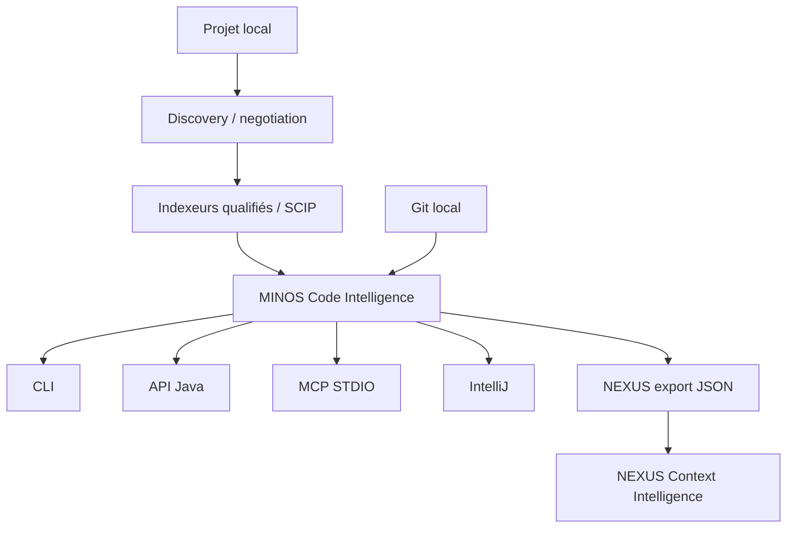

# MINOS — Code Intelligence Engine

**MINOS** construit une connaissance structurée, persistante, interrogeable et explicable d’un codebase.

Il répond notamment à des questions comme :

- où est défini ce symbole ?
- qui l’utilise, l’appelle, l’étend ou l’implémente ?
- de quoi dépend-il ?
- quels tests lui sont liés ?
- quelle est l’architecture observée du projet ?
- quelles sont les dépendances réelles entre modules et comment les visualiser ?
- quels éléments peuvent être potentiellement impactés par une modification ?
- quelles relations entre dépôts sont réellement prouvables ?
- quelles zones ont récemment changé dans Git ?
- quels chemins de programme avancés sont réellement disponibles selon les capacités du provider ?
- quels résultats supplémentaires apporte le retrieval sémantique/hybride lorsqu'il est activé ?

MINOS est **local-first**, **agnostique du langage**, indépendant des fournisseurs d’IA et découplé des formats d’indexation externes par une couche de normalisation.

## Architecture générale



MINOS n’est ni un chatbot ni un LLM. Il produit des **faits de code, dérivations explicables et vues structurées** consommables par des développeurs, outils, agents et moteurs de contexte. La couche sémantique M20 reste optionnelle et ses scores restent `HEURISTIC`.

## État courant

**C0 à M20 sont terminés, validés et livrés.**

M20 a ajouté la couche Semantic & Hybrid Code Intelligence : documents sémantiques, `EmbeddingProvider` optionnel, vector store reconstruisible, recherche sémantique/hybride, contexte borné, API additive, 23 tools MCP et signaux NEXUS v2.

**M21 — Production Integrity & Surface Convergence est en cours** sur `m21-production-integrity`. Ce jalon consolide CI, quality gates M19/M20, frontières Maven, documentation, supply-chain, parité IntelliJ et qualification de performance avant toute nouvelle phase fonctionnelle lourde.

Voir :

- [`docs/STATUS.md`](docs/STATUS.md) — état livré et jalon actif ;
- [`docs/ROADMAP.md`](docs/ROADMAP.md) — roadmap produit M0→M27 ;
- [`docs/roadmap/M21_EXECUTION.md`](docs/roadmap/M21_EXECUTION.md) — consolidation post-M20 ;
- [`docs/generated/product-facts.md`](docs/generated/product-facts.md) — facts calculables courants.

## Installer MINOS sous Windows

L’utilisateur normal **ne clone pas le dépôt MINOS et ne lance pas Maven**.

Une GitHub Release Windows expose deux canaux :

```text
MINOS-<version>-windows-x64-setup.exe
MINOS-<version>-windows-x64-setup.exe.sha256

minos-<version>-windows-x64.zip
minos-<version>-windows-x64.zip.sha256
```

Le **`setup.exe` est le canal recommandé** pour un poste Windows. Il installe l'application, son runtime Java, la CLI, le MCP natif, l'intégration PATH et le désinstalleur Windows.

Pendant l'installation, l'utilisateur peut choisir explicitement d'enregistrer le MCP natif MINOS dans :

```text
GitHub Copilot — JetBrains / IntelliJ
GitHub Copilot CLI
Claude Code
Claude Desktop
OpenAI Codex
```

Ces intégrations utilisent directement `app\minos.exe mcp` et **ne nécessitent pas Docker**. Le setup peut séparément configurer le MCP Docker si Docker Desktop est déjà installé et démarré.

Le ZIP reste le canal **portable / automatisation / diagnostic** et contient la même application MINOS, les scripts d'intégration MCP natifs, les scripts Docker et l'installateur PowerShell portable.

Parcours recommandé :

```text
GitHub Release
→ télécharger setup.exe + SHA-256
→ vérifier SHA-256
→ lancer setup.exe
→ choisir éventuellement les clients MCP natifs
→ choisir éventuellement le MCP Docker
→ minos.cmd doctor
```

Voir **[Installation PROD Windows](docs/user/production-installation.md)** pour le téléchargement, l’installation, les clients MCP natifs, le MCP Docker, les providers, la mise à jour, le rollback et la désinstallation.

## Utilisation après installation

```powershell
minos.cmd --version
minos.cmd doctor
minos.cmd tools install scip-java
minos.cmd project add N:\workspace-dev\my-project --name my-project
minos.cmd index my-project --dry-run
minos.cmd index my-project
minos.cmd search my-project GreetingPort --format json
```

Le parcours normal ne demande plus de préparer `index.scip` manuellement : MINOS découvre le projet, négocie le provider, vérifie son runtime, calcule la portée d’indexation, exécute le provider, normalise, stage puis promeut le snapshot.

L’import d’un artefact SCIP explicite reste disponible pour le diagnostic :

```powershell
minos.cmd import-scip my-project `
  --file N:\temp\index.scip `
  --provider external-provider
```

## Visualiser le graphe d'architecture

**Guide utilisateur détaillé : [Visualiser le graphe d'architecture MINOS](docs/user/architecture-graph.md).**

MINOS expose le graphe dans IntelliJ et peut aussi l'exporter hors IDE en JSON, Mermaid ou Graphviz DOT.

```powershell
minos.cmd architecture my-project --format json
minos.cmd architecture my-project --format mermaid |
  Set-Content .\architecture.mmd -Encoding utf8
minos.cmd architecture my-project --format dot |
  Set-Content .\architecture.dot -Encoding utf8
```

Avec Graphviz installé :

```powershell
dot -Tsvg .\architecture.dot -o .\architecture.svg
Start-Process .\architecture.svg
```

Sur un gros projet, limiter le graphe au voisinage direct d'un module :

```powershell
minos.cmd architecture my-project --module packages/api --format mermaid
```

Les rendus utilisent uniquement les arêtes réellement présentes dans le snapshot actif.

## Développer MINOS depuis les sources

### Prérequis

```text
Java 24
Maven 3.9.x via Maven Wrapper
Git
Python pour les gates documentaires/qualité
```

Sous Windows PowerShell :

```powershell
.\mvnw.cmd clean verify
```

Pour la consolidation M21, la porte locale courante est :

```powershell
.\scripts\m21\run-local.ps1
```

La version de développement est actuellement :

```text
0.2.0-SNAPSHOT
```

Le packaging produit notamment un shaded JAR :

```text
target/minos-code-intelligence-0.2.0-SNAPSHOT-all.jar
```

Le launcher du checkout `minos.cmd` recherche automatiquement le shaded JAR courant :

```powershell
.\minos.cmd --help
.\minos.cmd doctor
```

## Construire ou publier une distribution Windows

Cette section concerne les mainteneurs. Les utilisateurs téléchargent une GitHub Release.

Construire la distribution portable :

```powershell
.\scripts\release\build-windows-distribution.ps1 -Version 0.2.0-rc2
```

Construire ensuite le setup Windows avec Inno Setup 6/7 :

```powershell
.\scripts\release\build-windows-installer.ps1 -Version 0.2.0-rc2
```

Sorties :

```text
target/dist/MINOS-0.2.0-rc2-windows-x64-setup.exe
target/dist/MINOS-0.2.0-rc2-windows-x64-setup.exe.sha256
target/dist/minos-0.2.0-rc2-windows-x64.zip
target/dist/minos-0.2.0-rc2-windows-x64.zip.sha256
```

Publier depuis un poste Windows avec GitHub CLI authentifié :

```powershell
.\scripts\release\publish-windows-release.ps1 -Version 0.2.0-rc2
```

Le même parcours est disponible manuellement dans GitHub Actions via **Publish Windows Release**. Le workflow valide aussi le cycle installation/désinstallation des intégrations MCP natives, construit les deux distributions, vérifie les checksums, smoke-teste le ZIP et le `setup.exe`, vérifie la désinstallation, refuse de remplacer une version/tag existant, puis attache les quatre assets à la GitHub Release.

## Capacités CLI

### Projet, runtime et index

```text
doctor
tools list / install / verify
project add
project list
project inspect / inspect
index
import-scip
index-status
providers
```

### Code Intelligence

```text
search
find-symbol
get-source
find-usages
find-implementations
find-callers
find-callees
dependencies
dependents
related-tests
architecture
impact
```

`architecture` supporte `text`, `json`, `mermaid` et `dot` ; la sortie JSON contient les arêtes inter-modules détaillées.

Le catalogue CLI exact courant est généré dans [`docs/generated/product-facts.md`](docs/generated/product-facts.md).

### Intégrations

```text
API Java v1 + surfaces additives Provider / Advanced / Semantic
MCP STDIO — 23 tools read-only
Git Intelligence via JGit
Workspaces multi-repositories
IntelliJ — client externe minos-ide v1
nexus-export — contrat local versionné + signaux sémantiques v2
```

## MCP

Le mode natif recommandé pour les clients est :

```text
command = <installation>\app\minos.exe
args    = mcp
env     = MINOS_HOME=%LOCALAPPDATA%\MINOS\data
```

Le catalogue courant contient **23 tools read-only**, incluant les surfaces architecture, Program Graph / Impact v2 / security paths et Semantic / Hybrid Code Intelligence. La liste exacte est générée dans [`docs/generated/product-facts.md`](docs/generated/product-facts.md).

Docker reste un mode MCP durci optionnel : pas de réseau, filesystem read-only et projets read-only. Le `setup.exe` peut préparer, démarrer et valider ce mode si Docker Desktop est déjà opérationnel. Docker n’est pas le moteur principal de compilation/indexation des projets et n'est pas requis pour les intégrations MCP natives.

## Documentation

### Utilisateur

- **[Guide utilisateur — commencer ici](docs/user/README.md)**
- **[Plugin IntelliJ](docs/user/intellij-plugin.md)**
- **[Visualiser le graphe d'architecture](docs/user/architecture-graph.md)**
- [Installation PROD Windows](docs/user/production-installation.md)
- [Indexation autonome](docs/user/autonomous-indexing.md)
- [Installation depuis les sources](docs/user/installation.md)
- [CLI](docs/user/cli.md)
- [API Java](docs/user/java-api.md)
- [MCP](docs/user/mcp.md)
- [MINOS → NEXUS](docs/user/nexus.md)
- [Dépannage](docs/user/troubleshooting.md)

### Développeur

- [Guide développeur](docs/developer/README.md)
- [Architecture interne](docs/developer/architecture.md)
- [Modèle de domaine](docs/developer/domain-model.md)
- [Indexation, lifecycle et stockage](docs/developer/indexing-and-storage.md)
- [Surfaces publiques](docs/developer/public-surfaces.md)
- [Multi-dépôts et Git](docs/developer/multi-repo-git.md)
- [Semantic & Hybrid Intelligence](docs/developer/semantic-hybrid-intelligence.md)
- [Tests et contribution](docs/developer/testing.md)

### Architecture, roadmap et historique

- [ADR](docs/adr/README.md)
- [Historique](docs/history/README.md)
- [Roadmap](docs/ROADMAP.md)
- [M21 — Production Integrity](docs/roadmap/M21_EXECUTION.md)

## Stack

```text
Java             24
Build            Maven 3.9.x
Plugin IntelliJ  Java 21 / IntelliJ Platform
SCIP bindings    0.9.0
MCP Java SDK     2.0.0
Git              Eclipse JGit 7.6.0.202603022253-r
MCP transport    STDIO
Serveur HTTP     aucun requis dans le cœur
```

## Principes

- **MINOS-first, Glean-optional** ;
- faits, dérivations et heuristiques restent distincts ;
- provenance et preuves sont conservées ;
- les limitations fournisseur ne deviennent jamais des garanties ;
- les snapshots sont promus de façon cohérente ;
- l’incrémental n’est activé que lorsqu’un provider le prouve ;
- l’impact est potentiel, pas une certitude runtime ;
- une relation cross-repository exige une identité exacte et unique ;
- l’activité Git n’est pas une mesure automatique d’importance architecturale ;
- le sémantique reste un signal de retrieval/ranking, jamais une relation de code ;
- CLI, API, MCP, IntelliJ et NEXUS sont des surfaces d’exposition, pas des duplications du métier.

> Règle de développement : **mesurer avant d’industrialiser**.
