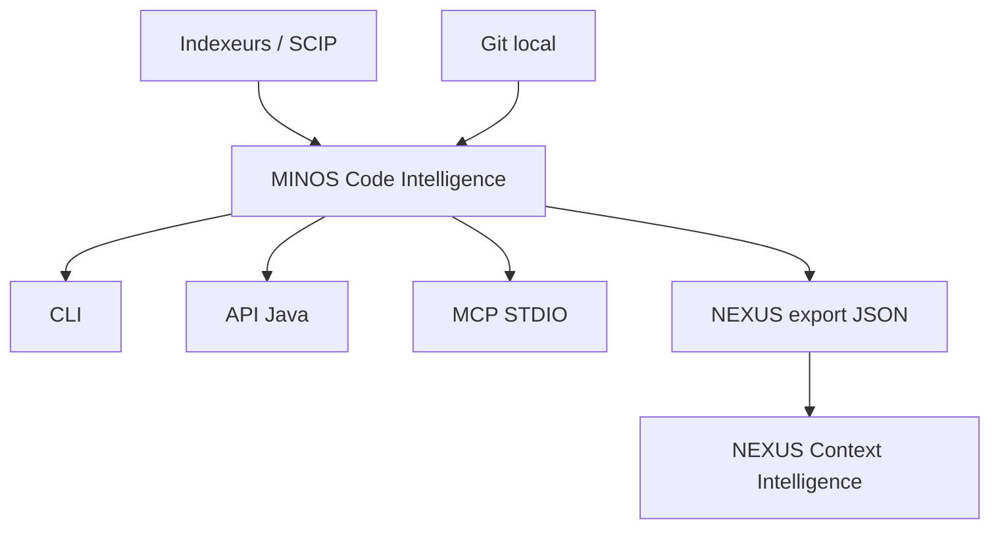
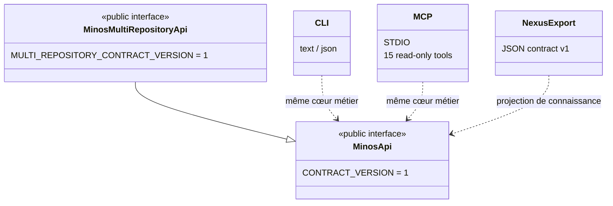

# MINOS — Code Intelligence Engine

**MINOS** construit une connaissance structurée, persistante, interrogeable et explicable d’un codebase.

Il est conçu pour répondre à des questions comme :

- où est défini ce symbole ?
- qui l’utilise, l’appelle, l’étend ou l’implémente ?
- de quoi dépend-il ?
- quels tests lui sont liés ?
- quelle est l’architecture observée du projet ?
- quels éléments peuvent être potentiellement impactés par une modification ?
- quelles relations entre dépôts sont réellement prouvables ?
- quelles zones ont récemment changé dans Git ?

MINOS est **local-first**, **agnostique du langage**, indépendant des fournisseurs d’IA et découplé des formats d’indexation externes par une couche de normalisation.

## Architecture générale



MINOS n’est ni un chatbot ni un LLM. Il produit des **faits de code, dérivations explicables et vues structurées** qui peuvent ensuite être consommés par des développeurs, outils, agents et moteurs de contexte.

## Démarrage rapide

### Prérequis

```text
Java 24
Maven 3.9.x
```

Le dépôt fournit le Maven Wrapper.

### Build

Sous Windows PowerShell :

```powershell
.\mvnw.cmd clean verify
```

Le packaging produit notamment :

```text
target/minos-code-intelligence-0.1.0-SNAPSHOT-all.jar
```

### Aide CLI

```powershell
java -jar .\target\minos-code-intelligence-0.1.0-SNAPSHOT-all.jar --help
```

### Enregistrer un projet

```powershell
java -jar .\target\minos-code-intelligence-0.1.0-SNAPSHOT-all.jar `
  project add N:\workspace-dev\my-project --name my-project
```

### Importer un index SCIP existant

```powershell
java -jar .\target\minos-code-intelligence-0.1.0-SNAPSHOT-all.jar `
  index my-project `
  --scip N:\workspace-dev\my-project\index.scip `
  --provider scip-typescript
```

### Rechercher

```powershell
java -jar .\target\minos-code-intelligence-0.1.0-SNAPSHOT-all.jar `
  search my-project GreetingPort --format json
```

> La CLI `index` importe un artefact SCIP déjà produit. Elle ne prétend pas lancer automatiquement les indexeurs externes.

## Capacités

### Projet et index

```text
project add
project list
project inspect / inspect
index
index-status
```

### Code Intelligence

```text
search
find-symbol
get-source
find-usages
find-implementations
find-callers
find-callees
dependencies
dependents
related-tests
architecture
impact
```

### Intégrations

```text
API Java M11/M12
MCP STDIO — 15 tools read-only
Git Intelligence via JGit
Workspaces multi-repositories
nexus-export — contrat JSON M13
```

## Documentation

### Portail

**[Ouvrir la documentation complète](docs/README.md)**

### Utilisateur

- [Guide utilisateur](docs/user/README.md)
- [Installation](docs/user/installation.md)
- [CLI](docs/user/cli.md)
- [API Java](docs/user/java-api.md)
- [MCP](docs/user/mcp.md)
- [MINOS → NEXUS](docs/user/nexus.md)
- [Dépannage](docs/user/troubleshooting.md)

### Développeur

- [Guide développeur](docs/developer/README.md)
- [Architecture interne](docs/developer/architecture.md)
- [Modèle de domaine](docs/developer/domain-model.md)
- [Indexation, lifecycle et stockage](docs/developer/indexing-and-storage.md)
- [Surfaces publiques](docs/developer/public-surfaces.md)
- [Multi-dépôts et Git](docs/developer/multi-repo-git.md)
- [Tests et contribution](docs/developer/testing.md)

### Conception et historique

- [État opérationnel](docs/STATUS.md)
- [Roadmap](docs/ROADMAP.md)
- [Cahier des charges](docs/CAHIER_DES_CHARGES.md)
- [MVP](docs/MVP.md)
- [Écosystème](docs/ECOSYSTEME.md)
- [ADR](docs/adr/)

## Surfaces d’exposition



Les contrats externes ne doivent pas exposer les types SCIP, JGit ou les modèles internes du domaine.

## Stack

```text
Java             24
Build            Maven 3.9.x
SCIP bindings    0.9.0
MCP Java SDK     2.0.0
Git              Eclipse JGit 7.6.0.202603022253-r
MCP transport    STDIO
Serveur HTTP     aucun requis dans le cœur
```

## Principes

- **MINOS-first, Glean-optional** ;
- faits, dérivations et heuristiques restent distincts ;
- provenance et preuves sont conservées ;
- les limitations fournisseur ne deviennent jamais des garanties ;
- les snapshots sont promus de façon cohérente ;
- l’impact est potentiel, pas une certitude runtime ;
- une relation cross-repository exige une identité exacte et unique ;
- l’activité Git n’est pas une mesure automatique d’importance architecturale ;
- CLI, API, MCP et NEXUS sont des surfaces d’exposition, pas des duplications du métier.

## État du projet

Le détail à jour des jalons et portes de validation est maintenu dans **[`docs/STATUS.md`](docs/STATUS.md)** et **[`docs/ROADMAP.md`](docs/ROADMAP.md)**.

> Règle de développement : **mesurer avant d’industrialiser**.
