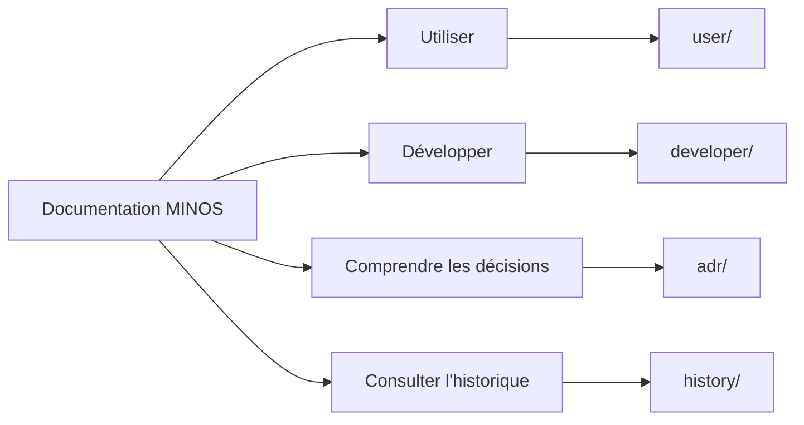

# Documentation MINOS

Ce répertoire est le point d’entrée de la documentation **utilisateur**, **développeur**, **architecturale** et **historique** de MINOS Code Intelligence.

MINOS est un moteur local de Code Intelligence. M14 ajoute un parcours d’indexation autonome et une distribution Windows native : l’utilisateur peut installer MINOS, gérer ses providers, enregistrer un projet puis exécuter `minos index <project>` sans préparer manuellement `index.scip`.

## Choisir son parcours

## Documentation utilisateur

- [Guide utilisateur](user/README.md)
- [Installation PROD Windows](user/production-installation.md)
- [Indexation autonome](user/autonomous-indexing.md)
- [Installation depuis les sources](user/installation.md)
- [Référence CLI](user/cli.md)
- [API Java locale](user/java-api.md)
- [Utiliser MINOS via MCP](user/mcp.md)
- [Intégration MINOS → NEXUS](user/nexus.md)
- [Dépannage](user/troubleshooting.md)

## Documentation développeur

- [Guide développeur](developer/README.md)
- [Architecture interne](developer/architecture.md)
- [Modèle de domaine](developer/domain-model.md)
- [Indexation, lifecycle et stockage](developer/indexing-and-storage.md)
- [CLI, API Java, MCP et export NEXUS](developer/public-surfaces.md)
- [Multi-dépôts et intelligence Git](developer/multi-repo-git.md)
- [Tests, validation et contribution](developer/testing.md)

## Décisions architecturales

Les choix techniques durables sont documentés sous forme d’[Architecture Decision Records](adr/README.md).

## Historique

- [Index historique](history/README.md)
- [Cadrage C0](history/c0/README.md)
- [Validations transverses historiques](history/validation/README.md)
- [Historique des jalons livrés](history/milestones/README.md)

Les archives conservent volontairement leurs anciens SHA, mesures, limitations fournisseur et états intermédiaires.

## Documents courants à la racine

- [État opérationnel](STATUS.md)
- [Roadmap produit](ROADMAP.md)
- [Roadmap opérationnelle M14](roadmap/M14_EXECUTION.md)
- [ADR](adr/README.md)

> Pour installer ou utiliser MINOS, privilégier `user/`. Pour modifier le code, privilégier `developer/`. Pour comprendre une décision durable, privilégier `adr/`. Pour auditer une livraison passée, utiliser `history/`.
