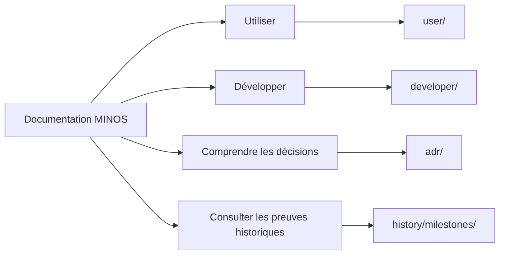

# Documentation MINOS

Ce répertoire est le point d’entrée de la documentation **utilisateur**, **développeur**, **architecturale** et **historique** de MINOS Code Intelligence.

MINOS est un moteur local de Code Intelligence : il enregistre des projets, importe des index structurés, normalise symboles et relations, produit des vues d’architecture et d’impact, expose ces capacités en CLI, API Java et MCP, et peut exporter sa connaissance vers NEXUS.

## Choisir son parcours

## Documentation utilisateur

- [Guide utilisateur](user/README.md)
- [Installation et mise en route](user/installation.md)
- [Référence CLI](user/cli.md)
- [API Java locale](user/java-api.md)
- [Utiliser MINOS via MCP](user/mcp.md)
- [Intégration MINOS → NEXUS](user/nexus.md)
- [Dépannage](user/troubleshooting.md)

## Documentation développeur

- [Guide développeur](developer/README.md)
- [Architecture interne](developer/architecture.md)
- [Modèle de domaine](developer/domain-model.md)
- [Indexation, lifecycle et stockage](developer/indexing-and-storage.md)
- [CLI, API Java, MCP et export NEXUS](developer/public-surfaces.md)
- [Multi-dépôts et intelligence Git](developer/multi-repo-git.md)
- [Tests, validation et contribution](developer/testing.md)

## Décisions architecturales

Les choix techniques durables sont documentés sous forme d’[Architecture Decision Records](adr/README.md).

Les ADR répondent à la question **« pourquoi MINOS est-il architecturé ainsi aujourd’hui ? »**. Ils ne servent pas de journal de validation de milestone.

## Historique et preuves de jalon

Les anciens dossiers `m0/` à `m13/` sont regroupés sous :

- [Historique des jalons](history/milestones/README.md)

Ces documents répondent à la question **« comment cette capacité a-t-elle été expérimentée, prouvée et livrée à ce moment-là ? »**. Ils conservent volontairement leurs SHA, nombres de tests, limitations fournisseur et états historiques.

## Documents transverses

- [État opérationnel](STATUS.md)
- [Roadmap](ROADMAP.md)
- [Cahier des charges](CAHIER_DES_CHARGES.md)
- [MVP](MVP.md)
- [Écosystème](ECOSYSTEME.md)
- [ADR](adr/README.md)

> Pour installer ou utiliser MINOS, privilégier `user/`. Pour modifier le code, privilégier `developer/`. Pour comprendre une décision durable, privilégier `adr/`. Pour auditer une livraison historique, utiliser `history/milestones/`.
