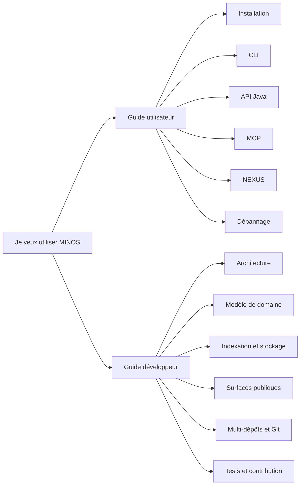

# Documentation MINOS

Ce répertoire est le point d’entrée de la documentation **utilisateur** et **développeur** de MINOS Code Intelligence.

MINOS est un moteur local de Code Intelligence : il enregistre des projets, importe des index structurés, normalise symboles et relations, produit des vues d’architecture et d’impact, expose ces capacités en CLI, API Java et MCP, et peut exporter sa connaissance vers NEXUS.

## Choisir son parcours

## Documentation utilisateur

- [Guide utilisateur](user/README.md)
- [Installation et mise en route](user/installation.md)
- [Référence CLI](user/cli.md)
- [API Java locale](user/java-api.md)
- [Utiliser MINOS via MCP](user/mcp.md)
- [Intégration MINOS → NEXUS](user/nexus.md)
- [Dépannage](user/troubleshooting.md)

## Documentation développeur

- [Guide développeur](developer/README.md)
- [Architecture interne](developer/architecture.md)
- [Modèle de domaine](developer/domain-model.md)
- [Indexation, lifecycle et stockage](developer/indexing-and-storage.md)
- [CLI, API Java, MCP et export NEXUS](developer/public-surfaces.md)
- [Multi-dépôts et intelligence Git](developer/multi-repo-git.md)
- [Tests, validation et contribution](developer/testing.md)

## Documents de conception et d’historique

Les guides ci-dessus décrivent **l’état utilisable du produit**. Les documents suivants conservent les décisions et preuves par jalon :

- [État opérationnel](STATUS.md)
- [Roadmap](ROADMAP.md)
- [Cahier des charges](CAHIER_DES_CHARGES.md)
- [MVP](MVP.md)
- [Écosystème](ECOSYSTEME.md)
- [ADR](adr/)
- [M10 — MCP](m10/MCP_SERVER.md)
- [M11 — API](m11/API.md)
- [M12 — Multi-dépôts et Git](m12/MULTI_REPO_GIT.md)
- [M13 — NEXUS](m13/NEXUS_INTEGRATION.md)

> Les documents de jalon peuvent contenir des chiffres de validation ou des états historiques propres à leur PR. Pour installer ou utiliser MINOS, privilégier les guides `user/`. Pour modifier le code, privilégier les guides `developer/`.
