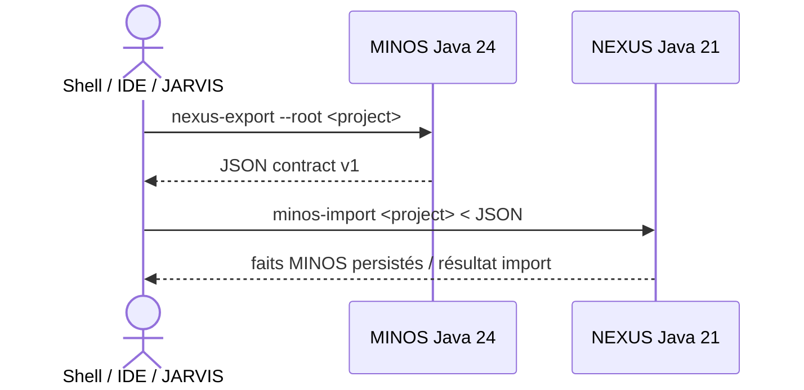

# État courant — MINOS

Dernière mise à jour documentaire : **24 juillet 2026**

Ce fichier résume l’état produit. Les SHA exacts, résultats de gates et éventuels échecs intermédiaires restent suivis dans les issues et PR de jalon.

## Synthèse

```text
C0 — Cadrage                         TERMINÉ
M0 — Faisabilité technique          TERMINÉ ET LIVRÉ
M1 — Découverte et orchestration    TERMINÉ ET LIVRÉ
M2 — Intelligence des symboles      TERMINÉ ET LIVRÉ
M3 — Intelligence des relations     TERMINÉ ET LIVRÉ
M4 — Recherche et contexte compact  TERMINÉ ET LIVRÉ
M5 — Tests liés et dérivations      TERMINÉ ET LIVRÉ
M6 — Intelligence d’architecture    TERMINÉ, VALIDÉ ET LIVRÉ
M7 — Indexation incrémentale        TERMINÉ, VALIDÉ ET LIVRÉ
M8 — Analyse d’impact               TERMINÉ, VALIDÉ ET LIVRÉ
M9 — CLI stabilisée                 TERMINÉ, VALIDÉ ET LIVRÉ
M10 — Serveur MCP                   TERMINÉ, VALIDÉ ET LIVRÉ
M11 — API publique                  TERMINÉ, VALIDÉ ET LIVRÉ
M12 — Multi-dépôts + Git            TERMINÉ, VALIDÉ ET LIVRÉ
M13 — Intégration NEXUS             IMPLÉMENTÉE — QUALIFICATION INTER-DÉPÔT EN COURS
```

## Portes livrées récentes

### M11 — API publique

```text
head validé   fae552e8e6f2aa66c327fb80485f5bad448d7520
merge         3780785f167cf373dfe0e9cf34f3c3862e87b868
tests         214/214 PASS
```

Contrat :

```text
com.minos.api.MinosApi
com.minos.api.LocalMinosApi
CONTRACT_VERSION = 1
```

### M12 — Multi-dépôts et intelligence Git

```text
head validé   6c771909e0b97b49fbd8e49090522d8a6c0b53aa
merge         3bc6cc364b6d7d651c1c9ab3a93ecac28ce02e86
tests         221/221 PASS
```

Acquis : workspaces, résolution cross-repository exacte, Git via JGit, activité bornée par commits/fichiers/zones et contrat public M12 additif.

## M13 — Intégration NEXUS

Suivi MINOS : issue #37 / PR #38.

Compagnon NEXUS : `FTurleque/nexus-context-engine` issue #11 / PR #12.

### Frontière actuelle



MINOS produit des faits ; NEXUS conserve le ranking, la sélection et le budget de contexte.

### Surface MINOS M13

```text
NexusExportContract.CONTRACT_VERSION = 1
NexusExportContract.PRODUCER = MINOS
NexusExportService
NexusExportCommand
minos nexus-export --root <project-root>
```

L’export :

- lit uniquement le snapshot actif ;
- reste read-only ;
- conserve origine, nature, confiance et preuves ;
- n’exporte que les symboles locaux rattachables à un fichier réel ;
- reconstruit les `fileId` SCIP stables ;
- exporte les relations symbol → symbol locales résolues ;
- expose les omissions/troncatures sous forme de limitations.

### Compagnon NEXUS

Le design final de qualification repose sur un import JSON explicite côté NEXUS. NEXUS ne doit pas connaître le JAR MINOS ni lancer un runtime Java 24 depuis son cœur.

La provenance des faits importés reste :

```text
sourceProvider = minos
```

### Porte inter-dépôt

La livraison M13 exige :

1. validation du head exact MINOS sous Java 24 ;
2. validation du head exact NEXUS sous Java 21 ;
3. replay réel MINOS → JSON → NEXUS ;
4. preuve que `GreetingPort` est importé avec `sourceProvider=minos` et retrouvé par `SearchService`.

Tout nouveau commit sur un head après sa validation invalide la preuve correspondante.

## GitHub Actions

La porte locale MINOS reste fondée sur le build exact du SHA qualifié. L’anomalie historique GitHub Actions est suivie séparément dans #5.

## Documentation

- portail : [`README.md`](README.md) ;
- utilisateur : [`user/README.md`](user/README.md) ;
- développeur : [`developer/README.md`](developer/README.md) ;
- contrat M13 : [`m13/NEXUS_INTEGRATION.md`](m13/NEXUS_INTEGRATION.md) ;
- décision M13 : [`m13/DECISION_M13.md`](m13/DECISION_M13.md).

## Sources de vérité opérationnelles

Pour une validation en cours, l’issue et la PR du jalon priment sur un ancien chiffre copié dans un document historique.
