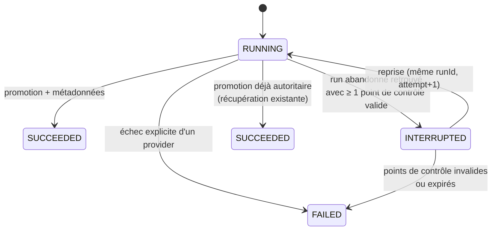

# 0039 — Reprendre une indexation interrompue au lieu de tout réindexer

Status: Proposed — conception, en attente de validation avant implémentation.

Complète [0006](0006-promouvoir-les-index-de-maniere-atomique.md) (promotion atomique), [0014](0014-safe-incremental-indexing.md) (indexation incrémentale sûre), [0021](0021-native-runtime-autonomous-indexing.md) et [0038](0038-aggregate-worker-resource-containment.md) (rétention des répertoires de run).

## Contexte

Aujourd'hui, une indexation qui s'arrête brutalement (reboot, `kill`, fermeture du terminal, coupure de courant, arrêt du conteneur) est intégralement perdue, même quand la quasi-totalité du travail coûteux avait abouti.

### Ce qui existe déjà et qui fonctionne

- **Bail projet inter-JVM** : `ProjectIndexLease` (`minos-application/.../orchestration/ProjectIndexLease.java`) pose un verrou fichier sous `MINOS_HOME/locks/indexing/<projectId>.lock`. Le système d'exploitation le libère à la mort du processus : après une coupure, le projet n'est pas bloqué.
- **Trace de run durable** : `IndexingRunExecutor` appelle `stateStore.saveRun(...)` après **chaque** provider terminé, ainsi qu'à l'entrée des phases `STAGING` et `PROMOTION`. `FileIndexStateStore` écrit ces propriétés de façon atomique et durable.
- **Artefacts déterministes et durables** : `ProcessIndexerExecutor` (`minos-runtime-local`) écrit l'artefact final dans `runs/<runId>/<indexerId>[/scopes/module-<sha256-16>]/index.scip`, par `DurableAtomicFile.replace` (fsync du fichier, `ATOMIC_MOVE`, fsync du répertoire). Le chemin du scope est le SHA-256 tronqué de la racine relative : il est reproductible d'un run à l'autre. Ces fichiers **ne sont pas supprimés** en fin de run, ni en cas d'échec.
- **Réconciliation des métadonnées** : `AuthoritativeProjectStateReconciler.recoverAbandonedRuns` récupère déjà le cas « la promotion a réussi mais le processus est mort avant d'écrire les métadonnées » : si le run était en phase `PROMOTION` et que son snapshot préparé est devenu l'actif, il est repassé en `SUCCEEDED`.

### Ce qui manque

1. **Aucune reprise.** Tout run `RUNNING` retrouvé sous bail exclusif est considéré comme abandonné et finalisé en `FAILED`, sans jamais regarder les artefacts sur disque. `IndexingRunExecutor.execute` tire ensuite un `UUID.randomUUID()` neuf : rien ne relie la nouvelle tentative au répertoire de run précédent. Un monorepo à 7 providers × N modules, interrompu au dernier module, recommence tout.
2. **Le point de reprise n'est pas identifiable.** `IndexingRun.IndexerExecution` ne porte que `(language, indexerId, finalArtifact)` : ni la racine relative du scope, ni la version du provider, ni la taille, ni l'empreinte de l'artefact, ni celle des sources. Impossible de décider si un artefact retrouvé est encore valable.
3. **Les artefacts ne sont pas protégés.** `RunDirectoryRetention.prune` se déclenche au **début** de chaque exécution provider, ignore l'état des runs et supprime par âge (7 j), nombre (16 runs) ou volume (4 Gio). Elle peut donc effacer précisément le run que l'on voulait reprendre, avant même qu'on l'ait lu.
4. **Les snapshots préparés orphelins ne sont jamais nettoyés.** Un `.snapshot-*.tmp` laissé par un crash dans `<storageRoot>/<projectId>/` n'est balayé par aucune rétention.

### Objectifs et non-objectifs

**Objectifs.** Après n'importe quelle coupure, relancer l'indexation du projet ne réexécute que les providers et scopes qui n'avaient pas produit d'artefact valide, ou reprend directement à la mise en snapshot. La reprise est sûre par défaut : au moindre doute, on réindexe entièrement. La reprise est explicite et visible.

**Non-objectifs.** Reprendre *à l'intérieur* d'un provider (les indexeurs SCIP ne savent pas repartir d'un fichier donné) ; reprendre sur une autre machine ou un autre `MINOS_HOME` ; reprendre une indexation distante (elle est de toute façon fermée aujourd'hui, cf. constat A1 de l'audit) ; garantir une reprise après suppression manuelle de `MINOS_HOME/runs`.

## Décision

### 1. Un run devient reprenable, avec des points de contrôle par cible

L'unité de reprise est la **cible d'exécution** déjà utilisée par l'orchestrateur : `IndexingExecutionTarget = (indexerId, projectRelativeRoot)`. Sa clé stable est

```
targetKey = sha256(indexerId + "\u0000" + providerVersion + "\u0000" + portable(projectRelativeRoot))
```

`IndexingRun.IndexerExecution` est étendu et devient le point de contrôle durable :

| Champ | Rôle |
|---|---|
| `language`, `indexerId` | existants |
| `projectRelativeRoot` | identifie le scope (aujourd'hui perdu) |
| `providerVersion` | invalide la réutilisation après mise à jour d'un indexeur |
| `finalArtifact` | existant |
| `artifactBytes`, `artifactSha256` | vérification d'intégrité avant réutilisation |
| `scopeFingerprint` | empreinte des sources du scope au moment de la production |
| `mode` | FULL ou INCREMENTAL, plus la liste des fichiers ciblés en incrémental |
| `completedAt` | âge du point de contrôle |

`ProcessIndexerExecutor` calcule le SHA-256 de l'artefact au moment où il le promeut et l'écrit à côté (`index.scip.sha256`, écriture durable) ; l'orchestrateur le recopie dans le point de contrôle. Le coût est d'environ une seconde pour 512 Mio, négligeable devant une exécution d'indexeur.

`scopeFingerprint` réutilise `ProjectFingerprintService` / `FileFingerprint` (module `incremental`), restreint au sous-arbre du scope : c'est ce qui garantit qu'on ne recycle pas l'artefact d'un code qui a changé pendant la coupure.

### 2. Un état `INTERRUPTED` distinct de `FAILED`

`IndexingRun.Status` gagne `INTERRUPTED`, et `ProjectIndexState` un champ `resumableRunId`.



`AuthoritativeProjectStateReconciler.recoverAbandonedRuns` est modifié ainsi : la récupération « promotion déjà autoritaire » reste prioritaire et inchangée ; sinon, un run abandonné qui possède au moins un point de contrôle **ou** un `stagedSnapshotId` devient `INTERRUPTED` au lieu de `FAILED`. L'état projet reste `STALE` (ou `FAILED` s'il n'y a pas de snapshot actif) et porte en plus `resumableRunId`. Un `INTERRUPTED` est terminal du point de vue de la disponibilité : il ne bloque jamais un nouveau run, il ne fait qu'offrir une reprise.

### 3. La reprise réutilise le même `runId`

Reprendre, c'est **rouvrir** le run interrompu : même `runId`, donc même répertoire `runs/<runId>/`, donc aucun déplacement ni copie d'artefacts de 512 Mio. Un compteur `attempt` est incrémenté et tracé dans le message du run.

Sous le bail exclusif, `IndexingRunExecutor` demande d'abord un plan de reprise à un nouveau composant `IndexingResumePlanner` (module `minos-application`, package `orchestration`) :

1. charger le run `INTERRUPTED` désigné par `resumableRunId` (au plus un par projet) ;
2. pour chaque cible du nouveau plan, chercher un point de contrôle de même `targetKey` ;
3. le retenir seulement si **toutes** ces conditions sont vraies :
   - l'artefact existe, est un fichier régulier non-symlink, sous `MINOS_HOME/runs/<runId>/`, de taille et de SHA-256 conformes au point de contrôle ;
   - `providerVersion` et la sélection d'indexeur sont identiques à celles négociées maintenant ;
   - le mode est identique (un artefact produit en incrémental ne sert pas un run FULL) ;
   - l'empreinte du scope recalculée est égale à `scopeFingerprint` ;
   - le point de contrôle a moins de `resumeTtl` (défaut 24 h, borné par la rétention des runs) ;
4. toute cible qui n'est pas retenue est réexécutée normalement ; tout écart inattendu (artefact illisible, hash différent, empreinte incalculable) **annule la reprise entière** et bascule en run complet, avec la raison journalisée.

Les cibles retenues sont injectées telles quelles dans `context.artifacts` / `context.executions` sans lancer le provider. Les temporaires d'un provider interrompu (`index.partial.scip`) sont supprimés à l'ouverture de la reprise.

### 4. Reprendre aussi les phases de staging et de promotion

- Coupure en phase `PROVIDER_EXECUTION` → on repart aux providers manquants.
- Coupure en phase `STAGING` → tous les artefacts sont là, on ne relance aucun provider et on remet en scène le snapshot. Le `.tmp` orphelin correspondant est supprimé avant.
- Coupure en phase `PROMOTION` → si le snapshot préparé est déjà l'actif, la récupération existante conclut `SUCCEEDED` ; sinon le run reprend directement à la promotion du `stagedSnapshotId` déjà connu.

Une rétention des snapshots préparés orphelins est ajoutée à `SnapshotRetentionService` : un `.snapshot-*.tmp` plus vieux que 24 h et non référencé par un run `RUNNING`/`INTERRUPTED` est supprimé.

### 5. La rétention ne détruit pas ce qu'on veut reprendre

Un fichier marqueur `runs/<runId>/.resumable` (écrit par l'orchestrateur quand un run passe `INTERRUPTED`, supprimé quand il devient terminal) permet à `RunDirectoryRetention`, qui vit dans `minos-runtime-local` et ne connaît pas le modèle de run, de protéger ce répertoire :

- les runs marqués sont supprimés **en dernier**, après tous les autres ;
- ils ne sont supprimés que si le budget l'exige encore, ou s'ils dépassent `resumeTtl` ;
- le run en cours reste protégé comme aujourd'hui (`protectedRunRoot`).

La reprise ne dépend pas de ce marqueur pour sa correction : si le répertoire a disparu, la vérification de l'étape 3 échoue et on réindexe complètement.

### 6. La reprise est visible et pilotable

- `minos index` reprend par défaut ; `--no-resume` force un run complet ; `--resume-only` échoue si aucune reprise n'est possible (utile en CI).
- La sortie texte et JSON indique `resumed: 5/8 cibles réutilisées, 3 réexécutées` et la raison quand la reprise est refusée.
- `minos_index_status` et `minos doctor` exposent `resumableRunId`, l'âge du point de contrôle et le nombre de cibles réutilisables.
- Aucun chemin absolu n'est exposé dans ces messages (`PublicErrorMessages`).

### 7. Sécurité et intégrité

Les artefacts réutilisés viennent de `MINOS_HOME`, pas d'une entrée non fiable, mais la reprise les traite quand même comme des données à valider : chemin confiné sous `runs/<runId>/` (résolution canonique, refus des liens symboliques), taille bornée par `IndexArtifactLimits.MAX_SCIP_ARTIFACT_BYTES`, SHA-256 vérifié avant ingestion. Le principe reste **fail-closed** : en cas de doute, réindexation complète, jamais un index partiel présenté comme complet.

## Conséquences

### Positives

- une coupure coûte au pire le provider en cours, plus la mise en snapshot ;
- le cas le plus fréquent (machine qui redort, terminal fermé) devient invisible pour l'utilisateur ;
- les métadonnées de run gagnent le scope et l'empreinte des artefacts, ce qui sert aussi au diagnostic et à l'indexation incrémentale ;
- `INTERRUPTED` distingue enfin « le processus est mort » de « l'indexation a échoué », ce que l'état actuel confond.

### Coûts et risques

| Risque | Atténuation |
|---|---|
| Réutiliser un artefact périmé et publier un index faux | Empreinte du scope + SHA-256 + version du provider + TTL ; fail-closed |
| Occupation disque des runs interrompus | TTL de 24 h, budget de rétention inchangé (16 runs / 4 Gio / 7 j) |
| Provider non déterministe dont l'artefact dépend d'un état externe | La réutilisation est un choix par provider : `IndexerCapability.RESUMABLE_ARTIFACT`, absente par défaut pour un indexeur non qualifié |
| Format de run persistant modifié | Champ `runFormatVersion` ; un run écrit par une version antérieure est lisible mais jamais reprenable |
| Coût du SHA-256 et de l'empreinte de scope | ~1 s/512 Mio, et l'empreinte de scope est déjà calculée par le planificateur incrémental |

## Plan d'implémentation

**Lot 1 — modèle et points de contrôle** (pré-requis, sans changement de comportement)
`IndexingRun.IndexerExecution` étendu, `runFormatVersion`, lecture/écriture dans `FileIndexStateStore`, `index.scip.sha256` écrit par `ProcessIndexerExecutor`, empreinte de scope calculée par `IndexingRunExecutor`. Tests : aller-retour de persistance, compatibilité ascendante des runs existants.

**Lot 2 — état `INTERRUPTED` et exposition**
`IndexingRun.Status.INTERRUPTED`, `ProjectIndexState.resumableRunId`, modification de `recoverAbandonedRuns`, marqueur `.resumable`, rendu CLI/MCP/API. Tests : run abandonné avec et sans point de contrôle, priorité de la récupération « promotion autoritaire ».

**Lot 3 — reprise des providers**
`IndexingResumePlanner`, câblage dans `IndexingRunExecutor`, drapeaux CLI. Tests : exécuteur qui échoue après N cibles puis reprise ; artefact tronqué ; fichier modifié dans un seul scope ; version de provider changée ; répertoire de run supprimé ; TTL dépassé.

**Lot 4 — reprise du staging et de la promotion, nettoyage**
Reprise par phase, rétention des `.tmp` orphelins, protection dans `RunDirectoryRetention`. Tests : coupure simulée entre stage et promote, et après promote.

**Lot 5 — validation de bout en bout**
Test d'intégration qui lance une indexation dans une JVM fille, la tue par `Process.destroyForcibly()` au milieu, relance dans une nouvelle JVM et vérifie que les providers déjà terminés ne sont pas réexécutés et que l'index final est identique, octet pour octet, à celui d'un run complet. Une variante Windows couvre l'absence de fsync de répertoire.

**Couverture.** Ajouter au gate `scripts/quality/check-jacoco.py` un scope `resume-orchestration` (`IndexingResumePlanner`, `AuthoritativeProjectStateReconciler`, `IndexingRunExecutor`) avec un seuil d'au moins 75 % de lignes et 55 % de branches, au niveau du scope `critical-orchestration` existant.
