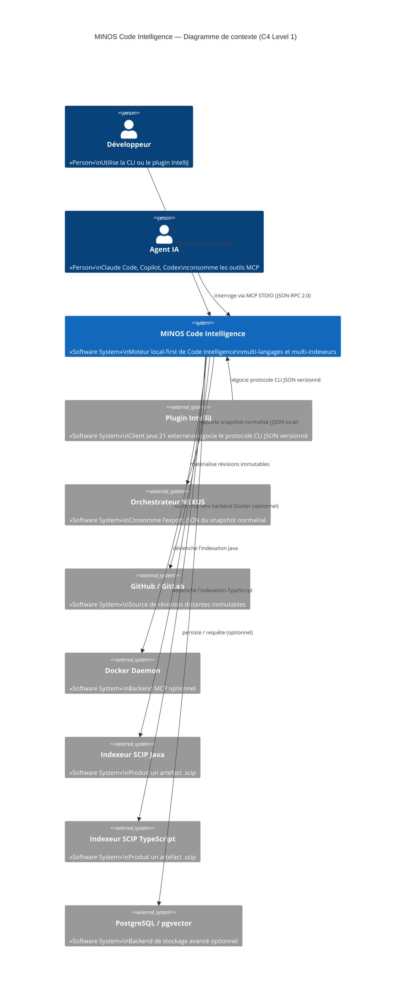

# Section 3 — Contexte et périmètre

> Preuves : ADR-0001, ADR-0017, ADR-0020, ADR-0027, ADR-0035, `MinosCli.java` (USAGE),
> `minos-mcp/pom.xml`, `minos-nexus/pom.xml`, `minos-integration-git/pom.xml`.

---

## 3.1 Frontière du système

MINOS Code Intelligence est un **composant local** qui s'exécute sur le poste du développeur ou dans un conteneur Docker.
Il **reçoit** des requêtes de ses consommateurs (CLI, MCP, API Java, NEXUS) et **émet** des résultats JSON structurés.
Il **ne stocke pas** de code sur un serveur distant et **ne s'authentifie pas** auprès de services cloud en mode standard.

---

## 3.2 Acteurs et systèmes externes

| Acteur / Système | Stéréotype | Direction | Description |
|-----------------|-----------|-----------|-------------|
| Développeur | `«Person»` | → MINOS | Invoque la CLI ou le plugin IntelliJ |
| Agent IA (Claude Code, Copilot, Codex) | `«Person»` | → MINOS MCP | Consomme les outils MCP STDIO |
| Plugin IntelliJ | `«Software System»` | → CLI JSON | Client Java 21 externe négociant le protocole CLI JSON versionné (ADR-0027) |
| Orchestrateur NEXUS | `«Software System»` | ← MINOS | Reçoit l'export JSON du snapshot normalisé (ADR-0020) |
| Dépôt GitHub / GitLab | `«Software System»` | → MINOS | Source pour l'indexation de révisions distantes immutables (ADR-0033) |
| Docker Daemon | `«Software System»` | → MINOS | Backend MCP optionnel (ADR-0037) |
| Indexeur SCIP Java | `«Software System»` | → MINOS | Processus externe produisant un artefact `.scip` |
| Indexeur SCIP TypeScript | `«Software System»` | → MINOS | Processus externe produisant un artefact `.scip` |
| Indexeurs SCIP polyglot (Go, Rust, C/C++, .NET, Python…) | `«Software System»` | → MINOS | Futurs providers SCIP (ADR-0032) |
| PostgreSQL / pgvector | `«Software System»` | ↔ MINOS | Backend de stockage avancé optionnel |

---

## 3.3 Interfaces sortantes

| Interface | Protocole | Sens | Consommateur |
|-----------|----------|------|-------------|
| CLI JSON | JSON newline-delimited / STDOUT | MINOS → | IntelliJ, scripts |
| MCP STDIO | JSON-RPC 2.0 / STDIO | MINOS → | Agents IA |
| API Java (`minos-api`) | Appel de méthode JVM | MINOS → | Intégrateurs Java |
| Contrat JSON NEXUS | JSON fichier local | MINOS → | Orchestrateur NEXUS |

---

## 3.4 Diagramme C4 — Context

