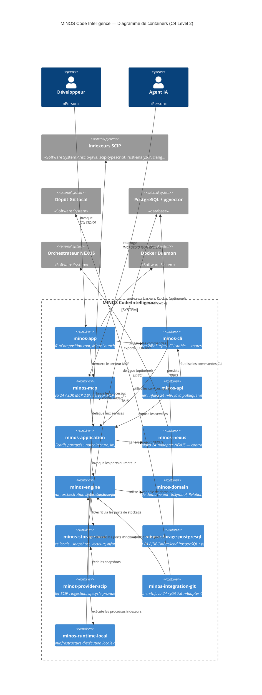
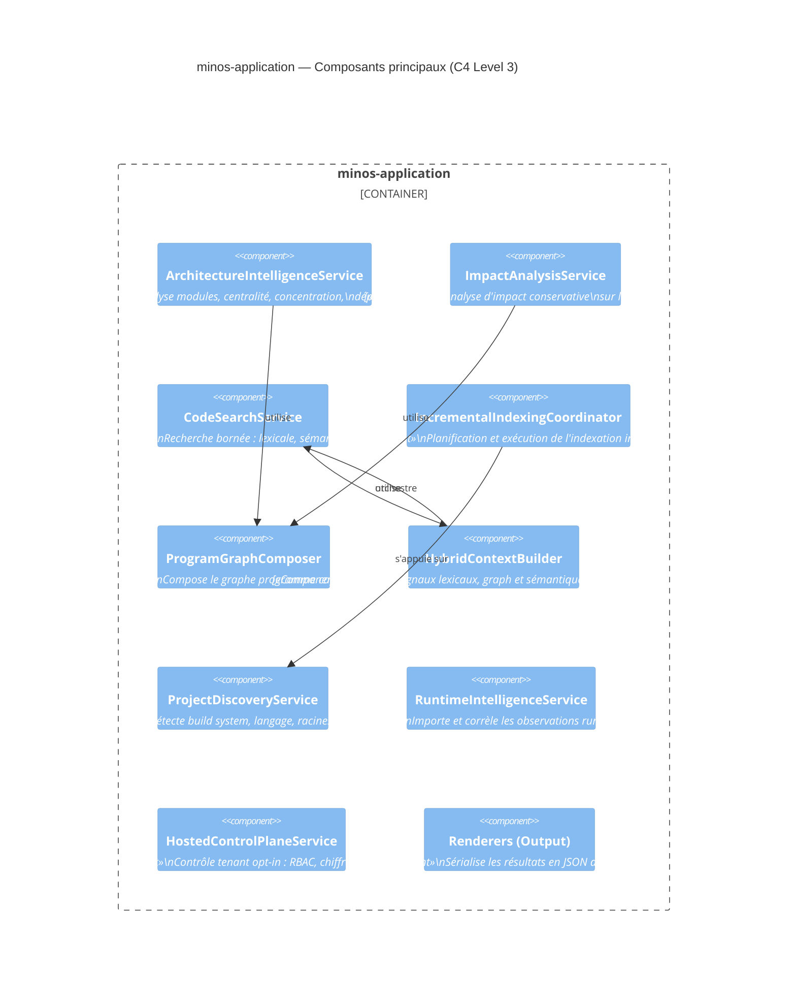

# Section 5 — Vue des blocs

> Preuves : `pom.xml` (reactor modules), tous les `pom.xml` des modules,
> `minos-domain/src/main/java/com/minos/domain/`, `minos-engine/src/main/java/`,
> `minos-cli/src/main/java/com/minos/cli/MinosCli.java`,
> `minos-mcp/src/main/java/com/minos/mcp/MinosMcpServer.java`,
> `minos-provider-scip/src/main/java/`, `minos-storage-local/src/main/java/`,
> `minos-application/src/main/java/`, ADR-0022.

---

## 5.1 Diagramme C4 — Container (niveau 2)

---

## 5.2 Détail des containers

### minos-domain
- **Responsabilité** : modèle de domaine pur, sans dépendance externe.
- **Types clés** : `Symbol`, `Relationship`, `Evidence`, `SymbolLocation`, `ProgramGraph`, `SemanticDocument`, `RuntimeObservation`, `HostedTenantState`.
- **Interfaces** : aucune (modèle passif).
- **Dépendances** : aucune.
- **Sources** : `minos-domain/src/main/java/com/minos/domain/`, `com/minos/program/`, `com/minos/semantic/`, `com/minos/dynamic/`, `com/minos/hosted/`.

### minos-engine
- **Responsabilité** : définit les ports (interfaces) du moteur et les services de requête provider-indépendants.
- **Types clés** : `CodeKnowledgeStore` (port), `IndexerRegistry`, `IndexerProvider`, `SymbolQueryService`, `RelationshipQueryService`, `DependencyDerivationService`, `RelatedTestDerivationService`.
- **Interfaces** : `CodeKnowledgeStore`, `IndexerRegistry`, `IndexerProvider`, `ProjectDiscovery`, `RuntimeObservationStore`.
- **Dépendances** : `minos-domain`.
- **Sources** : `minos-engine/src/main/java/com/minos/store/`, `com/minos/orchestration/`, `com/minos/query/`, `com/minos/discovery/`.

### minos-runtime-local
- **Responsabilité** : infrastructure générique d'exécution locale de processus providers (CommandLocator, ProcessIndexerExecutor).
- **Types clés** : `CommandLocator`, `ProcessIndexerExecutor`, `ProviderRuntimeManager`.
- **Interfaces** : `ProviderRuntimeManager` (impl de `IndexingRuntimePorts`).
- **Dépendances** : `minos-engine`.
- **Sources** : `minos-runtime-local/src/main/java/com/minos/runtime/`.

### minos-storage-local
- **Responsabilité** : persistance locale des snapshots, vecteurs sémantiques, observations runtime, control plane tenant.
- **Types clés** : `InMemoryCodeKnowledgeStore`, `SnapshotRepository`, `FileSemanticVectorStore`, `FileRuntimeObservationStore`, `FileHostedControlPlaneStore`.
- **Interfaces** : implémente `CodeKnowledgeStore`, `SemanticVectorStore`, `RuntimeObservationStore`, `HostedControlPlaneStore`.
- **Dépendances** : `minos-engine`.
- **Sources** : `minos-storage-local/src/main/java/com/minos/store/`.

### minos-provider-scip
- **Responsabilité** : adapter SCIP — ingestion des artefacts `.scip`, normalisation vers le domaine MINOS, lifecycle des providers Java/TypeScript/polyglot.
- **Types clés** : `ScipIngestionAdapter`, `ScipSymbolNormalizer`, `ScipIndexerCatalog`, `ScipJavaProcessPlanFactory`, `ScipTypeScriptProcessPlanFactory`, `ManagedPolyglotScipRuntimeManager`.
- **Interfaces** : implémente `IndexerProvider`.
- **Dépendances** : `minos-domain`, `minos-engine`, `minos-storage-local`, `minos-runtime-local`, `scip-java-bindings 0.9.0`.
- **Sources** : `minos-provider-scip/src/main/java/com/minos/adapter/scip/`.

### minos-integration-git
- **Responsabilité** : adapter Git local via JGit — historique, activité, faits Git.
- **Types clés** : `GitIntelligenceService`.
- **Interfaces** : implémente le port Git de `minos-engine`.
- **Dépendances** : `minos-engine`, `org.eclipse.jgit 7.6`.
- **Sources** : `minos-integration-git/src/main/java/com/minos/git/`.

### minos-application
- **Responsabilité** : services applicatifs partagés — architecture (`ArchitectureIntelligenceService`), impact (`ImpactAnalysisService`), recherche de code (`CodeSearchService`), indexation incrémentale, output, registry, workspace.
- **Types clés** : `ArchitectureIntelligenceService`, `ImpactAnalysisService`, `CodeSearchService`, `IncrementalIndexingCoordinator`, `ProjectDiscoveryService`, `HybridContextBuilder`, `EmbeddingProvider`.
- **Interfaces** : `EmbeddingProvider`, `ProgramGraphProvider`, SPI discovery (`BuildSystemDetector`, `LanguageDetector`…).
- **Dépendances** : `minos-domain`, `minos-engine`, `minos-runtime-local`, `minos-storage-local`, `minos-provider-scip`, `minos-integration-git`.
- **Sources** : `minos-application/src/main/java/com/minos/`.

### minos-nexus
- **Responsabilité** : export read-only du snapshot normalisé au format contrat JSON NEXUS.
- **Types clés** : `NexusExportContract`, `NexusExportService`.
- **Dépendances** : `minos-domain`, `minos-application`, `minos-storage-local`.
- **Sources** : `minos-nexus/src/main/java/`.

### minos-cli
- **Responsabilité** : surface CLI stable — dispatcher `MinosCli`, toutes les commandes (project, index, search, find-symbol, architecture, impact, runtime, team…).
- **Types clés** : `MinosCli`, `MinosCliRunner`, `MinosLauncher` (dans `minos-app`).
- **Dépendances** : `minos-domain`, `minos-engine`, `minos-application`, `minos-integration-git`, `minos-storage-local`, `minos-provider-scip`, `minos-runtime-local`, `minos-nexus`.
- **Sources** : `minos-cli/src/main/java/com/minos/cli/`.

### minos-api
- **Responsabilité** : API Java publique versionnée exposant les contrats stables.
- **Dépendances** : `minos-domain`, `minos-engine`, `minos-application`, `minos-storage-local`, `minos-cli`, `minos-integration-git`.
- **Sources** : `minos-api/src/main/java/`.

### minos-mcp
- **Responsabilité** : serveur MCP STDIO read-only, catalogue d'outils MCP.
- **Types clés** : `MinosMcpServer`, `MinosMcpApplicationTools`, `MinosApplicationMcpBackend`.
- **Dépendances** : `minos-application`, `io.modelcontextprotocol.sdk:mcp 2.0.0`.
- **Sources** : `minos-mcp/src/main/java/com/minos/mcp/`.

### minos-app
- **Responsabilité** : composition root, points d'entrée (`MinosLauncher`, `NexusExportBridgeMain`), shaded JAR, router backend natif/Docker.
- **Dépendances** : tous les modules.
- **Sources** : `minos-app/src/main/java/`.

### minos-storage-postgresql (optionnel)
- **Responsabilité** : backend de stockage PostgreSQL/pgvector — implémente `StorageBackend`, `ProjectRegistry`, `ProjectFingerprintSnapshotStore`, `SemanticVectorStore`, `RuntimeObservationStore`, `IndexStateStore`.
- **Note architecturale** : ce module dépend de `minos-application` car les interfaces `StorageBackend`, `ProjectRegistry` et `ProjectFingerprintSnapshotStore` sont définies dans `minos-application`. C'est intentionnel : le backend PostgreSQL remplace l'ensemble de la couche locale, pas seulement le port engine (voir ADR-0025).
- **Dépendances** : `minos-domain`, `minos-engine`, `minos-storage-local`, `minos-application`, `postgresql 42.7.13`, `jackson 2.22`.
- **Sources** : `minos-storage-postgresql/src/main/java/`.

---

## 5.3 Diagramme C4 — Component (minos-application)

Le module `minos-application` est le plus complexe. Ce diagramme montre ses principaux composants.

