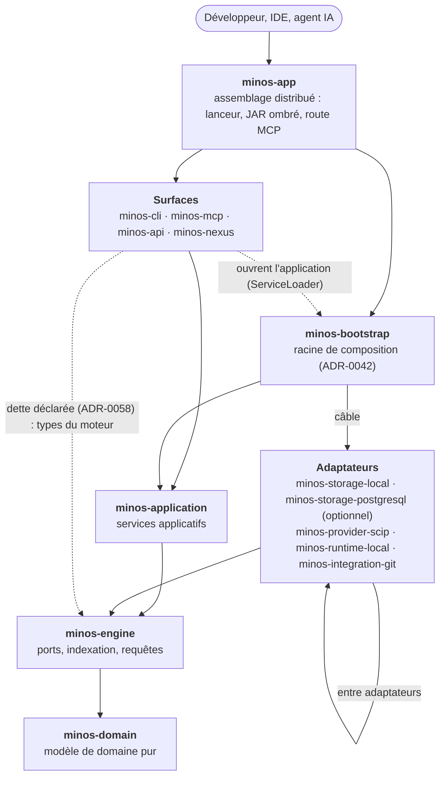
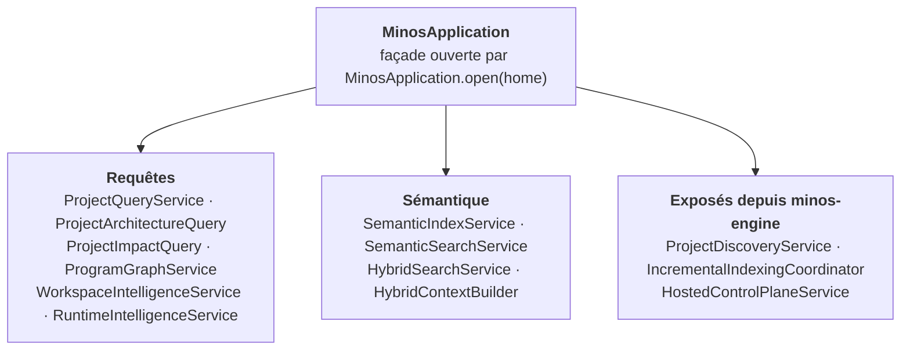

# Section 5 — Vue des blocs

> Preuves : `pom.xml` (reactor modules), tous les `pom.xml` des modules,
> `minos-domain/src/main/java/com/minos/domain/`, `minos-engine/src/main/java/`,
> `minos-cli/src/main/java/com/minos/cli/MinosCli.java`,
> `minos-mcp/src/main/java/com/minos/mcp/MinosMcpServer.java`,
> `minos-provider-scip/src/main/java/`, `minos-storage-local/src/main/java/`,
> `minos-application/src/main/java/`, ADR-0022.

---

## 5.1 Diagramme C4 — Container (niveau 2)

```mermaid
flowchart TB
    clients(["Développeur, IDE, agent IA"])
    app["<b>minos-app</b><br/>assemblage distribué : lanceur, JAR ombré, route MCP"]
    surfaces["<b>Surfaces</b><br/>minos-cli · minos-mcp · minos-api · minos-nexus"]
    bootstrap["<b>minos-bootstrap</b><br/>racine de composition (ADR-0042)"]
    application["<b>minos-application</b><br/>services applicatifs"]
    adapters["<b>Adaptateurs</b><br/>minos-storage-local · minos-storage-postgresql (optionnel)<br/>minos-provider-scip · minos-runtime-local · minos-integration-git"]
    engine["<b>minos-engine</b><br/>ports, indexation, requêtes"]
    domain["<b>minos-domain</b><br/>modèle de domaine pur"]

    clients --> app
    app --> surfaces
    app --> bootstrap
    surfaces --> application
    surfaces -.->|"ouvrent l'application (ServiceLoader)"| bootstrap
    bootstrap --> application
    bootstrap -->|"câble"| adapters
    application --> engine
    adapters --> engine
    adapters -->|"entre adaptateurs"| adapters
    surfaces -.->|"dette déclarée (ADR-0058) : types du moteur"| engine
    engine --> domain
```

Lecture : les flèches descendent vers le cœur ; `minos-bootstrap` est le seul module non adaptateur qui connaît
des classes d'adaptateur (hors `minos-app`, assemblage final). Les surfaces ne dépendent pas des adaptateurs.

---

## 5.2 Détail des containers

### minos-domain
- **Responsabilité** : modèle de domaine pur, sans dépendance externe.
- **Types clés** : `Symbol`, `Relationship`, `Evidence`, `SymbolLocation`, `ProgramGraph`, `SemanticDocument`.
- **Interfaces** : aucune (modèle passif).
- **Dépendances** : aucune.
- **Sources** : `minos-domain/src/main/java/com/minos/domain/`, `com/minos/program/`, `com/minos/semantic/`.

### minos-engine
- **Responsabilité** : définit les ports (interfaces) du moteur et les services provider-indépendants : requêtes, découverte de projet, planification incrémentale et orchestration de l'indexation (cycle de vie, exécution des runs, reprise) — [ADR 0044](../../adr/0044-un-package-un-module.md).
- **Types clés** : `CodeKnowledgeStore` (port), `InMemoryCodeKnowledgeStore` (`com.minos.store`), `IndexerRegistry`, `IndexerProvider`, `SymbolQueryService`, `RelationshipQueryService`, `DependencyDerivationService`, `RelatedTestDerivationService`, `ProjectDiscoveryService`, `IncrementalIndexingCoordinator`, `IndexingLifecycleService`, `IndexingRunExecutor`.
- **Interfaces** : `CodeKnowledgeStore`, `IndexerRegistry`, `IndexerProvider`, `ProjectDiscovery`, `RuntimeObservationStore`, SPI discovery (`BuildSystemDetector`, `LanguageDetector`…).
- **Dépendances** : `minos-domain`.
- **Sources** : `minos-engine/src/main/java/com/minos/store/`, `com/minos/orchestration/`, `com/minos/query/`, `com/minos/discovery/`, `com/minos/incremental/`, `com/minos/hosted/` (modèle, ports et services du plan de contrôle d'équipe), `com/minos/dynamic/` (modèle et port des observations runtime).

### minos-runtime-local
- **Responsabilité** : infrastructure générique d'exécution locale de processus providers (CommandLocator, ProcessIndexerExecutor).
- **Types clés** : `CommandLocator`, `ProcessIndexerExecutor`, `ProviderRuntimeManager`.
- **Interfaces** : `ProviderRuntimeManager` (impl de `IndexingRuntimePorts`).
- **Dépendances** : `minos-domain`, `minos-engine`.
- **Sources** : `minos-runtime-local/src/main/java/com/minos/runtime/local/`.

### minos-storage-local
- **Responsabilité** : persistance locale des snapshots, vecteurs sémantiques, observations runtime, control plane tenant.
- **Types clés** : `SnapshotRepository`, `FileSemanticVectorStore`, `FileRuntimeObservationStore`, `FileHostedControlPlaneStore`.
- **Interfaces** : implémente `CodeKnowledgeStore`, `SemanticVectorStore`, `RuntimeObservationStore`, `HostedControlPlaneStore`.
- **Dépendances** : `minos-domain`, `minos-engine`.
- **Sources** : `minos-storage-local/src/main/java/com/minos/storage/local/` (sous-packages `store`, `registry`, `orchestration`, `incremental`).

### minos-provider-scip
- **Responsabilité** : adapter SCIP — ingestion des artefacts `.scip`, normalisation vers le domaine MINOS, lifecycle des providers Java/TypeScript/polyglot.
- **Types clés** : `ScipIngestionAdapter`, `ScipSymbolNormalizer`, `ScipIndexerCatalog`, `ScipJavaProcessPlanFactory`, `ScipTypeScriptProcessPlanFactory`, `ManagedPolyglotScipRuntimeManager`.
- **Interfaces** : implémente `IndexerProvider`.
- **Dépendances** : `minos-domain`, `minos-engine`, `minos-storage-local`, `minos-runtime-local`, `scip-java-bindings 0.9.0`.
- **Sources** : `minos-provider-scip/src/main/java/com/minos/adapter/scip/`.

### minos-integration-git
- **Responsabilité** : adapter Git local via JGit — historique, activité, faits Git.
- **Types clés** : `GitIntelligenceService`.
- **Interfaces** : implémente le port Git de `minos-engine`.
- **Dépendances** : `minos-engine`, `org.eclipse.jgit 7.6`.
- **Sources** : `minos-integration-git/src/main/java/com/minos/integration/git/`.

### minos-application
- **Responsabilité** : services applicatifs partagés — architecture (`ArchitectureIntelligenceService`), impact (`ImpactAnalysisService`), recherche de code (`CodeSearchService`), output, workspace, sémantique, runtime dynamique ; ports seulement vers les adaptateurs (ADR 0042).
- **Types clés** : `ArchitectureIntelligenceService`, `ImpactAnalysisService`, `CodeSearchService`, `HybridContextBuilder`, `EmbeddingProvider`.
- **Interfaces** : `EmbeddingProvider`, `ProgramGraphProvider`.
- **Dépendances** : `minos-domain`, `minos-engine`.
- **Sources** : `minos-application/src/main/java/com/minos/`.

### minos-nexus
- **Responsabilité** : export read-only du snapshot normalisé au format contrat JSON NEXUS.
- **Types clés** : `NexusExportContract`, `NexusExportService`.
- **Dépendances** : `minos-domain`, `minos-engine`, `minos-application`, `minos-bootstrap` (voir [`module-dependencies.md`](../diagrams/module-dependencies.md)).
- **Sources** : `minos-nexus/src/main/java/`.

### minos-cli
- **Responsabilité** : surface CLI stable — dispatcher `MinosCli`, toutes les commandes (project, index, search, find-symbol, architecture, impact, runtime, team…).
- **Types clés** : `MinosCli`, `MinosCliRunner`, `MinosLauncher` et `DockerRuntimeBootstrap` (points d'entrée de processus, noms stables), SPI `McpLaunchRoute` (route `minos mcp`, fournie par `minos-app`).
- **Dépendances** : `minos-domain`, `minos-engine`, `minos-application`, `minos-bootstrap`, `minos-nexus`. Aucun adaptateur : la CLI ouvre l'application par `MinosApplication.open` et n'atteint la racine de composition qu'à l'exécution (ADR 0042).
- **Sources** : `minos-cli/src/main/java/com/minos/cli/`.

### minos-api
- **Responsabilité** : API Java publique versionnée exposant les contrats stables.
- **Dépendances** : `minos-domain`, `minos-engine`, `minos-application`, `minos-bootstrap`.
- **Sources** : `minos-api/src/main/java/`.

### minos-mcp
- **Responsabilité** : serveur MCP STDIO read-only, catalogue d'outils MCP.
- **Types clés** : `MinosMcpServer`, `MinosMcpApplicationTools`, `MinosApplicationMcpBackend`.
- **Dépendances** : `minos-domain`, `minos-engine`, `minos-application`, `minos-bootstrap`, `io.modelcontextprotocol.sdk:mcp 2.0.0`.
- **Sources** : `minos-mcp/src/main/java/com/minos/mcp/`.

### minos-bootstrap
- **Responsabilité** : racine de composition ([ADR 0042](../../adr/0042-racine-de-composition.md)) : seul module non adaptateur qui connaît des classes concrètes d'adaptateur ; découvert par `ServiceLoader` derrière `MinosApplication.open(home)` / `Builder.build()`.
- **Types clés** : `DefaultMinosApplicationComposer`, `StorageBackendSelection`, `LocalRemoteIndexingRuntime`, `LocalWorkerSandboxProbe`.
- **Dépendances** : `minos-application`, `minos-domain`, `minos-engine`, `minos-integration-git`, `minos-provider-scip`, `minos-runtime-local`, `minos-storage-local`, `minos-storage-postgresql` (voir [`module-dependencies.md`](../diagrams/module-dependencies.md)).
- **Sources** : `minos-bootstrap/src/main/java/com/minos/bootstrap/`.

### minos-app
- **Responsabilité** : assemblage final (shaded JAR), point d'entrée NEXUS (`NexusExportBridgeMain`), route `minos mcp` (`McpLaunchRouteProvider` → router backend natif/Docker, `com.minos.app`) fournie à `MinosLauncher` par `META-INF/services` ([ADR 0044](../../adr/0044-un-package-un-module.md)).
- **Dépendances** : tous les modules.
- **Sources** : `minos-app/src/main/java/`.

### minos-storage-postgresql (optionnel)
- **Responsabilité** : backend de stockage PostgreSQL/pgvector — implémente `StorageBackend`, `ProjectRegistry`, `ProjectFingerprintSnapshotStore`, `SemanticVectorStore`, `RuntimeObservationStore`, `IndexStateStore`.
- **Note architecturale** : ce module ne dépend pas de `minos-application` (un adaptateur n'en dépend jamais, ADR 0042). Les interfaces `StorageBackend` (`com.minos.storage`), `ProjectRegistry` (`com.minos.registry`) et `ProjectFingerprintSnapshotStore` (`com.minos.incremental`) sont définies dans `minos-engine` ; le backend PostgreSQL remplace l'ensemble de la couche locale, pas seulement le port de snapshot (voir ADR-0025).
- **Dépendances** : `minos-domain`, `minos-engine`, `minos-storage-local`, `postgresql 42.7.13`, `jackson 2.22`.
- **Sources** : `minos-storage-postgresql/src/main/java/`.

---

## 5.3 Diagramme C4 — Component (minos-application)

Le module `minos-application` est le plus complexe. Ce diagramme montre ses principaux composants.

```mermaid
flowchart TB
    facade["<b>MinosApplication</b><br/>façade ouverte par MinosApplication.open(home)"]

    queries["<b>Requêtes</b><br/>ProjectQueryService · ProjectArchitectureQuery<br/>ProjectImpactQuery · ProgramGraphService<br/>WorkspaceIntelligenceService · RuntimeIntelligenceService"]
    semantic["<b>Sémantique</b><br/>SemanticIndexService · SemanticSearchService<br/>HybridSearchService · HybridContextBuilder"]
    engine["<b>Exposés depuis minos-engine</b><br/>ProjectDiscoveryService · IncrementalIndexingCoordinator<br/>HostedControlPlaneService"]

    facade --> queries
    facade --> semantic
    facade --> engine
```

Dépendances internes relevées dans le code : `ProjectQueryService` → `CodeSearchService` ;
`ProjectArchitectureQuery` est réalisée par `LocalProjectArchitectureQuery` (qui utilise
`ArchitectureIntelligenceService`) ; `ProjectImpactQuery` par `LocalProjectImpactQuery` (qui utilise
`ImpactAnalysisService`) ; `ProgramGraphService` utilise `ProgramGraphComposer`. Les autres liens entre
services n'ont pas été relevés.
