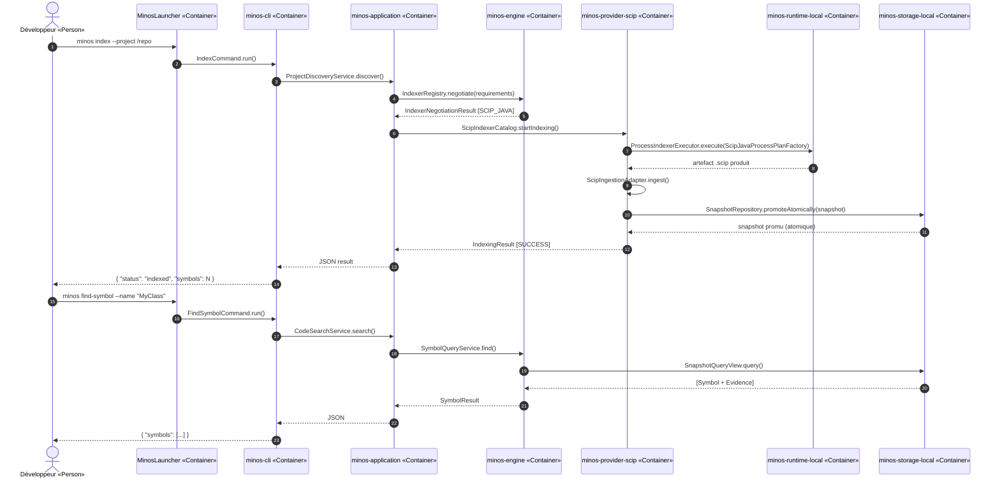
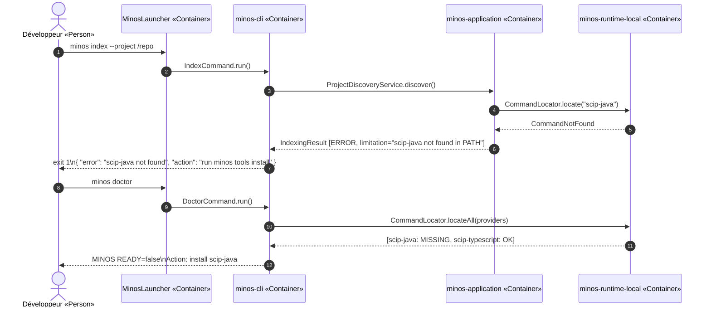
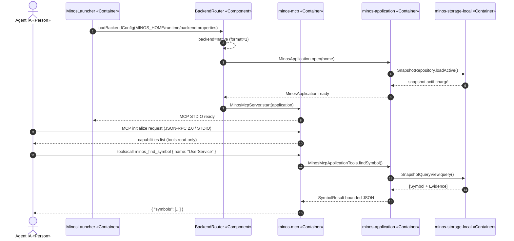
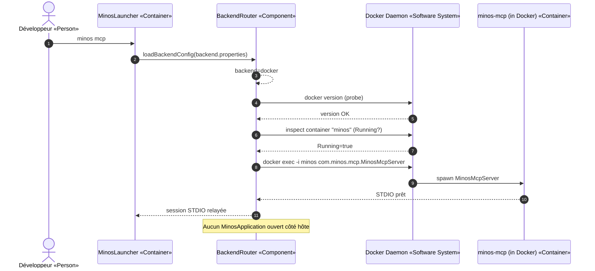

# Section 6 — Vue d'exécution

> Preuves : `MinosCli.java` USAGE, `ScipJavaProcessPlanFactory.java`,
> `IncrementalIndexingCoordinator.java`, `MinosMcpServer.java`, ADR-0006, ADR-0014,
> ADR-0037, `SnapshotIntegrityService.java`.

Les noms des participants sont strictement cohérents avec la section 5.

---

## 6.1 Scénario nominal — Indexation et requête de symbole

Ce scénario décrit le flux typique : un développeur demande d'indexer un projet Java,
puis interroge la définition d'un symbole.

---

## 6.2 Scénario d'erreur — Provider SCIP indisponible

Ce scénario illustre le comportement lorsque l'outil `scip-java` est absent du PATH.

---

## 6.3 Scénario d'exploitation — Démarrage du serveur MCP STDIO

Ce scénario décrit le démarrage de `minos mcp` en backend natif et la première requête MCP.

---

## 6.4 Scénario d'exploitation — Bascule vers backend Docker

