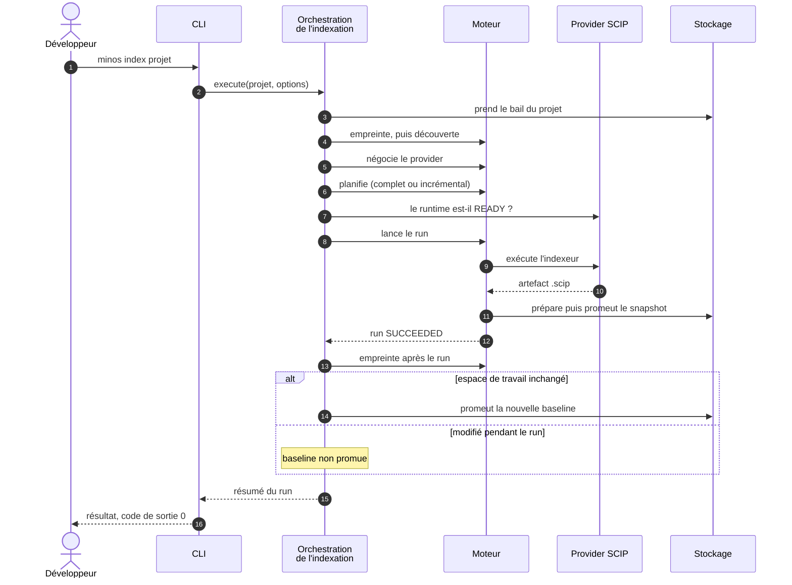
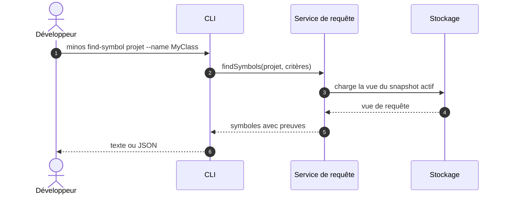
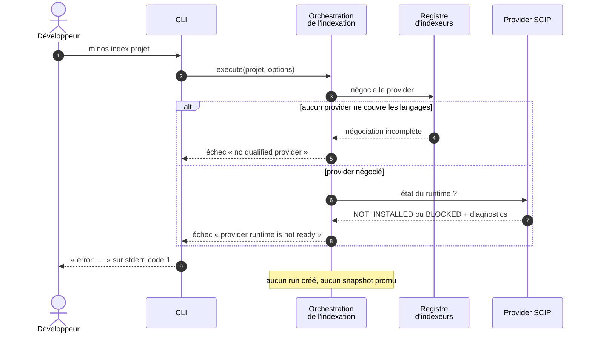
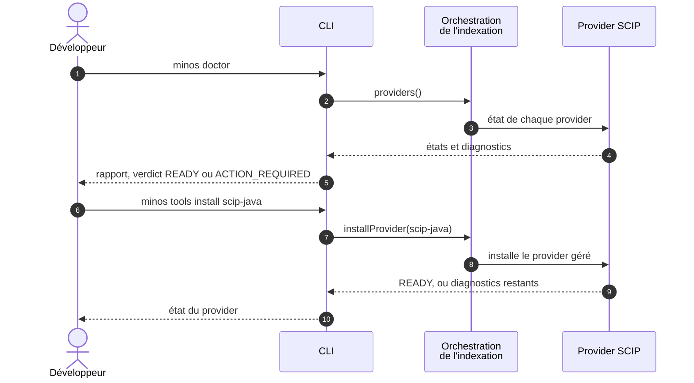
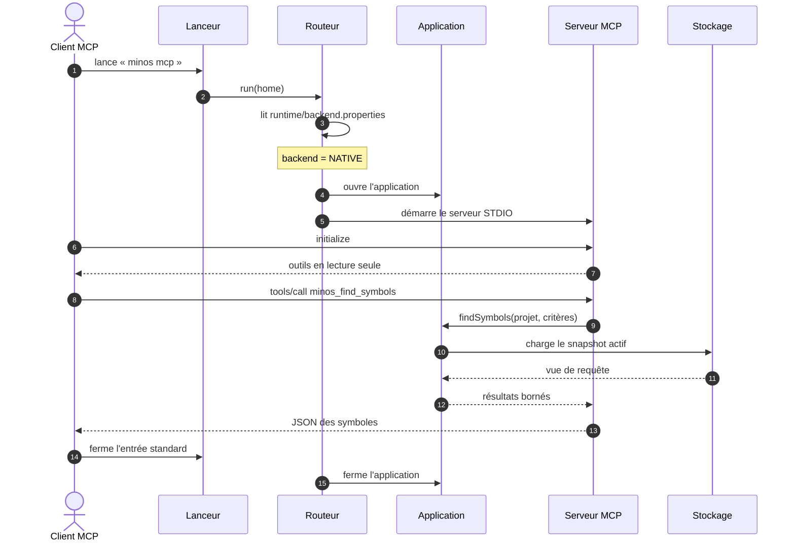
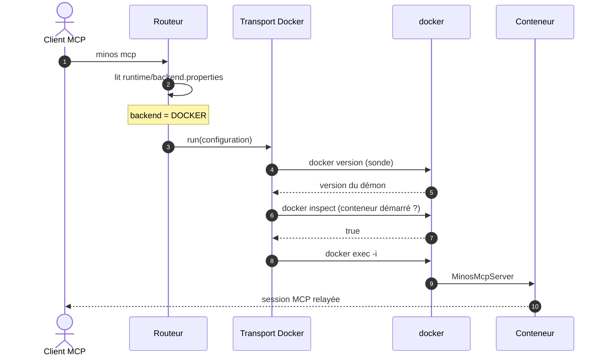

# Section 6 — Vue d'exécution

> Preuves : `MinosCliRunner`, `LocalAutonomousIndexOperations`, `IndexingLifecycleService`, `DoctorCommand`,
> `McpBackendRouter`, `DockerMcpTransport`, `MinosMcpServer`, ADR-0006, ADR-0014, ADR-0037, ADR-0039.

Relu contre le code le 2026-10-07 : les noms exacts des classes sont dans les tableaux sous chaque diagramme, et les mêmes diagrammes sont dans [`diagrams/`](../diagrams/README.md), qui fait foi en cas d'écart.

---

## 6.1 Scénario nominal — Indexation et requête de symbole

Ce scénario décrit le flux typique : un développeur demande d'indexer un projet Java,
puis interroge la définition d'un symbole.

### 1. Indexer un projet

```mermaid
sequenceDiagram
    autonumber
    actor Dev as Développeur
    participant CLI as CLI
    participant Ops as Orchestration<br/>de l'indexation
    participant Eng as Moteur
    participant Prov as Provider SCIP
    participant Sto as Stockage

    Dev->>CLI: minos index projet
    CLI->>Ops: execute(projet, options)
    Ops->>Sto: prend le bail du projet
    Ops->>Eng: empreinte, puis découverte
    Ops->>Eng: négocie le provider
    Ops->>Eng: planifie (complet ou incrémental)
    Ops->>Prov: le runtime est-il READY ?
    Ops->>Eng: lance le run
    Eng->>Prov: exécute l'indexeur
    Prov-->>Eng: artefact .scip
    Eng->>Sto: prépare puis promeut le snapshot
    Eng-->>Ops: run SUCCEEDED
    Ops->>Eng: empreinte après le run
    alt espace de travail inchangé
        Ops->>Sto: promeut la nouvelle baseline
    else modifié pendant le run
        Note over Ops: baseline non promue
    end
    Ops-->>CLI: résumé du run
    CLI-->>Dev: résultat, code de sortie 0
```

| Participant | Classes (module) |
|---|---|
| CLI | `MinosLauncher`, `MinosCliRunner`, `IndexCommand` (`minos-cli`) ; l'application est ouverte par `MinosApplication.open(home)` |
| Orchestration de l'indexation | `LocalAutonomousIndexOperations` (`minos-cli`) |
| Moteur | `ProjectFingerprintService`, `ProjectDiscoveryService`, `ProjectInvalidationService`, `IndexerRegistry`, `IncrementalIndexingPlanner`, `IndexingLifecycleService` / `IndexingRunExecutor` (`minos-engine`) |
| Provider SCIP | `ProviderRuntimeManager` (port) et `IndexerExecutor` (`IndexingRuntimePorts`), réalisés par `minos-provider-scip` |
| Stockage | `IndexStateStore`, `SnapshotStager`, `SnapshotPromoter`, `ProjectFingerprintSnapshotStore` (ports d'`minos-engine`, réalisés par `minos-storage-local`) |

Points à retenir : l'empreinte est prise **avant** la découverte (MINOS-AUD-D06) ; la promotion du snapshot est
atomique (ADR-0006) ; la baseline d'empreinte n'est promue que si l'espace de travail n'a pas changé pendant le run
(ADR-0014).

### 2. Interroger un symbole

```mermaid
sequenceDiagram
    autonumber
    actor Dev as Développeur
    participant CLI as CLI
    participant Q as Service de requête
    participant Sto as Stockage

    Dev->>CLI: minos find-symbol projet --name MyClass
    CLI->>Q: findSymbols(projet, critères)
    Q->>Sto: charge la vue du snapshot actif
    Sto-->>Q: vue de requête
    Q-->>CLI: symboles avec preuves
    CLI-->>Dev: texte ou JSON
```

| Participant | Classes (module) |
|---|---|
| CLI | `FindSymbolCommand` (`minos-cli`) |
| Service de requête | `ProjectQueryService.findSymbols` (`minos-application`), qui construit un `SymbolQueryService` |
| Stockage | `CodeKnowledgeSnapshotStore.loadActiveQueryView` ; sans snapshot actif, la requête échoue (« project has no active symbol snapshot ») |

---

## 6.2 Scénario d'erreur — Provider SCIP indisponible

Ce scénario illustre le comportement lorsque le runtime d'un provider (par exemple `scip-java`) n'est pas installé ou n'est pas prêt.

### 1. `minos index` refuse de démarrer

```mermaid
sequenceDiagram
    autonumber
    actor Dev as Développeur
    participant CLI as CLI
    participant Ops as Orchestration<br/>de l'indexation
    participant Eng as Registre<br/>d'indexeurs
    participant Prov as Provider SCIP

    Dev->>CLI: minos index projet
    CLI->>Ops: execute(projet, options)
    Ops->>Eng: négocie le provider
    alt aucun provider ne couvre les langages
        Eng-->>Ops: négociation incomplète
        Ops-->>CLI: échec « no qualified provider »
    else provider négocié
        Ops->>Prov: état du runtime ?
        Prov-->>Ops: NOT_INSTALLED ou BLOCKED + diagnostics
        Ops-->>CLI: échec « provider runtime is not ready »
    end
    CLI-->>Dev: « error: … » sur stderr, code 1
    Note over Ops: aucun run créé, aucun snapshot promu
```

| Participant | Classes (module) |
|---|---|
| CLI | `IndexCommand`, `CliCommandSupport.run` : message `error: …`, code `FindSymbolCommand.EXECUTION_ERROR` (= 1) |
| Orchestration de l'indexation | `LocalAutonomousIndexOperations.prepare` / `executeLocked` (`minos-cli`) |
| Registre d'indexeurs | `IndexerRegistry.negotiate` (`minos-engine`) |
| Provider SCIP | `ManagedScipProviderRuntimeManager.inspect` (`minos-provider-scip`) : états `READY`, `BLOCKED`, `NOT_INSTALLED` |

### 2. Diagnostiquer et réparer

```mermaid
sequenceDiagram
    autonumber
    actor Dev as Développeur
    participant CLI as CLI
    participant Ops as Orchestration<br/>de l'indexation
    participant Prov as Provider SCIP

    Dev->>CLI: minos doctor
    CLI->>Ops: providers()
    Ops->>Prov: état de chaque provider
    Prov-->>CLI: états et diagnostics
    CLI-->>Dev: rapport, verdict READY ou ACTION_REQUIRED

    Dev->>CLI: minos tools install scip-java
    CLI->>Ops: installProvider(scip-java)
    Ops->>Prov: installe le provider géré
    Prov-->>CLI: READY, ou diagnostics restants
    CLI-->>Dev: état du provider
```

| Participant | Classes (module) |
|---|---|
| CLI | `DoctorCommand`, `ToolsCommand` (`minos-cli`) |
| Orchestration de l'indexation | `LocalAutonomousIndexOperations.providers` et `installProvider` |
| Provider SCIP | `ManagedScipProviderRuntimeManager.inspect` et `install` |

Le rapport de `doctor` contient aussi les commandes trouvées, le stockage privé et l'état du sandbox des workers
(`workerSandbox`, ADR-0041).

---

## 6.3 Scénario d'exploitation — Démarrage du serveur MCP STDIO

Ce scénario décrit le démarrage de `minos mcp` en backend natif et la première requête MCP.

```mermaid
sequenceDiagram
    autonumber
    actor Client as Client MCP
    participant L as Lanceur
    participant R as Routeur
    participant App as Application
    participant S as Serveur MCP
    participant Sto as Stockage

    Client->>L: lance « minos mcp »
    L->>R: run(home)
    R->>R: lit runtime/backend.properties
    Note over R: backend = NATIVE
    R->>App: ouvre l'application
    R->>S: démarre le serveur STDIO

    Client->>S: initialize
    S-->>Client: outils en lecture seule
    Client->>S: tools/call minos_find_symbols
    S->>App: findSymbols(projet, critères)
    App->>Sto: charge le snapshot actif
    Sto-->>App: vue de requête
    App-->>S: résultats bornés
    S-->>Client: JSON des symboles

    Client->>L: ferme l'entrée standard
    R->>App: ferme l'application
```

| Participant | Classes (module) |
|---|---|
| Lanceur | `MinosLauncher` (`minos-cli`), qui résout la route par `META-INF/services` puis `McpLaunchRouteProvider` (`minos-app`) |
| Routeur | `McpBackendRouter` (`minos-app`) : valide `MINOS_HOME`, lit la configuration par `McpBackendConfigurationStore.loadOrMigrate` |
| Application | `MinosApplication.open(home)` (composée par `minos-bootstrap`) ; `ProjectQueryService.findSymbols` |
| Serveur MCP | `MinosMcpServer.run(application)`, `MinosMcpTools`, `MinosApplicationMcpBackend` (`minos-mcp`) |
| Stockage | `CodeKnowledgeSnapshotStore.loadActiveQueryView` (`minos-storage-local`) |

L'application reste ouverte pendant toute la session et n'est fermée qu'une fois, au retour du serveur.

---

## 6.4 Scénario d'exploitation — Bascule vers backend Docker

Quand `backend.properties` porte `backend=docker`, aucune application n'est ouverte côté hôte : le routeur relaie
la session MCP vers le conteneur.

```mermaid
sequenceDiagram
    autonumber
    actor Client as Client MCP
    participant R as Routeur
    participant T as Transport Docker
    participant D as docker
    participant C as Conteneur

    Client->>R: minos mcp
    R->>R: lit runtime/backend.properties
    Note over R: backend = DOCKER
    R->>T: run(configuration)
    T->>D: docker version (sonde)
    D-->>T: version du démon
    T->>D: docker inspect (conteneur démarré ?)
    D-->>T: true
    T->>D: docker exec -i
    D->>C: MinosMcpServer
    C-->>Client: session MCP relayée
```

| Participant | Classes (module) |
|---|---|
| Routeur | `McpBackendRouter` (`minos-app`) |
| Transport Docker | `DockerMcpTransport` (`minos-app`) : sonde `docker version`, `docker inspect --format {{.State.Running}}`, puis `docker exec -i` ; délais bornés |
| Conteneur | `MinosMcpServer` exécuté dans l'image du backend Docker |
