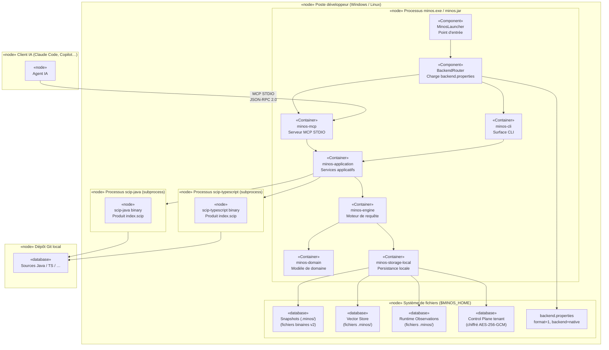
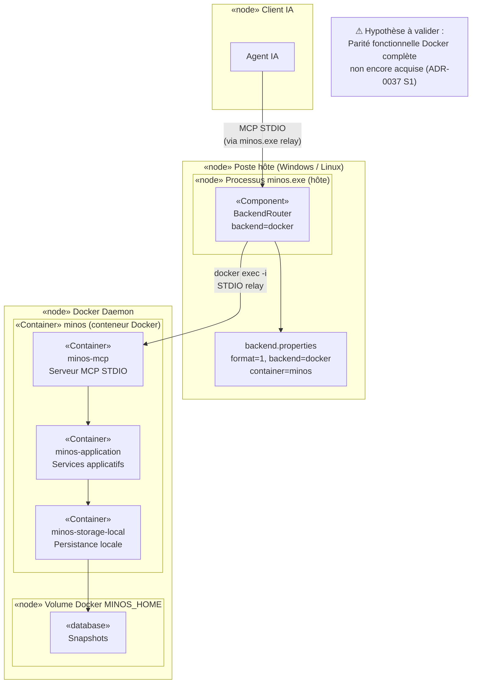

# Section 7 — Vue de déploiement

> Preuves : ADR-0021, ADR-0037, `minos-app/pom.xml` (shade, jar, failsafe),
> `minos-storage-postgresql/pom.xml` (DOCKER_HOST, Testcontainers),
> ADR-0035 (Windows + Linux), ADR-0027 (IntelliJ Java 21).

---

## 7.1 Environnements

| Environnement | Description |
|--------------|-------------|
| **Poste développeur Windows** | Installation principale : Advanced Installer / JPackage, `minos.exe` |
| **Poste développeur Linux / macOS** | Shaded JAR (`minos-code-intelligence-<version>-all.jar`) + wrapper script |
| **CI (GitHub Actions / pipeline local)** | Build Maven `./mvnw clean verify`, Testcontainers PostgreSQL via Docker Desktop |
| **Container Docker (opt-in)** | Backend MCP durable, indexation autonome (parité en cours — ADR-0037) |

---

## 7.2 Diagramme de déploiement — Backend natif (mode principal)

---

## 7.3 Diagramme de déploiement — Backend Docker (opt-in)

---

## 7.4 Protocoles

| Protocole | Usage | Participants |
|-----------|-------|-------------|
| STDIO / JSON-RPC 2.0 | Transport MCP | Agent IA ↔ MinosMcpServer |
| ProcessBuilder / STDIO | Lancement indexeurs | minos-runtime-local → scip-java, scip-typescript |
| JDBC | Stockage PostgreSQL (opt-in) | minos-storage-postgresql → PostgreSQL |
| JGit (in-process) | Lecture Git | minos-integration-git → dépôt Git local |
| docker exec -i | Relay STDIO Docker | BackendRouter → conteneur MINOS |
| Fichier local JSON | Export NEXUS | minos-nexus → orchestrateur NEXUS |
| Fichier binaire v2 | Snapshots MINOS | minos-storage-local → système de fichiers |
