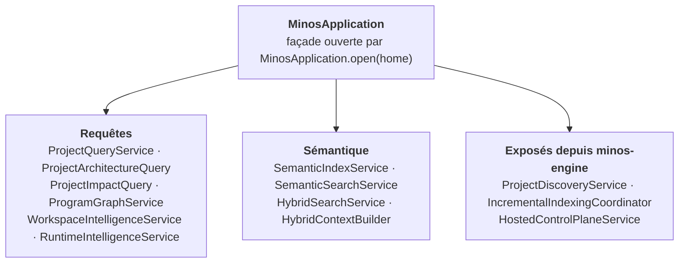

# Diagramme — Composants de `minos-application`

> Relu contre le code le 2026-10-07. `MinosApplication` expose chaque service par un accesseur
> (`projectQueryService()`, `architectureQuery()`, `impactQuery()`, `programGraphService()`,
> `workspaceIntelligence()`, `runtimeIntelligenceService()`, `semanticSearchService()`, etc.) ; les flèches de la
> façade sont ces accesseurs. Les services d'indexation et le plan de contrôle tenant vivent dans `minos-engine`
> depuis l'ADR-0044. Sources : `MinosApplication.java`, packages `architecture`, `impact`, `context`,
> `program/analysis`, `workspace`, `application/semantic`, `application/dynamic` ; ADR-0044, ADR-0045.

Dépendances internes relevées dans le code : `ProjectQueryService` → `CodeSearchService` ;
`ProjectArchitectureQuery` est réalisée par `LocalProjectArchitectureQuery` (qui utilise
`ArchitectureIntelligenceService`) ; `ProjectImpactQuery` par `LocalProjectImpactQuery` (qui utilise
`ImpactAnalysisService`) ; `ProgramGraphService` utilise `ProgramGraphComposer`. Les autres liens entre
services n'ont pas été relevés.
