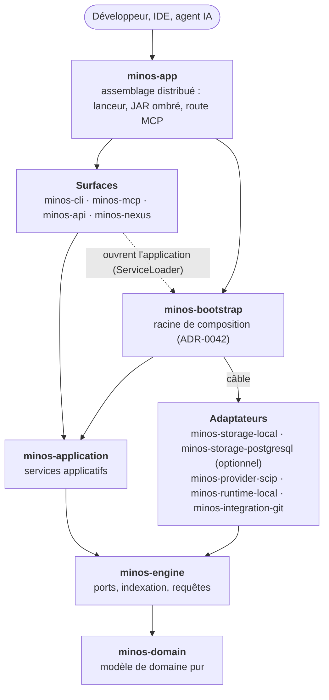

# Diagramme — Modules du reactor Maven, par couche

> Vue de niveau 2, volontairement simplifiée : une flèche relie des couches, pas chaque paire de modules. Les
> arêtes Maven exactes sont dans [module-dependencies.md](module-dependencies.md) (fichier généré, qui fait foi).
> Détail de chaque module : [arc42 § 5.2](../arc42/05-vue-blocs.md). Preuves : `pom.xml` (14 modules),
> ADR-0042 (racine de composition dans `minos-bootstrap`), ADR-0044.

Lecture : les flèches descendent vers le cœur ; `minos-bootstrap` est le seul module non adaptateur qui connaît
des classes d'adaptateur (hors `minos-app`, assemblage final). Les surfaces ne dépendent pas des adaptateurs.
