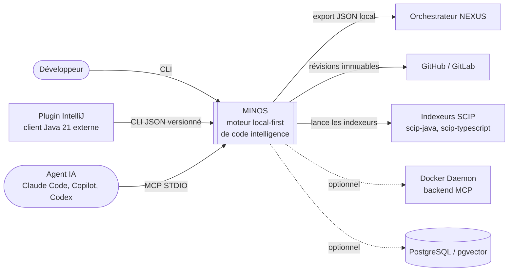

# Diagramme — Contexte du système

> Vue de niveau 1 : MINOS et ce qui l'entoure. Détail des acteurs et des interfaces : [arc42 § 3.2 et 3.3](../arc42/03-contexte-perimetre.md).
> Preuves : ADR-0001, ADR-0017, ADR-0020, ADR-0027, ADR-0033, ADR-0037, `MinosCli.java` (USAGE).

Traits pleins : usage courant. Traits pointillés : optionnel.
