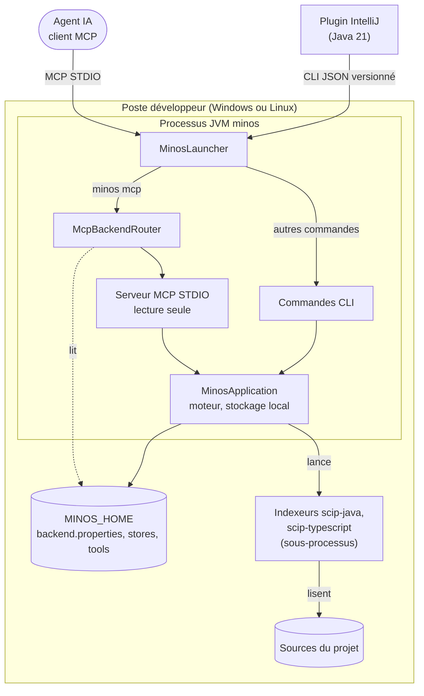

# Diagramme — Déploiement : backend natif

> Relu contre le code le 2026-10-07. Il remplace les éléments périmés du diagramme d'[arc42 § 7.2](../arc42/07-vue-deploiement.md) :
> `BackendRouter` (la classe est `McpBackendRouter`), « fichiers binaires v2 » (les snapshots sont écrits en v3, v1
> et v2 restent lisibles : ADR-0046) et l'absence de `minos-bootstrap`. Le backend Docker est décrit dans la
> [variante de seq-mcp-startup.md](seq-mcp-startup.md#2-variante--backend-docker).
> Sources : `McpBackendRouter`, `McpBackendConfigurationStore`, `MinosApplication.open`, `minos-bootstrap`,
> `ManagedScipProviderRuntimeManager` (outils sous `MINOS_HOME/tools`), ADR-0017, ADR-0021, ADR-0027, ADR-0037.

| Élément | Réalisation |
|---|---|
| Processus JVM minos | `minos-app` (JAR ombré ou `minos.exe`) ; `MinosLauncher` vient de `minos-cli`, `McpBackendRouter` de `minos-app`, le serveur MCP de `minos-mcp` |
| MinosApplication | composée par `minos-bootstrap` (ServiceLoader) ; moteur de `minos-engine`, stockage de `minos-storage-local` |
| MINOS_HOME | répertoires privés : `runtime/backend.properties`, `projects`, `indexing`, `runs`, `locks`, `workspaces`, `hosted-control-plane`, `tools` |
| Indexeurs | providers gérés sous `MINOS_HOME/tools`, lancés par `minos-runtime-local` et `minos-provider-scip` |

Éléments optionnels non dessinés : backend de stockage PostgreSQL / pgvector (`minos-storage-postgresql`, câblé par
`minos-bootstrap`), couche sémantique (`disabled | local-hash | ollama`), plan de contrôle tenant.
