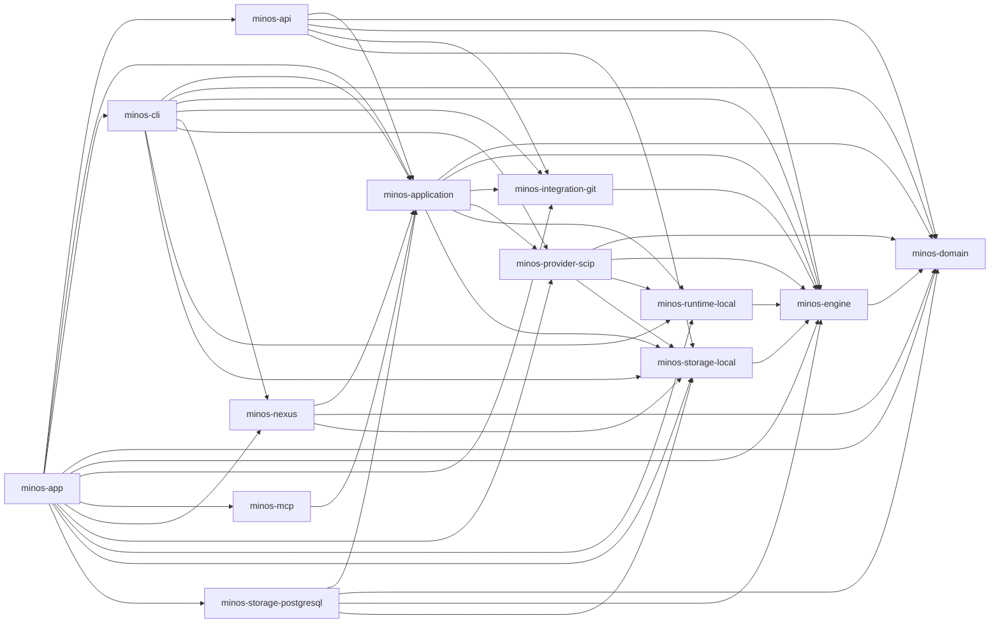

# Diagramme — Dépendances Maven entre modules MINOS

> **Fichier généré.** Ne pas modifier ce diagramme manuellement.
> La vérité exécutable provient des POMs du reactor et de
> `scripts/architecture/check-module-boundaries.py`.
> Régénération : `python scripts/architecture/check-module-boundaries.py --write-doc`.

## Dépendances MINOS directes

| Module | Dépendances directes |
|---|---|
| `minos-domain` | — |
| `minos-engine` | `minos-domain` |
| `minos-runtime-local` | `minos-engine` |
| `minos-storage-local` | `minos-engine` |
| `minos-storage-postgresql` | `minos-application`, `minos-domain`, `minos-engine`, `minos-storage-local` |
| `minos-provider-scip` | `minos-domain`, `minos-engine`, `minos-runtime-local`, `minos-storage-local` |
| `minos-integration-git` | `minos-engine` |
| `minos-application` | `minos-domain`, `minos-engine`, `minos-integration-git`, `minos-provider-scip`, `minos-runtime-local`, `minos-storage-local` |
| `minos-nexus` | `minos-application`, `minos-domain`, `minos-storage-local` |
| `minos-cli` | `minos-application`, `minos-domain`, `minos-engine`, `minos-integration-git`, `minos-nexus`, `minos-provider-scip`, `minos-runtime-local`, `minos-storage-local` |
| `minos-api` | `minos-application`, `minos-domain`, `minos-engine`, `minos-integration-git`, `minos-storage-local` |
| `minos-mcp` | `minos-application` |
| `minos-app` | `minos-api`, `minos-application`, `minos-cli`, `minos-domain`, `minos-engine`, `minos-integration-git`, `minos-mcp`, `minos-nexus`, `minos-provider-scip`, `minos-runtime-local`, `minos-storage-local`, `minos-storage-postgresql` |

Le sens d'une flèche est **module → dépendance directe**. Les dépendances transitives ne sont pas répétées.
Le mode normal du checker échoue si ce fichier n'est plus exactement aligné avec les POMs courants.
