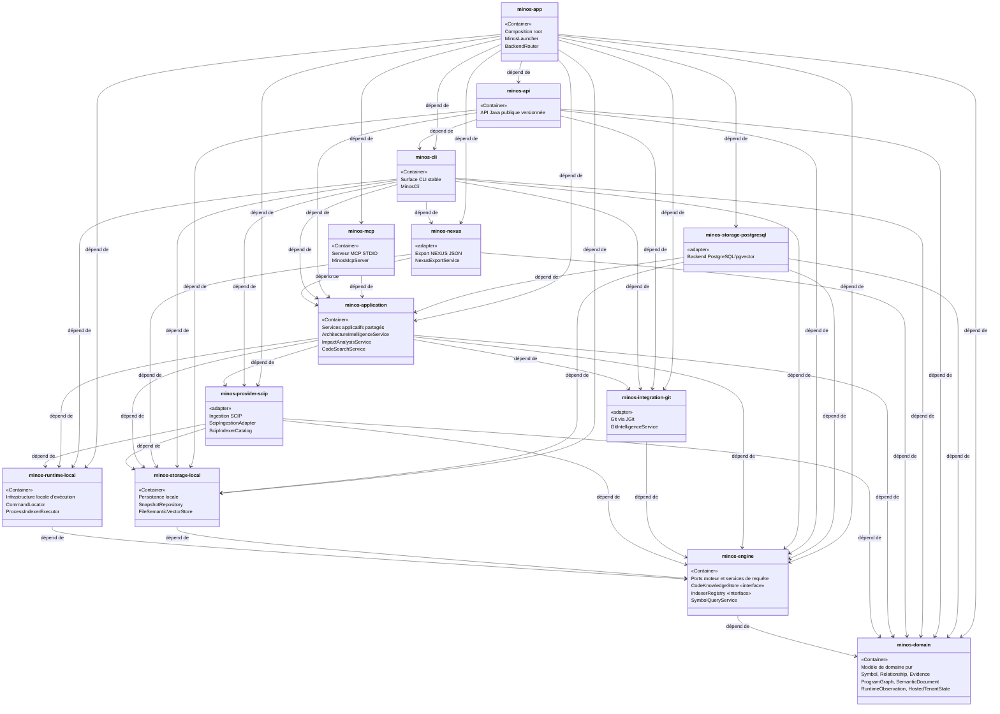

# Diagramme — Dépendances Maven entre modules MINOS

Type : UML classDiagram (dépendances Maven)
Portée : Reactor complet (`minos-parent`)

```mermaid
classDiagram
    class `minos-domain` {
        «Container»
        Modèle de domaine pur
        Symbol, Relationship, Evidence
        ProgramGraph, SemanticDocument
        RuntimeObservation, HostedTenantState
    }
    class `minos-engine` {
        «Container»
        Ports moteur et services de requête
        CodeKnowledgeStore «interface»
        IndexerRegistry «interface»
        SymbolQueryService
    }
    class `minos-runtime-local` {
        «Container»
        Infrastructure locale d'exécution
        CommandLocator
        ProcessIndexerExecutor
    }
    class `minos-storage-local` {
        «Container»
        Persistance locale
        SnapshotRepository
        FileSemanticVectorStore
    }
    class `minos-provider-scip` {
        «adapter»
        Ingestion SCIP
        ScipIngestionAdapter
        ScipIndexerCatalog
    }
    class `minos-integration-git` {
        «adapter»
        Git via JGit
        GitIntelligenceService
    }
    class `minos-application` {
        «Container»
        Services applicatifs partagés
        ArchitectureIntelligenceService
        ImpactAnalysisService
        CodeSearchService
    }
    class `minos-nexus` {
        «adapter»
        Export NEXUS JSON
        NexusExportService
    }
    class `minos-cli` {
        «Container»
        Surface CLI stable
        MinosCli
    }
    class `minos-api` {
        «Container»
        API Java publique versionnée
    }
    class `minos-mcp` {
        «Container»
        Serveur MCP STDIO
        MinosMcpServer
    }
    class `minos-storage-postgresql` {
        «adapter»
        Backend PostgreSQL/pgvector
    }
    class `minos-app` {
        «Container»
        Composition root
        MinosLauncher
        BackendRouter
    }

    `minos-engine` --> `minos-domain` : dépend de
    `minos-runtime-local` --> `minos-engine` : dépend de
    `minos-storage-local` --> `minos-engine` : dépend de
    `minos-provider-scip` --> `minos-domain` : dépend de
    `minos-provider-scip` --> `minos-engine` : dépend de
    `minos-provider-scip` --> `minos-storage-local` : dépend de
    `minos-provider-scip` --> `minos-runtime-local` : dépend de
    `minos-integration-git` --> `minos-engine` : dépend de
    `minos-application` --> `minos-domain` : dépend de
    `minos-application` --> `minos-engine` : dépend de
    `minos-application` --> `minos-runtime-local` : dépend de
    `minos-application` --> `minos-storage-local` : dépend de
    `minos-application` --> `minos-provider-scip` : dépend de
    `minos-application` --> `minos-integration-git` : dépend de
    `minos-nexus` --> `minos-domain` : dépend de
    `minos-nexus` --> `minos-application` : dépend de
    `minos-nexus` --> `minos-storage-local` : dépend de
    `minos-cli` --> `minos-domain` : dépend de
    `minos-cli` --> `minos-engine` : dépend de
    `minos-cli` --> `minos-application` : dépend de
    `minos-cli` --> `minos-integration-git` : dépend de
    `minos-cli` --> `minos-storage-local` : dépend de
    `minos-cli` --> `minos-provider-scip` : dépend de
    `minos-cli` --> `minos-runtime-local` : dépend de
    `minos-cli` --> `minos-nexus` : dépend de
    `minos-api` --> `minos-domain` : dépend de
    `minos-api` --> `minos-engine` : dépend de
    `minos-api` --> `minos-application` : dépend de
    `minos-api` --> `minos-storage-local` : dépend de
    `minos-api` --> `minos-cli` : dépend de
    `minos-api` --> `minos-integration-git` : dépend de
    `minos-mcp` --> `minos-application` : dépend de
    `minos-storage-postgresql` --> `minos-domain` : dépend de
    `minos-storage-postgresql` --> `minos-engine` : dépend de
    `minos-storage-postgresql` --> `minos-storage-local` : dépend de
    `minos-storage-postgresql` --> `minos-application` : dépend de
    `minos-app` --> `minos-domain` : dépend de
    `minos-app` --> `minos-engine` : dépend de
    `minos-app` --> `minos-runtime-local` : dépend de
    `minos-app` --> `minos-storage-local` : dépend de
    `minos-app` --> `minos-provider-scip` : dépend de
    `minos-app` --> `minos-integration-git` : dépend de
    `minos-app` --> `minos-application` : dépend de
    `minos-app` --> `minos-storage-postgresql` : dépend de
    `minos-app` --> `minos-nexus` : dépend de
    `minos-app` --> `minos-cli` : dépend de
    `minos-app` --> `minos-api` : dépend de
    `minos-app` --> `minos-mcp` : dépend de
```
