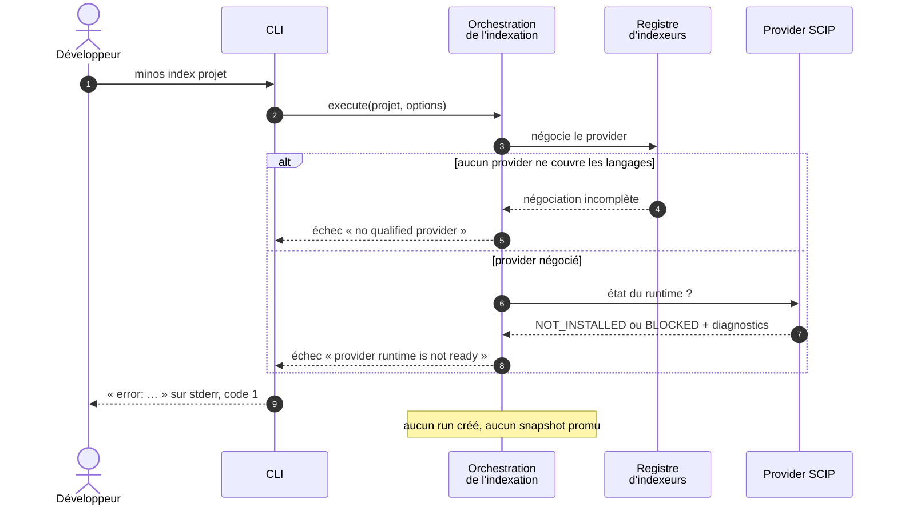
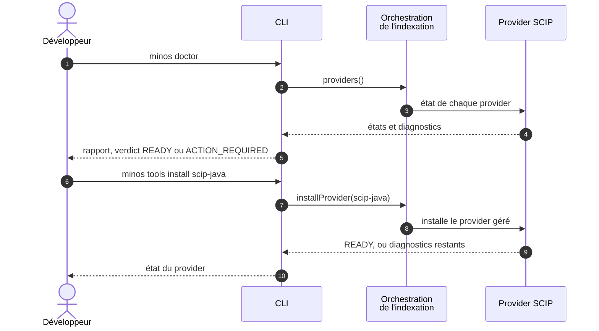

# Diagramme — Provider SCIP absent ou non prêt

> Relu contre le code le 2026-10-07 : le diagramme d'[arc42 § 6.2](../arc42/06-vue-execution.md) (août) montrait
> un échec dans la découverte ; ce n'est plus le chemin. Le refus se fait dans la préparation de l'indexation, à
> partir de l'état du runtime du provider. Les noms exacts sont dans les tableaux.

## 1. `minos index` refuse de démarrer

| Participant | Classes (module) |
|---|---|
| CLI | `IndexCommand`, `CliCommandSupport.run` : message `error: …`, code `FindSymbolCommand.EXECUTION_ERROR` (= 1) |
| Orchestration de l'indexation | `LocalAutonomousIndexOperations.prepare` / `executeLocked` (`minos-cli`) |
| Registre d'indexeurs | `IndexerRegistry.negotiate` (`minos-engine`) |
| Provider SCIP | `ManagedScipProviderRuntimeManager.inspect` (`minos-provider-scip`) : états `READY`, `BLOCKED`, `NOT_INSTALLED` |

## 2. Diagnostiquer et réparer

| Participant | Classes (module) |
|---|---|
| CLI | `DoctorCommand`, `ToolsCommand` (`minos-cli`) |
| Orchestration de l'indexation | `LocalAutonomousIndexOperations.providers` et `installProvider` |
| Provider SCIP | `ManagedScipProviderRuntimeManager.inspect` et `install` |

Le rapport de `doctor` contient aussi les commandes trouvées, le stockage privé et l'état du sandbox des workers
(`workerSandbox`, ADR-0041).
