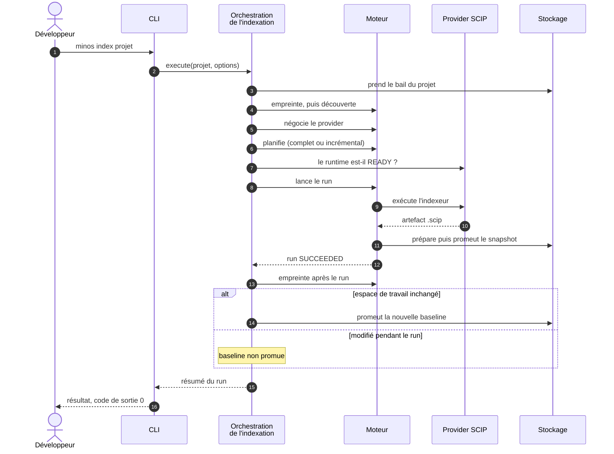
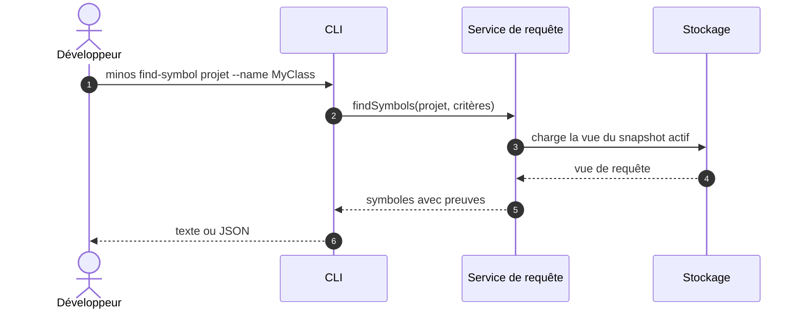

# Diagramme — Indexation nominale puis requête de symbole

> Relu contre le code le 2026-10-07 : le diagramme d'[arc42 § 6.1](../arc42/06-vue-execution.md) date d'août et
> cite des classes qui n'existent plus. Les noms exacts des classes et des appels sont dans le tableau sous chaque
> diagramme, pour garder les diagrammes lisibles. Le bail de projet, la reprise d'un run interrompu (ADR-0039) et la
> synchronisation sémantique ne sont pas détaillés ; si aucun fichier n'a changé, la commande répond `NO_CHANGES`
> sans lancer de provider.

## 1. Indexer un projet

| Participant | Classes (module) |
|---|---|
| CLI | `MinosLauncher`, `MinosCliRunner`, `IndexCommand` (`minos-cli`) ; l'application est ouverte par `MinosApplication.open(home)` |
| Orchestration de l'indexation | `LocalAutonomousIndexOperations` (`minos-cli`) |
| Moteur | `ProjectFingerprintService`, `ProjectDiscoveryService`, `ProjectInvalidationService`, `IndexerRegistry`, `IncrementalIndexingPlanner`, `IndexingLifecycleService` / `IndexingRunExecutor` (`minos-engine`) |
| Provider SCIP | `ProviderRuntimeManager` (port) et `IndexerExecutor` (`IndexingRuntimePorts`), réalisés par `minos-provider-scip` |
| Stockage | `IndexStateStore`, `SnapshotStager`, `SnapshotPromoter`, `ProjectFingerprintSnapshotStore` (ports d'`minos-engine`, réalisés par `minos-storage-local`) |

Points à retenir : l'empreinte est prise **avant** la découverte (MINOS-AUD-D06) ; la promotion du snapshot est
atomique (ADR-0006) ; la baseline d'empreinte n'est promue que si l'espace de travail n'a pas changé pendant le run
(ADR-0014).

## 2. Interroger un symbole

| Participant | Classes (module) |
|---|---|
| CLI | `FindSymbolCommand` (`minos-cli`) |
| Service de requête | `ProjectQueryService.findSymbols` (`minos-application`), qui construit un `SymbolQueryService` |
| Stockage | `CodeKnowledgeSnapshotStore.loadActiveQueryView` ; sans snapshot actif, la requête échoue (« project has no active symbol snapshot ») |
