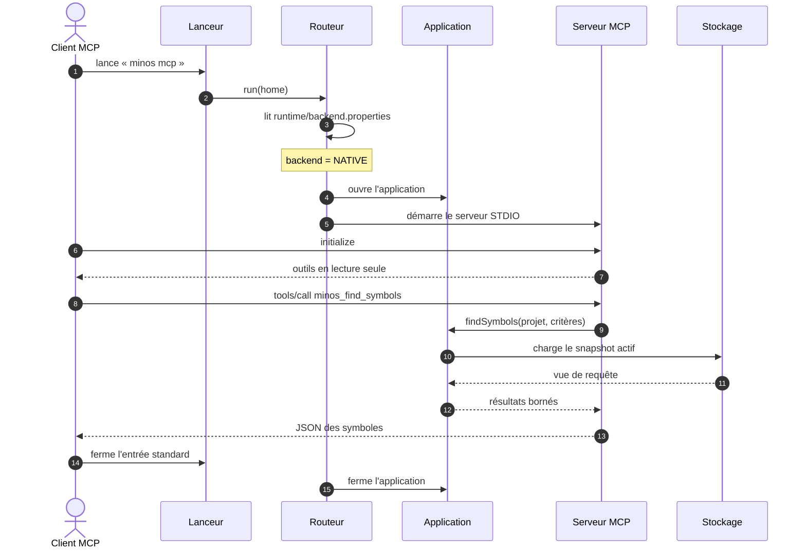
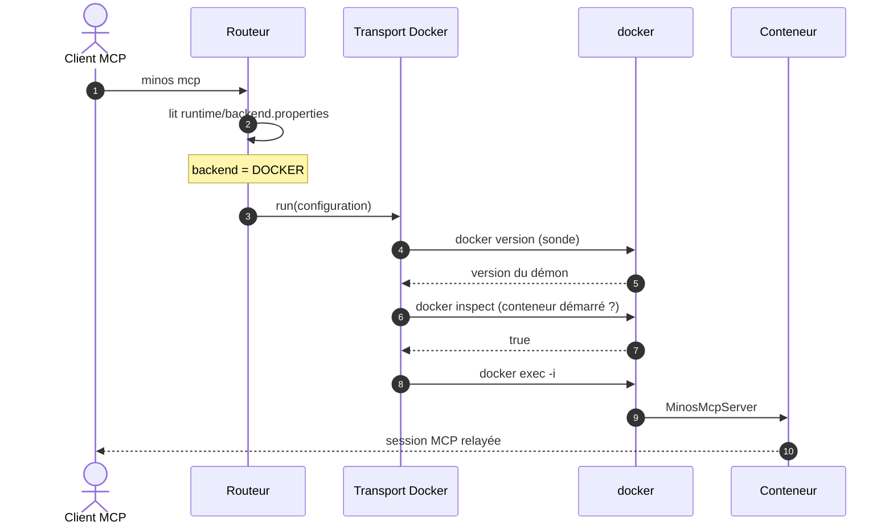

# Diagramme — Démarrage du serveur MCP STDIO

> Relu contre le code le 2026-10-07 : le diagramme d'[arc42 § 6.3](../arc42/06-vue-execution.md) (août) nomme un
> `BackendRouter` qui n'existe pas ; la classe est `McpBackendRouter`. Les noms exacts sont dans les tableaux.
> Sources : `MinosLauncher.main` (cas `minos mcp`), `McpLaunchRouteProvider`, `McpBackendRouter`,
> `McpBackendConfigurationStore`, `MinosMcpServer`, `MinosMcpTools`, ADR-0017, ADR-0037, ADR-0044.

## 1. Backend natif

| Participant | Classes (module) |
|---|---|
| Lanceur | `MinosLauncher` (`minos-cli`), qui résout la route par `META-INF/services` puis `McpLaunchRouteProvider` (`minos-app`) |
| Routeur | `McpBackendRouter` (`minos-app`) : valide `MINOS_HOME`, lit la configuration par `McpBackendConfigurationStore.loadOrMigrate` |
| Application | `MinosApplication.open(home)` (composée par `minos-bootstrap`) ; `ProjectQueryService.findSymbols` |
| Serveur MCP | `MinosMcpServer.run(application)`, `MinosMcpTools`, `MinosApplicationMcpBackend` (`minos-mcp`) |
| Stockage | `CodeKnowledgeSnapshotStore.loadActiveQueryView` (`minos-storage-local`) |

L'application reste ouverte pendant toute la session et n'est fermée qu'une fois, au retour du serveur.

## 2. Variante : backend Docker

Quand `backend.properties` porte `backend=docker`, aucune application n'est ouverte côté hôte : le routeur relaie
la session MCP vers le conteneur.

| Participant | Classes (module) |
|---|---|
| Routeur | `McpBackendRouter` (`minos-app`) |
| Transport Docker | `DockerMcpTransport` (`minos-app`) : sonde `docker version`, `docker inspect --format {{.State.Running}}`, puis `docker exec -i` ; délais bornés |
| Conteneur | `MinosMcpServer` exécuté dans l'image du backend Docker |
