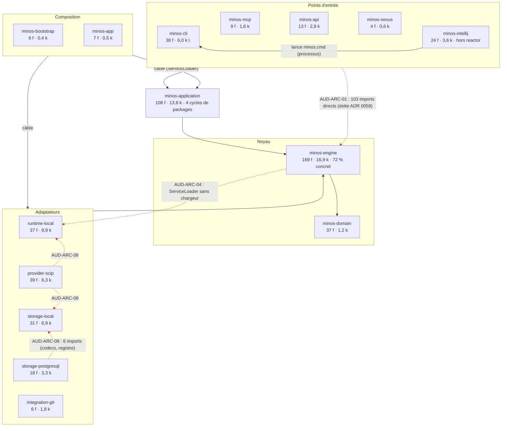

# Architecture observée — 10 octobre 2026

Découpage **réellement observé** au HEAD `816cdd0c`, reconstruit à partir des `pom.xml` et des `import com.minos.…` des sources de production (script de l'axe Architecture ; données brutes dans l'artefact de synthèse et dans [`findings.json`](findings.json)). Il diffère de la documentation courante sur un point principal : `docs/architecture/arc42/05` donne des dépendances fausses pour 7 modules sur 14 (AUD-ARC-03).

## Chiffres

| Couche observée | Module | Fichiers main | Lignes main |
|---|---|---:|---:|
| Points d'entrée | minos-cli | 38 | 6 025 |
| | minos-api | 13 | 2 891 |
| | minos-mcp | 9 | 1 574 |
| | minos-nexus | 4 | 626 |
| | minos-intellij (Gradle, hors reactor) | 24 | 3 600 |
| Composition | minos-bootstrap | 6 | 407 |
| | minos-app (assemblage + transport MCP Docker, pont NEXUS) | 7 | 538 |
| Application | minos-application | 108 | 13 753 |
| Noyau | minos-engine (ports + orchestration + E/S durcies + plan hébergé) | 169 | 16 932 |
| | minos-domain | 37 | 1 185 |
| Adaptateurs | minos-runtime-local (bacs à sable Linux/Windows) | 37 | 8 919 |
| | minos-storage-local | 31 | 6 857 |
| | minos-provider-scip | 39 | 6 269 |
| | minos-storage-postgresql | 18 | 3 254 |
| | minos-integration-git | 6 | 1 752 |

Total de production dans le reactor : 546 fichiers, 74 582 lignes ; 51 packages, 277 arêtes entre packages. Aucun cycle entre modules (ni par les POM ni par les imports). Quatre cycles de packages, dont un de 8 packages dans `minos-application` (AUD-ARC-06).

## Diagramme

Les flèches vont **du module qui dépend vers le module dont il dépend**. Les arêtes en pointillés rouges sont des écarts à une règle documentée.

## Écarts aux règles documentées

| Arête | Règle | Autorisée par | Constat |
|---|---|---|---|
| minos-cli → minos-engine (76 imports, 21 fichiers) | ADR 0057 § 2 et § 6 : les surfaces consomment des cas d'usage de `minos-application` | ADR 0058, comme dette, sans cliquet par classe | AUD-ARC-01 |
| minos-api → minos-engine (16), minos-nexus → minos-engine (6), minos-mcp → minos-engine (5) | ADR 0057 § 6 | ADR 0058 (dette listée) | AUD-ARC-01 |
| minos-storage-postgresql → minos-storage-local (6) | ADR 0055 : aucune dépendance entre backends | `ALLOWED_DEPENDENCIES`, transitoire jusqu'à SH-02/SH-03 | AUD-ARC-08 |
| minos-provider-scip → minos-storage-local, minos-runtime-local | ADR 0057 § 3 : staging SCIP par ports injectés | ADR 0022 + `ALLOWED_DEPENDENCIES` | AUD-ARC-08 |
| minos-engine ⇢ minos-runtime-local (ServiceLoader, non déclarée) | ADR 0042 : seule la racine de composition câble des adaptateurs | rien | AUD-ARC-04 |
| minos-cli ⇢ minos-app (exécution, non déclarée) | aucune règle violée | ADR 0044 (route MCP découverte) | AUD-ARC-11 |

## Ce que ce graphe ne montre pas

Un graphe de modules ne montre pas les défauts internes à un module, qui sont l'essentiel du sujet ici : la double orchestration de l'indexation (AUD-ARC-02) vit entièrement dans `minos-engine` et `minos-cli`, les relectures de snapshot du chemin de requête (AUD-PERF-01, 03) dans `minos-application` et les stores, et la remontée vers un `.git` parent (AUD-SEC-01) dans un seul appel de `minos-integration-git`. Le garde-fou `check-module-boundaries.py` passe (14 modules, 522 sources, 45 packages) : il contrôle les arêtes entre modules, pas les classes que chaque surface importe.
