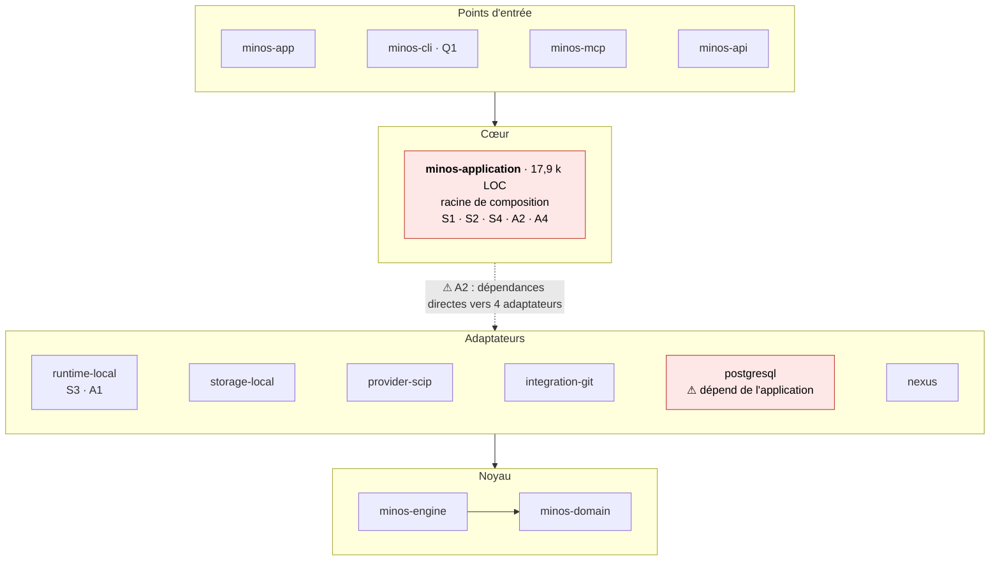

# Audit de code MINOS — septembre 2026

> **Périmètre** : dépôt `minos-code-intelligence`, version `1.3.0-SNAPSHOT` (Java 24, Maven, 13 modules).
> **Axes** : architecture et couplage, sécurité, qualité et dette technique, tests et couverture.
> **Méthode** : lecture intégrale des sources de production de 10 modules (environ 48 500 lignes), des workflows CI, de Docker et des scripts qualité, puis revérification ciblée des constats les plus graves. Aucune CI n'a été déclenchée et aucun code n'a été exécuté.
> **Statuts** : **CONFIRMÉ** = défaut vu dans le code (et revérifié pour les constats Haute) ; **PLAUSIBLE** = le risque dépend d'un contexte d'exécution ou d'un code non lu.

## 1. Vue d'ensemble

**Verdict global.** La base est d'un **bon niveau d'ingénierie défensive** :
- les entrées sont bornées partout ;
- les fichiers sont ouverts de façon confinée (`ConfinedFileOpener`) et écrits de façon atomique et durable ;
- les jetons HMAC sont comparés en temps constant ;
- les diagnostics sont nettoyés ;
- la CI épingle ses actions par SHA ;
- les conteneurs sont durcis.

Les faiblesses se concentrent sur trois points :
1. **l'architecture** : la couche application dépend d'adaptateurs concrets et des packages sont éclatés entre plusieurs modules ;
2. **quelques trous de sécurité ciblés** : escalade de rôle dans le plan de contrôle d'équipe, nettoyage cgroup trop agressif, fuite de mot de passe via `toString` ;
3. **la cohérence** : primitives de sécurité appliquées de façon inégale, CI qui prolifère, couverture de tests limitée à des zones précises.

| Sévérité | Nombre |
|---|---|
| 🔴 Haute | 8 |
| 🟠 Moyenne | 22 |
| 🟡 Basse | 10 groupes (≈ 27 points) |

## 2. Les 12 priorités

| # | Constat | Axe | Sévérité | Statut | Échéance |
|---|---|---|---|---|---|
| S1 | Un ADMIN peut s'attribuer le rôle OWNER, donc la rotation de clé | Sécurité | 🔴 Haute | CONFIRMÉ | Sprint 1 |
| S2 | Des refus d'accès en boucle saturent l'audit et bloquent toute mutation du tenant | Sécurité | 🔴 Haute | CONFIRMÉ | Sprint 1 |
| S3 | `LinuxCgroupJob.reclaimStaleJobs` tue les jobs d'un autre processus MINOS | Sécurité / fiabilité | 🔴 Haute | CONFIRMÉ (impact PLAUSIBLE) | Sprint 1 |
| S4 | `StorageBackendConfiguration.toString()` affiche le mot de passe PostgreSQL | Sécurité | 🔴 Haute | CONFIRMÉ | Sprint 1 |
| Q1 | `team …` : la mutation est faite avant le rejet des options inconnues | Qualité | 🔴 Haute | CONFIRMÉ | Sprint 1 |
| A1 | L'indexation distante est toujours refusée sur tous les OS (sandbox non qualifiée), contrairement à ce que dit le README | Architecture | 🔴 Haute | CONFIRMÉ | Trimestre |
| A2 | La couche application dépend d'adaptateurs concrets et porte la racine de composition | Architecture | 🔴 Haute | CONFIRMÉ | Trimestre |
| R1 | Aucune reprise après une indexation interrompue | Fiabilité | 🔴 Haute | CONFIRMÉ | Sprints 2–3 |
| S5 | `PrivateLocalStorage` et `NOFOLLOW` appliqués de façon inégale (≈10 sites) | Sécurité | 🟠 Moyenne | CONFIRMÉ | Sprints 2–3 |
| P1 | `minos_index_status` bloque 10 s puis échoue pendant une indexation | Fiabilité | 🟠 Moyenne | CONFIRMÉ | Sprints 2–3 |
| D1 | Le paquet n'embarque aucun indexeur | Distribution | 🟠 Moyenne | CONFIRMÉ | Sprints 2–3 |
| T1 | Pas de seuil de couverture global ; CLI, Git et la majorité d'application échappent au gate | Tests | 🟠 Moyenne | CONFIRMÉ | Trimestre |

## 3. Architecture et couplage

### A1 — L'indexation distante est désactivée de fait (🔴 CONFIRMÉ)
- **Où** : `WorkerSandboxBackends.strongestAvailable`, `WorkerSandboxQualification`, `LinuxBubblewrap…`, `WindowsAppContainerWorkerSandboxBackend.containment()`.
- **Constat** : les deux backends déclarent `filesystemWriteBytes/Entries = SUPERVISED_HARD_KILL`. La qualification les rétrograde donc en `UNTRUSTED_CODE_UNSUPPORTED`, et `LocalIsolatedIndexWorker` (indexation distante, CLI `remote`) échoue en mode fermé sur **tous** les OS. C'est même verrouillé par le test `currentOsBackendsFailClosedUntilStorageIsOsEnforced`.
- **Impact** :
  - environ 2 000 lignes de code sandbox sont inatteignables en production ;
  - le README annonce une « sandbox OS worker réelle qualifiée Linux + Windows » (#98) ;
  - le repli se fait en silence, sans aucun log.
- **Recommandation** : soit appliquer le quota de stockage au niveau OS (quota XFS/btrfs, tmpfs de taille fixe dans bwrap, VHD à taille fixe sous Windows), soit corriger la documentation. Dans les deux cas, journaliser la raison du repli.

### A2 — Application couplée aux adaptateurs (🔴 CONFIRMÉ)
- `minos-application` dépend dans son POM de `runtime-local`, `storage-local`, `provider-scip` et `integration-git`.
- `MinosApplicationAssembler` et `LocalStorageBackend` instancient directement `ManagedScip*`, `FileHostedControlPlaneStore`, `FileSymbolSnapshotStore`, `FileSemanticVectorStore`, etc.
- Des adaptateurs fichiers vivent dans le module application lui-même : `FileProjectFingerprintSnapshotStore` (≈580 lignes), `FileIndexStateStore`, `LocalProjectRegistry`.
- `ProviderPlatformService` dépend de `ScipIndexerCatalog.qualifiedM24Providers()`.
- `SemanticIndexService` fait des `instanceof LocalHash/Ollama`.
- `minos-storage-postgresql` dépend de `minos-application` : un adaptateur dépend du cœur applicatif.
- **Recommandation** : déplacer la racine de composition vers `minos-app`, garder dans `minos-application` uniquement des ports (interfaces), et déplacer les adaptateurs fichiers dans `storage-local`. Il faut aussi que `check-module-boundaries.py` interdise `application → adaptateurs`.

### A3 — Packages éclatés entre modules et doublons (🟠 CONFIRMÉ)
- 9 packages sont éclatés entre plusieurs modules, dont :
  - `com.minos.cli` (app, cli) ;
  - `com.minos.dynamic` (application, domain, engine) ;
  - `com.minos.hosted` (application, domain, engine) ;
  - `com.minos.runtime` (application, runtime-local) ;
  - `com.minos.store` (engine, storage-local).
- Conséquences : le projet ne peut pas passer à JPMS, et la visibilité « package » traverse les modules.
- `cli.ProjectOperations`, `cli.ProjectSymbolQuery`, `cli.LocalProject*` sont des alias dépréciés, mais `MinosCliRunner` les instancie encore. La dépréciation ne peut donc jamais aboutir.

### A4 — Classes-dieux et constructeurs télescopiques (🟠 CONFIRMÉ)
- `MinosApplication` expose environ 30 services.
- `LocalProjectArchitectureQuery` a 9 constructeurs et recalcule la découverte, le snapshot et la topologie à chaque appel, sans cache.
- `MinosCli` a 9 constructeurs.
- Les plus gros fichiers : `WindowsAppContainerWorkerSandboxBackend` (789 lignes), `SnapshotBinaryCodecSupport` (757), `FileProjectFingerprintSnapshotStore` (728), `DistributedArtifactBundleStore` (706).

### A5 — `minos-engine` fourre-tout (🟡 CONFIRMÉ)
- Le package `io` (primitives de sécurité et d'I/O) vit dans le module moteur.
- Deux modèles de capacités coexistent, `IndexerDescriptor.capabilities` et `ProviderCapabilityProfile`, avec un risque de dérive.
- Le domaine mélange des conventions : lignes numérotées à partir de 0 dans `SemanticDocument`, à partir de 1 dans `SymbolLocation`.
- `SemanticVectorStore` (domaine) embarque de l'I/O.

### A6 — Mémoire et scalabilité (🟠 PLAUSIBLE)
- Les snapshots sont chargés entièrement en mémoire (`InMemoryCodeKnowledgeStore`, cache de 512 Mo).
- Les chaînes sont encodées en UTF-16, ce qui double leur taille.
- Le plafond des snapshots persistés (256 Mo) est inférieur à la limite des artefacts SCIP (512 Mo) : sur un gros projet, l'échec arrive tard.
- `HybridSearchService` re-normalise tout le corpus (jusqu'à 250 000 documents) à chaque requête de 64 Ko au plus.
- `ImpactAnalysisService` n'applique `maxResults` qu'après une traversée complète.

## 4. Fiabilité opérationnelle et distribution

### R1 — Aucune reprise après une indexation interrompue (🔴 CONFIRMÉ)
- **Où** : `orchestration/IndexingRunExecutor`, `AuthoritativeProjectStateReconciler.recoverAbandonedRuns`, `runtime-local/RunDirectoryRetention`.
- **Constat** : tout run `RUNNING` retrouvé sous bail exclusif est finalisé en `FAILED` sans consulter le disque, et la relance tire un nouveau `runId`. Or les artefacts `runs/<runId>/<indexerId>/index.scip` sont écrits atomiquement, avec fsync, et ne sont jamais supprimés en fin de run. Le travail coûteux est donc encore là, mais personne ne le regarde. S'y ajoutent trois trous : le point de contrôle ne porte ni le module, ni la version du provider, ni l'empreinte de l'artefact ; la rétention des répertoires de run peut effacer le run à reprendre, et elle se déclenche au début de l'exécution suivante ; les snapshots `.tmp` orphelins ne sont nettoyés par personne.
- **Scénario** : un reboot pendant l'indexation d'un monorepo, au dernier module de sept providers, coûte la totalité du run.
- **Conception** : [ADR 0039](../adr/0039-reprise-indexation-apres-interruption.md) — points de contrôle par cible, état `INTERRUPTED`, reprise sur le même `runId`.

### D1 — Le paquet n'embarque aucun indexeur (🟠 CONFIRMÉ)
- **Où** : `scripts/release/build-windows-distribution.ps1`, `packaging/windows/minos-installer.iss.template`.
- **Constat** : la distribution ne contient que l'image `jpackage` (runtime Java + `minos.jar`), les scripts d'intégration, le SBOM et les notices. Le `README.txt` généré demande encore `minos.cmd tools install scip-java`, et le template Inno Setup n'a aucune étape d'installation d'outil. L'image Docker release, elle, embarque déjà ses toolchains avec des téléchargements vérifiés.
- **Scénario** : sur un poste neuf, ou sans accès réseau, MINOS s'installe correctement puis échoue à indexer quoi que ce soit.
- **Conception** : [ADR 0040](../adr/0040-distribution-auto-portante-indexeurs-embarques.md) — indexeurs embarqués, amorçage hors ligne, repli par téléchargement épinglé.

## 5. Gouvernance

### G2 — La documentation affirme des capacités que le code ne tient pas (🟠 CONFIRMÉ)
Le README annonce la sandbox worker OS « qualifiée Linux + Windows » (#98) alors que l'indexation distante est refusée sur toutes les plateformes (A1). Les guides d'installation présentent encore `tools install` comme une étape de démarrage (D1). Des commentaires de POM citent une version de testcontainers qui n'est plus celle utilisée (Q17). Une revendication fausse coûte plus cher qu'une absence de revendication — c'est d'ailleurs le principe affiché de l'ADR 0038.

### G1 — Un seul propriétaire dans CODEOWNERS, sans revue imposée (🟡 CONFIRMÉ)
Un unique propriétaire couvre tout le dépôt et aucune règle de protection n'impose sa revue. Le gate repose entièrement sur la CI, sans second regard humain sur les zones sensibles : sandbox, cryptographie, plan de contrôle d'équipe.

### G3 — Prolifération de scripts et de workflows par jalon (🟡 CONFIRMÉ)
Chaque jalon a laissé ses scripts (`scripts/m0…m29`, `scripts/remediation`) et ses workflows, y compris des jobs qui ne se déclenchent plus jamais (`m19-final-windows`, `m20-final-windows`). Aucune politique ne dit quand un artefact de jalon terminé est archivé ou supprimé.

## 6. Sécurité

### S1 — Escalade ADMIN → OWNER (🔴 CONFIRMÉ)
- **Où** : `hosted/HostedMembershipService.grant` et `HostedTokenService.issue`.
- **Constat** : `grant` exige seulement `MEMBER_WRITE`, sans borner le rôle attribué par rapport à celui de l'appelant. Or `ADMIN` a toutes les permissions sauf `KEY_ROTATE` (`HostedRole`).
- **Scénario** : un ADMIN s'attribue `OWNER`, obtient `KEY_ROTATE` et peut révoquer les autres owners (`requireOwner` exige seulement qu'il reste au moins un owner). De la même façon, `TENANT_ADMIN` peut émettre un jeton au nom d'un OWNER.
- **Correctif** : interdire d'attribuer un rôle supérieur au sien et réserver l'attribution OWNER aux OWNER. Ajouter un test de non-régression.

### S2 — Saturation de l'audit par les refus (🔴 CONFIRMÉ)
- **Où** : `HostedAuthorizationService.authorizeMutation`, branche refusée.
- **Constat** : chaque refus persiste un événement `DENIED` et incrémente la version du tenant. Arrivé à `MAX_AUDIT_EVENTS`, `append` lève « hard capacity reached ».
- **Scénario** : un membre révoqué dont le jeton reste valide jusqu'à 24 h, ou un simple VIEWER, boucle sur des mutations refusées. Plus aucune mutation légitime ne passe, et les écritures concurrentes subissent des conflits de version optimiste.
- **Correctif** : limiter le débit des refus par principal, les agréger, ou les journaliser hors de la chaîne transactionnelle. Garder de la place réservée pour les mutations autorisées.

### S3 — Nettoyage cgroup inter-processus (🔴 CONFIRMÉ, impact PLAUSIBLE)
- **Où** : `runtime-local/LinuxCgroupJob.reclaimStaleJobs` et `relocateSelf`.
- **Constat** : au moment de la découverte, tout cgroup enfant `minos-*` qui contient encore des processus vivants est tué, sans vérifier à quel processus MINOS il appartient.
- **Scénario** : la CLI est lancée pendant qu'un serveur MCP indexe. La CLI tue les jobs `minos-<runId>-…` du serveur, et l'indexation échoue sans raison apparente.
- `relocateSelf` déplace aussi le processus entier dans `minos-controller`, un effet de bord global.
- Le profil bwrap n'a pas de seccomp.
- **Correctif** : préfixer les jobs par le PID ou un jeton d'instance, et ne récupérer que les cgroups dont le propriétaire est mort.

### S4 — Mot de passe PostgreSQL dans `toString()` (🔴 CONFIRMÉ)
- **Où** : `storage/StorageBackendConfiguration`.
- **Constat** : ce record contient `postgresPassword` sans redéfinir `toString()`. `safeDescription()` existe, mais rien n'oblige à l'utiliser.
- **Correctif** : redéfinir `toString()` pour masquer le mot de passe, ou encapsuler le secret dans un type `Secret` dont le `toString` affiche `***`.

### S5 — Durcissement du système de fichiers appliqué de façon inégale (🟠 CONFIRMÉ)

Dans ces cas, des répertoires et fichiers sont créés avec les permissions par défaut ou ouverts sans `NOFOLLOW_LINKS` :

| Fichier / méthode | Défaut |
|---|---|
| `DistributedArtifactBundleStore` | `createDirectories`, `Files.write` manifeste, `copyBounded` |
| `LocalIsolatedIndexWorker`, `ProcessIndexerExecutor.prepareRunDirectory`, `BoundedProcessOutput.openTarget`, `RunDirectoryRetention` | permissions par défaut |
| `SharedCacheLeaseRegistry.openLeaseChannel`, `FileHostedControlPlaneStore.lock`, `LocalStorageRetentionService.compact`, verrou de matérialisation Git | `FileChannel.open(CREATE, WRITE)` sans NOFOLLOW |
| `RuntimeObservationEnvelopeCodec.read` | TOCTOU : contrôle avec NOFOLLOW puis `newInputStream` qui suit les liens |
| `LocalProjectRegistry`, `MinosRuntimeSettings.readAbsoluteSecret`, `buildQueryView` | `isRegularFile` suit les liens ; permissions du secret non vérifiées |

Le risque est atténué si `MINOS_HOME` est lui-même en 0700. **Recommandation** : faire passer toute création sous `MINOS_HOME` par `PrivateLocalStorage`/`ConfinedFileOpener`, et ajouter une règle ArchUnit ou un grep CI qui interdit `Files.createDirectories` et `FileChannel.open` en dehors de ces primitives.

### S6 — Verrous sans délai (🟠 CONFIRMÉ)
`FileHostedControlPlaneStore.lock` et `LocalStorageRetentionService.compact` appellent `channel.lock()` sans délai, alors que le reste du code borne l'attente à 10 s. `compact` n'a pas non plus de verrou JVM, ce qui provoque une `OverlappingFileLockException` quand deux threads compactent en même temps.

### S7 — Windows : environnement et ACL (🟠 PLAUSIBLE)
- Les launchers PowerShell (AppContainer et Job Object) héritent de l'environnement parent complet (`trustedLauncherRequiresParentEnvironment=true`). La sûreté repose sur les scripts `.ps1`, qui n'ont pas été relus.
- `PrivateLocalStorage` pose une seule ACE « propriétaire », sans protéger la DACL : des ACE héritées peuvent réapparaître, et SYSTEM et Administrateurs sont retirés.
- `requireInheritableOwnerAccess` s'appuie sur `user.name`.
- `DurableAtomicFile.forceDirectory` ne fait rien sous Windows.

### S8 — `.gitignore` non fiable (🟠 CONFIRMÉ / PLAUSIBLE)
- `ProjectIgnoreRules` recopie les classes de caractères telles quelles dans une regex. `[z-a]` lève une `PatternSyntaxException` non vérifiée qui fait échouer tout le chargement (CONFIRMÉ).
- Des `**/` imbriqués produisent des `(?:.*/)?` répétés, soit un ReDoS possible depuis un dépôt distant (PLAUSIBLE).
- Seul le `.gitignore` racine est pris en compte : ni les `.gitignore` imbriqués, ni `.git/info/exclude`.

### S9 — Intégration Git (🟠 CONFIRMÉ)
- Le nom de la variable d'environnement de credential est choisi par l'utilisateur : n'importe quelle variable peut être envoyée en basic-auth à github ou gitlab.
- `FileRepositoryBuilder.readEnvironment()` respecte `GIT_DIR`.
- L'historique s'arrête au premier commit plus ancien que `since`, alors que les dates ne sont pas monotones.
- `deleteCacheTree` réimplémente la suppression sans protection contre les jonctions.
- `RemoteRepositoryRequest` : une URL avec slash final donne `…/r/.git`.
- Le clone est shallow (depth 1) et exige `expectedCommit == HEAD` : impossible d'indexer un commit qui n'est pas la pointe de branche.

### S10 — Divers (🟡)
- Le plan de contrôle chiffré en AES-GCM ne met pas de version dans l'AAD, donc aucune protection contre le rollback.
- La chaîne d'audit sépare les champs par `\0` sans préfixe de longueur (collision possible).
- `OllamaEmbeddingProvider` fait confiance à `minos-ollama` aussi en natif (résolution DNS, HTTP en clair) et recopie un corps d'erreur de 16 Mo dans l'exception.
- Le rendu Mermaid n'échappe pas `<` et `>` (injection HTML via un nom de module).
- MCP : les arguments inconnus ne sont pas rejetés malgré `additionalProperties:false` ; `rootPath` est exposé en absolu.
- `git-activity` expose les e-mails des auteurs.
- Des chemins absolus figurent dans les diagnostics (`IncrementalIndexingResult.diagnostic`, `ProjectDiscoveryService`).
- `PublicErrorMessages` repose sur une liste noire heuristique : des codes d'erreur typés seraient plus sûrs.

### S11 — Chaîne d'approvisionnement et conteneurs (🟠 CONFIRMÉ)
- Dependabot n'a pas d'écosystème `docker` : les digests de base et le snapshot APT ne sont jamais mis à jour.
- Les lockfiles npm SCIP ne sont pas suivis.
- `pgvector` et `ollama` sont épinglés par tag, pas par digest.
- Aucun `mem_limit`, `pids_limit` ni `cpus` dans les fichiers compose.
- Le plan `minos-admin` compile des projets non fiables avec accès réseau, en écriture sur tout `MINOS_DATA_DIR`, sans sandbox forte (conséquence de A1).
- Ollama tourne en root.
- L'image release embarque un JDK et 5 toolchains, soit une grosse surface d'attaque.

## 7. Code et dette technique

| ID | Constat | Sév. | Statut |
|---|---|---|---|
| Q1 | `TeamCommand.run` n'appelle `rejectUnknown(options)` **qu'après** le `switch` : `team token-issue --principal p --request_id x` émet un jeton jamais affiché, sort en exit 2, et l'utilisateur relance (double mutation) | 🔴 | CONFIRMÉ | Sprint 1 |
| Q2 | `IndexingLifecycleService.projectState()` prend le bail exclusif (10 s) : `minos_index_status` échoue pendant une indexation au lieu de répondre INDEXING, et la lecture réécrit l'état | 🟠 | CONFIRMÉ |
| Q3 | `FileProjectFingerprintSnapshotStore.publish/promote` ne sont pas synchronisés : deux publications concurrentes rendent l'état « multiple fingerprint snapshots » permanent, et `compact` peut supprimer un snapshot pendant la promotion | 🟠 | CONFIRMÉ |
| Q4 | La rétention tourne sous un verrou distinct du bail de cycle de vie : un snapshot préparé peut être supprimé avant sa promotion | 🟠 | PLAUSIBLE |
| Q5 | `IndexingRunExecutor.execute` avale `InterruptedException` sans rétablir le drapeau ; `validateArtifact` ne confine pas le chemin d'artefact au répertoire de run | 🟠 | CONFIRMÉ / PLAUSIBLE |
| Q6 | Renderers « déterministes » construits avec `Map.of(≥2)` : l'ordre des clés JSON change d'une JVM à l'autre (`HostedControlPlaneRenderer`, `RuntimeIntelligenceRenderer`) | 🟠 | CONFIRMÉ |
| Q7 | `DeterministicJson` écrit `NaN`/`Infinity`, ce qui donne un JSON invalide ; `TeamCommand.jsonEscape` n'échappe pas les caractères de contrôle | 🟡 | CONFIRMÉ |
| Q8 | Un fichier corrompu (registre, historique, `Instant.parse`) ou un répertoire illisible (`visitFileFailed`) fait échouer **tout** `listProjects` | 🟠 | CONFIRMÉ |
| Q9 | `SemanticDocumentFactory` lève une exception sur une clé en double au lieu de dédupliquer, ce qui fait échouer toute l'indexation sémantique | 🟠 | PLAUSIBLE |
| Q10 | Fuites de ressources : `McpBackendRouter` et `MinosLauncher` ne ferment jamais `MinosApplication` ; `LazyAutonomousIndexOperations` est du code mort qui n'est pas `AutoCloseable` | 🟡 | CONFIRMÉ |
| Q11 | CLI : parsing d'arguments réimplémenté environ 15 fois avec des règles divergentes (`--x --format`, doublons, `toLowerCase()` sans Locale) ; `IllegalArgumentException` d'un service transformée en exit 2 ; `doctor --help` lance le diagnostic complet ; `doctor` et `tools verify` divergent sur `UNSUPPORTED_BY_BACKEND` ; `index --dry-run` écrit sur disque | 🟡 | CONFIRMÉ |
| Q12 | `RelatedTestDerivationService` : le suffixe `it` retire le « it » de `Audit`/`Commit`/`Limit` ; tout dossier `/test/` est considéré comme test | 🟡 | CONFIRMÉ |
| Q13 | Duplication : `requireText` ×15, `sha256` ×4, `quote()`/JSON écrit à la main ×4 alors que `DeterministicJson` existe, mapping DTO dupliqué entre API, MCP et CLI, `ProjectView` ×2 | 🟡 | CONFIRMÉ |
| Q14 | Exceptions avalées : `LocalProjectOperations.writeHistory`, `DefaultDiscoveryPlugins.visibleFile`, `FileIndexStateStore.migrateLegacyRuns`, `ExecutionPathAuthorization.tryCapture` | 🟡 | CONFIRMÉ |
| Q15 | I/O dans des constructeurs de records (`IndexingExecutionRequest`) ; point d'injection de test statique et mutable (`ConfinedFileOpener.beforeOpenForTests`) | 🟡 | CONFIRMÉ |
| Q16 | `ProcessOwnershipTracker` interroge `descendants()` toutes les 10 ms pendant toute l'exécution | 🟡 | CONFIRMÉ |
| Q17 | Dépendances : testcontainers 2.0.5 mélangé avec junit-jupiter/postgresql 1.21.4 ; `postgresql` épinglé dans le module et non dans le parent ; commentaire obsolète | 🟡 | CONFIRMÉ |
| Q18 | Javadoc mélangeant français et anglais ; prolifération de scripts par jalon (`scripts/m0…m29`, remédiations) | 🟡 | CONFIRMÉ |

## 8. Tests et couverture

**Points forts.**
- Environ 330 classes de test, avec de très bons tests de régression sécurité : liens symboliques, concurrence, fail-closed, contrats de packaging.
- Le script `check-jacoco.py` échoue si un scope pointe vers un préfixe mort, impose des planchers par classe et a un auto-test.

**Constats.**

| ID | Constat | Sév. |
|---|---|---|
| T1 | **Aucun seuil global** : 27 scopes ciblés, dont les seuils vont de 30 % à 80 % en lignes (nexus 30/12, m27-team 45/25, semantic-vector-store 45/20) | 🟠 | Trimestre |
| T2 | Hors gate : la quasi-totalité de `minos-cli` (sauf 4 commandes), `GitIntelligenceService`, la majorité de `minos-application` (hosted, incremental, registry, renderers) | 🟠 |
| T3 | Aucun test ne couvre S1, S2, S3 ou Q1 (escalade de rôle, saturation d'audit, collision cgroup, mutation avant validation) | 🟠 |
| T4 | La lecture du rapport JaCoCo par `m29` repose sur une redirection du `<directory>` de `minos-app` : fragile | 🟡 |
| T5 | Répartition inégale : application ≈95 tests, domain 7, mcp 8, nexus 3 | 🟡 |

**CI (voir aussi S11).**
- Côté sécurité, c'est bon : actions épinglées par SHA et vérifiées par un gate, aucun `pull_request_target`, aucune expression `github.event` dans `run:`, `contents: read` par défaut.
- En revanche, **12 workflows se chevauchent** sur chaque PR vers `develop` : jusqu'à 3 `clean verify` complets sous Linux, environ 12 jobs, un build Docker de 90 min sans filtre de chemins, et `check-workflow-pins` exécuté 4 fois.
- Les jobs `m19-final-windows`/`m20-final-windows` ne se déclenchent jamais (code mort).
- Pas de `persist-credentials: false`.
- `m0-java-ci` a `issues: write` et poste des logs dans une issue publique.

## 9. Plan de remédiation

| Horizon | Actions |
|---|---|
| **Sprint 1 — colmater** | S1 (borner les rôles), S2 (limiter les refus), S4 (`toString`), Q1 (valider avant de muter), S3 (propriété des cgroups), plus un test de non-régression pour chacun, et G2 (aligner README et guides d'installation sur la réalité du code) |
| **Sprints 2–3 — uniformiser** | S5/S6 (faire passer toutes les I/O sous `MINOS_HOME` par les primitives, règle CI), Q2/Q3/Q4 (verrous cohérents et lectures sans bail exclusif), Q6/Q7 (JSON déterministe unique), S11 (Dependabot docker, digests, limites compose), consolider la CI en un pipeline PR unique avec filtres de chemins, R1 (reprise d'indexation, ADR 0039), D1 (indexeurs embarqués, ADR 0040) et G1 (revue imposée sur les zones sensibles) |
| **Trimestre — restructurer** | A2/A3 (racine de composition dans `minos-app`, ports dans application, supprimer les packages éclatés, envisager JPMS), A1 (quota OS réel ou documentation corrigée), A6 (snapshots paginés ou mappés en mémoire, index lexical inversé), T1/T2 (seuil global ≥ 60 % et gate CLI/Git/application), un parseur d'arguments CLI unique, G3 (politique de retrait des scripts et workflows de jalon) |

## 10. Limites de l'audit

- **Non relus en détail** (environ 70 fichiers, faute d'accès aux dossiers les plus profonds) :
  - l'analyse de programme (taint, CFG, def-use, `com.minos.program`) ;
  - l'ingestion SCIP et les runtimes gérés (`minos-provider-scip/…/adapter`) ;
  - `minos-storage-postgresql` (sources) ;
  - `minos-nexus` ;
  - les scripts PowerShell de lancement `.ps1` ;
  - le plugin IntelliJ ;
  - `scripts/ci|release|remediation` et les workflows `windows-installer`/`windows-in-place-upgrade`, absents de l'upload.
- Aucun build, test ni outil SAST n'a été exécuté : les constats reposent sur une lecture statique.
- Les constats **PLAUSIBLE** doivent être confirmés par un test ciblé avant d'être corrigés.

*Audit réalisé le 22/09/2026.*
