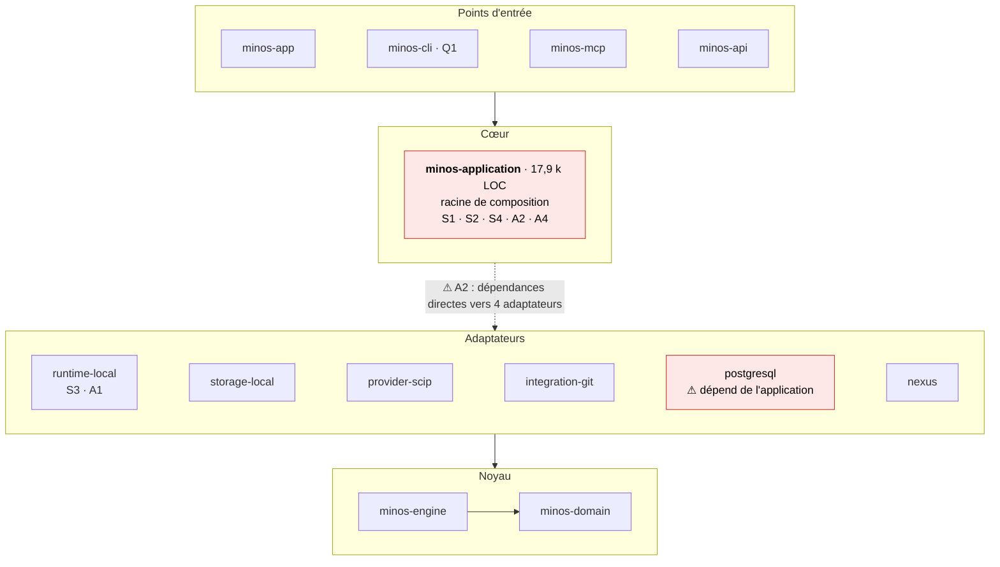

# Audit de code MINOS — septembre 2026

> **Périmètre** : dépôt `minos-code-intelligence`, version `1.3.0-SNAPSHOT` (Java 24, Maven, 13 modules).
> **Axes** : architecture, sécurité, code et dette technique, fiabilité, tests, CI, release, gouvernance.
> **Méthode** : lecture intégrale des sources de production de 10 modules (environ 48 500 lignes), des workflows CI, de Docker et des scripts qualité, puis revérification ciblée des constats les plus graves. Aucune CI n'a été déclenchée et aucun code n'a été exécuté.
> **Suivi** : instantané au 28 septembre 2026. Les deux sprints sont implémentés et vérifiés. Sprint 1 : S1, S2, S3, S4, Q1 et G2 **clos** (§ 5). Sprint 2 : A1, A2 et R1 **clos** (§ 6). **Les huit constats de sévérité Haute sont donc fermés.** Sprint 3 : C1 et G3 **clos** (§ 7). Sprint 4 : A3, A4, A6 et A7 **clos** (§ 8). Reste ouvert, issu des quatre sprints : S12, S13, S14, R2 à R7, Q19, Q20, A8, A9, A10, C2. Le suivi ouvert/clos vit sur la page de partage, où chaque constat peut être clos ou rouvert, et où l'état est partagé entre les lecteurs.
> **Statuts** : **CONFIRMÉ** = défaut vu dans le code (et revérifié pour les constats Haute) ; **PLAUSIBLE** = le risque dépend d'un contexte d'exécution ou d'un code non lu.

## 1. Vue d'ensemble

```mermaid
flowchart TB
    subgraph E["Points d'entrée"]
        direction LR
        APP["minos-app"] ~~~ CLI["minos-cli · Q1"] ~~~ MCP["minos-mcp"] ~~~ API["minos-api"]
    end
    subgraph C["Cœur"]
        APPL["<b>minos-application</b> · 17,9 k LOC<br/>racine de composition<br/>S1 · S2 · S4 · A2 · A4"]
    end
    subgraph AD["Adaptateurs"]
        direction LR
        RT["runtime-local<br/>S3 · A1"] ~~~ STL["storage-local"] ~~~ SCIP["provider-scip"] ~~~ GIT["integration-git"] ~~~ PG["postgresql<br/>⚠ dépend de l'application"] ~~~ NEX["nexus"]
    end
    subgraph N["Noyau"]
        direction LR
        ENG["minos-engine"] --> DOM["minos-domain"]
    end
    E --> C
    C -. "⚠ A2 : dépendances directes vers 4 adaptateurs" .-> AD
    AD --> N
    classDef warn fill:#fde7e7,stroke:#c0392b,color:#000
    class APPL,PG warn
```

**Verdict global.** La base est d'un **bon niveau d'ingénierie défensive** :
- les entrées sont bornées partout ;
- les fichiers sont ouverts de façon confinée (`ConfinedFileOpener`) et écrits de façon atomique et durable ;
- les jetons HMAC sont comparés en temps constant ;
- les diagnostics sont nettoyés ;
- la CI épingle ses actions par SHA ;
- les conteneurs sont durcis.

Les faiblesses se concentrent sur trois points :
1. **l'architecture** : la couche application dépend d'adaptateurs concrets et des packages sont éclatés entre plusieurs modules ;
2. **quelques trous de sécurité ciblés** : escalade de rôle dans le plan de contrôle d'équipe, nettoyage cgroup trop agressif, fuite de mot de passe via `toString` ;
3. **la cohérence** : primitives de sécurité appliquées de façon inégale, CI qui prolifère, couverture de tests limitée à des zones précises.

| Sévérité | Nombre |
|---|---|
| 🔴 Haute | 8 |
| 🟠 Moyenne | 32 |
| 🟡 Basse | 42 groupes (≈ 59 points) |

## 2. Les 12 priorités

| # | Constat | Axe | Sévérité | Statut | Échéance | État |
|---|---|---|---|---|---|---|
| S1 | Un ADMIN peut s'attribuer le rôle OWNER, donc la rotation de clé | Sécurité | 🔴 Haute | CONFIRMÉ | Sprint 1 | ✅ clos |
| S2 | Des refus d'accès en boucle saturent l'audit et bloquent toute mutation du tenant | Sécurité | 🔴 Haute | CONFIRMÉ | Sprint 1 | ✅ clos |
| S3 | `LinuxCgroupJob.reclaimStaleJobs` tue les jobs d'un autre processus MINOS | Sécurité / fiabilité | 🔴 Haute | CONFIRMÉ (impact PLAUSIBLE) | Sprint 1 | ✅ clos |
| S4 | `StorageBackendConfiguration.toString()` affiche le mot de passe PostgreSQL | Sécurité | 🔴 Haute | CONFIRMÉ | Sprint 1 | ✅ clos |
| Q1 | `team …` : la mutation est faite avant le rejet des options inconnues | Code | 🔴 Haute | CONFIRMÉ | Sprint 1 | ✅ clos |
| A1 | L'indexation distante est toujours refusée sur tous les OS (sandbox non qualifiée), contrairement à ce que dit le README | Architecture | 🔴 Haute | CONFIRMÉ | Trimestre | ✅ clos |
| A2 | La couche application dépend d'adaptateurs concrets et porte la racine de composition | Architecture | 🔴 Haute | CONFIRMÉ | Trimestre | ✅ clos |
| R1 | Aucune reprise après une indexation interrompue | Fiabilité | 🔴 Haute | CONFIRMÉ | Sprints 2–3 | ✅ clos |
| S5 | `PrivateLocalStorage` et `NOFOLLOW` appliqués de façon inégale (≈10 sites) | Sécurité | 🟠 Moyenne | CONFIRMÉ | Sprints 2–3 | ✅ clos |
| P1 | `minos_index_status` bloque 10 s puis échoue pendant une indexation | Fiabilité | 🟠 Moyenne | CONFIRMÉ | Sprints 2–3 | ✅ clos |
| D1 | Le paquet n'embarque aucun indexeur | Release | 🟠 Moyenne | CONFIRMÉ | Sprints 2–3 | ✅ clos |
| T1 | Pas de seuil de couverture global ; CLI, Git et la majorité d'application échappent au gate | Tests | 🟠 Moyenne | CONFIRMÉ | Trimestre | ouvert |

## 3. Architecture et couplage

### A1 — L'indexation distante est désactivée de fait (🔴 CONFIRMÉ)
- **Où** : `WorkerSandboxBackends.strongestAvailable`, `WorkerSandboxQualification`, `LinuxBubblewrap…`, `WindowsAppContainerWorkerSandboxBackend.containment()`.
- **Constat** : les deux backends déclarent `filesystemWriteBytes/Entries = SUPERVISED_HARD_KILL`. La qualification les rétrograde donc en `UNTRUSTED_CODE_UNSUPPORTED`, et `LocalIsolatedIndexWorker` (indexation distante, CLI `remote`) échoue en mode fermé sur **tous** les OS. C'est même verrouillé par le test `currentOsBackendsFailClosedUntilStorageIsOsEnforced`.
- **Impact** :
  - environ 2 000 lignes de code sandbox sont inatteignables en production ;
  - le README annonce une « sandbox OS worker réelle qualifiée Linux + Windows » (#98) ;
  - le repli se fait en silence, sans aucun log.
- **Recommandation** : soit appliquer le quota de stockage au niveau OS (quota XFS/btrfs, tmpfs de taille fixe dans bwrap, VHD à taille fixe sous Windows), soit corriger la documentation. Dans les deux cas, journaliser la raison du repli.

### A2 — Application couplée aux adaptateurs (🔴 CONFIRMÉ)
- `minos-application` dépend dans son POM de `runtime-local`, `storage-local`, `provider-scip` et `integration-git`.
- `MinosApplicationAssembler` et `LocalStorageBackend` instancient directement `ManagedScip*`, `FileHostedControlPlaneStore`, `FileSymbolSnapshotStore`, `FileSemanticVectorStore`, etc.
- Des adaptateurs fichiers vivent dans le module application lui-même : `FileProjectFingerprintSnapshotStore` (≈580 lignes), `FileIndexStateStore`, `LocalProjectRegistry`.
- `ProviderPlatformService` dépend de `ScipIndexerCatalog.qualifiedM24Providers()`.
- `SemanticIndexService` fait des `instanceof LocalHash/Ollama`.
- `minos-storage-postgresql` dépend de `minos-application` : un adaptateur dépend du cœur applicatif.
- **Recommandation** : déplacer la racine de composition vers `minos-app`, garder dans `minos-application` uniquement des ports (interfaces), et déplacer les adaptateurs fichiers dans `storage-local`. Il faut aussi que `check-module-boundaries.py` interdise `application → adaptateurs`.

### A3 — Packages éclatés entre modules et doublons (🟠 CONFIRMÉ)
- 9 packages sont éclatés entre plusieurs modules, dont :
  - `com.minos.cli` (app, cli) ;
  - `com.minos.dynamic` (application, domain, engine) ;
  - `com.minos.hosted` (application, domain, engine) ;
  - `com.minos.runtime` (application, runtime-local) ;
  - `com.minos.store` (engine, storage-local).
- Conséquences : le projet ne peut pas passer à JPMS, et la visibilité « package » traverse les modules.
- `cli.ProjectOperations`, `cli.ProjectSymbolQuery`, `cli.LocalProject*` sont des alias dépréciés, mais `MinosCliRunner` les instancie encore. La dépréciation ne peut donc jamais aboutir.

### A4 — Classes-dieux et constructeurs télescopiques (🟠 CONFIRMÉ)
- `MinosApplication` expose environ 30 services.
- `LocalProjectArchitectureQuery` a 9 constructeurs et recalcule la découverte, le snapshot et la topologie à chaque appel, sans cache.
- `MinosCli` a 9 constructeurs.
- Les plus gros fichiers : `WindowsAppContainerWorkerSandboxBackend` (789 lignes), `SnapshotBinaryCodecSupport` (757), `FileProjectFingerprintSnapshotStore` (728), `DistributedArtifactBundleStore` (706).

### A7 — Le script de frontières ne se confronte jamais au reactor (🟡 CONFIRMÉ, résidu d'A2)
La liste des modules est codée en dur dans `check-module-boundaries.py` et n'est jamais comparée aux `<modules>` du POM racine. Le contrôle existant vérifie que la politique couvre cette liste, pas que la liste couvre le reactor : un module ajouté au projet et oublié dans le script échappe à toutes les règles, POM comme sources.

### A8 — Le choix du backend de stockage utilise le chargeur de classes de contexte (🟡 CONFIRMÉ, résidu d'A2)
`ServiceLoader.load(StorageBackendProvider.class)` est appelé sans chargeur explicite dans la composition : le résultat dépend du chargeur de contexte du thread. C'est exactement le défaut corrigé pour la découverte de la racine de composition, non étendu à la sélection du backend. Le code a été déplacé tel quel, donc le défaut est préexistant, mais il vit désormais dans le module de composition.

### A9 — Le snapshot reste chargé intégralement en mémoire (🟠 CONFIRMÉ, résidu d'A6)
Le lot A6 a traité le format sur disque, le plafond et la recherche hybride, mais **aucun gain mémoire n'est revendiqué** : `InMemoryCodeKnowledgeStore` charge toujours un snapshot en entier. La pagination ou le mappage mémoire fait l'objet de l'ADR 0047, laissé en `Proposed` — c'est une refonte, pas une correction. Le plafond rend au moins la limite explicite avant l'ingestion au lieu de la faire découvrir après.

### A11 — Trois points d'entrée publics n'isolent rien (🟡 CONFIRMÉ, relevé au sprint 9)
Relevé en prouvant que le plan admin ne compile pas de code non fiable : trois entrées publiques de `minos-runtime-local` n'appliquent aucune isolation et exécuteraient du code venu d'un projet indexé si elles étaient câblées. Aucun appelant en production aujourd'hui — un seul site de construction, la variante complète — mais rien n'empêche un futur appel. À rendre non publiques ou à retirer.

### A10 — Les chemins de source approchent les limites de l'outillage Windows (🟡 PLAUSIBLE, effet de bord d'A3)
Ranger chaque module sous son propre préfixe de package allonge les chemins : `com/minos/storage/local/store/<classe>.java` descend à neuf répertoires sous la racine, auxquels s'ajoute `target/` au build. Aucun échec observé à ce jour, mais la marge avant la limite historique de 260 caractères de Windows se réduit, et des outils tiers refusent déjà ces profondeurs. À surveiller au premier échec de build Windows portant sur un chemin.

### A5 — `minos-engine` fourre-tout (🟡 CONFIRMÉ)
- Le package `io` (primitives de sécurité et d'I/O) vit dans le module moteur.
- Deux modèles de capacités coexistent, `IndexerDescriptor.capabilities` et `ProviderCapabilityProfile`, avec un risque de dérive.
- Le domaine mélange des conventions : lignes numérotées à partir de 0 dans `SemanticDocument`, à partir de 1 dans `SymbolLocation`.
- `SemanticVectorStore` (domaine) embarque de l'I/O.

### A6 — Mémoire et scalabilité (🟠 PLAUSIBLE)
- Les snapshots sont chargés entièrement en mémoire (`InMemoryCodeKnowledgeStore`, cache de 512 Mo).
- Les chaînes sont encodées en UTF-16, ce qui double leur taille.
- Le plafond des snapshots persistés (256 Mo) est inférieur à la limite des artefacts SCIP (512 Mo) : sur un gros projet, l'échec arrive tard.
- `HybridSearchService` re-normalise tout le corpus (jusqu'à 250 000 documents) à chaque requête de 64 Ko au plus.
- `ImpactAnalysisService` n'applique `maxResults` qu'après une traversée complète.

## 4. Fiabilité opérationnelle et distribution

### R1 — Aucune reprise après une indexation interrompue (🔴 CONFIRMÉ)
- **Où** : `orchestration/IndexingRunExecutor`, `AuthoritativeProjectStateReconciler.recoverAbandonedRuns`, `runtime-local/RunDirectoryRetention`.
- **Constat** : tout run `RUNNING` retrouvé sous bail exclusif est finalisé en `FAILED` sans consulter le disque, et la relance tire un nouveau `runId`. Or les artefacts `runs/<runId>/<indexerId>/index.scip` sont écrits atomiquement, avec fsync, et ne sont jamais supprimés en fin de run. Le travail coûteux est donc encore là, mais personne ne le regarde. S'y ajoutent trois trous : le point de contrôle ne porte ni le module, ni la version du provider, ni l'empreinte de l'artefact ; la rétention des répertoires de run peut effacer le run à reprendre, et elle se déclenche au début de l'exécution suivante ; les snapshots `.tmp` orphelins ne sont nettoyés par personne.
- **Scénario** : un reboot pendant l'indexation d'un monorepo, au dernier module de sept providers, coûte la totalité du run.
- **Conception** : [ADR 0039](../adr/0039-reprise-indexation-apres-interruption.md) — points de contrôle par cible, état `INTERRUPTED`, reprise sur le même `runId`.

### D1 — Le paquet n'embarque aucun indexeur (🟠 CONFIRMÉ) — ✅ **clos au sprint 9, avec réserve**
- **Où** : `scripts/release/build-windows-distribution.ps1`, `packaging/windows/minos-installer.iss.template`.
- **Constat** : la distribution ne contient que l'image `jpackage` (runtime Java + `minos.jar`), les scripts d'intégration, le SBOM et les notices. Le `README.txt` généré demande encore `minos.cmd tools install scip-java`, et le template Inno Setup n'a aucune étape d'installation d'outil. L'image Docker release, elle, embarque déjà ses toolchains avec des téléchargements vérifiés.
- **Scénario** : sur un poste neuf, ou sans accès réseau, MINOS s'installe correctement puis échoue à indexer quoi que ce soit.
- **Conception** : [ADR 0040](../adr/0040-distribution-auto-portante-indexeurs-embarques.md) — indexeurs embarqués, amorçage hors ligne, repli par téléchargement épinglé.

### D3 — Trois vérifications de la distribution n'ont jamais été exécutées (🟡 CONFIRMÉ, résidu du sprint 9)
La coupure réseau **physique** n'a pas été faite : la preuve hors ligne repose sur un observateur réseau avec témoins positifs, pas sur une machine déconnectée. L'installateur Windows de bout en bout n'a jamais été exécuté. Et la qualification réelle de mise à niveau Docker n'a pas tourné : elle exercera pour la première fois la migration des noms de compose depuis une vraie release antérieure. S'y ajoutent les ponts de tolérance à l'ancien nom, à retirer quand plus aucune installation ne les porte.

### R4 — La promotion reprise ne vérifie pas que le snapshot préparé couvre les cibles courantes (🟠 CONFIRMÉ, résidu de R1) — ✅ **clos au sprint 6**
La reprise directe en promotion exige seulement que rien ne reste à exécuter, que la phase soit `PROMOTION` et qu'un snapshot soit préparé ; elle ne compare jamais les cibles réutilisées à celles du run interrompu. Scénario : run interrompu en promotion sur deux scopes, l'utilisateur supprime un module, relance ; la découverte ne négocie plus que le scope restant, dont le point de contrôle est valide, et MINOS promeut le snapshot qui contient encore l'index du module supprimé — un index qu'un run complet n'aurait jamais produit. Exiger l'égalité des clés de cible, sinon re-préparer.

### R5 — La rétention peut encore supprimer un run reprenable (🟠 CONFIRMÉ, résidu de R1) — ✅ **clos au sprint 6**
Trois défauts dans la même méthode : `overCount` devient vrai pour **chaque** entrée dès que le parcours de `runs/` est tronqué, marqueur `.resumable` compris ; seul le run du processus courant est protégé, donc une seconde indexation concurrente peut effacer le répertoire de run de la première ; et un run marqué expire à 24 h quand un run ordinaire vit 7 jours — marquer un run interrompu divise sa durée de vie par sept au lieu de la prolonger.

### R6 — Une interruption pendant l'attente de l'artefact dégrade le run en FAILED (🟡 CONFIRMÉ, résidu de R1) — ✅ **clos au sprint 6**
L'attente de lisibilité rétablit bien le drapeau d'interruption, mais lève une exception sans cause ; la détection d'interruption remontant `getCause()`, elle conclut à un échec ordinaire. Un arrêt du service dans la seconde qui suit la sortie d'un provider jette donc tous les points de contrôle déjà acquis. `ResumeAborted` ne chaîne pas davantage sa cause.

### R7 — La réparation « snapshot stable » perd la référence de run reprenable (🟡 CONFIRMÉ, résidu de R1) — ✅ **clos au sprint 6**
Cette branche du réconciliateur réécrit l'état projet sans `resumableRunId` et sans appeler `supersede`, contrairement aux autres chemins de récupération. Le run interrompu garde son marqueur : son répertoire échappe indéfiniment à la rétention, et il peut être re-proposé alors qu'il avait été supplanté.

### R2 — Un saut d'horloge peut faire conclure à tort à une réutilisation de PID (🟠 PLAUSIBLE, résidu de S3) — ✅ **clos au sprint 6**
La marque d'appartenance compare deux instants de démarrage dérivés de l'horloge murale (`ProcessHandle.Info.startInstant`, calculé depuis `btime`), avec une tolérance de 2 s. Un pas NTP décale cette base : deux JVM lisent alors un instant différent **pour le même processus**, la dérive dépasse la tolérance, et le balayeur conclut « pid réutilisé » puis tue le cgroup d'un MINOS vivant — le symptôme même de S3. Comparer les ticks de `/proc/<pid>/stat`, indépendants de l'horloge murale, ou ne jamais récupérer sur le seul écart d'instant.

### R3 — Les résidus cgroup non récupérables ne sont pas signalés (🟡 CONFIRMÉ, résidu de S3) — ✅ **clos au sprint 6**
`qualifyRoot` appelle `reclaimStaleJobs(root)` en jetant le `StaleSweep` retourné ; un résidu marqué laissé intact n'est journalisé qu'en DEBUG ; un cgroup non marqué encore peuplé (créé par une version antérieure) n'est désormais plus jamais récupéré. Ces résidus consomment `pids` et `memory` de la racine sans remonter nulle part. Le message d'échec de suppression journalise par ailleurs un chemin absolu, alors que le fichier affirme deux fois ne jamais en journaliser.

### R8 — Un snapshot préparé par un run tué reste sur disque pour toujours (🟠 CONFIRMÉ, découvert au sprint 6)
Les trois rétentions parcourent `symbol-snapshots/`, `fingerprint-snapshots/` et `runs/` ; aucune ne parcourt `staged-snapshots/`. Un run tué avant sa promotion laisse son snapshot préparé — potentiellement plusieurs centaines de mégaoctets — indéfiniment, de même que les fichiers temporaires d'un processus tué pendant une publication d'empreinte. C'est l'exact inverse de ce qu'annonçait Q4 : une fuite, pas une suppression. À traiter sous le bail de cycle de vie, avec la durée de vie unique introduite au lot 1.

### R9 — Le verrou de rétention est le seul verrou du dépôt sans délai ni couche JVM (🟡 CONFIRMÉ, résidu du sprint 6) — ✅ **clos au sprint 8 avec S6**
`retention-locks/<projet>.lock` est un `FileChannel.lock()` sans délai, alors que tous les autres baux sont bornés à 10 s et que les gates interdisent `channel.lock()` ailleurs ; sans couche JVM (un second `compact` du même processus lèverait `OverlappingFileLockException` au lieu d'attendre), et ouvert sans `NOFOLLOW` ni droits privés, contrairement à S5. Sans danger aujourd'hui parce que son unique appelant tient déjà le bail — mais rien ne garde cette règle.

### R10 — Une lecture peut encore muter, par la migration des runs au format historique (🟡 CONFIRMÉ, résidu du sprint 6)
Le sprint a fermé « une lecture ne mute rien » pour l'état projet, mais l'ouverture du magasin déplace ou supprime les fichiers de run du format d'origine, sans bail : le processus qui répond à un simple statut écrit donc sur disque. Préexistant, idempotent et limité aux données historiques, mais la règle ne le couvre pas.

### R11 — Les cgroups marqués par un build antérieur ne sont plus jamais récupérés (🟡 CONFIRMÉ, conséquence assumée du sprint 6)
La marque porte désormais les inodes des espaces de noms PID et temps. Un cgroup marqué par un build `develop` antérieur ne peut plus prouver son appartenance : il n'est plus récupéré automatiquement, même à propriétaire mort. Ils sont signalés par le WARNING agrégé et la documentation dit comment les supprimer. Aucune version publiée n'écrit ces marques : le constat se ferme quand plus aucun de ces builds n'existe.

### R12 — Une commande de lecture ne peut pas tourner sur un `MINOS_HOME` en lecture seule (🟠 CONFIRMÉ, mesuré au sprint 7)
Le câblage paresseux a supprimé les écritures qui lui étaient imputables, mais deux subsistent sur le chemin de toute lecture : `MinosApplication.open` crée le squelette du stockage, et lire le registre crée et prend son verrou inter-processus. Un `MINOS_HOME` en lecture seule, un volume plein ou un montage partagé en lecture restent donc inutilisables, même pour un `project list`. Y remédier suppose un mode de stockage sans écriture ou un verrou de lecture sans fichier — c'est-à-dire de rouvrir le régime de verrous du sprint 6.

### R14 — L'indexation Java échoue sous le bac à sable AppContainer (🟠 CONFIRMÉ, mis au jour au sprint 9)
Sur un poste Windows, `minos index` d'un projet Java échoue sous le bac à sable alors que le même runner appelé directement réussit. Une première cause était une régression du sprint 8 — la DACL protégée de `runtime\` empêchait le grant AppContainer d'atteindre le runner — corrigée dans une PR dédiée. La cause profonde reste : `C:\` n'est pas lisible par ALL APPLICATION PACKAGES, donc PowerShell 5.1 ne peut pas changer de répertoire courant sous AppContainer. C'est ce qui empêche de prouver D1 sur Java. S'ajoutent deux défauts de lisibilité : le message final perd son détail, et le runner masque le vrai échec.

### R13 — Les répertoires de lanceurs s'accumulent et la désinstallation les laisse (🟡 CONFIRMÉ, résidu du sprint 8)
Le script du bac à sable a été sorti de `MINOS_HOME` vers `%LOCALAPPDATA%\minos-launchers\<sha256>\`, à un nom dérivé de son empreinte — le bon choix, mais il crée un répertoire par version du script, sans ménage, et le désinstalleur ne purge pas cet emplacement. Les copies d'un MINOS précédent sont supprimées au démarrage du bac à sable ; celles des versions qui ne tournent plus restent.

## 5. Sprint 1 — implémenté et vérifié (26 septembre 2026)

Les six constats du sprint 1 ont été corrigés sur la branche `sprint1/audit-remediation` (suivi détaillé : `SPRINT-1-SUIVI.md`). J'ai revérifié chaque correctif contre le code livré, en cherchant les chemins détournés plutôt qu'en relisant les intentions.

| Constat | Verdict | Preuve principale | Résidu ouvert |
|---|---|---|---|
| S1 | ✅ fermé | `canGovern` appliqué sur le rôle cible **et** le rôle préexistant dans `grant`, `revoke` et `issue` ; les seuls autres points d'affectation de rôle sont le bootstrap (OWNER figé, tenant existant refusé) et la désérialisation ; ADMIN plafonne à ADMIN, aucune escalade par étapes | — |
| S2 | ✅ fermé avec réserve | 10 % de la capacité d'audit réservés aux mutations autorisées + budget glissant par (tenant, principal) ; les deux chemins de refus passent par `recordDenial` ; un refus hors budget laisse un WARNING avant toute implication du sink ; la chaîne reste contiguë | S12, S13 |
| S3 | ✅ fermé avec réserve | marque `.own-<pid>-<instant>-<token>` dans le nom du cgroup ; propriétaire vivant → jamais tué ; token d'instance comparé avant la table des processus ; probe marqué ; test d'isolation réel exécuté sous WSL | R2, R3 |
| S4 | ✅ fermé | `toString()` masque le mot de passe et fait passer l'URL par `safePostgresUrl` (user-info et paramètres supprimés, repli `REDACTED`) ; `equals`/`hashCode`/accesseurs intacts ; les quatre records porteurs de jeton masquent aussi le leur | — |
| Q1 | ✅ fermé | 17 sous-commandes, 17 `rejectUnknown(options)`, chacun avant le premier appel de service ; plus aucun `required()`/`uuid()` évalué dans un appel ; codes de sortie usage/exécution séparés ; sorties JSON inchangées | Q19 |
| G2 | ✅ fermé | chaque affirmation du README relue contre le code (`SUPERVISED_HARD_KILL`, rétrogradation `UNTRUSTED_CODE_UNSUPPORTED`, `LocalIsolatedIndexWorker` fail-closed avant tout provider, `supportsManagedLocalProvider` pour le local) | — |

**Aucune régression détectée** : pas de fuite de secret ni de chemin absolu ajoutée dans un message, pas d'exception avalée, pas de rupture d'API publique, `equals`/`hashCode` préservés, `Locale.ROOT` partout, budget de refus borné en mémoire et synchronisé. Une alerte « bloquante » remontée pendant la revue (un test de récupération de cgroup qui n'aurait pas été mis à jour) s'est révélée fausse : elle venait d'une copie périmée du fichier ; le test a bien été renommé et asserte désormais `leftIntact`.

Les cinq résidus ci-dessous sont de vrais constats nouveaux, tous mineurs par rapport aux failles fermées : **S12** et **S13** (audit hosted), **R2** et **R3** (cgroups), **Q19** (CLI). Ils sont décrits à leur axe respectif.

## 6. Sprint 2 — priorités hautes fermées (28 septembre 2026)

A1, A2 et R1 ont été livrés sur la branche `hautes/audit-remediation` (PR #298, CI verte, `clean verify` complet à 1 319 tests). Suivi détaillé : `SPRINT-2-SUIVI.md`. J'ai revérifié le code livré, en cherchant les contournements.

| Constat | Verdict | Preuve principale | Résidu ouvert |
|---|---|---|---|
| A1 | ✅ fermé par décision | [ADR 0041](../adr/0041-indexation-distante-de-code-non-fiable.md) : l'indexation distante de code non fiable reste fermée, faute de quota d'écriture applicable par l'OS. Aucune disposition ne passe à `OS_ENFORCED`, la rétrogradation porte un marqueur de décision, le refus est journalisé sans chemin, `doctor` dit pourquoi, et le refus précoce (avant toute matérialisation) est prouvé par un test qui passe par le câblage de production | — |
| A2 | ✅ fermé | [ADR 0042](../adr/0042-racine-de-composition.md) : ports de persistance dans `minos-engine`, adaptateurs fichiers dans `minos-storage-local`, PostgreSQL affranchi de l'application, nouveau module `minos-bootstrap` découvert par `ServiceLoader` (fail-fast à zéro et à plusieurs implémentations), `minos-application` réduit à `minos-domain` + `minos-engine`, `minos-cli` sans aucun adaptateur, script de frontières durci et commité — vérifié par moi sur le dépôt : le module est bien dans le reactor, le fichier de service existe, et les portées `runtime`/`test` sont respectées | A7, A8 |
| R1 | ✅ fermé | [ADR 0039](../adr/0039-reprise-indexation-apres-interruption.md) en 5 lots : point de contrôle par cible (scope, version de provider, taille, SHA-256, empreinte des sources), état `INTERRUPTED`, reprise sur le même `runId`, revérification complète avant mise en snapshot, gate JaCoCo `resume-orchestration` | R4, R5, R6, R7, S14, Q20 |

**Chaîne de vérification de la reprise : solide.** Les douze conditions de réutilisation d'un artefact sont toutes présentes et combinées en ET — capacité déclarée, langage, mode, fichiers ciblés, TTL, non-symlink, fichier régulier en `NOFOLLOW`, confinement décidé sur le chemin canonique, taille et plafond SCIP, SHA-256, empreinte de scope — et tout écart inattendu annule la reprise entière au profit d'un run complet. Le bail projet couvre l'exécution, un run d'ancien format est refusé sans exception, et la récupération « promotion déjà autoritaire » garde sa priorité.

**Un point de vigilance sur la méthode.** Une des trois revues a rendu un verdict « non conforme » sur A2, en s'appuyant sur une copie du dépôt antérieure au chantier. J'ai vérifié chacune de ses affirmations sur les fichiers réels : le module `minos-bootstrap` est dans le reactor, `minos-application` ne dépend plus que de `minos-domain` et `minos-engine`, `minos-cli` ne porte `minos-bootstrap` qu'en `runtime` et `test`, et le fichier `META-INF/services` existe. Ce verdict est écarté ; seuls ses constats portant sur le script de frontières lui-même, lu dans sa version courante, sont retenus (A7).

Les huit résidus ci-dessous sont des constats nouveaux, tous d'un ordre inférieur aux trois constats fermés.

## 7. Sprint 3 — CI et hygiène du dépôt (28 septembre 2026)

Suivi détaillé : `CI-HYGIENE-SUIVI.md`. Verdicts revérifiés par mes soins sur les fichiers du dépôt.

| Constat | Verdict | Preuve principale | Résidu |
|---|---|---|---|
| C1 | ✅ fermé avec réserve | `mnd-remediation`, `mne-remediation`, `post-mne-remediation` et `post-228-hardening` supprimés, leur contenu fusionné dans un job `invariants` unique de `pr-ci.yml` où chaque gate statique s'exécute une seule fois (`check-workflow-pins` : 8 → 1) ; jobs morts `m19-final-windows` et `m20-final-windows` retirés ; `docker-release-validation` filtré ; concurrence corrigée — `cancel-in-progress` n'est vrai que pour un événement `pull_request`, donc un push sur `develop`/`main` n'est plus annulé ; runners épinglés partout. PR docs : 10 → 4 job-runs ; PR code : 13 → 7 | C2 |
| G3 | ✅ fermé | [ADR 0043](../adr/0043-retrait-des-artefacts-de-jalon.md) : trois états possibles pour un artefact de jalon, règle de retrait, et — reprise d'une remarque de revue — un gate s'ancre sur un invariant, pas sur une phrase. 49 fichiers archivés sous `scripts/history/` (dix jalons), gates vivants relocalisés hors numéro de jalon, garde-fou `check-milestone-artifact-references.py` livré avec son auto-test à trois scénarios (référencé, archivé, orphelin) et exécuté dans le job `invariants` | — |

**Contrôles refaits indépendamment** : aucune action désépinglée dans l'ensemble des workflows, aucun `pull_request_target`, `contents: read` au niveau global, l'arbre `scripts/history/` existe avec ses dix jalons, et le garde-fou porte réellement un `--self-test` par fixtures.

**Trois régressions trouvées et corrigées avant tout push** par les agents de surveillance, chaque fois un gate qui vérifiait mot pour mot le contenu d'un fichier déplacé ou réécrit — exactement la fragilité que l'ADR 0043 interdit désormais.

## 8. Sprint 4 — Architecture, sévérité moyenne (30 septembre 2026)

Suivi détaillé : `ARCHI-SUIVI.md`, trois lots séquentiels, une PR par lot. Vérifications refaites sur l'arborescence réelle du dépôt.

| Constat | Verdict | Preuve principale | Résidu |
|---|---|---|---|
| A3 | ✅ fermé | [ADR 0044](../adr/0044-un-package-un-module.md). L'inventaire a été refait avant d'agir — A2 avait créé de nouveaux éclatements en descendant des ports dans `minos-engine`, d'où 14 packages éclatés et non 9. Résultat vérifié : `minos-storage-local` vit sous `com.minos.storage.local.*`, `minos-runtime-local` sous `com.minos.runtime.local`, les paquets `dynamic` et `semantic` de l'application sous `com.minos.application.*`, et `minos-engine` garde les packages de ports. 45 tests en package étranger relogés, accès package-private entre jars supprimés, 4 alias CLI retirés. La règle « aucun package éclaté » est dans le gate, sans cliquet | — |
| A4 | ✅ fermé | [ADR 0045](../adr/0045-surfaces-d-objet.md). Vérifié dans le code : `LocalProjectArchitectureQuery` passe de 9 constructeurs à un seul, privé, derrière une fabrique ; `MinosCli` de 10 à un seul, privé, derrière un `Builder` ; `MinosApplication` garde un unique constructeur de portée paquet, sa surface publique inchangée. Aucun alias déprécié laissé derrière. Le cache d'architecture n'a **pas** été ajouté : l'invalidation n'était pas prouvable, et c'était la consigne | — |
| A6 | ✅ fermé avec réserve | Mesuré avant et après, comme exigé. Format de snapshot V3 en UTF-8, avec les codecs V1 et V2 conservés pour la relecture ; un snapshot trop grand est refusé **avant** toute écriture au lieu d'échouer en fin d'ingestion (ce dépôt redevient indexable : 194,6 Mo en V3 contre un refus à 355 Mo en V2) ; lecture à froid environ 2,5 fois plus rapide ; recherche hybride 4 à 6 fois plus rapide à classement identique à l'octet. La traversée d'impact n'a pas été touchée : la mesure a infirmé l'hypothèse de l'audit | A9 |
| A7 | ✅ fermé | La liste de modules du gate est désormais confrontée aux `<modules>` du POM racine, avec son cas d'auto-test | — |

**Ce que j'ai contrôlé moi-même** : l'arborescence des paquets des modules historiquement éclatés (plus aucun recouvrement), le nombre de constructeurs des trois classes visées, la coexistence des codecs V1, V2 et V3, et le fait que `StorageBackends` côté application n'est plus qu'une façade déléguant à la racine de composition — pas une seconde implémentation.

**Limite de ma vérification** : les sources de `minos-storage-local` sont désormais à neuf répertoires sous la racine, au-delà de ce que mon accès aux fichiers autorise. Le détail du codec V3 et de la relecture V1/V2 repose donc sur l'inventaire des fichiers et sur le suivi, pas sur une lecture ligne à ligne. C'est aussi ce qui motive le constat A10.

## 9. Sprint 5 — axe Code (30 septembre 2026)

Suivi détaillé : `CODE-SUIVI.md`, quatre lots séquentiels, une PR par lot (lot 1 = PR #305). Le travail vit sur les branches `code/*` ; il n'est **pas** encore fusionné dans `develop`.

| Constat | Verdict | Preuve principale | Résidu |
|---|---|---|---|
| Q6 | ✅ fermé | Ordre des clés JSON rendu déterministe dans les renderers hébergés et runtime ; les `Map.of(≥2)` sont remplacés par des formes ordonnées (`JsonShapes`) | — |
| Q7 | ✅ fermé | `DeterministicJson` passe de 6,4 ko à 10 ko : `NaN`/`Infinity` refusés, caractères de contrôle échappés, `jsonEscape` maison de `TeamCommand` supprimé au profit de l'unique sérialiseur | — |
| Q10 | ✅ fermé | `LazyAutonomousIndexOperations` supprimé (le fichier n'existe plus) ; `McpBackendRouter` et `MinosLauncher` ferment désormais `MinosApplication` | — |
| Q11 | ✅ fermé | Analyse d'options extraite dans un `CliOptions` unique (12 ko), règles convergées (doublons, `--x --format`, `toLowerCase` avec Locale) ; `doctor --help` ne lance plus le diagnostic ; `index --dry-run` n'écrit plus | Q21, Q22 |
| Q12 | ✅ fermé | Dérivation des tests liés corrigée (le suffixe `it` ne mutile plus `Audit`/`Commit`/`Limit`) ; les trois renderers concernés passent de 16,2 / 14,0 / 10,0 ko à 9,0 / 8,0 / 5,4 ko, à **12 goldens inchangés** | — |
| Q13 | ✅ fermé | `Preconditions` introduit dans `minos-domain` (fin des 15 `requireText`), `sha256` et le mapping DTO unifiés, `ProjectJson` unique | — |
| Q14 | ✅ fermé | Exceptions avalées remontées ou tracées dans les quatre sites cités | — |
| Q19 | ✅ fermé | L'invariant « valider avant muter » ne repose plus sur 17 répétitions ; 26 scopes JaCoCo au vert | — |
| Q20 | ✅ fermé | `--no-resume` et `--dry-run` alignés sur ce que l'aide annonce | — |

**Vérification de build (rapportée par le suivi)** : `clean verify` en succès sur `a65d99ff`, 15 modules, 1 671 tests, 0 échec, 46 ignorés ; 26 scopes JaCoCo au vert, seul `m24-polyglot-provider-platform` au rouge (préexistant, spécifique à Windows) ; gate de frontières `modules=14, sources=504, packages=45` ; 12 goldens de caractérisation inchangés.

**Ce que j'ai contrôlé moi-même** : la disparition effective de `LazyAutonomousIndexOperations`, l'apparition de `CliOptions`, de `JsonShapes`, de `ProjectJson` et de `Preconditions`, et la réduction mesurée des trois renderers et de `DeterministicJson`.

**Limite de ma vérification** : les sources du worktree sont à huit répertoires sous la racine, au-delà de ce que mon accès aux fichiers autorise. Le contenu des classes repose donc sur l'inventaire des fichiers, leurs tailles et le suivi — pas sur une lecture ligne à ligne. Trois points restent à surveiller côté utilisateur : les branches `code/*` ne sont pas fusionnées dans `develop`, l'état des PR autres que #305 m'est inconnu, et SonarCloud a signalé 6 nouvelles remarques sur la PR #305 qui n'ont pas été revues.

## 10. Sprint 6 — axe Fiabilité (1er octobre 2026)

Suivi détaillé : `FIAB-SUIVI.md` (161 ko), cinq lots séquentiels, une branche et une PR par lot, les cinq branches poussées. PR 309 (lot 1), 310 (lot 2) et 311 (lot 3), Quality Gate SonarCloud passé pour les trois.

| Constat | Verdict | Preuve principale | Résidu |
|---|---|---|---|
| R4 | ✅ fermé | L'égalité des clés de cible devient une **condition** de la promotion, et elle est fail-closed : une exécution sans point de contrôle n'a pas de clé, donc ne peut être prouvée présente. Quand l'égalité est fausse, la reprise continue mais le snapshot est re-préparé | — |
| R5 | ✅ fermé | La durée de vie d'un répertoire de run est écrite **à un seul endroit** (`Policy.lifetime`) : `max(maxAge, resumeTtl)` pour un run marqué, donc un marqueur n'abrège plus jamais la vie (avant : 24 h contre 7 j). Un parcours tronqué ne supprime plus un run marqué, et le marqueur est posé dès le **démarrage** d'un run, ce qui protège aussi d'une indexation concurrente. Borne supérieure explicite : un run marqué finit par expirer | — |
| R7 | ✅ fermé | `endResumeOffer` : récupération et réparation « snapshot stable » passent par le même point, qui écrit `resumableRunId` et appelle `supersede` | — |
| P1 (= Q2) | ✅ fermé | Deux points d'entrée en lecture : `observe` (plan, calcule la réparation en mémoire) et `observeStatus` (statut, rapporte l'état en vol tel quel, sans bail et sans écriture). Le statut répond pendant une indexation au lieu d'échouer | — |
| Q3 | ✅ fermé | Publication, compaction et promotion d'empreintes sérialisées ; ordre de prise unique **L1 < L3 < L2 < L4 < M**, écrit aux quatre endroits et dans l'ADR 0039 | R9 |
| Q4 | ⬜ **non reproduit** | Les trois rétentions ne parcourent jamais `staged-snapshots/` ; l'empreinte publiée avant promotion est le fichier le plus récent de son répertoire, donc conservée sous la politique de production. La borne a été mesurée puis annulée : seule une politique gardant **zéro** snapshot historique supprime l'empreinte préparée, et aucun code de production ne la construit. Aucun correctif — un correctif défensif aurait ajouté une attente de 10 s sans fermer quoi que ce soit | R8 |
| R2 | ✅ fermé | **Déjà fermé avant le chantier** par les résidus du sprint 1 (marque en ticks de `/proc/<pid>/stat`). Le lot a relu chaque branche qui tue et trouvé six trous restants (F1–F6), tous fermés | R11 |
| R3 | ✅ fermé | **Déjà fermé avant le chantier** (WARNING agrégé, aucun chemin absolu). Le lot ajoute le comptage des entrées non examinées, l'appartenance récursive et les cgroups imbriqués | — |
| Q5 | ✅ fermé | Le drapeau d'interruption est effacé pour écrire l'état puis rejoué **en dernier** sur toutes les sorties ; le confinement de l'artefact ne suit plus aucun lien, à aucun niveau du chemin | — |
| R6 | ✅ fermé | Une interruption reste une interruption de bout en bout, cause chaînée, points de contrôle conservés | — |
| Q8 | ✅ fermé | Une entrée illisible dégrade **cette** entrée : `project list` affiche les projets sains, compte et affiche les entrées dégradées, et sort en **3** (inventaire partiel) | Q23, Q24 |
| Q9 | ⬜ **non reproduit** | L'invariant est à trois étages, chacun sous test : l'identifiant d'un symbole est dérivé de sa clé, l'instantané refuse un identifiant en double, et chaque étape amont fusionne ou refuse. Un test de bout en bout suit le chemin de production (index SCIP → staging → promotion → relecture disque → fabrique) sur trois scénarios, verts sur le code d'origine. La seule façon d'atteindre l'exception est un fichier d'instantané forgé. Aucune règle de résolution écrite, aucun compteur : ce serait du code défensif sans scénario démontré | — |

**Le trou le plus grave n'était pas dans l'audit.** En appliquant la règle « en cas de doute, ne pas récupérer », le lot 3 a trouvé **F1** : le JDK renvoie un `ProcessHandle` vide dès que sa propre lecture de `/proc/<pid>/stat` échoue — descripteurs de fichiers épuisés, `hidepid`, `/proc` partiel. Un MINOS voisin **vivant** était alors jugé mort et son cgroup tué, c'est-à-dire S3 par un autre chemin. Reproduit pour de vrai sous WSL en épuisant les descripteurs. Fermé, avec cinq autres trous : un `/proc/<pid>/stat` tronqué pris pour des ticks valides (F2), un TOCTOU entre le verdict « cgroup vide » et le `kill` (F3), un balayage qui plafonnait en silence à 4 096 entrées (F4), une suppression ratée comptée comme récupérée (F5), un `cgroup.kill` journalisé seulement en DEBUG (F6). `verif-fiab` en a trouvé un septième, bloquant lui aussi : un propriétaire vivant dans un **autre espace de PID** était tué — tuerie rejouée sous `unshare --pid --mount-proc`, fermée en inscrivant les inodes des espaces de noms PID et temps dans la marque.

**Vérification de build (rapportée par le suivi)** : `clean verify` en succès à chaque fin de lot, de 1 671 tests à la base à **1 826 tests, 0 échec, 54 ignorés** à la fin du lot 5, soit **+155 tests**. Gates inchangés tout du long (`modules=14, sources=504, packages=45`, `scripts checked=95`), 26 portées JaCoCo au vert avec la seule rouge préexistante `m24-polyglot-provider-platform`, et les **12 goldens de caractérisation inchangés**. Les tests de concurrence ont été rejoués 50 fois, et `verif-fiab` les a rejoués de son côté.

**Ce que j'ai contrôlé moi-même** : les 20 classes de test annoncées existent, aux bons emplacements ; `ArtifactConfinement` et `DegradedEntry` sont des classes de production neuves ; **aucun fichier de test n'a disparu** entre le worktree du lot 1 et celui du lot 5 ; aucun fichier `*Disabled*` ; et les 12 goldens ont exactement la même taille que dans le dépôt principal. Le worktree contient même huit classes de test que le suivi ne mentionne pas.

**Limite de ma vérification** : les sources sont à huit répertoires sous la racine, au-delà de ce que mon accès aux fichiers autorise, et je n'ai pas de shell sur la machine. Je ne peux donc pas détecter la triche qui ne se voit qu'au contenu : un `@Disabled` sur une méthode, un `assumeTrue` qui neutralise un test, un corps de test vidé, une assertion affaiblie. Trois points restent à vérifier de votre côté : les numéros de PR des lots 4 et 5 ne sont pas consignés dans le suivi, l'état de leur CI m'est inconnu, et `origin/develop` a avancé au-delà de la base du chantier sans que je puisse dire lesquelles de ces PR y sont fusionnées.

## 11. Sprint 7 — résidus CLI (1er octobre 2026)

Suivi détaillé : `CLI-SUIVI.md`, trois lots séquentiels, trois branches poussées (`cli/q21-q22-cablage-paresseux`, `cli/q24-resolution-tolerante`, `plugin/q23-code-3`). Base : `origin/develop`, les cinq PR du chantier Fiabilité (309 à 313) y étant fusionnées.

| Constat | Verdict | Preuve principale | Résidu |
|---|---|---|---|
| Q21 | ✅ fermé | **Un seul** point de construction différée (`LazyApplication`), pas quinze indirections : les services sont des poignées qui ne construisent qu'au premier appel de méthode. La racine de composition reste dans `minos-bootstrap` (ADR 0042). Mesure de départ : 22 commandes de lecture modifiaient `MINOS_HOME` (`distributed-artifacts/.leases`, `remote-cache/`) ; plus aucune | R12, S15 |
| Q22 | ✅ fermé | Une erreur d'usage sort en 2 **sans rien ouvrir** pour les 29 commandes de la table, et `--help` est servi sans état à n'importe quelle position. Le câblage « sans état » de l'aide, qui doublait le câblage réel, a disparu : un seul chemin | — |
| Q24 | ✅ fermé **avec réserve** | Une doctrine écrite **avant** le code, famille par famille : inventaire tolérant, résolution tolérante dans sa réponse mais pas dans son verdict, mutation stricte au message véridique. Un seul signal (`UnreadableRegistryException`, qui porte les `DegradedEntry` existantes — pas une seconde notion). Le code 3 garde un sens unique et aucun code ne s'ajoute. La réserve : `listWorkspaces` et `findWorkspace` restent strictes | Q26 |
| Q23 | ✅ fermé | Le vrai livrable est la **liste** : neuf consommateurs du code de sortie recensés ligne par ligne, cinq corrigés (plugin IntelliJ et toute la chaîne Docker, qui portait quatre appelants), quatre nommés et laissés. Le workflow du plugin se déclenche bien sur `minos-cli/**` | Q25, G5 |

**La garde est le livrable du lot 1, comme demandé.** `LazyWiringGuardTest` énumère les sous-commandes depuis la table de routes, jamais depuis une liste recopiée, et pour chacune vérifie trois choses : une erreur d'usage ne crée aucun fichier, `--help` aux positions 1 à 5 non plus, et une commande de lecture laisse l'arborescence identique octet par octet. Elle exige en plus que **chaque** commande soit classée lecture ou mutation : une commande ajoutée sans classement fait rougir la suite. Sur la base, elle échouait 3 fois sur 4.

**Un seul golden a changé, et le changement est le correctif.** `team.golden` : la ligne `team tenant --format json` sortait en 1 (« not configured »), alors que `team tenant` n'accepte pas `--format` — c'était une erreur d'usage **masquée** parce que la commande n'était jamais analysée. Elle sort maintenant en 2. La ligne valide a été ajoutée au test et garde sa sortie exacte. Les onze autres goldens sont inchangés.

**Où l'agent m'a contredit, avec raison.** J'avais écrit que `listWorkspaces` devait suivre l'inventaire. Aucune commande CLI ne le liste : ses seuls consommateurs sont l'API et MCP, dont les listes n'ont aucun champ où porter le compte des entrées écartées. Le rendre tolérant sans ce champ aurait produit exactement le silence que la doctrine interdit. Le constat reste donc ouvert sous Q26, comme un changement de contrat public et non comme un correctif CLI.

**Ce que j'ai contrôlé moi-même** : `LazyApplication` et `UnreadableRegistryException` existent aux bons emplacements, `UnreadableRegistryException` est bien dans `com.minos.registry` à côté de `DegradedEntry` (donc pas une seconde notion d'entrée dégradée dans un autre module), aucun fichier de test n'a disparu, aucun fichier `*Disabled*`, les 12 goldens sont présents et **onze ont exactement la même taille** qu'avant, seul `team.golden` diffère. La surface réelle du chantier est de 19 fichiers, concentrés sur la frontière CLI / registre / plugin, sans propagation dans `minos-bootstrap` ni `minos-app`. J'ai lu `intellij-plugin.yml` en entier : ses filtres couvrent bien `minos-cli/**`.

**Trois réserves sur la vérification, à trancher de votre côté :**

1. **`CLI-SUIVI.md` ne porte ni résultat de `clean verify`, ni tableau de constats de l'agent de surveillance, ni numéros de PR** — le suivi renvoie aux PR pour le tableau des codes de sortie. Les trois précédents chantiers consignaient tout dans leur suivi ; celui-ci est le premier qui ne le fait pas. Je ne peux donc confirmer ni le nombre de tests, ni les gates de fin de lot, ni l'état de la CI.
2. **Un test a rétréci sans être déclaré** : `IndexDryRunSideEffectsTest` passe de 4 341 à 3 423 octets, et le suivi ne le mentionne jamais. L'explication probable est bénigne — ce test contournait Q21 en lançant d'abord une commande de lecture, contournement devenu inutile — mais c'est une hypothèse. `git diff origin/develop -- …/IndexDryRunSideEffectsTest.java` tranche en une ligne.
3. **Généalogie des branches** : le lot 2 est branché sur le lot 1 et non sur `develop`, ce qui est conforme ; mais plusieurs fichiers ont une taille identique à la seconde près dans deux worktrees, ce qui ressemble à une recopie entre arbres plutôt qu'à un `rebase`. À confirmer avec `git log`.

**Limite de ma vérification** : toujours pas de shell sur la machine, et les sources sont au-delà de la profondeur que mon accès aux fichiers autorise. Je ne peux pas voir un `@Disabled` posé sur une méthode, une assertion affaiblie, ni vérifier l'égalité réelle des onze goldens au-delà de leur taille.

## 12. Sprint 8 — axe Sécurité, sévérité moyenne (2 octobre 2026)

Suivi détaillé : `SEC-SUIVI.md` (76 ko), cinq lots séquentiels, PR 317 à 320 plus celle du lot 5, toutes fusionnées dans `develop`. Les lots ont été ordonnés par **risque** et non par identifiant.

| Constat | Verdict | Preuve principale | Résidu |
|---|---|---|---|
| S9 | ✅ fermé | Le nom de la variable de credential n'est plus libre : liste blanche **par hôte** (`GITHUB_TOKEN` ne peut pas partir vers gitlab.com), refus avant tout accès réseau et avant même la lecture de la variable, message qui n'écho pas le nom refusé. `readEnvironment()` supprimé : `GIT_DIR` ne redirige plus l'analyse. L'effaceur d'arborescence local et sa copie dans `ProviderWorkspaceFiles` disparaissent au profit de la primitive — deux implémentations en moins. Le clone *shallow* (point 6) est nommé comme limite fonctionnelle, pas traité | — |
| S12 | ✅ fermé — **l'audit était périmé** | Le correctif existait déjà sur `develop` depuis le 28 septembre (`c380baa3`, chantier « résidus du sprint 1 ») : la réserve est comptée sur les `DENIED` retenus. Prouvé **sans toucher au code**, par mutation témoin : la condition remise à l'ancienne forme fait échouer 7 tests sur 19, dont « le premier refus d'une attaque après 90 % d'événements autorisés ». La borne inverse est gardée aussi : 90 refus chaînés au plus | — |
| S13 | ✅ fermé — **l'audit était périmé** | Même chantier, `f0f70b6d` : un refus non chaîné est marqué `UNCHAINED`, porte la séquence 0 et un HMAC dans un domaine séparé. Il n'était pas au périmètre de ce sprint ; je l'avais laissé ouvert à tort | — |
| S5 | ✅ fermé | **Le gate est bien le livrable** : `scripts/architecture/check-private-io.py`, 8 interdictions (dont la détention d'un canal quel que soit le nom de la variable), liste blanche **nominative à cliquet** de 12 entrées justifiées — jamais un répertoire, jamais un joker, et une entrée dont le maximum dépasse le compte réel échoue, donc la liste ne peut que rétrécir. 30 cas d'auto-test, une mutation témoin par interdiction et une par contournement connu (import joker, référence de méthode, `raf.getChannel().lock()`, échappement unicode). Branché dans `pr-ci.yml`. Le TOCTOU est fermé par une **ouverture unique**, pas par un second contrôle | S17, S18, Q28 |
| S6 | ✅ fermé | Les deux verrous passent par `BoundedFileLease` (verrou JVM par bande + verrou fichier, 10 s, message sans chemin). La compaction gagne le verrou JVM qui lui manquait. **Ferme aussi R9.** La copie de la boucle d'attente de la matérialisation Git est supprimée | — |
| S8 | ✅ fermé — **et la part PLAUSIBLE devient confirmée** | Le ReDoS a été **reproduit** : `*a*a*…*b` contre 200 `a` ne termine pas en 20 s. Le coût est borné par un **mécanisme** et non par un chronomètre (1 024 caractères, 8 groupes d'étoiles, `**/` consécutifs repliés, budget de 100 000 lectures par règle et par chemin). Un motif qui ne compile pas est écarté et compté, jamais fatal. Mesure exigée : **0 fichier gagné, 0 perdu** sur 3 364 évaluations, et 263 règles réelles de 8 dépôts sans divergence | — |
| S7 | ✅ fermé **avec réserve** | Environnement des lanceurs réduit à une liste blanche de 16 noms ; identité de l'ACE prise sur le **SID du jeton** et non sur `user.name` (qu'un `-Duser.name=…` modifie) ; DACL protégée contre l'héritage. La réserve : `forceDirectory` reste inerte sous Windows — documenté comme limite, pas simulé | S16, T6 |
| S15 | ✅ fermé | Une ACE de refus n'est plus retirée : si elle empêche MINOS d'écrire, il **échoue en le disant**. Le script du bac à sable sort de `MINOS_HOME` vers `%LOCALAPPDATA%\minos-launchers\<sha256>\`, en lecture seule, **empreinte revérifiée avant chaque lancement**, échec fermé sans repli | S16, R13, T6 |

**Ce que j'ai contrôlé moi-même.** J'ai lu le gate et sa liste blanche : les douze entrées sont nominatives, chacune avec fichier, méthode, maximum et une justification écrite — y compris quatre qui portent leur propre condamnation (« à migrer »). J'ai vérifié indépendamment la revendication la plus inhabituelle du chantier, celle qui corrige **mon** audit : `RESIDUS-SPRINT-1-SUIVI.md` consigne bien `c380baa3` pour S12 et `f0f70b6d` pour S13, au 28 septembre, avec leurs rouges et la revue qui les a durcis. Les deux constats étaient fermés depuis dix jours et l'audit ne l'avait pas enregistré.

**Trois choses que ce chantier a faites mieux que les précédents**, et qui méritent d'être dites :

- **il a refusé d'écrire du code là où il n'y en avait pas besoin** : le lot 2 est une PR de documentation portant une preuve par mutation témoin. C'est exactement la bonne réponse à un constat périmé ;
- **il a contredit ma position quand elle était mal fondée.** J'avais laissé ouverte l'exemption de SYSTEM et des Administrateurs ; l'agent l'a refusée avec trois arguments, dont le plus fort : ces comptes gardent `SeBackupPrivilege` et la prise de possession, donc retirer l'ACE ne leur ôte aucun pouvoir, seulement l'accès ambiant. Il a aussi mesuré que `/inheritance:r` laisse une DACL **vide** là où `:d` la rend explicite, et a changé ma formulation en conséquence ;
- **il a trouvé la cause racine d'un échec CI plutôt que de le contourner.** Quatre passages de CI, dont une dichotomie sur 153 variables d'environnement, pour découvrir qu'une seule — `PSModuleAnalysisCachePath` — faisait passer le démarrage de PowerShell de 0,3 s à 24 s sur les runners. La liste blanche s'élargit d'un nom, justifié et mesuré, au lieu d'être rouverte en grand.

**Vérification de build (rapportée par le suivi)** : `clean verify` en succès à chaque fin de lot, de 1 876 à **1 965 tests, 0 échec, 54 ignorés** — tous antérieurs, aucun `@Disabled` ni `assumeTrue` ajouté. Les 12 goldens inchangés. Le bac à sable réel (AppContainer, Job Object) et `minos doctor` rejoués sous Windows après chaque changement du lot 5, avec `MINOS_HOME` neuf : **aucun `.ps1` sous `MINOS_HOME`**. R12 observé de bout en bout : `project list` sur un `MINOS_HOME` protégé en écriture échoue désormais au lieu d'effacer la protection.

**Deux réserves, honnêtement portées par le suivi lui-même :** le comportement sous jeton élevé n'est vérifié que par la CI (non reproductible sur le poste), et le repli de `discover` sur un SID inconnu n'a aucun test parce qu'on ne peut rien y injecter. Elles sont consignées sous T6.

**Limite de ma vérification** : toujours pas de shell sur la machine. J'ai pu lire le gate, sa liste blanche et les suivis, mais pas les sources Java ni rejouer un test. Les chiffres de build et de gates sont ceux du suivi, pas les miens.

## 13. Sprint 9 — les derniers constats d'échéance sprints 2–3 (3 octobre 2026)

Suivi détaillé : `S23-SUIVI.md` (171 ko), quatre lots séquentiels plus une PR de renommage. PR 324 (lot 1) et 326 (lot 2) ; les numéros des lots 3 et 4 et du renommage ne sont pas consignés. **Après ce chantier, il ne reste que des constats d'échéance Trimestre.**

| Constat | Verdict | Preuve principale | Résidu |
|---|---|---|---|
| S11 | ✅ fermé — **et le point grave était faux** | Dependabot surveille les images ; les cinq `FROM` passent en `image:tag@sha256` (une référence sans tag est déplacée vers `latest` par Dependabot : vérifié dans sa source) ; une seule source pour chaque tag, le gate refusant toute copie ; Ollama en non-root. Les plafonds sont **mesurés**, pas estimés : empreinte réelle par rôle, marges écrites (requêtes ×3,8 en mémoire, PostgreSQL ×1,7 sur une vraie construction HNSW de 30 000 vecteurs), et `MaxRAMPercentage` écarté avec preuve (`UseContainerSupport` fait déjà suivre le tas au plafond : 128 Mio sous 512m, 768 Mio sous 3g) | A11 |
| D1 | ✅ fermé **avec réserve** | **Une seule** description des outils (`embedded-tools.json`), lue par les gestionnaires Java, par le gate et par le script de construction : tout écart entre catalogue, Dockerfile, Java et paquet fait échouer le build. Le zip passe de 67 à 220 Mo, avec une variante `lite` à 67 Mo. Un artefact embarqué altéré est **refusé** (`INVALID`, jamais de repli réseau) : prouvé en conteneur `--network none` avec un octet modifié. Licences vérifiées composant par composant sur sources primaires ; aucune n'interdit la redistribution. La réserve : le critère « machine neuve » est établi sur TypeScript, pas sur Java | R14, Q29, D3 |
| C2 | ✅ fermé | **Ni workflow réutilisable ni job d'absorption : suppression de M19 et M20**, parce que l'inventaire montre que `pr-ci` les subsume déjà — un appelé vidé de son build n'aurait plus d'assertion propre, et réutiliser le build exigerait de transporter des centaines de mégaoctets de `target/` pour zéro assertion de plus. Une PR du cœur passe de 4 `clean verify` à 2, de 3 installations de chaîne de bac à sable à 1. Comparaison un à un : **aucune assertion ne perd son exécutant** | G6 |
| S14 | ✅ fermé — **prémisse partiellement fausse** | Les chemins étaient déjà caviardés depuis le sprint 2 : le test le montre. La fuite réelle était ailleurs — les caractères de contrôle écrits tels quels dans la sortie **texte** (séquences exécutées par le terminal), et la valeur JSON non neutralisée pour un consommateur qui l'afficherait. Fermée à un point d'étranglement unique, dont bénéficient tous les diagnostics de la CLI, sans troisième assainisseur | S19 |

**Le constat le plus grave de S11 n'existait pas.** L'audit affirmait que le plan admin compilait du code non fiable sans bac à sable. L'inventaire par le code dit l'inverse : dans ce plan, tous les providers sont refusés (`UNSUPPORTED_BY_BACKEND`), `index` échoue avant le moindre processus, `remote index` est refusé avant toute matérialisation, et `bwrap` ne peut de toute façon pas s'y exécuter (`unshare --user` refusé par le seccomp, cgroup en lecture seule, binaire absent de l'image). L'agent n'a pas fabriqué de test rouge pour une prémisse qu'il ne vérifiait pas — c'est la bonne réponse, et c'est la troisième fois qu'un chantier corrige l'audit plutôt que le code.

**Une régression du sprint 8 a été trouvée et corrigée.** C'est exactement le risque que j'avais nommé en lançant le chantier Sécurité : resserrer une ACL peut empêcher le bac à sable de fonctionner. La DACL protégée que S15 a introduite sur `tools\scip-java\<v>\runtime` empêchait le grant AppContainer d'atteindre le runner du provider, qui devenait illisible. Corrigée dans une PR séparée (`fix/appcontainer-protected-runtime-grant`), en accordant la plus petite portée utile — le dossier parent réel du fichier d'argument, parce qu'une ACE sur le seul runner aurait laissé le fichier qu'il lit à côté de lui hors d'atteinte. Trois options plus larges ont été écartées par écrit. Le défaut plus profond, lui, reste ouvert sous R14.

**Ce que j'ai contrôlé moi-même** : les workflows `m19-advanced-code-intelligence.yml` et `m20-semantic-hybrid-intelligence.yml` **ont bien disparu** de `.github/workflows` ; les compose sont renommés en `compose-mcp.{prod,connected}.yaml` ; les quatre gates neufs et leurs quatre auto-tests existent (`check-image-pins`, `check-compose-limits`, `check-tools-manifest`, `check-single-execution`) ; et j'ai lu `docker/.env.example` : les plafonds y sont exactement ceux décidés, chaque variable avec son unité, `CPUS=0` documenté comme « 0 = no ceiling » avec l'avertissement de rester sous le nombre de CPU de l'hôte.

**Trois réserves :**

1. **Le tableau de bord du suivi est périmé** : il donne les quatre lots « en attente de PR » et le lot 4 « à faire », alors que les sections détaillées montrent les quatre lots livrés et que deux numéros de PR apparaissent plus loin. Je ne peux donc confirmer ni l'état des PR des lots 3 et 4, ni celui de la PR de renommage.
2. **La preuve hors ligne n'est pas une preuve hors ligne.** Elle repose sur un observateur réseau avec deux témoins positifs, qui montre zéro connexion et zéro résolution d'hôte de téléchargement — ce qui est sérieux, et le suivi dit lui-même ce qu'il ne couvre pas : une connexion ouverte et refermée entre deux échantillons (environ 275 ms). La coupure physique reste à faire, et le propriétaire s'en est chargé.
3. **Les chiffres de mesure ont dû être corrigés deux fois**, par le superviseur puis en rejouant : le plancher PID pour 9 clients MCP est passé de 150 à « environ 320-400 selon les CPU visibles », et le 344 Mio attribué à l'administration ne s'est jamais reproduit. Les plafonds par défaut n'en sont pas affectés, mais c'est la prose livrée à l'utilisateur qui était fausse.

**Vérification de build (rapportée par le suivi)** : `clean verify` complet à chaque fin de lot, tous en succès, le dernier en 18 min 45 ; les 12 goldens inchangés ; la liste blanche du gate d'E/S privées **inchangée à 37 entrées** malgré six classes neuves — c'était ma condition, et elle est tenue.

## 14. Gouvernance

### G2 — La documentation affirme des capacités que le code ne tient pas (🟠 CONFIRMÉ)
Le README annonce la sandbox worker OS « qualifiée Linux + Windows » (#98) alors que l'indexation distante est refusée sur toutes les plateformes (A1). Les guides d'installation présentent encore `tools install` comme une étape de démarrage (D1). Des commentaires de POM citent une version de testcontainers qui n'est plus celle utilisée (Q17). Une revendication fausse coûte plus cher qu'une absence de revendication — c'est d'ailleurs le principe affiché de l'ADR 0038.

*(Constat G1 — propriétaire unique dans CODEOWNERS — retiré le 28 septembre 2026 : dépôt à mainteneur unique, la revue par un tiers n'est pas applicable ici. La CI reste le gate.)*

### G3 — Prolifération de scripts et de workflows par jalon (🟡 CONFIRMÉ)
Chaque jalon a laissé ses scripts (`scripts/m0…m29`, `scripts/remediation`) et ses workflows, y compris des jobs qui ne se déclenchent plus jamais (`m19-final-windows`, `m20-final-windows`). Aucune politique ne dit quand un artefact de jalon terminé est archivé ou supprimé.

### G4 — Un gate d'historique ne résout plus ses chemins (🟡 CONFIRMÉ, découvert au sprint 5)
`scripts/history/m21/check-m21-parity.py` échoue en annonçant un fichier manquant qui existe pourtant : ses chemins n'ont pas suivi les déplacements d'A3. Il était déjà cassé avant, et personne ne l'a vu parce qu'il n'est plus rejoué par aucun workflow — exactement le scénario que la politique de retrait ([ADR 0043](../adr/0043-retrait-des-artefacts-de-jalon.md)) est censée empêcher. Soit il est réparé et rebranché, soit il est archivé explicitement.

### G5 — Le gate du plugin IntelliJ n'est exigé par rien (🟡 CONFIRMÉ, relevé au sprint 7)
Le workflow du plugin se déclenche bien sur `minos-intellij/**` et `minos-cli/**`, et il construit et teste avec Gradle — mais ce n'est pas `pr-ci.yml`, et rien ne dit qu'il est exigé par le contrôle de branche : un plugin cassé pourrait fusionner. C'est une décision de configuration du dépôt, invisible depuis le code, et elle n'a pas été prise. Au passage, Gradle n'est pas installé sur le poste de développement : la logique du plugin a été exercée en JUnit, le build Gradle jamais localement.

### G6 — Tous les gates statiques peuvent être rouges sans empêcher une fusion (🟡 CONFIRMÉ, découvert au sprint 9)
Le job `Static invariants (single run)` n'est pas un check exigé par le ruleset du dépôt : les frontières de modules, les E/S privées, les plafonds de conteneurs, l'épinglage des images, le manifeste d'outils et toutes les remédiations peuvent échouer sans qu'une PR en soit bloquée — c'était le cas d'une PR de ce chantier au moment du relevé. Neuf sprints ont construit cet appareil de gates ; rien ne l'impose. L'exiger est une décision de configuration, invisible depuis le code.

## 15. Sécurité

### S1 — Escalade ADMIN → OWNER (🔴 CONFIRMÉ)
- **Où** : `hosted/HostedMembershipService.grant` et `HostedTokenService.issue`.
- **Constat** : `grant` exige seulement `MEMBER_WRITE`, sans borner le rôle attribué par rapport à celui de l'appelant. Or `ADMIN` a toutes les permissions sauf `KEY_ROTATE` (`HostedRole`).
- **Scénario** : un ADMIN s'attribue `OWNER`, obtient `KEY_ROTATE` et peut révoquer les autres owners (`requireOwner` exige seulement qu'il reste au moins un owner). De la même façon, `TENANT_ADMIN` peut émettre un jeton au nom d'un OWNER.
- **Correctif** : interdire d'attribuer un rôle supérieur au sien et réserver l'attribution OWNER aux OWNER. Ajouter un test de non-régression.

### S2 — Saturation de l'audit par les refus (🔴 CONFIRMÉ)
- **Où** : `HostedAuthorizationService.authorizeMutation`, branche refusée.
- **Constat** : chaque refus persiste un événement `DENIED` et incrémente la version du tenant. Arrivé à `MAX_AUDIT_EVENTS`, `append` lève « hard capacity reached ».
- **Scénario** : un membre révoqué dont le jeton reste valide jusqu'à 24 h, ou un simple VIEWER, boucle sur des mutations refusées. Plus aucune mutation légitime ne passe, et les écritures concurrentes subissent des conflits de version optimiste.
- **Correctif** : limiter le débit des refus par principal, les agréger, ou les journaliser hors de la chaîne transactionnelle. Garder de la place réservée pour les mutations autorisées.

### S3 — Nettoyage cgroup inter-processus (🔴 CONFIRMÉ, impact PLAUSIBLE)
- **Où** : `runtime-local/LinuxCgroupJob.reclaimStaleJobs` et `relocateSelf`.
- **Constat** : au moment de la découverte, tout cgroup enfant `minos-*` qui contient encore des processus vivants est tué, sans vérifier à quel processus MINOS il appartient.
- **Scénario** : la CLI est lancée pendant qu'un serveur MCP indexe. La CLI tue les jobs `minos-<runId>-…` du serveur, et l'indexation échoue sans raison apparente.
- `relocateSelf` déplace aussi le processus entier dans `minos-controller`, un effet de bord global.
- Le profil bwrap n'a pas de seccomp.
- **Correctif** : préfixer les jobs par le PID ou un jeton d'instance, et ne récupérer que les cgroups dont le propriétaire est mort.

### S4 — Mot de passe PostgreSQL dans `toString()` (🔴 CONFIRMÉ)
- **Où** : `storage/StorageBackendConfiguration`.
- **Constat** : ce record contient `postgresPassword` sans redéfinir `toString()`. `safeDescription()` existe, mais rien n'oblige à l'utiliser.
- **Correctif** : redéfinir `toString()` pour masquer le mot de passe, ou encapsuler le secret dans un type `Secret` dont le `toString` affiche `***`.

### S5 — Durcissement du système de fichiers appliqué de façon inégale (🟠 CONFIRMÉ) — ✅ **clos au sprint 8**

Dans ces cas, des répertoires et fichiers sont créés avec les permissions par défaut ou ouverts sans `NOFOLLOW_LINKS` :

| Fichier / méthode | Défaut |
|---|---|
| `DistributedArtifactBundleStore` | `createDirectories`, `Files.write` manifeste, `copyBounded` |
| `LocalIsolatedIndexWorker`, `ProcessIndexerExecutor.prepareRunDirectory`, `BoundedProcessOutput.openTarget`, `RunDirectoryRetention` | permissions par défaut |
| `SharedCacheLeaseRegistry.openLeaseChannel`, `FileHostedControlPlaneStore.lock`, `LocalStorageRetentionService.compact`, verrou de matérialisation Git | `FileChannel.open(CREATE, WRITE)` sans NOFOLLOW |
| `RuntimeObservationEnvelopeCodec.read` | TOCTOU : contrôle avec NOFOLLOW puis `newInputStream` qui suit les liens |
| `LocalProjectRegistry`, `MinosRuntimeSettings.readAbsoluteSecret`, `buildQueryView` | `isRegularFile` suit les liens ; permissions du secret non vérifiées |

Le risque est atténué si `MINOS_HOME` est lui-même en 0700. **Recommandation** : faire passer toute création sous `MINOS_HOME` par `PrivateLocalStorage`/`ConfinedFileOpener`, et ajouter une règle ArchUnit ou un grep CI qui interdit `Files.createDirectories` et `FileChannel.open` en dehors de ces primitives.

### S6 — Verrous sans délai (🟠 CONFIRMÉ) — ✅ **clos au sprint 8**
`FileHostedControlPlaneStore.lock` et `LocalStorageRetentionService.compact` appellent `channel.lock()` sans délai, alors que le reste du code borne l'attente à 10 s. `compact` n'a pas non plus de verrou JVM, ce qui provoque une `OverlappingFileLockException` quand deux threads compactent en même temps.

### S7 — Windows : environnement et ACL (🟠 PLAUSIBLE) — ✅ **clos au sprint 8**
- Les launchers PowerShell (AppContainer et Job Object) héritent de l'environnement parent complet (`trustedLauncherRequiresParentEnvironment=true`). La sûreté repose sur les scripts `.ps1`, qui n'ont pas été relus.
- `PrivateLocalStorage` pose une seule ACE « propriétaire », sans protéger la DACL : des ACE héritées peuvent réapparaître, et SYSTEM et Administrateurs sont retirés.
- `requireInheritableOwnerAccess` s'appuie sur `user.name`.
- `DurableAtomicFile.forceDirectory` ne fait rien sous Windows.

### S8 — `.gitignore` non fiable (🟠 CONFIRMÉ / PLAUSIBLE) — ✅ **clos au sprint 8**
- `ProjectIgnoreRules` recopie les classes de caractères telles quelles dans une regex. `[z-a]` lève une `PatternSyntaxException` non vérifiée qui fait échouer tout le chargement (CONFIRMÉ).
- Des `**/` imbriqués produisent des `(?:.*/)?` répétés, soit un ReDoS possible depuis un dépôt distant (PLAUSIBLE).
- Seul le `.gitignore` racine est pris en compte : ni les `.gitignore` imbriqués, ni `.git/info/exclude`.

### S9 — Intégration Git (🟠 CONFIRMÉ) — ✅ **clos au sprint 8**
- Le nom de la variable d'environnement de credential est choisi par l'utilisateur : n'importe quelle variable peut être envoyée en basic-auth à github ou gitlab.
- `FileRepositoryBuilder.readEnvironment()` respecte `GIT_DIR`.
- L'historique s'arrête au premier commit plus ancien que `since`, alors que les dates ne sont pas monotones.
- `deleteCacheTree` réimplémente la suppression sans protection contre les jonctions.
- `RemoteRepositoryRequest` : une URL avec slash final donne `…/r/.git`.
- Le clone est shallow (depth 1) et exige `expectedCommit == HEAD` : impossible d'indexer un commit qui n'est pas la pointe de branche.

### S10 — Divers (🟡)
- Le plan de contrôle chiffré en AES-GCM ne met pas de version dans l'AAD, donc aucune protection contre le rollback.
- La chaîne d'audit sépare les champs par `\0` sans préfixe de longueur (collision possible).
- `OllamaEmbeddingProvider` fait confiance à `minos-ollama` aussi en natif (résolution DNS, HTTP en clair) et recopie un corps d'erreur de 16 Mo dans l'exception.
- Le rendu Mermaid n'échappe pas `<` et `>` (injection HTML via un nom de module).
- MCP : les arguments inconnus ne sont pas rejetés malgré `additionalProperties:false` ; `rootPath` est exposé en absolu.
- `git-activity` expose les e-mails des auteurs.
- Des chemins absolus figurent dans les diagnostics (`IncrementalIndexingResult.diagnostic`, `ProjectDiscoveryService`).
- `PublicErrorMessages` repose sur une liste noire heuristique : des codes d'erreur typés seraient plus sûrs.

### S14 — Le motif de refus de reprise est écrit sans assainissement (🟡 CONFIRMÉ, résidu de R1) — ✅ **clos au sprint 9**
`refusalReason` est concaténé tel quel dans la sortie texte et dans la sortie JSON de `minos index`, alors que tous les autres diagnostics de la commande passent par `publicDiagnostic`. Un motif qui embarquerait un chemin de run ou un message d'exception atterrirait sur stdout.

### S12 — La réserve d'audit compte tous les événements, pas seulement les refus (🟠 CONFIRMÉ, résidu de S2) — ✅ **déjà clos le 28/09 (`c380baa3`), l'audit était périmé**
La condition de chaînage d'un refus est `auditEvents().size() < deniedAuditCapacity()`, soit la taille **totale** de la chaîne. Un tenant qui accumule 90 % d'événements autorisés légitimes — la rétention n'évince rien implicitement — cesse de chaîner tout refus, y compris le premier refus d'une attaque réelle, qui se réduit alors à un WARNING. Compter les événements `DENIED` ferme le point.

### S13 — Un événement d'audit non chaîné est indiscernable d'un événement chaîné (🟡 CONFIRMÉ, résidu de S2) — ✅ **déjà clos le 28/09 (`f0f70b6d`), l'audit était périmé**
L'événement non chaîné sort du même `hash()`, avec la même clé, la séquence `auditSequence + 1` et le `previousHash` de la tête — valeurs que réutilisera le prochain événement chaîné. Rien dans l'événement sérialisé ne le distingue : un consommateur externe indexé par (tenant, séquence) voit une collision, et un événement non chaîné réinjecté dans un export vérifie son HMAC.

### S15 — MINOS réécrit l'ACL de son répertoire et y dépose un script exécutable (🟠 CONFIRMÉ, découvert au sprint 7) — ✅ **clos au sprint 8**
Sous Windows, la première commande qui ouvre l'application **supprime l'ACE de refus d'écriture** posée sur `MINOS_HOME` : une restriction explicite de l'administrateur est annulée en silence. Et `doctor` matérialise un script PowerShell exécutable (`sandbox/windows-appcontainer-sandbox-v4.ps1`) dans ce même répertoire. Les deux sont des comportements de durcissement, mais ils vont dans le sens inverse de S5 : le produit élargit ses droits sur son propre répertoire et y écrit du code. À trancher explicitement, puis à documenter.

### S16 — Ce que MINOS ne voit pas dans une ACL, il le supprime (🟡 CONFIRMÉ, limite assumée du sprint 8)
Une ACE de refus **conditionnelle** (`XD`) est invisible à `getAcl()` : la réécriture de la DACL l'emporte, alors que S15 vient d'établir que MINOS ne retire jamais une restriction d'administrateur. Même famille : une ACE `OWNER RIGHTS` (`S-1-3-4`) serait vue comme un grant étranger à retirer, échouerait, et le message brut du JDK nommerait le chemin. Et le backend AppContainer écrit encore des ACE hors de `PrivateLocalStorage`, donc hors de la règle « un seul endroit décide des droits ». Les lire demande un `icacls /save` par objet, ou un appel natif.

### S17 — Le gate d'E/S privées ne couvre pas cinq API d'écriture (🟡 CONFIRMÉ, résidu du sprint 8)
Le gate interdit les huit motifs demandés, mais `Files.newOutputStream`, `Files.createTempFile`, `Files.createDirectory`, `Files.copy` et `Files.newBufferedWriter` n'y figurent pas : rien n'empêche de réécrire une écriture brute sous `MINOS_HOME`. Les copies temporaires des magasins passent désormais par la primitive, mais par discipline et non par contrainte. Les ajouter exige de migrer d'abord les écritures de flux.

### S18 — Des chemins absolus subsistent dans les messages des primitives (🟡 CONFIRMÉ, résidu du sprint 8)
Le chantier n'a assaini que les messages qu'il touchait. Les autres nomment encore un chemin absolu, y compris dans `PrivateLocalStorage` — précisément le code qu'un opérateur lit quand quelque chose ne va pas. Même famille : `MinosRuntimeSettings.load` suit encore un lien avec `isRegularFile` avant d'appeler la primitive, qui le refuse ensuite avec un chemin dans le message.

### S19 — Un chemin collé à un caractère d'identifiant échappe à la détection (🟡 CONFIRMÉ, résidu du sprint 9)
L'heuristique qui repère un chemin dans un message ignore le cas où il est collé à un caractère d'identifiant — y compris une séquence ESC `[31m` immédiatement suivie du chemin. Le chemin passe alors la détection et atteint la sortie. Le cas est étroit mais il porte sur la dernière barrière avant stdout.

### S11 — Chaîne d'approvisionnement et conteneurs (🟠 CONFIRMÉ) — ✅ **clos au sprint 9 ; le point « code non fiable » était une prémisse fausse**
- Dependabot n'a pas d'écosystème `docker` : les digests de base et le snapshot APT ne sont jamais mis à jour.
- Les lockfiles npm SCIP ne sont pas suivis.
- `pgvector` et `ollama` sont épinglés par tag, pas par digest.
- Aucun `mem_limit`, `pids_limit` ni `cpus` dans les fichiers compose.
- Le plan `minos-admin` compile des projets non fiables avec accès réseau, en écriture sur tout `MINOS_DATA_DIR`, sans sandbox forte (conséquence de A1).
- Ollama tourne en root.
- L'image release embarque un JDK et 5 toolchains, soit une grosse surface d'attaque.

## 16. Code et dette technique

| ID | Constat | Sév. | Statut |
|---|---|---|---|
| Q1 | `TeamCommand.run` n'appelle `rejectUnknown(options)` **qu'après** le `switch` : `team token-issue --principal p --request_id x` émet un jeton jamais affiché, sort en exit 2, et l'utilisateur relance (double mutation) | 🔴 | ✅ clos (sprint 1) |
| Q2 | `IndexingLifecycleService.projectState()` prend le bail exclusif (10 s) : `minos_index_status` échoue pendant une indexation au lieu de répondre INDEXING, et la lecture réécrit l'état | 🟠 | ✅ clos (sprint 6, = P1) |
| Q3 | `FileProjectFingerprintSnapshotStore.publish/promote` ne sont pas synchronisés : deux publications concurrentes rendent l'état « multiple fingerprint snapshots » permanent, et `compact` peut supprimer un snapshot pendant la promotion | 🟠 | ✅ clos (sprint 6) |
| Q4 | La rétention tourne sous un verrou distinct du bail de cycle de vie : un snapshot préparé peut être supprimé avant sa promotion | 🟠 | ⬜ non reproduit (sprint 6) |
| Q5 | `IndexingRunExecutor.execute` avale `InterruptedException` sans rétablir le drapeau ; `validateArtifact` ne confine pas le chemin d'artefact au répertoire de run | 🟠 | ✅ clos (sprint 6) |
| Q6 | Renderers « déterministes » construits avec `Map.of(≥2)` : l'ordre des clés JSON change d'une JVM à l'autre (`HostedControlPlaneRenderer`, `RuntimeIntelligenceRenderer`) | 🟠 | ✅ clos (sprint 5) |
| Q7 | `DeterministicJson` écrit `NaN`/`Infinity`, ce qui donne un JSON invalide ; `TeamCommand.jsonEscape` n'échappe pas les caractères de contrôle | 🟡 | ✅ clos (sprint 5) |
| Q8 | Un fichier corrompu (registre, historique, `Instant.parse`) ou un répertoire illisible (`visitFileFailed`) fait échouer **tout** `listProjects` | 🟠 | ✅ clos (sprint 6) |
| Q9 | `SemanticDocumentFactory` lève une exception sur une clé en double au lieu de dédupliquer, ce qui fait échouer toute l'indexation sémantique | 🟠 | ⬜ non reproduit (sprint 6) |
| Q10 | Fuites de ressources : `McpBackendRouter` et `MinosLauncher` ne ferment jamais `MinosApplication` ; `LazyAutonomousIndexOperations` est du code mort qui n'est pas `AutoCloseable` | 🟡 | ✅ clos (sprint 5) |
| Q11 | CLI : parsing d'arguments réimplémenté environ 15 fois avec des règles divergentes (`--x --format`, doublons, `toLowerCase()` sans Locale) ; `IllegalArgumentException` d'un service transformée en exit 2 ; `doctor --help` lance le diagnostic complet ; `doctor` et `tools verify` divergent sur `UNSUPPORTED_BY_BACKEND` ; `index --dry-run` écrit sur disque | 🟡 | ✅ clos (sprint 5) |
| Q12 | `RelatedTestDerivationService` : le suffixe `it` retire le « it » de `Audit`/`Commit`/`Limit` ; tout dossier `/test/` est considéré comme test | 🟡 | ✅ clos (sprint 5) |
| Q13 | Duplication : `requireText` ×15, `sha256` ×4, `quote()`/JSON écrit à la main ×4 alors que `DeterministicJson` existe, mapping DTO dupliqué entre API, MCP et CLI, `ProjectView` ×2 | 🟡 | ✅ clos (sprint 5) |
| Q14 | Exceptions avalées : `LocalProjectOperations.writeHistory`, `DefaultDiscoveryPlugins.visibleFile`, `FileIndexStateStore.migrateLegacyRuns`, `ExecutionPathAuthorization.tryCapture` | 🟡 | ✅ clos (sprint 5) |
| Q15 | I/O dans des constructeurs de records (`IndexingExecutionRequest`) ; point d'injection de test statique et mutable (`ConfinedFileOpener.beforeOpenForTests`) | 🟡 | CONFIRMÉ |
| Q16 | `ProcessOwnershipTracker` interroge `descendants()` toutes les 10 ms pendant toute l'exécution | 🟡 | CONFIRMÉ |
| Q17 | Dépendances : testcontainers 2.0.5 mélangé avec junit-jupiter/postgresql 1.21.4 ; `postgresql` épinglé dans le module et non dans le parent ; commentaire obsolète | 🟡 | CONFIRMÉ |
| Q18 | Javadoc mélangeant français et anglais ; prolifération de scripts par jalon (`scripts/m0…m29`, remédiations) | 🟡 | CONFIRMÉ |
| Q20 | Résidu de R1 : `minos index --no-resume` n'entraîne pas un run complet — le drapeau ne pilote que la politique de reprise, le mode restant commandé par `--force-full` — alors que l'aide de la commande annonce un run complet ; `--dry-run` accepte les drapeaux de reprise, les ignore et n'affiche aucune cible réutilisable | 🟡 | ✅ clos (sprint 5) |
| Q19 | Résidu de Q1 : l'invariant « valider avant muter » repose sur 17 répétitions de `rejectUnknown(options)`, qu'aucun test ni garde ne verrouille ; `team audit --limit 0` sort désormais en 1 au lieu de 2, la borne 1..10000 étant validée côté service alors qu'elle est documentée dans l'usage | 🟡 | ✅ clos (sprint 5) |
| Q21 | Résidu du chantier Code : `MinosCliRunner` construit toutes les opérations pour n'importe quelle commande, même en lecture seule — `project list` crée `distributed-artifacts/.leases` dans `MINOS_HOME`. Un câblage paresseux laisserait `MINOS_HOME` intact pour les lectures | 🟡 | ✅ clos (sprint 7) |
| Q22 | Résidu du chantier Code : seule l'aide est traitée sans état — `find-symbol --bogus` ouvre `MINOS_HOME` avant de refuser l'option, et un `--help` placé au-delà du troisième argument reste une option inconnue. Séparer l'analyse de l'exécution au niveau du dispatcher fermerait le cas | 🟡 | ✅ clos (sprint 7) |
| Q23 | Résidu du sprint 6 : `project list` sort désormais en 3 sur un inventaire partiel, avec un JSON valide et complet ; le plugin IntelliJ n'accepte que le code 0 et ne résout donc plus le projet sain ouvert. Pas une régression (il échouait déjà, en 1), mais c'est le seul consommateur qui n'a pas suivi | 🟡 | ✅ clos (sprint 7) |
| Q24 | Résidu du sprint 6 : seul l'inventaire est devenu tolérant. Avec une entrée de registre abîmée, `project add` et `inspect <nom>` échouent encore en 1, `listWorkspaces` avec eux ; `inspect <identifiant>` passe. Voulu pour les mutations, à trancher pour la résolution par nom | 🟡 | ✅ clos (sprint 7, avec réserve) |
| Q25 | Résidu du sprint 7 : quatre scripts d'historique (`m29/run-s5.ps1`, `m14/validate-local.ps1`, `m24/run-provider-e2e.py`, `history/m17/run-final.ps1`) traitent encore tout code non nul comme un échec alors qu'ils lancent une commande par nom, qui peut rendre 3. Aucun n'est exécuté par un workflow : risque latent, échec visible plutôt que silencieux | 🟡 | CONFIRMÉ |
| Q26 | Résidu du sprint 7, et la moitié de Q24 non fermée : `listWorkspaces` et `findWorkspace` restent strictes. Leurs seuls consommateurs sont l'API et MCP, dont les listes n'ont aucun champ où porter le compte des entrées écartées ; fermer le constat demande un changement de contrat public | 🟡 | CONFIRMÉ |
| Q27 | Résidu du sprint 7 : la ligne d'échec de la CLI est assainie, mais une résolution par identifiant d'une entrée abîmée rend encore un message brut du JDK qui recopie un fragment du fichier lu. `PublicErrorMessages`, MCP et l'API n'ont pas été traités | 🟡 | CONFIRMÉ |
| Q28 | Résidu du sprint 8 : la liste blanche du gate d'E/S privées est nominative, justifiée et à cliquet — mais quatre de ses douze entrées portent leur propre condamnation (« à migrer ») : les deux lectures de sources du projet dans `minos-application`, et les deux `createDirectories` du parent de l'artefact dans les backends de bac à sable | 🟡 | CONFIRMÉ |
| Q29 | Résidu du sprint 9 : les artefacts épinglés du paquet sont vérifiés contre le catalogue embarqué dans le JAR, mais deux composants sont des arbres assemblés à la construction — le `node_modules` de scip-typescript et le cache Coursier de scip-java — dont aucun amont ne publie d'empreinte. La leur est calculée au build et couverte par le manifeste de release et la signature de l'installateur, pas par le JAR | 🟡 | CONFIRMÉ |

## 17. Tests et couverture

**Points forts.**
- Environ 330 classes de test, avec de très bons tests de régression sécurité : liens symboliques, concurrence, fail-closed, contrats de packaging.
- Le script `check-jacoco.py` échoue si un scope pointe vers un préfixe mort, impose des planchers par classe et a un auto-test.

**Constats.**

| ID | Constat | Sév. |
|---|---|---|
| T1 | **Aucun seuil global** : 27 scopes ciblés, dont les seuils vont de 30 % à 80 % en lignes (nexus 30/12, m27-team 45/25, semantic-vector-store 45/20) | 🟠 | Trimestre |
| T2 | Hors gate : la quasi-totalité de `minos-cli` (sauf 4 commandes), `GitIntelligenceService`, la majorité de `minos-application` (hosted, incremental, registry, renderers) | 🟠 |
| T3 | Aucun test ne couvre S1, S2, S3 ou Q1 (escalade de rôle, saturation d'audit, collision cgroup, mutation avant validation) | 🟠 |
| T4 | La lecture du rapport JaCoCo par `m29` repose sur une redirection du `<directory>` de `minos-app` : fragile | 🟡 |
| T5 | Répartition inégale : application ≈95 tests, domain 7, mcp 8, nexus 3 | 🟡 |
| T6 | Résidu du sprint 8 : trois correctifs Windows ne sont prouvés que par le runner GitHub (comportement sous jeton élevé, alias SDDL `LA` du compte Administrateur intégré, perte de droits du bac à sable qui en découlait), et le repli de `discover` sur un SID inconnu n'a aucun test. Un correctif vérifié par un seul environnement est un correctif dont la régression ne sera vue qu'en CI | 🟡 |
| C2 | Résidu de C1 (sprint 3) : une PR touchant `minos-domain`, `minos-application`, `minos-api` ou `minos-mcp` déclenche encore trois `clean verify` complets sous Linux — `pr-ci`, M19, M20 — plus un sous Windows ; `product-facts` et JaCoCo s'exécutent trois fois chacun et chaque workflow réinstalle sa propre chaîne de sandbox. Choix assumé et documenté, mais « chaque gate exactement une fois » n'est pas atteint pour ces trois | 🟠 |

**CI (voir aussi S11).**
- Côté sécurité, c'est bon : actions épinglées par SHA et vérifiées par un gate, aucun `pull_request_target`, aucune expression `github.event` dans `run:`, `contents: read` par défaut.
- ~~**12 workflows se chevauchent** sur chaque PR vers `develop`~~ → **C1 clos au sprint 3** (§ 7) : quatre workflows supprimés, gates statiques fusionnés en un job unique, build Docker filtré, jobs morts retirés. Il reste C2, les trois builds Maven complets.
- ~~Les jobs `m19-final-windows`/`m20-final-windows` ne se déclenchent jamais~~ → supprimés.
- Pas de `persist-credentials: false`.
- `m0-java-ci` a `issues: write` et poste des logs dans une issue publique.

## 18. Plan de remédiation

| Horizon | Actions |
|---|---|
| **Sprint 9 — derniers constats sprints 2–3 (fait, 03/10)** | S11, D1, C2 et S14 fermés. Le point « code non fiable dans le plan admin » de S11 était une prémisse fausse, et celui de S14 partiellement. Une régression du sprint 8 sur le bac à sable trouvée et corrigée. **Plus aucun constat d'échéance sprints 2–3.** Résidus ouverts : R14, A11, S19, Q29, D3, G6 |
| **Sprint 8 — axe Sécurité, sévérité moyenne (fait, 02/10)** | S5, S6, S7, S8, S9 et S15 fermés en cinq lots ordonnés par risque, plus R9 ; S12 et S13 constatés **déjà fermés** depuis le 28/09 et prouvés par mutation témoin. Un gate à cliquet interdit désormais l'E/S brute hors des primitives. Résidus ouverts : S16, S17, S18, R13, Q28, T6 |
| **Sprint 7 — résidus CLI (fait, 01/10)** | Q21, Q22, Q23 et Q24 fermés : un seul point de construction différée, une erreur d'usage qui n'ouvre plus rien, une doctrine de tolérance écrite famille par famille, et les neuf consommateurs du code de sortie recensés. Résidus ouverts : R12, S15, Q25, Q26, Q27, G5 |
| **Sprint 6 — axe Fiabilité (fait, 01/10)** | R2 à R7, P1, Q3, Q5 et Q8 fermés en cinq lots ; Q4 et Q9 démontrés non reproductibles et laissés sans correctif ; sept trous de la décision « ce cgroup appartient à un MINOS mort » fermés, dont un qui tuait un processus vivant. Résidus ouverts : R8, R9, R10, R11, Q23, Q24 |
| **Sprint 5 — axe Code (fait, 30/09)** | Q6, Q7, Q10, Q11, Q12, Q13, Q14, Q19, Q20 : JSON déterministe unique, parseur d'arguments CLI unique, code mort et fuites de ressources supprimés, duplication factorisée. Résidus ouverts : Q21, Q22, G4 |
| **Sprint 1 — colmater (fait, 26/09)** | S1 (borner les rôles), S2 (limiter les refus), S4 (`toString`), Q1 (valider avant de muter), S3 (propriété des cgroups), plus un test de non-régression pour chacun, et G2 (aligner README et guides d'installation sur la réalité du code) |
| **Sprints 2–3 — uniformiser** | C2, S14 (assainir le motif de refus), R1 (reprise d'indexation, ADR 0039) — **tout est fermé** |
| **Trimestre — restructurer** | A9 (trancher l'ADR 0047 : snapshot paginé ou mappé en mémoire), A10 (surveiller la profondeur des chemins), T1/T2 (seuil global ≥ 60 % et gate CLI/Git/application), A7 et A8 (résidus des sprints 2 et 4), Q21, Q22 et G4 (résidus du sprint 5), R8 (fuite de `staged-snapshots/`), R9, R10, R11 (résidus du sprint 6), R12 et S15 (le régime de verrous et les droits sur `MINOS_HOME`), Q25, Q26, Q27 et G5 (résidus du sprint 7), S16, S17, S18, R13, Q28 et T6 (résidus du sprint 8), R14 (l'indexation Java sous AppContainer), A11, S19, Q29, D3 et G6 (résidus du sprint 9), G3 (politique de retrait des scripts et workflows de jalon) |

## 19. Limites de l'audit

- **Non relus en détail** (environ 70 fichiers, faute d'accès aux dossiers les plus profonds) :
  - l'analyse de programme (taint, CFG, def-use, `com.minos.program`) ;
  - l'ingestion SCIP et les runtimes gérés (`minos-provider-scip/…/adapter`) ;
  - `minos-storage-postgresql` (sources) ;
  - `minos-nexus` ;
  - les scripts PowerShell de lancement `.ps1` ;
  - le plugin IntelliJ ;
  - `scripts/ci|release|remediation` et les workflows `windows-installer`/`windows-in-place-upgrade`, absents de l'upload.
- Aucun build, test ni outil SAST n'a été exécuté : les constats reposent sur une lecture statique.
- Les constats **PLAUSIBLE** doivent être confirmés par un test ciblé avant d'être corrigés.

*Audit réalisé le 22/09/2026.*
