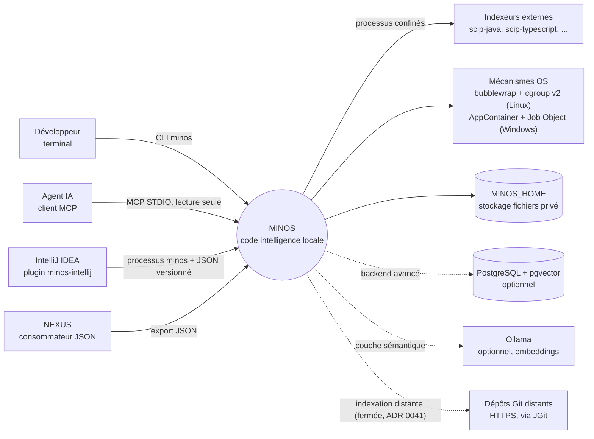
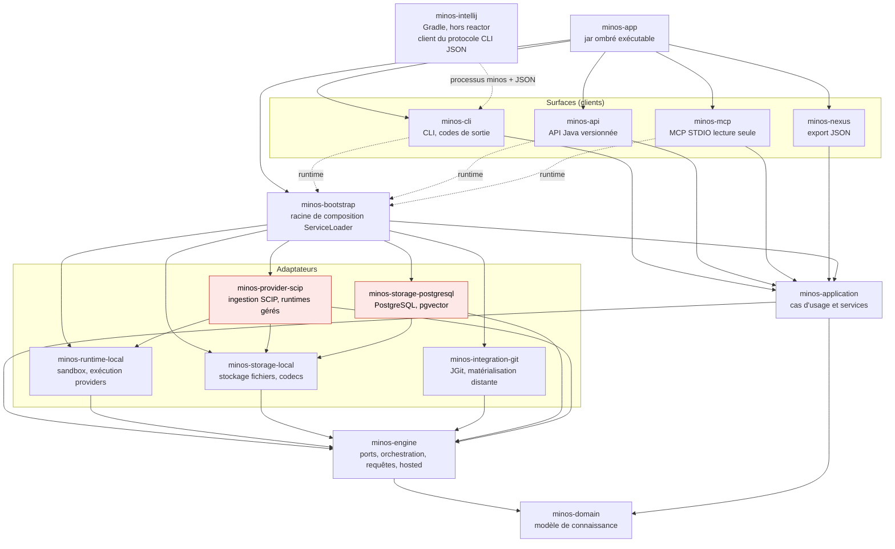
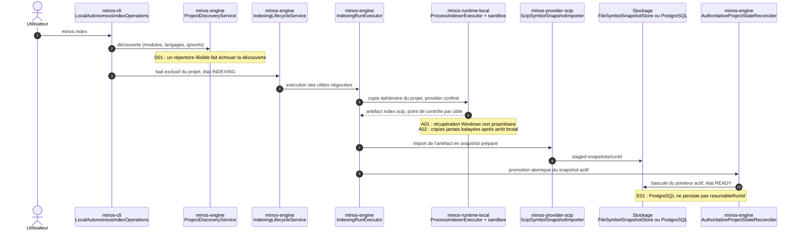
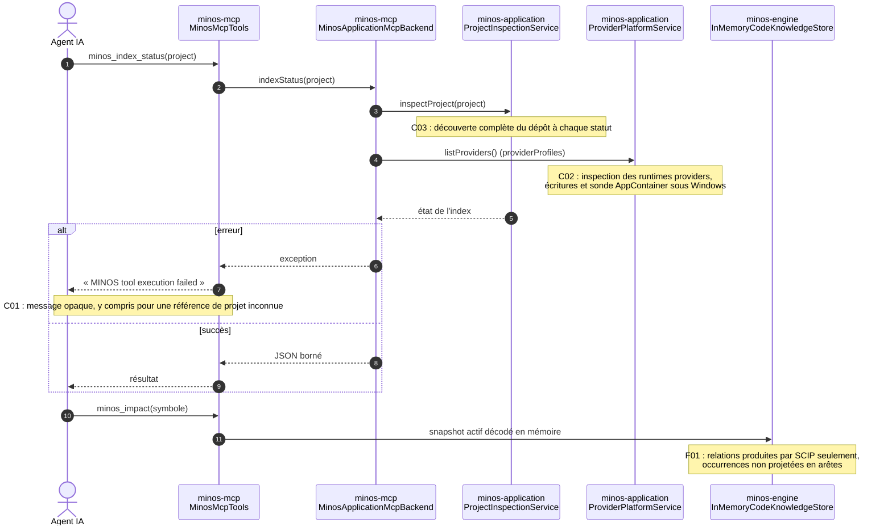
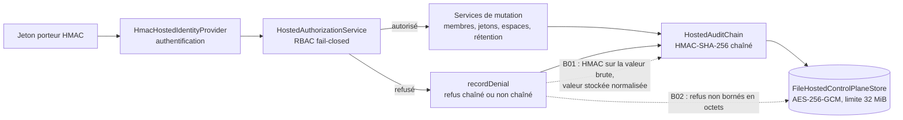

# Architecture actuelle de MINOS — audit 2026-10

> **Statut** : état observé au HEAD `bc1d3421` de `develop` (6 octobre 2026), pas une cible.
> **Sources** : les `pom.xml` des 14 modules du reactor, les sources `src/main`, `minos-intellij` (Gradle, hors reactor) et les rapports d'analyse en [`annexes/`](annexes/).
> **Limite** : les arêtes ci-dessous sont celles que déclarent les POM et que confirment les lectures de code citées. Le serveur MCP `minos` (index du projet lui-même) a échoué (`MINOS tool execution failed`, voir [MINOS-AUD-C01](constats.md#minos-aud-c01)) : aucune arête n'a donc été obtenue de l'index MINOS. La carte de dépendances de packages (cycles) vient d'un script jetable exécuté par l'analyse E, non conservé.
> **Architecture cible** : elle n'est pas redessinée ici. Elle est décrite par les ADR [0055](../adr/0055-unifier-les-adaptateurs-de-stockage.md), [0056](../adr/0056-ports-de-lecture-des-snapshots.md), [0057](../adr/0057-finaliser-les-frontieres-hexagonales.md) et le [backlog SH-01..SH-12](../roadmap/storage-hexagonal-2026-10/README.md) ; la dernière section liste seulement les écarts que cet audit y ajoute.

## 1. Contexte (C4, niveau 1)

Preuves : `minos-mcp` (MCP STDIO), `minos-cli` (CLI), `minos-nexus`, `minos-intellij`, `minos-storage-postgresql`, `OllamaEmbeddingProvider` (`minos-application/.../semantic/`), `minos-integration-git`, ADR 0017, 0020, 0027, 0041.

## 2. Conteneurs (C4, niveau 2) — dépendances Maven réelles

Les arêtes pleines sont des dépendances de compilation déclarées dans les POM ; les pointillés `runtime` sont des dépendances de portée `runtime` ; `minos-intellij` n'a aucune arête `com.minos:*` (règle de `openspec/config.yaml`, ADR 0027).

En rouge : les deux adaptateurs qui dépendent d'un autre adaptateur (`minos-provider-scip` → `minos-storage-local` et `minos-runtime-local` ; `minos-storage-postgresql` → `minos-storage-local`). Le premier est assumé par la direction `adaptateurs → moteur` d'ADR 0022 seulement s'il est qualifié d'exception ; le second est précisément ce que SH-02/SH-03 doivent résoudre (voir [MINOS-AUD-E04](constats.md#minos-aud-e04)). Dans le POM de `minos-bootstrap`, PostgreSQL n'apparaît qu'en portée `test` : le choix du backend passe par `ServiceLoader` (`StorageBackendSelection`).

### Carte des modules

Volumes : fichiers et lignes de `src/main/java` (mesurés par `find` + `wc -l`), fichiers de `src/test/java`. Responsabilité = ce que fait le code, pas ce qu'annonce le nom.

| Module | Main (fichiers / lignes) | Tests (fichiers) | Responsabilité effective | Points d'entrée | Constats principaux |
|---|---|---|---|---|---|
| `minos-domain` | 37 / 1 185 | 6 | Modèle de connaissance : symboles, relations, occurrences, identités | types publics | peu de tests au regard de son rôle (T5) |
| `minos-engine` | 165 / 16 069 | 95 | Ports (`StorageBackendProvider`…), orchestration d'indexation, découverte, empreintes, requêtes, plan de contrôle hébergé, primitives d'E/S | `IndexingLifecycleService`, `IndexingRunExecutor`, `ProjectDiscoveryService`, `HostedControlPlaneService`, `InMemoryCodeKnowledgeStore` | [B01](constats.md#minos-aud-b01), [B02](constats.md#minos-aud-b02), [D01](constats.md#minos-aud-d01), [E10](annexes/E-persistance-frontieres.md) |
| `minos-application` | 108 / 13 614 | 38 | Services applicatifs : résolution de projet, inspection, impact, architecture, sémantique, plateforme de providers | `MinosApplication`, `ProjectInspectionService`, `ImpactAnalysisService`, `ProviderPlatformService` | [C03](constats.md#minos-aud-c03), [F01](constats.md#minos-aud-f01), [F04](annexes/F-providers-requetes.md) |
| `minos-runtime-local` | 37 / 8 830 | 58 | Exécution de providers confinés : sandbox Linux (bubblewrap, cgroup v2) et Windows (AppContainer, Job Object), espaces de travail éphémères, rétention des runs | `WorkerSandboxBackends`, `ProcessIndexerExecutor`, `LocalProviderWorkspace`, `LocalIsolatedIndexWorker` | [A01](constats.md#minos-aud-a01), [A02](annexes/A-confinement.md) |
| `minos-storage-local` | 31 / 6 839 | 62 | Persistance fichiers : snapshots (codecs V1/V2/V3), état d'indexation, empreintes, vecteurs, registre, plan de contrôle chiffré | `FileSymbolSnapshotStore`, `FileHostedControlPlaneStore` | [B02](constats.md#minos-aud-b02), [E03](annexes/E-persistance-frontieres.md) |
| `minos-storage-postgresql` | 18 / 3 241 | 17 | Backend PostgreSQL/pgvector, activé par `ServiceLoader` | `PostgresIndexStateStore`, `PostgresJdbcUrlPolicy` | [B07](constats.md#minos-aud-b07), [E01](annexes/E-persistance-frontieres.md) |
| `minos-provider-scip` | 40 / 6 298 | 39 | Catalogue d'indexeurs SCIP, ingestion de l'index protobuf vers le domaine, runtimes gérés | `ScipIngestionAdapter`, `ScipSymbolSnapshotImporter`, `ScipIndexerCatalog` | [F01](constats.md#minos-aud-f01), [F07](annexes/F-providers-requetes.md) |
| `minos-integration-git` | 6 / 1 740 | 7 | Matérialisation de dépôts Git distants (JGit) | `JGitRemoteRepositoryMaterializer` | dormant tant que ADR 0041 reste fermé ([A05](annexes/A-confinement.md), A09) |
| `minos-bootstrap` | 6 / 407 | 41 | Racine de composition découverte par `ServiceLoader`, fail-fast | `DefaultMinosApplicationComposer`, `StorageBackendSelection` | A8 (chargeur de contexte), [E04](annexes/E-persistance-frontieres.md) |
| `minos-cli` | 38 / 6 002 | 71 | Commandes `minos …`, analyse d'arguments, codes de sortie, **et** workflow d'indexation | `MinosLauncher`, `MinosCliRunner`, `LocalAutonomousIndexOperations` | [C01](constats.md#minos-aud-c01), [C03](constats.md#minos-aud-c03) ; workflow d'indexation en CLI = SH-05 |
| `minos-api` | 13 / 2 828 | 17 | API Java versionnée (façades) | `LocalMinosApi`, `MinosApiSupport` | [C06](annexes/C-surfaces.md) |
| `minos-mcp` | 8 / 1 498 | 11 | Serveur MCP STDIO, catalogue de 31 outils (`product-facts`) | `MinosMcpTools`, `MinosApplicationMcpBackend` | [C01](constats.md#minos-aud-c01), [C02](constats.md#minos-aud-c02) |
| `minos-nexus` | 4 / 626 | 3 | Export JSON NEXUS (ADR 0020) | `NexusSemanticSignalService` | [C14](annexes/C-surfaces.md) ; 3 fichiers de tests |
| `minos-app` | 7 / 538 | 39 | Agrégat exécutable (jar ombré), tests de caractérisation | assemblage du jar | doc : « composition root » à tort (ADR 0042 la place dans `minos-bootstrap`) — [G16](annexes/G-adr-documentation.md) |
| `minos-intellij` (hors reactor) | 24 / 3 564 | 14 | Plugin IntelliJ, client externe du protocole CLI JSON | `MinosCommandLine`, `MinosStrongProcessLauncher`, `MinosCliClient` | [C04](constats.md#minos-aud-c04) |

## 3. Parcours de bout en bout

### 3.1 Indexation

Schéma simplifié : l'ordre des appels reprend l'analyse D et les ADR ; seuls la construction de `IndexingLifecycleService` dans le CLI (`LocalAutonomousIndexOperations.java:166`) et l'emplacement des classes ont été revérifiés par l'auteur du livrable. Références : [ADR 0006](../adr/0006-promouvoir-les-index-de-maniere-atomique.md), [ADR 0039](../adr/0039-reprise-indexation-apres-interruption.md) (reprise sur le même `runId`), `LocalAutonomousIndexOperations.java:166` (construction de `IndexingLifecycleService`). Le point de contrôle de reprise est vérifié avant toute réutilisation d'un artefact (SHA-256, taille, empreinte de scope, version de provider) : aucun défaut nouveau trouvé sur cette chaîne par l'analyse D.

### 3.2 Interrogation par un agent (MCP)

### 3.3 Plan de contrôle d'équipe hébergé (opt-in)

Preuves : `HostedAuthorizationService.recordDenial`, `HostedAuditChain.append`/`verify`, `FileHostedControlPlaneStore.DEFAULT_MAX_TENANT_BYTES` (voir la fiche [MINOS-AUD-B01](constats.md#minos-aud-b01), reproduite par un test rouge).

## 4. Écarts constatés entre responsabilité annoncée et implémentation

| Annonce | Réalité observée | Source de la preuve | Constat |
|---|---|---|---|
| MCP STDIO « lecture seule » (ADR 0017) | Un appel de statut inspecte les runtimes providers (écritures, hachage, sonde AppContainer sous Windows) | [annexe C](annexes/C-surfaces.md), C-02 | MINOS-AUD-C02 |
| Impact « conservateur », architecture « factuelle » (ADR 0013, 0015) | Aucune arête d'appel issue des occurrences SCIP ; la limite n'est pas dite dans la sortie | `ScipIngestionAdapter`, `ImpactAnalysisService`, `ScipIndexerCatalog` | MINOS-AUD-F01 |
| Refus RBAC audités et bornés (`team-hosted-mode.md`, ADR 0035) | Un identifiant non canonique corrompt la chaîne ; les refus ne sont pas bornés en octets | test rouge `AuditReproHostedDenialChainTest` | MINOS-AUD-B01, B02 |
| Reprise après interruption (ADR 0039) | Inopérante avec PostgreSQL (`resumableRunId` jamais persisté) | `PostgresIndexStateStore` | MINOS-AUD-E01 |
| `minos-app` « composition root » (README racine, arc42) | La racine de composition est `minos-bootstrap` (ADR 0042) ; `minos-app` est l'agrégat exécutable | POM, ADR 0042 | MINOS-AUD-G16, G17 |
| Wrapper Maven « 3.9.x » (STATUS, TOOLCHAIN_POLICY, ADR 0004/0005) | `.mvn/wrapper/maven-wrapper.properties` pointe sur Maven 3.10.0 | fichier lu pendant l'audit | MINOS-AUD-G11 |

## 5. Observations structurelles

- **Frontières** : le garde `scripts/architecture/check-module-boundaries.py` passe au HEAD, mais ses règles « application ↛ adaptateurs » n'ont pas d'auto-test, contrairement à ce qu'affirme l'ADR 0042 §8.4, et trois contournements ont été reproduits sur une copie ([MINOS-AUD-E02](annexes/E-persistance-frontieres.md)).
- **Cycles de packages** : quatre cycles non gardés (huit packages dans `minos-application` ; `discovery`↔`spi` et `incremental`↔`orchestration` dans `minos-engine` ; un dans `minos-intellij`) — [MINOS-AUD-E10](annexes/E-persistance-frontieres.md). ADR 0057 §7 vise explicitement les cycles.
- **Cycle de vie des données** : snapshot actif décodé en entier en mémoire à chaque observation (E-09, D-03), sans garde-fou de tas (E-03) ; résidus disque après arrêt brutal sur `staged-snapshots/` (R8, élargi par l'analyse D), `local-provider-workspaces/` et `distributed-workers/` (A-02).
- **Concurrence inter-processus** : le verrouillage des états projet passe par des baux bornés ; la récupération des sandbox Windows ne distingue pas un sandbox vivant d'un sandbox mort (A-01).
- **Configuration** : le backend de stockage est choisi par `ServiceLoader` sans chargeur de classes explicite (A8 de l'audit 2026-09, toujours ouvert), et la politique d'URL PostgreSQL accepte une clé `sslmode` que le pilote ignore (B-07).

## 6. Écarts ajoutés au plan d'architecture cible (ADR 0055-0057)

Le backlog `SH-01..SH-12` n'est pas commencé (12 tâches « À faire », aucun commit ne les cite). L'analyse E y relève des critères incomplets, à intégrer **avant** SH-02/03/10/11 ([MINOS-AUD-E04](annexes/E-persistance-frontieres.md), décision à clarifier) :

1. `PostgresProjectRegistry` dépend du magasin de correspondances de chemins du backend local, pas seulement des codecs.
2. Le pointeur de snapshot partage des primitives de portée paquet avec le codec.
3. Fusionner les modules perdrait le garde-fou « `minos-bootstrap` ne dépend pas de PostgreSQL en compilation » si la règle n'est pas réécrite.
4. Un chemin cité dans SH-10 est inexact et les préfixes JaCoCo sont des littéraux de packages.

Avant SH-02, il est également recommandé d'ajouter les auto-tests manquants du garde de frontières ([MINOS-AUD-E02](annexes/E-persistance-frontieres.md)), car SH-02/SH-11 le modifient en profondeur.
