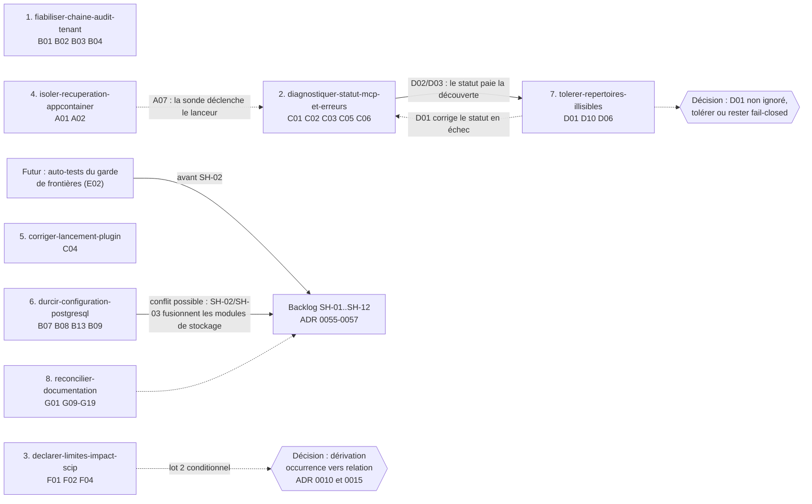

# Plan de remédiation — audit 2026-10

Ce plan ordonne le traitement des 101 constats de [`constats.md`](constats.md). Il ne contient aucune correction : il prépare le travail de production qui suivra l'examen des livrables.

**Base** : HEAD `bc1d3421` de `develop`. **Statut** : proposé, à valider par l'utilisateur. Aucune décision d'architecture n'est prise ici ; les décisions à clarifier sont listées en [§ 6](#6-décisions-à-clarifier).

## 1. Principes d'ordonnancement

1. **Défaut confirmé avant risque ; risque avant amélioration.** Les décisions à clarifier ne bloquent aucun changement : elles sont posées en questions ouvertes.
2. **Test rouge d'abord.** Chaque changement commence par la reproduction du défaut. Trois reproductions existent déjà et ont été exécutées : `AuditReproHostedDenialChainTest` (B01, B03) et `AuditReproPostgresJdbcUrlPolicyTest` (B07). Elles sont sautées par défaut (`@EnabledIfSystemProperty(named = "minos.audit.repro", matches = "true")`) pour ne pas rendre `verify` rouge ; le correctif retire la condition.
3. **Un changement, une PR, vérifiable seul.** Les 8 changements préparés ne partagent pas de fichier de production, sauf un point signalé en § 4.
4. **Gates littéraux.** `scripts/remediation/check-*.py` assertent des chaînes littérales : chaque tâche qui touche du code nomme les gates à rejouer (règle de `openspec/config.yaml`).
5. **Windows et Linux.** Ce qui n'est prouvé que par le runner Windows est dit comme tel dans le changement concerné.

## 2. Changements OpenSpec préparés

Tous validés par `openspec validate --all --strict` (8 réussis, 0 échec). **Avancement (2026-10-06)** : les changements 1 et 2 sont **implémentés en local**, en PR : `fiabiliser-chaine-audit-tenant` (10 tâches sur 12 cochées ; 7.1 est conditionnelle, 8.1 attend la CI Ubuntu/Windows) et `diagnostiquer-statut-mcp-et-erreurs` (11 tâches sur 12 cochées ; 9.1 attend la CI Ubuntu/Windows) ; le changement 3, `declarer-limites-impact-scip`, est **implémenté en local, non commité** (10 tâches sur 11 cochées ; 7.1 reste ouverte : réindexation réelle et CI) ; le changement 4, `isoler-recuperation-appcontainer-par-proprietaire`, est **implémenté en local** (10 tâches sur 13 cochées ; 3.1 reste ouverte : Linux et job `windows-2022` ; 4.1 et 4.2 sont conditionnelles à une décision) ; le changement 5, `corriger-lancement-plugin-intellij-windows`, est **implémenté en local** (7 tâches sur 8 cochées ; 2.2 reste ouverte : build Gradle et CI du plugin) ; le changement 6, `durcir-configuration-postgresql-et-secrets`, est **implémenté en local** (5 tâches sur 6 cochées ; 5.1 reste ouverte : CI Ubuntu et Windows) ; le changement 7, `tolerer-repertoires-illisibles-a-la-decouverte`, est **implémenté en local** (9 tâches sur 13 cochées ; 4.1 reste ouverte : Linux et CI ; 5.1 à 5.3 sont conditionnelles à une décision) ; le changement 8, `reconcilier-documentation-courante`, est **implémenté en local** (11 tâches sur 11 cochées ; documentation seule, CI de la PR à observer ; les questions Q2 à Q6, Q8 et Q9 du design restent ouvertes, Q1 et Q7 ont été tranchées : ADR-0036 alignée sur son fichier, sept diagrammes créés). Les huit changements préparés sont implémentés, fusionnés dans `develop` (PR #351 à #357) et **archivés le 2026-10-07** sous `openspec/changes/archive/`, avec huit capacités créées sous `openspec/specs/` (54 exigences). Restent ouvertes dans les archives : `declarer-limites-impact-scip` 7.1 (contrôles manuels sur un index SCIP réel), `fiabiliser-chaine-audit-tenant` 7.1, `isoler-recuperation-appcontainer-par-proprietaire` 4.1 et 4.2, `tolerer-repertoires-illisibles-a-la-decouverte` 5.1 à 5.3 (conditionnelles, décisions de l'utilisateur). `openspec/specs/` étant vide, chaque changement crée ses capacités ; les noms suivent [`CAPACITES.md`](CAPACITES.md). Les compteurs sont ceux du dossier `openspec/changes/<nom>/`.

| Ordre | Changement | Capacité(s) | Constats | Exig. / scén. / tâches | Modules touchés | Plateforme | ADR |
|---|---|---|---|---|---|---|---|
| **1** | [`fiabiliser-chaine-audit-tenant`](../../openspec/changes/archive/2026-10-07-fiabiliser-chaine-audit-tenant/proposal.md) | `controle-tenant-heberge` | B01 (P1), B02 (P1), B03, B04 | 7 / 24 / 12 | `minos-engine`, `minos-storage-local`, `minos-api` (test) | portable | amendement d'ADR 0035 à proposer (note), pas rédigé |
| **2** | [`diagnostiquer-statut-mcp-et-erreurs`](../../openspec/changes/archive/2026-10-07-diagnostiquer-statut-mcp-et-erreurs/proposal.md) | `surfaces-publiques` | C01 (P1), C02 (P1), C03 + D02, C05, C06, C16 | 10 / 41 / 12 | `minos-application`, `minos-mcp`, `minos-api`, `minos-cli`, `minos-engine` | portable (sonde AppContainer côté Windows) | aucun (applique ADR 0017) |
| **3** | [`declarer-limites-impact-scip`](../../openspec/changes/archive/2026-10-07-declarer-limites-impact-scip/proposal.md) | `tests-lies-et-impact`, `program-graph-et-architecture` | F01 (P1), F02, F04 (F03 lié) | 11 / 30 / 11 | `minos-engine`, `minos-application`, `minos-provider-scip`, `minos-cli`, `minos-mcp`, `minos-api` | portable | aucun pour le lot 1 ; le lot conditionnel (dérivation occurrence→relation) amende ADR 0010 et 0015 |
| **4** | [`isoler-recuperation-appcontainer-par-proprietaire`](../../openspec/changes/archive/2026-10-07-isoler-recuperation-appcontainer-par-proprietaire/proposal.md) | `confinement-code-non-fiable` | A01 (P1), A02 | 9 / 18 / 13 | `minos-runtime-local`, `minos-engine` (primitive de balayage), `minos-integration-git` | **A01 : Windows seul** (preuve par le runner Windows, classe T6) ; A02 portable | amendement éventuel d'ADR 0038 (question ouverte) |
| **5** | [`corriger-lancement-plugin-intellij-windows`](../../openspec/changes/archive/2026-10-07-corriger-lancement-plugin-intellij-windows/proposal.md) | `client-intellij` | C04 (P1 à confirmer), C07 en question ouverte | 5 / 13 / 8 | `minos-intellij` (hors reactor) | **Windows** | aucun |
| 6 | [`durcir-configuration-postgresql-et-secrets`](../../openspec/changes/archive/2026-10-07-durcir-configuration-postgresql-et-secrets/proposal.md) | `stockage-prive-et-secrets` | B07, B08, B13, B09 | 6 / 24 / 6 | `minos-storage-postgresql`, `minos-engine` (E/S), `scripts/install` | portable (B08 propre à Windows en pratique) | aucun |
| 7 | [`tolerer-repertoires-illisibles-a-la-decouverte`](../../openspec/changes/archive/2026-10-07-tolerer-repertoires-illisibles-a-la-decouverte/proposal.md) | `decouverte-et-negociation` | D01 (P2), D10, D06 | 6 / 15 / 13 | `minos-engine`, `minos-runtime-local`, `minos-cli` | portable ; tests d'illisibilité sautés pour un compte root/administrateur | aucun |
| 8 | [`reconcilier-documentation-courante`](../../openspec/changes/archive/2026-10-07-reconcilier-documentation-courante/proposal.md) | aucune (`skip_specs: true`) | G01, G09–G19 retenus ; G02–G08, G20 en questions ouvertes | — / — / 9 | `docs/` seulement | — | aucun ADR modifié (statuts d'ADR : à décider par l'utilisateur) |

Total : 54 exigences, 165 scénarios, 84 tâches pour 49 constats sur 101. Les 52 autres sont regroupés en § 5.

## 3. Premier changement recommandé : `fiabiliser-chaine-audit-tenant`

Raisons, par ordre d'importance :

1. **C'est le seul défaut P1 déjà démontré par des tests rouges dans le dépôt** : trois tests (B01 et B03) ont été exécutés pendant l'audit et échouent comme prévu au HEAD ; la valeur de la reproduction est maximale.
2. **Correctif local et peu risqué** : calculer le HMAC depuis l'événement construit plutôt que depuis les arguments bruts ; un vecteur de référence figé avant la modification garantit que les chaînes existantes restent vérifiables.
3. **Garantie centrale** : un appelant de rang minimal rend le tenant inutilisable pour tous (lectures comprises) ; la promesse de refus « bornés » d'ADR 0035 n'est pas tenue.
4. **Indépendant** : aucun ADR à rédiger avant de commencer, aucun comportement propre à une plateforme, aucun autre changement en prérequis.
5. **Les quatre constats partagent un point d'entrée** (autorisation d'une mutation et enregistrement d'un refus) : les traiter ensemble évite qu'un correctif expose le suivant (borner l'identifiant sans repli non chaîné transformerait B02 en B03).

**Réserve** : le plan de contrôle hébergé est opt-in (ADR 0035) et le MCP est en lecture seule, donc l'exposition suppose qu'un intégrateur place un transport devant le service. Si la priorité du moment est l'utilisabilité des agents, **le changement 2 peut passer en premier** sans conflit : il ne partage aucun fichier de production avec le changement 1. Il restaure aussi l'outil qui sert à diagnostiquer les suivants (`minos_index_status` a échoué pendant cet audit sans autre information que « MINOS tool execution failed »).

## 4. Dépendances et ordre de traitement

- **Indépendants entre eux** : 1, 3, 5, 6, 8.
- **Couplés** : 2 ↔ 7 (le statut dépend de la découverte : le changement 7 fait échouer moins souvent ce que le changement 2 rend lisible ; ils peuvent être livrés dans n'importe quel ordre) ; 2 ↔ 4 (A07 : la sonde de statut déclenche le lanceur AppContainer, laissé en question ouverte dans le changement 4).
- **Avec le backlog SH** : le changement 6 touche `minos-storage-postgresql`, que SH-02/SH-03 fusionnent dans un module de stockage unique : livrer 6 **avant** SH-02 ou le rebaser. Les auto-tests du garde de frontières (E02) sont à faire **avant** SH-02 et SH-11, qui le modifient en profondeur.

### Ordre proposé

| Vague | Contenu | Pourquoi |
|---|---|---|
| **V1 — P1 indépendants et ciblés** | 1, puis 2, puis 3 (lot 1) | Défauts P1 vérifiés, correctifs locaux, ADR non requis ; 3 est la mise en conformité d'une capacité déjà revendiquée honnête |
| **V2 — P1 propres à Windows** | 4 et 5 | Exigent le runner Windows (T6) ; 5 d'abord *confirmer* le défaut dans l'IDE avant d'écrire du code |
| **V3 — P2 bornés** | 6, 7, 8 | Petite taille ; 6 avant SH-02 |
| **V4 — P2 non préparés** | groupes de § 5 | À transformer en changements après décision de l'utilisateur sur la vague 1 |

## 5. Constats non couverts par un changement préparé

52 constats (dont 13 P2) ne sont pas rattachés à un changement. Regroupement proposé, **chaque groupe étant un futur changement** à préparer (aucun artefact n'existe encore). Les P2 sont en gras.

| Groupe proposé | Constats | Remarque |
|---|---|---|
| Parité PostgreSQL de la reprise et du stockage | **E01**, E06, E08, E12 | E01 : la reprise ADR 0039 est inopérante avec PostgreSQL (`resumableRunId` jamais persisté). Migration de schéma v5 : coordonner avec SH-02 |
| Garde de frontières et dettes de structure | **E02**, E10, E11 | E02 d'abord (avant SH-02) ; E11 touche des statuts d'ADR (décision) |
| Mémoire des snapshots | **E03**, **D03**, E09 | À arbitrer avec l'ADR 0047 (Proposed) et A9 de l'audit précédent : la structure du correctif dépend de la décision « paginé ou mappé » |
| Cycle de vie : résidus et reprise | **D04**, **D05**, D07, D08, D09, D13, D14, A06 (+ R8 élargi de l'audit précédent) | D04 : reprise annoncée pour des indexeurs sans `RESUMABLE_ARTIFACT` ; D05 : capture d'empreinte post-run non protégée ; A02 est déjà dans le changement 4 |
| Limites du sandbox Linux et Windows | **A03**, A04, A05, A08, A09 | A03 à mesurer avant toute décision (`prlimit --cpu`, `pids.max`) ; A05, A08, A09 sont dormants tant que l'ADR 0041 reste fermé |
| Recherche, requêtes et couche sémantique | **F05**, **F06**, F07, F08, F09, F10, F11, F12, F13, F14, E07 | F05 : repli de la recherche hybride quand Ollama échoue ; F06 : fraîcheur source/snapshot (décision) |
| Surfaces : contrat et durcissement | C09, C10, C11, C12, C13, C14, C15, E05 | C11, C12 : dérives de doc/contrat gardées par `product-facts.py` seulement pour le catalogue |
| Plugin IntelliJ | C08 (infirmé, P3), C09 | C07 (délais) est une question ouverte du changement 5 |
| Plan de contrôle : décisions | **B05**, **B06**, B10, B11, B12 | B05, B06, B10, B11 : décisions ; B12 : documentation seulement |
| Évolution du backlog hexagonal | **E04** | À intégrer à `docs/roadmap/storage-hexagonal-2026-10/` avant SH-02/03/10/11 |
| Décisions de produit | **D11**, D12 (changement 7, question ouverte), A07, A10 | D11 : budgets de fichiers, binaires inclus ; A07 : sonde qui mute en lecture ; A10 : prérequis avant de rouvrir l'ADR 0041 |

## 6. Décisions à clarifier

Aucun changement ne les tranche ; elles figurent en questions ouvertes du `design.md` concerné et ne bloquent aucune tâche suivie.

| # | Décision | Constats | Où elle est posée | Options |
|---|---|---|---|---|
| 1 | Dériver les relations d'appel à partir des occurrences SCIP | F01 (fond), F03, F02 | `declarer-limites-impact-scip` | Oui (amende ADR 0010 et 0015) ; non, limite déclarée définitivement ; par langage |
| 2 | Tolérer un répertoire illisible **non ignoré** à la découverte | D01 | `tolerer-repertoires-illisibles-a-la-decouverte` | Fail-closed avec message actionnable (défaut proposé) ; tolérance avec avertissement |
| 3 | Valeur de `runtimeState` du statut MCP rendu passif | C02 | `diagnostiquer-statut-mcp-et-erreurs` | `NOT_INSPECTED` (hypothèse du design) ; autre vocabulaire |
| 4 | Réparation d'un tenant déjà corrompu par B01 ; budget global de refus ; refus des clés retirées au niveau du fournisseur d'identité | B01, B04 | `fiabiliser-chaine-audit-tenant` | outil de réparation ; budget par tenant ; statu quo |
| 5 | Rejeu du fichier chiffré (rollback) et modèle de menace | B05 | non préparé | témoin hors fichier ; accepter le risque ; l'ajout de la version à l'AAD (S10) est **inefficace** |
| 6 | Le rôle ADMIN peut-il effacer la piste d'audit, y compris ses propres actions ? | B06 | non préparé | retirer la rétention à ADMIN ; double contrôle ; statu quo |
| 7 | Politique de délai des commandes longues du plugin | C07 | `corriger-lancement-plugin-intellij-windows` | table par classe ; annulation par la barre de progression ; statu quo documenté |
| 8 | Tolérer l'absence de lien physique pour la publication atomique | B09 | `durcir-configuration-postgresql-et-secrets` | refus explicite (défaut) ; repli (risque de régression sur exFAT/partage réseau) |
| 9 | Sonde passive ou qualification active dans `doctor` et les statuts | A07 | `isoler-recuperation-appcontainer-par-proprietaire` | passive ; active hors commandes de lecture |
| 10 | Statuts d'ADR et amendements de documentation | G02–G08, G20, E11 | `reconcilier-documentation-courante` | seul l'utilisateur change un statut d'ADR |
| 11 | `openspec/config.yaml` écrit « `minos-app` est le composition root », ce que l'ADR 0042 contredit | G16/G17 | `reconcilier-documentation-courante` (Q9) | corriger le contexte OpenSpec |
| 12 | Budgets de fichiers et d'octets de la copie provider | D11 | non préparé | exclure les binaires ; message actionnable ; statu quo |

## 7. Interaction avec les documents et chantiers existants

- **Audit 2026-09** ([`AUDIT-2026-09.md`](AUDIT-2026-09.md)) : 16 constats clos revérifiés, aucun contredit ; R8, R10, R12 confirmés au HEAD, R8 élargi ; S10 (AAD sans version) reste ouvert et son correctif suggéré est inefficace contre le rejeu (B05). Ce document n'est pas modifié : il reste l'instantané de septembre.
- **Backlog hexagonal SH-01..SH-12** ([`docs/roadmap/storage-hexagonal-2026-10/`](../roadmap/storage-hexagonal-2026-10/README.md)) : le backlog n'est pas commencé (12 tâches « À faire », aucun commit ne les cite). L'analyse E ajoute quatre écarts à intégrer avant SH-02/03/10/11 (MINOS-AUD-E04) et recommande les auto-tests du garde de frontières avant SH-02 (MINOS-AUD-E02). Ces entrées sont reliées à ce plan dans le README du chantier.
- **ADR** : 57 ADR présents (0001–0057), aucun manquant ni doublon. État réel : 41 implémentés, 3 partiellement (0033, 0040, 0057), 10 non implémentés dont 0047–0054 (Proposed, conformes) et 0055–0056 (acceptés, non commencés), 1 contredit par le code (0031 §2 « loopback only », élargi à `minos-ollama`), 2 à réexaminer (0004, 0025). Détail : [annexe G](annexes/G-adr-documentation.md). **Aucun ADR n'a été créé ni modifié par cet audit** ; les décisions nouvelles restent à l'état de question.
- **Vérifications de gouvernance** : `docs/audit/CAPACITES.md` (carte de la phase 0) est désormais complétée par ce plan ; sa limite « non vérifiée contre le code » est levée par [`architecture-actuelle.md`](architecture-actuelle.md).

## 8. Critères de clôture d'un changement

Un changement est clos quand : (1) tous ses tests rouges sont verts **et** n'ont plus de condition `@EnabledIfSystemProperty` ; (2) les gates `scripts/**/check-*.py` nommés dans ses tâches sont rejoués ; (3) `./mvnw -B -ntp clean verify` est vert sur Ubuntu 24.04 et Windows Server 2022 (CI de qualification) ; (4) `python scripts/quality/check-jacoco.py` reste vert (sous Windows, comparer `m24-polyglot-provider-platform` à `develop` s'il est rouge) ; (5) les `docs/` listés à l'archivage sont mis à jour.
