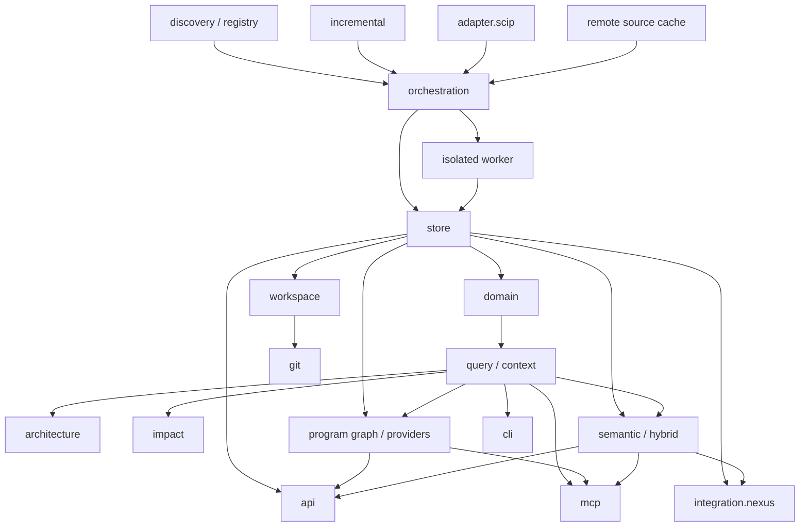

# Guide développeur MINOS

Ce guide décrit l’architecture interne, les invariants de domaine, les flux d’indexation, les surfaces publiques et les règles de validation du code MINOS.

## Principes structurants

MINOS suit plusieurs règles fortes :

- le domaine ne dépend pas des fournisseurs d’indexation ;
- les adaptateurs externes restent confinés à leurs packages ;
- faits, dérivations et heuristiques restent distingués ;
- provenance, preuves et confiance accompagnent les informations qui en ont besoin ;
- les couches CLI/MCP/API exposent le cœur mais ne réimplémentent pas la logique métier ;
- un nouveau snapshot n’est visible qu’après promotion ;
- une relation cross-repository n’est promue que sur une identité exacte et unique ;
- l’activité Git ne devient jamais automatiquement une mesure d’importance architecturale ;
- un score sémantique reste un signal de ranking heuristique, jamais une relation de code ;
- l’index vectoriel reste reconstruisible depuis les snapshots structurés ;
- un provider learned doit être qualifié sur le modèle réellement configuré, pas sur son nom ;
- un backend ANN/vectoriel n'est adopté qu'après mesure d'un bottleneck ;
- MINOS ne sélectionne pas le contexte final de NEXUS ;
- une release distribuée doit conserver une provenance et un inventaire supply-chain vérifiables ;
- une capability avancée n’est publiée que lorsque le provider courant produit réellement les facts correspondants.
- le contrôle tenant reste opt-in, chiffré par clés externes et séparé des snapshots autoritatifs.

## Carte des sous-systèmes



## Packages principaux

| Package | Responsabilité |
|---|---|
| `com.minos.discovery` | découverte de projet, langages, builds, modules |
| `com.minos.registry` | projets et workspaces persistés |
| `com.minos.orchestration` | négociation, lifecycle et promotion |
| `com.minos.incremental` | fingerprints, invalidation, plans NONE/FULL/INCREMENTAL |
| `com.minos.adapter.scip` | lecture et normalisation SCIP |
| `com.minos.domain` | symboles, relations, origine, preuves et critères |
| `com.minos.program` | modèle provider-independent des graphes de programme M19 |
| `com.minos.semantic` | documents, embeddings, recherche sémantique/hybride, provider learned local et budgets M20/M23 |
| `com.minos.store` | snapshots, persistance locale et index reconstruisibles |
| `com.minos.query` | requêtes symboles/relations/tests |
| `com.minos.context` | recherche compacte, extraits et budgets |
| `com.minos.architecture` | topologie, dépendances, centralité, technologies |
| `com.minos.impact` | propagation d’impact potentielle |
| `com.minos.api` | contrats Java publics versionnés |
| `com.minos.cli` | exposition CLI stable |
| `com.minos.mcp` | exposition MCP STDIO read-only |
| `com.minos.git` | faits Git via JGit |
| `com.minos.workspace` | intelligence cross-repository |
| `com.minos.integration.nexus` | projections versionnées vers NEXUS |
| `com.minos.output` | rendus texte/JSON |
| `com.minos.hosted` | identité, RBAC, espaces partagés, audit et rétention M27 |

## Parcours de lecture conseillé

1. [Architecture interne](architecture.md)
2. [Modèle de domaine](domain-model.md)
3. [Indexation, lifecycle et stockage](indexing-and-storage.md)
4. [Surfaces publiques](public-surfaces.md)
5. [Intelligence sémantique et hybride M20](semantic-hybrid-intelligence.md)
6. [Semantic Retrieval 2.0 — learned local M23](semantic-retrieval-2.md)
7. [Provider avancé Program Graph sidecar M21-S7](advanced-program-provider.md)
8. [Provider Java avancé de référence M22](java-advanced-provider.md)
9. [Providers polyglottes M24](polyglot-providers.md)
10. [Remote & Distributed Indexing M25](remote-distributed-indexing.md)
11. [Runtime & Dynamic Intelligence M26](runtime-dynamic-intelligence.md)
12. [Team / Hosted Mode M27](team-hosted-mode.md)
13. [Qualification de scalabilité sémantique M21-S8](semantic-scale-qualification.md)
14. [Multi-dépôts et Git](multi-repo-git.md)
15. [Supply-chain et provenance de release](supply-chain.md)
16. [Tests et contribution](testing.md)

## Build développeur

```powershell
.\mvnw.cmd clean verify
```

La toolchain est contractualisée par Maven Enforcer : Java 24 et Maven 3.9.x.

Le build du module final produit également le SBOM de distribution dans `target/sbom/minos-cyclonedx.json`.

## Règle de modification

Une évolution doit être placée au niveau architectural le plus bas qui porte réellement la responsabilité. Par exemple :

- un nouveau fournisseur d’index → adaptateur + orchestration, pas CLI ;
- une nouvelle relation métier → domaine/query, puis exposition ;
- un nouveau provider Program Graph → `ProgramGraphProvider`, avec capabilities/limitations explicites ;
- un nouveau provider d'embeddings → `EmbeddingProvider`, sans dépendance cloud implicite dans les services ;
- un nouveau backend vectoriel → `SemanticVectorStore`, en restant reconstruisible et en exigeant une mesure avant adoption ;
- un nouveau transport → couche d’exposition, sans dupliquer les services ;
- une nouvelle dérivation → preuve + nature + confiance explicites.

## Documentation historique

Les ADR et documents `mX/` expliquent pourquoi les frontières existent. Ils doivent être consultés avant de modifier une décision structurante.
