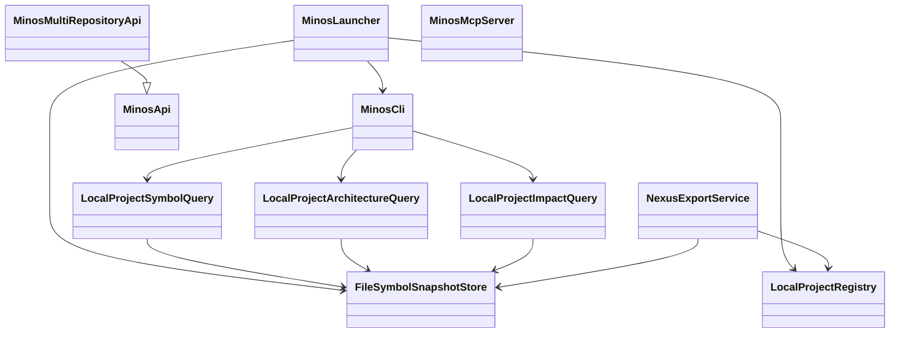
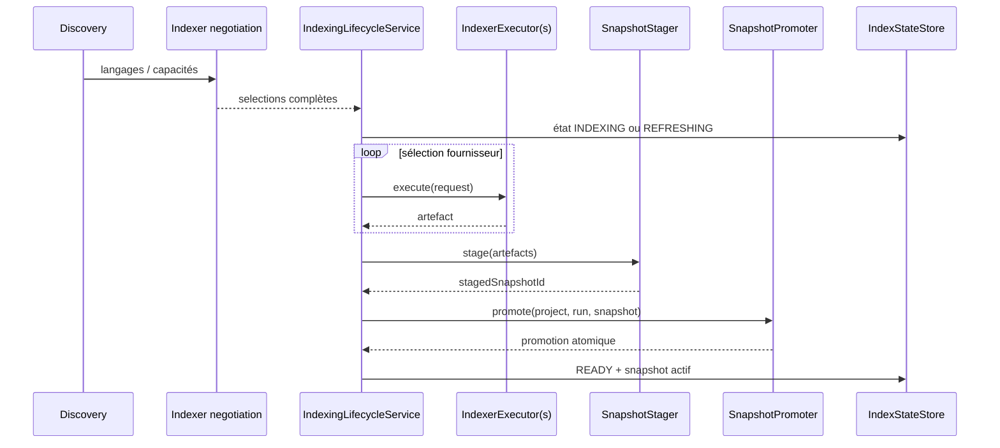
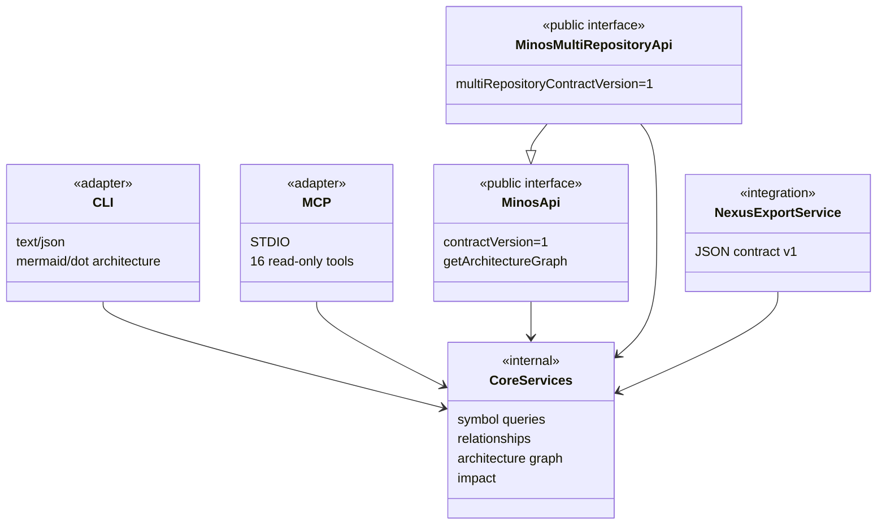

# Architecture interne

## Vue générale

MINOS sépare acquisition, normalisation, persistance, intelligence et exposition.



Ce diagramme montre la direction des dépendances principales, pas chaque classe du dépôt.

## Couche acquisition

La découverte détecte les caractéristiques locales du projet : langages, systèmes de build, modules et racines source. Le registre donne ensuite une identité persistante au projet.

Les indexeurs externes restent des fournisseurs d’artefacts. Le cœur MINOS ne doit pas connaître leurs types spécifiques.

### SCIP

`com.minos.adapter.scip` transforme les données SCIP en modèles normalisés MINOS : symboles, occurrences et relations. La dépendance `scip-java-bindings` doit rester confinée à cette frontière.

## Couche orchestration

L’orchestration négocie les fournisseurs disponibles, exécute les plans lorsque des executors existent, stage un snapshot puis le promeut atomiquement.



M14 fournit désormais l'exécution autonome des providers qualifiés derrière les ports d'orchestration ; l'import SCIP explicite reste disponible pour le diagnostic et le fallback.

## Couche normalisée

Le package `domain` porte les objets indépendants des fournisseurs. Les invariants importants vivent dans les constructeurs de records, de façon à empêcher la création d’un état incohérent.

Voir [domain-model.md](domain-model.md).

## Couche persistance

Les stores persistent les snapshots et permettent de retrouver le snapshot actif. Une requête de haut niveau doit lire une vue cohérente et ne pas dépendre d’un artefact fournisseur brut.

## Intelligence

### Query

Les services `query` portent les recherches de symboles, usages et relations.

### Context

Les services `context` bornent les résultats, extraits source et budgets estimés. La recherche compacte est conçue pour fournir un contexte utile sans renvoyer toute la base.

### Architecture

Le package `architecture` dérive topologie, dépendances, concentration, centralité relative et technologies observées.

`ArchitectureDependencyGraph` conserve notamment les arêtes agrégées entre modules sous forme de `ArchitectureModuleDependency`. Ces arêtes restent **dérivées** : elles sont calculées à partir des relations normalisées du snapshot et portent nature, confiance et preuves.

Le graphe est désormais exposé sans recopier la logique métier :

```text
ArchitectureDependencyGraph
        │
        ├── CLI architecture --format json
        ├── CLI architecture --format mermaid
        ├── CLI architecture --format dot
        ├── MinosApi.getArchitectureGraph(...)
        └── MCP minos_architecture_graph
```

Les renderers Mermaid/DOT sont des adapters d'exposition ; ils ne recalculent aucune dépendance.

### Impact

Le package `impact` propage un changement potentiel sur le graphe observé. Son résultat est explicatif et borné ; il n’est pas une preuve d’exhaustivité runtime.

## Exposition



Les adapters d’exposition ne doivent pas devenir une nouvelle couche métier.

## Règles de dépendance

### À préserver

```text
provider-specific -> adapter -> domain/store/query -> exposure
```

### À éviter

```text
domain -> SCIP
query -> MCP SDK
architecture -> CLI
impact -> NEXUS
```

Les tests `ProviderBoundaryTest` et `NamespaceConventionTest` participent à la protection de ces frontières.

## Local-first

La persistance, la CLI et le serveur MCP sont locaux. MINOS n’impose aucun service HTTP de production. Cette propriété réduit les dépendances d’exploitation et permet une utilisation directe depuis un poste développeur ou un agent local.
