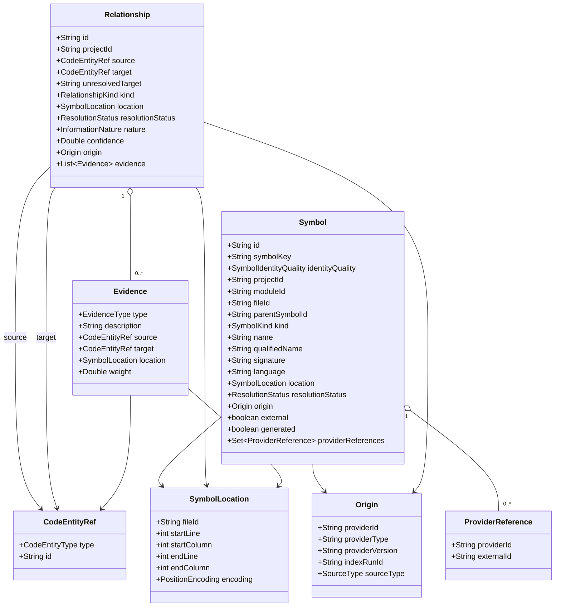
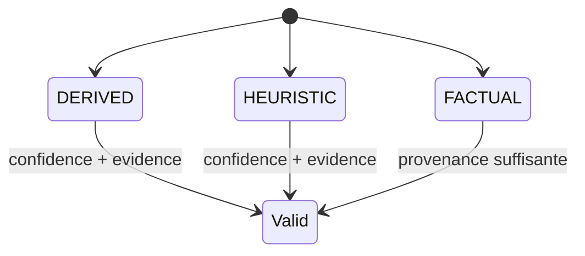

# Modèle de domaine

Le modèle de domaine est **indépendant des fournisseurs**. Il décrit ce que MINOS sait, avec quelle qualité, quelle provenance et quelles limites.

## Noyau UML



## `Symbol`

Un symbole est une déclaration adressable normalisée.

Invariants essentiels :

- `id`, `symbolKey`, `projectId`, `name` et `language` non vides ;
- `identityQuality`, `kind`, `resolutionStatus` et `origin` non nuls ;
- les références fournisseur sont immuables côté domaine.

`external=true` signifie que MINOS connaît une identité de symbole sans nécessairement disposer d’un fichier source local correspondant.

## `Relationship`

Une relation relie une source à une cible résolue ou conserve une cible non résolue.

### Cible résolue ou non résolue

Le modèle impose l’exclusivité :

```text
target != null XOR unresolvedTarget != blank
```

Une cible absente ne peut pas avoir `ResolutionStatus.RESOLVED`, et une cible présente ne peut pas avoir `UNRESOLVED`.

## Nature de l’information

MINOS distingue au minimum :

```text
FACTUAL
DERIVED
HEURISTIC
```

Une information dérivée ou heuristique doit transporter :

- une `confidence` entre 0 et 1 ;
- au moins une preuve (`evidence`).

Une relation factuelle peut ne pas avoir de confiance numérique : le fait provient alors directement de la source observée.



## Provenance

`Origin` empêche de perdre la source d’une information après normalisation. Un consommateur doit pouvoir savoir quel provider et quel run ont produit la donnée.

Cette propriété est essentielle pour :

- expliquer une relation ;
- comparer les capacités fournisseurs ;
- reconstruire un diagnostic ;
- exporter vers NEXUS sans inventer de provenance.

## Identité fournisseur

`ProviderReference` permet de conserver une identité externe précise. M12 s’appuie notamment sur cette identité pour résoudre une relation entre dépôts.

Une relation cross-repository n’est pas promue sur un simple nom de symbole : l’identité `(providerId, externalId)` doit correspondre exactement et de façon unique.

## Emplacements et `fileId`

Le domaine ne suppose pas que `fileId` soit toujours un chemin. Un adapter peut produire une identité stable opaque.

L’adaptateur SCIP utilise notamment des identités stables de fichiers, ce qui explique pourquoi M13 doit parfois reconstruire `fileId → relativePath` lors d’un export NEXUS.

## Modèle public vs modèle interne

Les types de ce document sont internes au cœur. `MinosApi` ne les expose pas directement : l’API publique définit ses propres DTOs avec uniquement des types JDK et des records imbriqués au contrat public.

Cette séparation protège la compatibilité des consommateurs contre les refactorings internes.

## Règle d’évolution du domaine

Lorsqu’un nouveau concept est ajouté :

1. définir sa nature factuelle/dérivée/heuristique ;
2. définir sa provenance ;
3. définir les invariants empêchant les états impossibles ;
4. décider s’il doit être persistant ;
5. ajouter les requêtes internes ;
6. seulement ensuite l’exposer en CLI/API/MCP si nécessaire.
