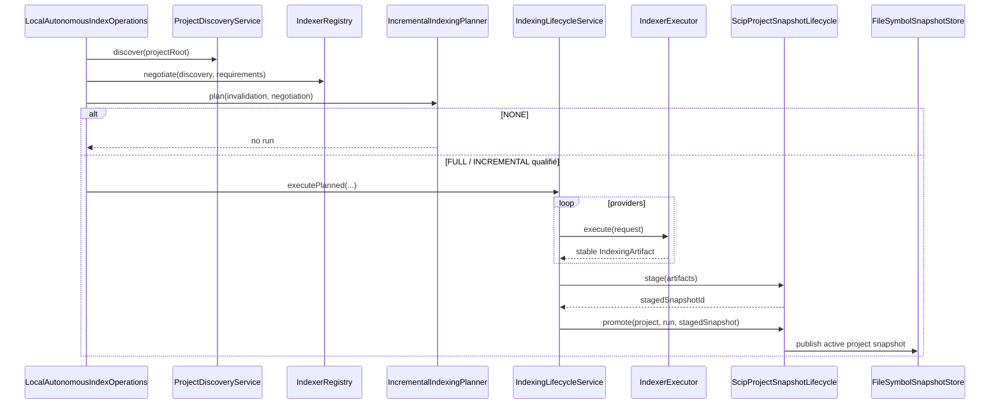
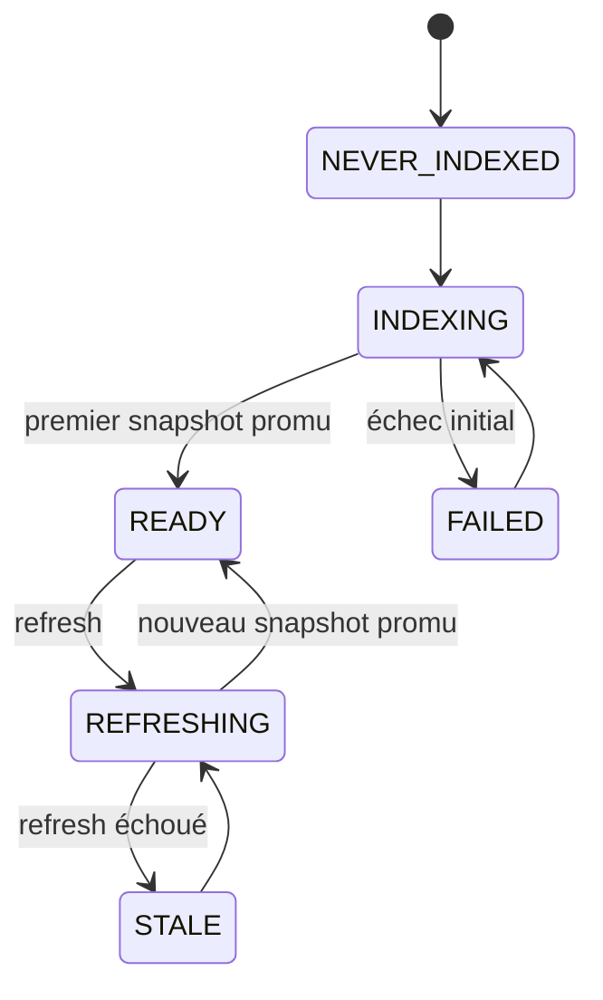

# Indexation, lifecycle et stockage

M14 relie désormais le lifecycle interne historique à une exécution réelle de providers.

## Parcours autonome



Le chemin manuel M9 reste disponible séparément via `import-scip`.

## Discovery et négociation

`ProjectDiscoveryService` détecte langages, build systems et modules.

`IndexerRegistry` reste fournisseur-indépendant et choisit un provider uniquement si :

- le langage est supporté ;
- le build est compatible avec la qualification ;
- les capacités demandées sont présentes ;
- le niveau de qualification est admissible ;
- la priorité déterministe le place devant les autres candidats compatibles.

Un override CLI `--provider` réduit le catalogue considéré ; il ne contourne pas les contraintes de qualification.

## Runtime providers M14

Le runtime est séparé de l'orchestration :

```text
IndexerRegistry        = sait quel provider choisir
ProviderRuntimeManager = sait si son runtime est disponible/installable
IndexerExecutor        = sait exécuter un provider choisi
```

`ProcessIndexerExecutor` ne connaît aucun type SCIP. Il reçoit un `IndexerProcessPlan` construit par l'adapter provider.

Responsabilités génériques :

- working directory explicite ;
- arguments sans shell implicite ;
- adaptation `.cmd/.bat` Windows via `cmd.exe` lorsque nécessaire ;
- environnement contrôlé ;
- timeout ;
- stdout/stderr capturés ;
- destruction du process tree en cas de timeout ;
- préservation d'un artefact préexistant dans le projet ;
- copie du nouvel artefact sous `<MINOS_HOME>/runs/<runId>/<provider>/` ;
- métadonnées d'exécution et masquage minimal des arguments sensibles.

## Providers SCIP gérés

### TypeScript

Le runtime géré installe `@sourcegraph/scip-typescript` sous `MINOS_HOME/tools` sans modifier le PATH global.

MINOS exige `node`/`npm` mais ne lance jamais automatiquement l'installation des dépendances métier du projet.

### Java

Le runtime géré utilise Coursier pour lancer la version de `scip-java` verrouillée par M14.

Le projet doit fournir son JDK via `JAVA_HOME` et appartenir au périmètre de build qualifié. M14 ne transforme pas le runtime Java embarqué de MINOS en JDK du projet.

## Lifecycle d'un projet



- `NEVER_INDEXED` : aucune connaissance active ;
- `INDEXING` : premier run en cours ;
- `REFRESHING` : refresh avec ancien snapshot encore actif ;
- `READY` : snapshot actif valide ;
- `STALE` : refresh échoué, ancien snapshot conservé ;
- `FAILED` : aucun snapshot utilisable après échec initial.

`FileIndexStateStore` rend ces états et les runs persistants entre processus CLI.

## États d'un run

```text
Status: RUNNING | SUCCEEDED | FAILED
Phase : PROVIDER_EXECUTION | STAGING | PROMOTION | COMPLETED
```

Un run `SUCCEEDED` est `COMPLETED` et possède un `activeSnapshotAfter`.

## Staging M14

Le chemin d'import direct historique :

```text
SCIP -> normalize -> active store
```

n'est plus utilisé par le parcours autonome.

Le parcours M14 est :

```text
artifact provider A ─┐
artifact provider B ─┼→ normalisation temporaire
                     ↓
            faits providers normalisés
                     ↓
            assemblage snapshot projet
                     ↓
                 staging
                     ↓
             promotion atomique
                     ↓
               active store
```

`ScipProjectSnapshotLifecycle` normalise chaque artefact dans un store temporaire. Les collisions d'identifiants sont rejetées explicitement ; aucune fusion implicite contradictoire n'est effectuée.

## Promotion atomique

La règle ADR-0006 reste inchangée : **aucun nouveau snapshot n'est annoncé actif tant que tous les providers, le staging et la promotion n'ont pas réussi**.

En cas d'échec de refresh, l'ancien snapshot reste actif et l'état devient `STALE`.

## Fingerprints et indexation incrémentale

Le planner M7 reste source de vérité :

```text
NONE
FULL
INCREMENTAL
```

`INCREMENTAL` n'est permis que si tous les providers sélectionnés déclarent explicitement la capacité qualifiée.

Pour les runtimes M14 initiaux, cette capacité n'est pas revendiquée. Le comportement conservateur est donc :

```text
aucun changement -> NONE
changement       -> FULL
```

Le fingerprint n'est promu qu'après succès du run et si le workspace n'a pas changé pendant l'indexation.

## CLI

Parcours normal :

```text
minos index <project>
minos index <project> --dry-run
minos index <project> --force-full
```

Parcours de diagnostic/compatibilité :

```text
minos import-scip <project> --file <index.scip> --provider <id>
```

`index --scip` reste temporairement accepté avec warning de dépréciation.

## Stockage M14

Selon les fonctionnalités utilisées :

```text
<MINOS_HOME>/
├── registry/
├── symbol-snapshots/
├── fingerprint-snapshots/
├── index-state/
├── staged-snapshots/
├── runs/
└── tools/
```

Le code de requête dépend uniquement du snapshot MINOS actif, jamais du fichier SCIP brut.

## Cohérence concurrente

`IndexingLifecycleService` sérialise les runs par projet dans une instance : un projet déjà `INDEXING` ou `REFRESHING` ne peut pas démarrer un second run concurrent.

Le store persistant rend l'état observable entre processus. Une protection inter-processus stricte par verrou OS n'est pas ajoutée par M14 ; l'exploitation normale doit éviter deux commandes d'indexation concurrentes sur le même projet.

## Ajouter un provider

1. déclarer un `IndexerDescriptor` et ses capacités réellement prouvées ;
2. adapter/normaliser son format sans faire fuiter ses types dans `orchestration` ;
3. fournir un diagnostic/runtime géré ou externe ;
4. construire son `IndexerProcessPlan` ;
5. qualifier FULL et INCREMENTAL séparément ;
6. produire une fixture et un replay réel ;
7. conserver staging et promotion projet atomique.
