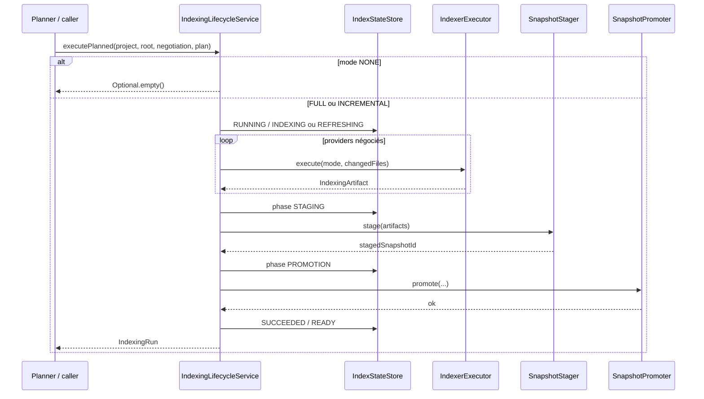
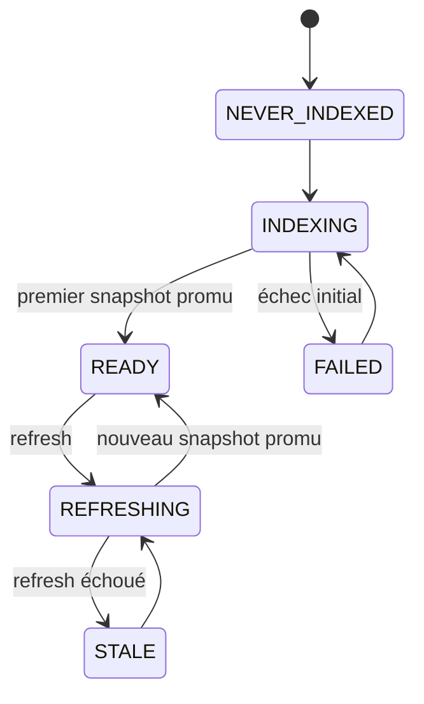
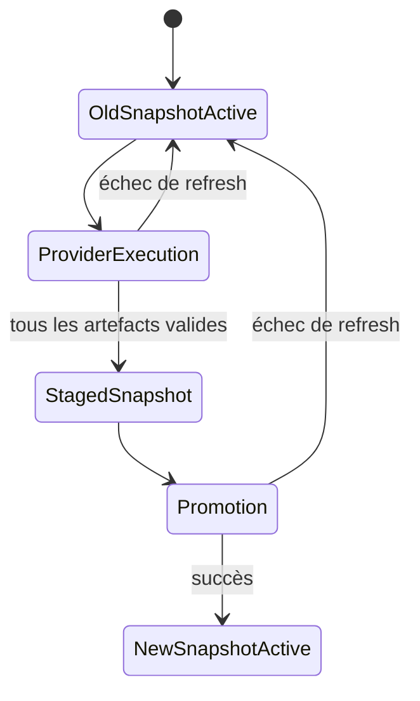

# Indexation, lifecycle et stockage

Cette partie distingue deux chemins :

1. le **lifecycle interne** d’orchestration, capable de gérer FULL/INCREMENTAL, staging et promotion ;
2. la **CLI stable**, qui importe explicitement un artefact SCIP déjà généré.

## Lifecycle interne

`IndexingLifecycleService` orchestre un run projet et ne rend un nouveau snapshot actif qu’après promotion.



## États d’un projet



### Sémantique

- `NEVER_INDEXED` : aucune indexation terminée ;
- `INDEXING` : premier run en cours ;
- `REFRESHING` : nouveau run en cours avec snapshot actif précédent ;
- `READY` : snapshot actif valide ;
- `STALE` : refresh échoué, ancien snapshot toujours actif ;
- `FAILED` : échec sans snapshot actif utilisable.

`STALE` est un choix important : une erreur de refresh ne rend pas automatiquement indisponible la connaissance précédente.

## États d’un run

`IndexingRun.Status` :

```text
RUNNING
SUCCEEDED
FAILED
```

`IndexingRun.Phase` :

```text
PROVIDER_EXECUTION
STAGING
PROMOTION
COMPLETED
```

Un run `SUCCEEDED` doit être en phase `COMPLETED` et posséder un `activeSnapshotAfter`.

## Promotion atomique

La règle est : **les providers doivent réussir, le snapshot doit être stagé, puis promu avant d’être annoncé comme actif**.



Le but est d’éviter qu’une requête lise un mélange de données anciennes et nouvelles.

## Indexation incrémentale M7

Le planner peut produire :

```text
NONE
FULL
INCREMENTAL
```

`NONE` ne démarre aucun run. `INCREMENTAL` n’est utilisable que lorsque la capacité fournisseur a été qualifiée ; sinon le système doit retomber sur une portée complète conservatrice.

Les fingerprints servent à détecter les changements du projet et du build. La logique d’invalidation ne doit pas prétendre qu’une modification locale est indépendante lorsque cette indépendance n’est pas prouvée.

## CLI `index`

La CLI M9 ne passe pas par un runner universel de fournisseurs. Son contrat est explicite :

```text
minos index <project> --scip <index.scip> --provider <id>
```

Elle :

1. résout le projet ;
2. lit l’artefact SCIP fourni ;
3. normalise symboles/occurrences/relations ;
4. publie le snapshot MINOS ;
5. retourne les compteurs d’import.

Cette frontière évite d’affirmer qu’un exécuteur `scip-java` ou `scip-typescript` existe lorsqu’il n’est pas fourni par le runtime.

## Stockage

Le bootstrap local utilise notamment :

```text
<MINOS_HOME>/registry
<MINOS_HOME>/symbol-snapshots
```

Les stores de snapshots offrent une vue persistante et un pointeur de snapshot actif.

Le code de requête ne doit pas dépendre du fichier SCIP brut une fois le snapshot publié.

## Cohérence concurrente

`IndexingLifecycleService` sérialise les runs par projet. Un projet déjà `INDEXING` ou `REFRESHING` ne peut pas démarrer un second run concurrent dans le même service.

## Ajouter un nouveau type de stockage

Conserver les invariants :

- promotion atomique ;
- snapshot actif identifiable ;
- lecture cohérente ;
- pas de type fournisseur dans le contrat du store ;
- capacité à distinguer staging et actif ;
- erreurs d’I/O propagées sans transformer un échec en succès partiel.

## Ajouter un nouveau provider

Le provider doit rester derrière les ports d’orchestration. Les étapes recommandées sont :

1. adapter le format externe ;
2. produire les modèles MINOS normalisés ;
3. déclarer les capacités ;
4. qualifier FULL/INCREMENTAL séparément ;
5. brancher l’exécution derrière `IndexerExecutor` si un runner existe ;
6. ajouter une fixture réelle et un replay.
