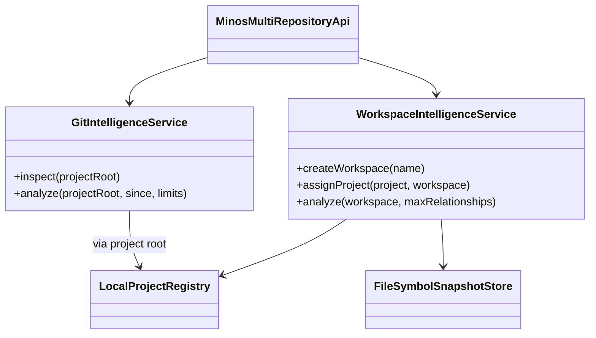
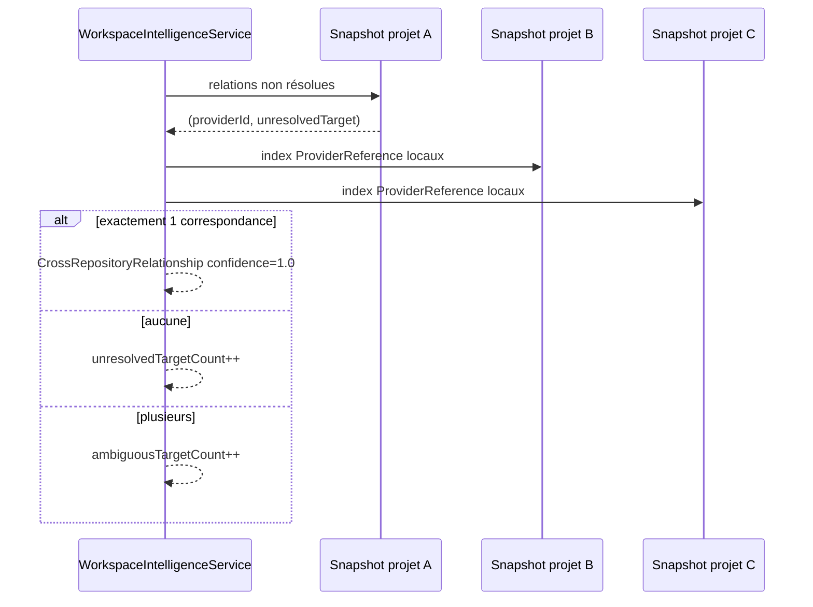

# Multi-dépôts et intelligence Git

M12 ajoute deux capacités distinctes :

1. des workspaces regroupant plusieurs projets MINOS ;
2. des faits Git locaux lus en Java pur avec JGit.

Ces capacités restent séparées des métriques d’architecture : une zone très modifiée n’est pas automatiquement un module important.

## Vue UML



## Workspaces

Un workspace associe plusieurs projets enregistrés. Il ne fusionne pas leurs snapshots : chaque projet conserve son propre snapshot actif.

L’analyse workspace construit une **vue dérivée** des relations inter-dépôts.

## Résolution cross-repository

La résolution est volontairement stricte.

Pour une relation non résolue du projet A, MINOS utilise :

```text
relationship.origin.providerId
relationship.unresolvedTarget
```

et cherche dans les symboles locaux des autres projets du même workspace une référence :

```text
symbol.providerReference.providerId
symbol.providerReference.externalId
```

La promotion n’a lieu que si la correspondance est exacte et unique.



### Ce qui n’est pas utilisé comme preuve

MINOS ne résout pas automatiquement une relation cross-repository avec :

- le simple `name` ;
- le `qualifiedName` seul ;
- une ressemblance de chemin ;
- la fréquence Git ;
- une heuristique de proximité.

`resolutionBasis` vaut `EXACT_PROVIDER_REFERENCE` pour les relations promues.

## GitIntelligenceService

M12 utilise Eclipse JGit ; le cœur n’a pas besoin d’exécuter `git.exe` pour analyser le dépôt.

Informations de repository :

```text
repositoryId
workTree
originRemote (sanitisé)
branch
headCommit
detachedHead
shallow
clean
limitations
```

## Historique borné

Bornes internes/publics principales :

```text
max commits  10000
max files    10000
zone depth   8
```

Un historique dépassant les bornes est signalé comme tronqué plutôt que présenté comme exhaustif.

## Activité par fichier

La vue fichier expose notamment :

```text
path
commitCount
uniqueAuthorCount
lastChangedAt
lastCommitId
```

Ce sont des faits d’activité observée, pas un score de criticité.

## Activité par zone

Une zone correspond à un préfixe de répertoire borné par `zoneDepth`. Les fichiers à la racine utilisent une zone dédiée.

La vue permet d’identifier où se concentre l’activité récente sans conclure automatiquement que cette zone est architecturalement centrale.

## Commits et merges

Le service analyse les chemins modifiés par commit. Les merges sont comparés au premier parent ; le commit racine est comparé à un arbre vide.

## Remote

Le remote public est sanitisé avant exposition : informations d’authentification et éléments sensibles de l’URL ne doivent pas être renvoyés dans les DTOs.

## Limitations explicites

Exemples Git :

```text
NO_ORIGIN_REMOTE
DETACHED_HEAD
SHALLOW_HISTORY
UNBORN_HEAD
HISTORY_TRUNCATED
FILES_TRUNCATED
```

Exemples workspace :

```text
PROJECT_WITHOUT_ACTIVE_SNAPSHOT
AMBIGUOUS_PROVIDER_IDENTITY
UNRESOLVED_CROSS_REPOSITORY_TARGETS
RELATIONSHIPS_TRUNCATED
```

## API publique

`MinosMultiRepositoryApi` expose ces vues sans JGit dans ses signatures. Aucun type `org.eclipse.jgit` ne doit traverser le contrat public.
