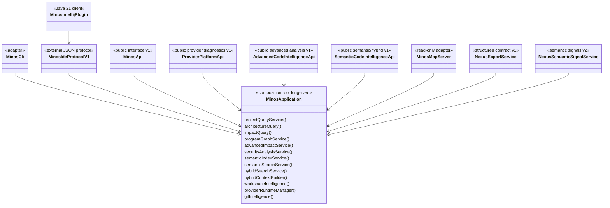

# Surfaces publiques : CLI, API Java, MCP, IntelliJ et NEXUS

MINOS expose un même cœur métier par plusieurs adapters. Une capacité n'est jamais réimplémentée différemment pour chaque transport.

Les facts mécaniquement calculables — version, catalogue MCP, commandes CLI, formats et providers — sont générés depuis le code dans [`../generated/product-facts.md`](../generated/product-facts.md). Cette page décrit les responsabilités et invariants.

## Composition partagée



`MinosApplication` est la composition locale partagée d'un `MINOS_HOME`. Les stores, caches, runtimes provider et services ne doivent pas être reconstruits par les transports.

## Couches d'intelligence

```text
snapshot structuré MINOS
   ├── symboles / relations / architecture / Git
   ├── ProgramGraph M19
   │      ├── Impact v2
   │      └── Security paths
   └── SemanticDocument M20
          ↓ EmbeddingProvider optionnel
      SemanticVectorStore reconstruisible
          ├── SemanticSearch
          ├── HybridSearch
          └── HybridContext
```

Le snapshot structuré reste autoritatif. `ProgramGraph` est une vue reconstructible capability-honest. L'index vectoriel M20 est également reconstructible et ne devient jamais une seconde base de facts.

## CLI

`MinosCli` reste le dispatcher administratif et utilisateur. Le protocole `minos-ide` constitue l'adapter processus externe explicitement réservé aux clients IDE.

Administration :

```text
doctor
tools list / install / verify
providers [provider-id]
project add / list / inspect
index <project>
import-scip <project> ...
```

Intégration IDE :

```text
ide handshake
ide program-graph
ide impact-v2
ide security-paths
ide semantic-index-status
ide semantic-index-sync
ide semantic-search
ide hybrid-search
ide hybrid-context
git-activity <project>
```

Codes de sortie stables :

```text
0 success
1 execution failure / diagnostic action required
2 usage error
```

### Activation sémantique native M20

La baseline reste désactivée :

```text
MINOS_SEMANTIC_PROVIDER absent → structured/hybrid fallback uniquement
```

Activation locale explicite du provider de référence :

```text
MINOS_SEMANTIC_PROVIDER=local-hash
```

`local-hash` est un provider local de référence, pas un language model. Avec ce provider activé, `minos index` peut synchroniser l'index sémantique après la promotion structurée. Une erreur de refresh sémantique n'annule pas un snapshot structuré déjà publié avec succès.

## IntelliJ — protocole `minos-ide` v1

Le plugin `minos-intellij/` reste un client Java 21 externe du runtime MINOS Java 24. Il n'embarque aucune classe métier `com.minos:*`.

```text
IntelliJ plugin Java 21
   ↓ processus local JSON
minos-ide v1
   ↓
MinosApplication Java 24
```

Le PSI sert uniquement à identifier le contexte sous le caret ; les facts finaux viennent du snapshot/services MINOS. Les positions suivent le contrat ligne base 1, colonne base 0 et encodage explicite UTF-8/16/32/UNKNOWN.

M21-S6 étend le handshake v1 **sans rupture**. Les nouvelles opérations sont négociées par capabilities :

```text
program-graph
impact-v2
security-paths
semantic-index-status
semantic-index-sync
semantic-search
hybrid-search
hybrid-context
```

Le serveur IDE (`IdeIntelligenceCommand`) ne contient que parsing, bornes et projection JSON. Il délègue directement à :

```text
ProgramGraphService
AdvancedImpactService
SecurityAnalysisService
SemanticIndexService
SemanticSearchService
HybridSearchService
HybridContextBuilder
```

Le client IntelliJ vérifie la capability avant chaque nouvelle action. Un runtime plus ancien ne reçoit donc pas une réponse reconstituée ou approximative : l'action est refusée explicitement.

### Surfaces natives S6

```text
Advanced Intelligence
  Program Graph
  Impact v2
  Security paths

Semantic & Hybrid
  Semantic index status
  Semantic index sync
  Semantic search
  Hybrid search
  Hybrid context
```

L'Impact M8 historique reste exposé comme **baseline**. Impact v2 est additif.

Invariants UX :

- le plugin ne produit aucune arête de Program Graph ;
- les security paths restent des chemins statiques observés et bornés ; absence de chemin ≠ preuve de sûreté ;
- le score sémantique reste `HEURISTIC` ;
- les signaux lexical/graph restent `DERIVED` ;
- le ranking hybride est une décision de sélection, pas un fact structurel ;
- si le sémantique est indisponible, le fallback structuré est explicite ;
- un document sémantique sans colonne exacte ne reçoit pas de colonne inventée par le plugin.

### Compatibilité IntelliJ

Le plugin reste Java 21 et annonce `sinceBuild=261`, correspondant à IntelliJ Platform 2026.1. La qualification S6 demande au Plugin Verifier de tester la distribution courante et les releases stables de la branche `261` résolues par le plugin Gradle JetBrains. Aucun support 2025.x n'est revendiqué sans qualification dédiée.

## API Java

### `MinosApi` v1

Contrat historique fournisseur-indépendant M11/M12. Il reste en version `1` et n'expose ni SCIP, ni les stores, ni MCP.

### `ProviderPlatformApi` v1

Contrat additif M17 : providers, versions, écosystèmes, profils de capabilities, conformance et diagnostics runtime.

### `AdvancedCodeIntelligenceApi` v1

Contrat additif M19 :

```java
ProgramGraphDto getProgramGraph(...)
AdvancedImpactDto analyzeImpactV2(...)
SecurityReportDto analyzeSecurityPaths(...)
```

Les capabilities, natures, confiances, preuves et limitations restent explicites et les traversées sont bornées.

### `SemanticCodeIntelligenceApi` v1

Contrat additif M20 :

```java
SemanticIndexStatusDto getSemanticIndexStatus(String project)
SemanticIndexUpdateDto synchronizeSemanticIndex(String project)
SemanticSearchDto semanticSearch(String project, SemanticQuery query)
HybridSearchDto hybridSearch(String project, HybridQuery query)
HybridContextDto buildHybridContext(String project, ContextQuery query)
```

La synchronisation d'index est explicite sur l'API administrative Java. Les recherches ne déclenchent pas de mutation cachée.

```text
semantic score        → HEURISTIC
lexical/graph signal  → DERIVED
hybrid score          → décision de ranking, pas fact structurel
```

## MCP

MCP reste **strictement read-only**. Il n'expose pas `project add`, `tools install`, `index`, `import-scip` ni la synchronisation vectorielle mutante.

Chemin d'appel :

```text
MCP tool
  ↓ validation/schema
MinosApplicationMcpBackend
  ↓
service typé MinosApplication
  ↓
renderer JSON déterministe
```

Catalogue courant : **23 tools**.

M19 :

```text
minos_program_graph
minos_impact_v2
minos_security_paths
```

M20 :

```text
minos_semantic_index_status
minos_semantic_search
minos_hybrid_search
minos_hybrid_context
```

`minos_semantic_index_status` expose `DISABLED/MISSING/STALE/READY`, snapshot, provider/modèle, dimensions, nombre de documents, taille disque et limitations.

`minos_semantic_search` retourne des hits `HEURISTIC` et la limitation contractuelle `VECTOR_SCORE_IS_RANKING_SIGNAL_NOT_STRUCTURAL_FACT`.

`minos_hybrid_search` retourne chaque composante du ranking. Sans index sémantique READY, le fallback lexical+graph reste utilisable et l'absence du signal est explicite.

`minos_hybrid_context` respecte les mêmes bornes de documents/tokens que `HybridContextBuilder` et expose les troncatures.

## NEXUS

### Contrat structuré v1

`NexusExportService` projette le snapshot actif vers le contrat JSON historique M13. M20 ne modifie pas ce contrat implicitement.

### Signaux sémantiques v2

`NexusSemanticSignalService` fournit des candidats **code-local** :

```text
stableKey
kind / source / location
localRankingScore
rankingMode
signals[] { type, score, nature }
limitations
```

Frontière de responsabilité :

```text
MINOS → facts de code + retrieval/ranking local au code
NEXUS → ranking global multi-source + sélection finale + budget global de contexte
```

Les limitations `NEXUS_GLOBAL_RANKING_NOT_PERFORMED_BY_MINOS` et `NEXUS_MULTI_SOURCE_CONTEXT_BUDGET_NOT_OWNED_BY_MINOS` empêchent l'ambiguïté contractuelle.

## Runtime natif vs Docker

ADR-0021 reste valable :

```text
runtime natif = administration + providers + CLI + MCP local + IDE + sémantique opt-in
Docker MCP    = consommation read-only durcie optionnelle
```

Un backend sémantique ne doit pas casser la séparation des chemins hôte/conteneur ni rendre Docker obligatoire.

## Ajouter un nouvel écosystème M17+

1. ajouter les détecteurs SPI nécessaires ;
2. déclarer un `IndexerProvider` avec profil exhaustif ;
3. ajouter le runtime derrière `ProviderRuntimeManager` si nécessaire ;
4. exécuter `ProviderConformanceKit` ;
5. versionner une fixture ;
6. qualifier discovery, runtime, snapshot et requêtes ;
7. exposer les limitations sans inventer de capacité.

Discovery et support runtime restent deux facts distincts.

## Ajouter une capability de graphe M19+

1. implémenter `ProgramGraphProvider` ;
2. déclarer uniquement les capabilities prouvées ;
3. fournir identités/nature/provenance/preuves ;
4. ajouter une vérité terrain et des métriques ;
5. garder les limitations dynamiques explicites ;
6. laisser le composer rejeter les collisions incohérentes.

## Ajouter un provider d'embeddings M20+

1. implémenter `EmbeddingProvider` ;
2. donner un `id`, `modelId` et nombre de dimensions stables ;
3. rester local-first ou documenter explicitement toute frontière externe avant intégration ;
4. ne jamais promouvoir le score en fact structurel ;
5. qualifier Recall@K/MRR/nDCG@K sur un ground truth ;
6. mesurer latence, coût de rebuild et taille ;
7. vérifier le rebuild lors d'un changement de modèle ;
8. conserver le produit fonctionnel si le provider est absent.

## Ajouter un backend vectoriel M20+

Un backend remplaçant `FileSemanticVectorStore` doit implémenter `SemanticVectorStore`, conserver snapshot/provider/model/dimensions et rester intégralement reconstruisible. Un ANN ou moteur externe n'est justifié que par des mesures reproductibles, conformément à ADR-0025.

## Ajouter une nouvelle surface

1. réutiliser `MinosApplication` ;
2. définir des DTOs/serialisations externes propres ;
3. imposer les mêmes bornes ;
4. conserver nature/provenance/limitations ;
5. ne pas déplacer le métier vers le transport ;
6. choisir explicitement read-only vs administratif ;
7. tester l'absence de fuite des types internes.

## Qualité et cohérence

- tests API : contrats historiques + M19 + M20 ;
- tests MCP : 23 tools, schemas/bornes, mappings, erreurs récupérables ;
- tests M19 : ground truths graphes/flux/sécurité ;
- tests M20 : optionnalité, vector store, Recall@K/MRR/nDCG, gain hybride, budgets, invalidation incrémentale, NEXUS v2 ;
- IntelliJ S6 : `scripts/intellij/check-m21-parity.py` + replay du gate M18 et Plugin Verifier branche 261 ;
- facts générés : `scripts/docs/product-facts.py --check` ;
- qualité : `scripts/quality/check-jacoco.py` ;
- qualification courante M21 : `scripts/m21/run-local.ps1` / `run-s6.ps1`.

Voir aussi [Intelligence sémantique et hybride — M20](semantic-hybrid-intelligence.md), [Plugin IntelliJ](../user/intellij-plugin.md) et [ADR-0029](../adr/0029-optional-rebuildable-semantic-layer-and-hybrid-ranking.md).
