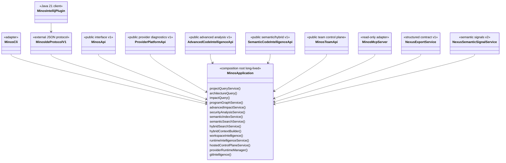

# Surfaces publiques : CLI, API Java, MCP, IntelliJ et NEXUS

MINOS expose un même cœur métier par plusieurs adapters. Une capacité n’est jamais réimplémentée différemment pour chaque transport.

Les facts mécaniquement calculables — version, catalogue MCP, commandes CLI, formats et providers — sont générés depuis le code dans [`../generated/product-facts.md`](../generated/product-facts.md). Cette page décrit les responsabilités et invariants.

## Composition partagée



`MinosApplication` est la composition locale partagée d’un `MINOS_HOME`. Les stores, caches, runtimes provider et services ne doivent pas être reconstruits par les transports.

La composition de production du `ProgramGraph` inclut le provider de relations, le provider Java avancé M22 et les sidecars fichiers. Les contract tests doivent partir de `MinosApplication.open()` afin d’empêcher qu’un provider qualifié isolément soit absent du produit livré.

## Couches d’intelligence

```text
snapshot structuré MINOS
   ├── symboles / relations / architecture / Git
   ├── ProgramGraph M19/M22
   │      ├── Impact v2
   │      └── Security paths
   ├── SemanticDocument M20/M23
   │      ↓ EmbeddingProvider optionnel
   │  SemanticVectorStore reconstruisible
   │      ├── SemanticSearch
   │      ├── HybridSearch
   │      └── HybridContext
   └── corrélations runtime M26
          └── OBSERVED_PARTIAL, jamais exhaustif
```

Le snapshot structuré reste autoritatif. `ProgramGraph` est une vue reconstructible capability-honest. L’index vectoriel est reconstructible. Les observations runtime ne mutent pas les facts statiques.

## CLI

`MinosCli` reste le dispatcher administratif et utilisateur. Le protocole `minos-ide` constitue l’adapter processus externe réservé aux clients IDE.

Administration :

```text
doctor
tools list / install / verify
providers [provider-id]
project add / list / inspect
index <project>
import-scip <project> ...
remote ...
runtime ...
team ...
```

Intégration IDE :

```text
ide handshake
ide program-graph
ide impact-v2
ide security-paths
ide semantic-index-status
ide semantic-index-sync
ide semantic-search
ide hybrid-search
ide hybrid-context
git-activity <project>
```

Codes de sortie stables :

```text
0 success
1 execution failure / diagnostic action required
2 usage error
```

Les mutations restent explicites : une recherche ou une lecture ne déclenche ni indexation, ni import runtime, ni mutation team cachée.

## IntelliJ — protocole `minos-ide` v1

Le plugin `minos-intellij/` reste un client Java 21 externe du runtime MINOS Java 24. Il n’embarque aucune classe métier `com.minos:*`.

```text
IntelliJ plugin Java 21
   ↓ processus local JSON
minos-ide v1
   ↓
MinosApplication Java 24
```

Le PSI sert uniquement à identifier le contexte sous le caret ; les facts finaux viennent du snapshot et des services MINOS. Les positions suivent le contrat ligne base 1, colonne base 0 et encodage explicite UTF-8/16/32/UNKNOWN.

Opérations additives négociées par capabilities :

```text
program-graph
impact-v2
security-paths
semantic-index-status
semantic-index-sync
semantic-search
hybrid-search
hybrid-context
```

Le serveur IDE délègue à `ProgramGraphService`, `AdvancedImpactService`, `SecurityAnalysisService`, `SemanticIndexService`, `SemanticSearchService`, `HybridSearchService` et `HybridContextBuilder`. Le plugin ne produit aucune arête lui-même.

La compatibilité reste qualifiée avec **Plugin Verifier** sur les IDE cibles de la branche 261 ; aucun support d’une autre branche IntelliJ n’est revendiqué sans preuve dédiée.

Invariants UX :

- absence de security path ≠ preuve de sûreté ;
- score sémantique = `HEURISTIC` ;
- signaux lexical/graph = `DERIVED` ;
- ranking hybride = décision de sélection, pas fact structurel ;
- fallback structuré explicite si le sémantique est indisponible ;
- aucune colonne de source inventée.

## API Java

### `MinosApi` v1

Contrat historique fournisseur-indépendant M11/M12. Il n’expose ni SCIP, ni les stores, ni MCP.

Les extensions restent additives (`default methods`) : `getArchitectureGraph(...)`, `team()` et `importScipOutcome(...)`. Cette dernière restitue le `commitStatus` de l'import (`COMMITTED`, durabilité et/ou métadonnées en attente) et un diagnostic assaini, faits que `IndexImportDto` ne portait pas ; `importScip(...)` conserve son contrat exact et `CONTRACT_VERSION` reste `1`.

Une façade qui étend `MinosApi` doit **redéléguer** chaque opération plutôt qu'hériter d'un `default` : un `default` conçu pour une implémentation tierce répondrait `UNAVAILABLE` pour une capacité que l'application possède. L'invariant est vérifié par réflexion sur `LocalMinosMultiRepositoryApi`, sans liste de méthodes maintenue à la main.

Un argument `null` fourni par un appelant est classé `INVALID_REQUEST` par validation à la frontière publique (`MinosApiSupport.required`) — jamais par capture de `NullPointerException` dans `execute()`, qui présenterait un défaut interne de MINOS comme une erreur du client.

### `ProviderPlatformApi` v1

Contrat additif M17 : providers, versions, écosystèmes, profiles de capabilities, conformance et diagnostics runtime.

### `AdvancedCodeIntelligenceApi` v1

```java
ProgramGraphDto getProgramGraph(...)
AdvancedImpactDto analyzeImpactV2(...)
SecurityReportDto analyzeSecurityPaths(...)
```

Capabilities, natures, confiances, preuves et limitations restent explicites. Les traversées sont bornées.

### `SemanticCodeIntelligenceApi` v1

```java
SemanticIndexStatusDto getSemanticIndexStatus(String project)
SemanticIndexUpdateDto synchronizeSemanticIndex(String project)
SemanticSearchDto semanticSearch(String project, SemanticQuery query)
HybridSearchDto hybridSearch(String project, HybridQuery query)
HybridContextDto buildHybridContext(String project, ContextQuery query)
```

La synchronisation est administrative et explicite. Les recherches ne déclenchent pas de mutation cachée.

### `MinosTeamApi`

Le contrôle team/tenant M27 est opt-in. Il expose workspaces, membres, bindings exact-snapshot, tokens, rétention, rotation et audit derrière authentification et RBAC fail-closed. Il ne constitue pas à lui seul un SaaS opéré : IdP, KMS, TLS, isolation processus, sauvegarde et disponibilité restent des frontières opérateur.

## MCP

MCP reste **strictement read-only**. Il n’expose pas `project add`, `tools install`, `index`, `import-scip`, l’import runtime, la synchronisation vectorielle mutante ni les mutations team.

Chemin d’appel :

```text
MCP tool
  ↓ validation/schema
MinosApplicationMcpBackend
  ↓
service typé MinosApplication
  ↓
renderer JSON déterministe
```

Catalogue courant : **31 tools**.

### M19 — intelligence avancée

```text
minos_program_graph
minos_impact_v2
minos_security_paths
```

### M20/M23 — sémantique et hybride

```text
minos_semantic_index_status
minos_semantic_search
minos_hybrid_search
minos_hybrid_context
```

### M26 — runtime et dynamique

```text
minos_runtime_sessions
minos_runtime_report
minos_runtime_symbol
```

Chaque réponse runtime porte `OBSERVED_PARTIAL`, `exhaustive: false`, l’identité du snapshot et les limitations d’absence. L’absence d’observation ne prouve jamais la non-exécution.

### M27 — team / hosted control plane

```text
minos_team_tenant
minos_team_workspaces
minos_team_workspace
minos_team_members
minos_team_audit
```

Les tools team lisent `MINOS_TEAM_TOKEN` depuis le processus et n’acceptent aucun credential dans leurs arguments. Les mutations team restent des actions CLI/API explicites.

## NEXUS

`NexusExportService` projette le snapshot actif vers le contrat structuré v1. `NexusSemanticSignalService` fournit des candidats code-local avec score, nature et limitations.

```text
MINOS → facts de code + retrieval/ranking local au code
NEXUS → ranking global multi-source + sélection finale + budget global de contexte
```

Les limitations `NEXUS_GLOBAL_RANKING_NOT_PERFORMED_BY_MINOS` et `NEXUS_MULTI_SOURCE_CONTEXT_BUDGET_NOT_OWNED_BY_MINOS` empêchent l’ambiguïté contractuelle.

## Runtime natif, remote et hosted

```text
runtime natif = administration + providers + CLI + MCP local + IDE + sémantique opt-in
worker remote = workspace éphémère + provenance/bundle vérifiés + sandbox backend explicite
hosted M27    = contrôle tenant embarqué opt-in, pas SaaS opéré complet
Docker MCP    = consommation read-only durcie optionnelle
```

Un workspace éphémère n’est pas présenté comme sandbox OS. La politique réseau `DENY` reste fail-closed tant qu’un backend qualifié Windows/Linux ne prouve pas son enforcement.

## Ajouter un provider ou une capability

1. implémenter le SPI approprié ;
2. déclarer uniquement les capabilities prouvées ;
3. fournir identités, nature, provenance et preuves ;
4. ajouter fixture et ground truth ;
5. qualifier discovery, runtime, snapshot et surfaces publiques ;
6. exposer toutes les limitations ;
7. ajouter un test vertical depuis `MinosApplication.open()` lorsque le claim concerne le produit livré.

## Ajouter un backend vectoriel

Un backend remplaçant `FileSemanticVectorStore` doit implémenter `SemanticVectorStore`, conserver snapshot/provider/model/dimensions et rester intégralement reconstruisible. Un ANN ou moteur externe n’est justifié que par des mesures reproductibles, conformément à ADR-0025 et `KEEP_CURRENT_M20_BACKEND`.

## Ajouter une nouvelle surface

1. réutiliser `MinosApplication` ;
2. définir des DTO/serialisations externes propres ;
3. imposer les mêmes bornes ;
4. conserver nature/provenance/limitations ;
5. ne pas déplacer le métier vers le transport ;
6. choisir explicitement read-only vs administratif ;
7. tester l’absence de fuite des types internes ;
8. ajouter une preuve verticale de composition.

## Qualité et cohérence

- tests composition root : provider wiring et capabilities depuis `MinosApplication.open()` ;
- tests API/MCP/IDE : mappings, bornes, erreurs et provenance ;
- tests M19/M22 : graphes, CFG, def-use, flux interprocéduraux et sécurité ;
- tests M20/M23 : vector store, Recall@K/MRR/nDCG, fallback, budgets et invalidation ;
- tests M25 : confinement, provenance, artefact, sandbox backend et `DENY` fail-closed ;
- tests M26 : format strict, corrélation et caractère partiel ;
- tests M27 : RBAC, isolation tenant, tampering, rotation, rétention et audit HMAC ;
- facts générés : `scripts/docs/product-facts.py --check` ;
- architecture : `scripts/architecture/check-module-boundaries.py` ;
- qualité : `scripts/quality/check-jacoco.py`.

Voir aussi [Intelligence sémantique et hybride — M20](semantic-hybrid-intelligence.md), [Plugin IntelliJ](../user/intellij-plugin.md), [Team / Hosted](team-hosted-mode.md) et [ADR-0029](../adr/0029-optional-rebuildable-semantic-layer-and-hybrid-ranking.md).
