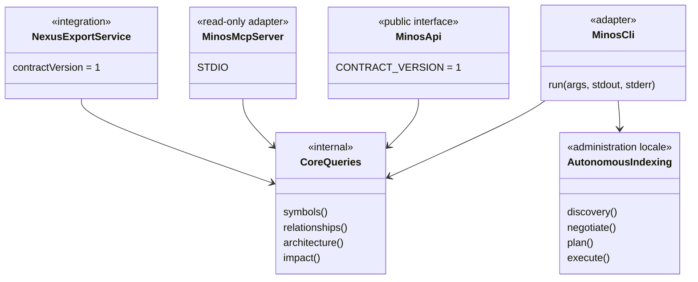
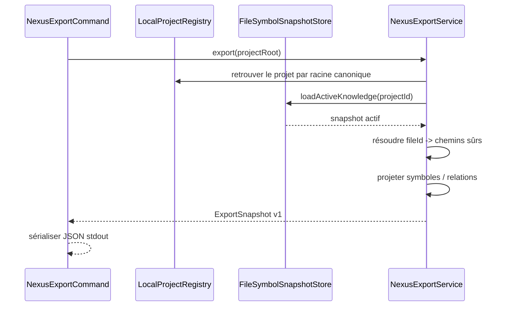

# Surfaces publiques : CLI, API Java, MCP et NEXUS

MINOS expose le même cœur métier par plusieurs adapters. Une fonctionnalité ne doit pas être réimplémentée différemment dans chaque transport.

## Relations entre surfaces



## CLI

`MinosCli` reste le dispatcher de commandes.

M14 ajoute une surface d'administration locale dédiée :

```text
doctor
tools list / install / verify
index <project>
import-scip <project> ...
```

`LocalAutonomousIndexOperations` coordonne discovery, négociation, fingerprints et lifecycle existants ; la CLI ne contient pas elle-même la logique provider.

### Bootstrap

`MinosLauncher` :

- traite `--version` sans ouvrir de store ;
- traite `--help` sans créer de home ;
- expose `mcp` comme sous-commande de lancement ;
- n'ouvre les stores/services qu'une fois une commande fonctionnelle exécutée.

### Codes de sortie

```text
0 success
1 execution failure / diagnostic action required
2 usage error
```

Un run d'indexation provider/staging/promotion en échec remonte en code `1` ; il n'est pas rendu comme un succès CLI.

Les commandes d'automatisation acceptent `--format json` lorsqu'un format machine est pertinent.

## API Java M11/M12

`MinosApi` reste le contrat public fournisseur-indépendant versionné.

Il expose notamment l'administration projet, l'import SCIP explicite et les requêtes de Code Intelligence.

M14 **n'étend pas silencieusement le contrat API v1 avec l'exécution des providers**. L'indexation autonome est d'abord une responsabilité d'administration locale CLI/runtime. Une future exposition API devra être additive/versionnée et ne devra pas faire fuiter les types de runtime provider.

La surface publique utilise uniquement :

- types JDK ;
- DTOs déclarés par le contrat public.

Elle ne doit pas exposer directement SCIP, MCP, les stores, Coursier, npm ou les modèles internes `com.minos.domain`.

### Erreurs publiques

```text
INVALID_REQUEST
UNAVAILABLE
IO_FAILURE
EXECUTION_FAILURE
```

## API M12 multi-repository

`MinosMultiRepositoryApi` étend `MinosApi` sans modifier le contrat M11 existant.

Les bornes publiques existantes restent inchangées : commits, fichiers, profondeur de zone et relations restent explicitement limités.

## MCP

MCP reste **strictement read-only**.

Les tools lisent la connaissance active et ne peuvent pas :

```text
project add
tools install
index
import-scip
```

Ce choix empêche un agent MCP de déclencher implicitement une compilation, un téléchargement de provider ou une mutation administrative.

Le launcher natif M14 fournit :

```text
minos mcp
```

mais la surface fonctionnelle MCP reste celle de M10.

Voir le [guide utilisateur MCP](../user/mcp.md).

## Export NEXUS M13

`NexusExportService` projette le snapshot actif vers un contrat JSON indépendant du modèle Java de NEXUS.



M14 change la manière de produire le snapshot (`index <project>` autonome), pas le contrat NEXUS.

## Runtime natif vs Docker

ADR-0021 sépare :

```text
runtime natif = administration + providers + CLI + MCP local
Docker MCP    = consommation read-only durcie optionnelle
```

Les deux modes ne doivent pas partager aveuglément un registre contenant des racines projet, car les chemins hôte Windows et conteneur diffèrent.

## Ajouter une nouvelle surface

Pour un futur adapter HTTP, IDE ou autre protocole :

1. réutiliser les services existants ;
2. définir des DTOs/serialisations propres au contrat externe ;
3. imposer les mêmes bornes ;
4. conserver limitations et provenance ;
5. ne pas déplacer la logique métier vers le transport ;
6. décider explicitement si la surface est read-only ou administrative ;
7. ajouter des tests de frontière empêchant les fuites de types internes.

## Tests de contrat

Les tests API continuent de vérifier l'absence de fuite des packages internes/JGit.

Le MCP conserve ses tests de catalogue/schemas et replay STDIO.

M14 ajoute des tests ciblés pour l'exécution processus et la CLI autonome ; les replays providers réels et la distribution Windows font partie des portes de qualification du jalon.
