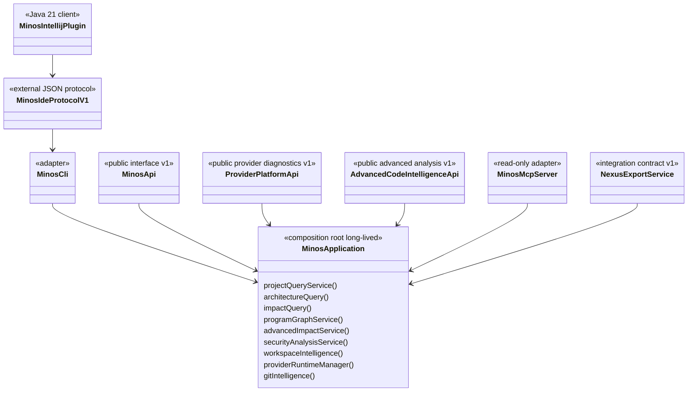

# Surfaces publiques : CLI, API Java, MCP, IntelliJ et NEXUS

MINOS expose le même cœur métier par plusieurs adapters. Une fonctionnalité ne doit pas être réimplémentée différemment dans chaque transport.

Les faits mécaniquement calculables (versions, catalogue MCP, commandes CLI, formats et providers) sont générés depuis le code dans [`../generated/product-facts.md`](../generated/product-facts.md). La présente page reste narrative et architecturale.

## Relations entre surfaces



## Composition M15–M19

`MinosApplication` est la composition locale partagée pour un `MINOS_HOME`. CLI, API et MCP peuvent recevoir la même instance et réutilisent registry, stores, runtime provider et services applicatifs.

M17 ajoute deux compositions provider-neutral :

```text
ProjectDiscoveryService
  → ProjectDetector / BuildSystemDetector / SourceRootDetector / LanguageDetector

ProviderRuntimeManager
  → CompositeProviderRuntimeManager
      → extensions runtime indépendantes
```

M18 n'ajoute pas un second moteur dans IntelliJ. Le plugin est volontairement un **client externe Java 21** du runtime MINOS Java 24 :

```text
IntelliJ plugin
  ↓ processus local + JSON
minos ide handshake / commandes CLI JSON
  ↓
MinosApplication
```

M19 ajoute une vue de graphe avancé reconstruisible et capability-honest :

```text
snapshot actif
   ↓
ProgramGraphProvider[]
   ├── projection CALLS / READS / WRITES historique
   └── providers avancés explicites (CFG / def-use / taint)
   ↓
ProgramGraphComposer
   ↓
ProgramGraphService
   ├── AdvancedImpactService
   └── SecurityAnalysisService
```

Le `ProgramGraph` n'est pas un second stockage autoritatif. Les snapshots persistés restent la source de vérité ; les fragments avancés sont composés de manière déterministe, les collisions incohérentes sont rejetées et toute capability absente reste explicitement indisponible conformément à ADR-0028.

Le snapshot actif possède toujours une vue de requête immuable et indexée, mise en cache par identité de snapshot actif. Les transports ne reconstruisent ni cache ni indexes.

## CLI

`MinosCli` reste le dispatcher. Il traduit arguments/formats vers les services applicatifs ; il n'est pas une couche métier consommée par les autres transports, à l'exception du **contrat de processus externe M18** qui réutilise volontairement ses commandes JSON stables.

Administration locale :

```text
doctor
tools list / install / verify
providers [provider-id]
index <project>
import-scip <project> ...
```

Intégration M18 :

```text
ide handshake
git-activity <project>
```

`ide handshake` négocie le protocole externe `minos-ide` v1 avant toute requête métier du plugin. `git-activity` expose l'activité factuelle déjà calculée par `GitIntelligenceService` et transporte explicitement `importanceInference=false`.

`providers` est la surface M17 de diagnostic : version, langages, systèmes de build, niveau de chaque capability, score de conformance, limitations et état runtime. `tools` conserve la responsabilité d'installation et de vérification.

Les runtimes marqués `requiredByDefault` définissent la baseline `doctor/tools verify`. Un provider optionnel peut donc être visible et installable sans rendre la baseline historique rouge tant qu'il n'est pas sélectionné.

`LocalAutonomousIndexOperations` coordonne discovery, négociation, fingerprints et lifecycle existants ; la CLI ne contient pas elle-même la logique provider.

### Bootstrap et codes de sortie

`MinosLauncher` traite `--version` sans store, traite `--help` et le handshake IDE sans dépendre d'un projet actif, expose `mcp` et ouvre une seule `MinosApplication` pour les commandes fonctionnelles.

```text
0 success
1 execution failure / diagnostic action required
2 usage error
```

## IntelliJ — protocole et plugin M18

ADR-0027 fixe la frontière : le module Gradle `minos-intellij/` ne déclare aucune dépendance `com.minos:*`. Il communique avec le launcher MINOS installé localement et refuse une version de protocole différente de `1`.

Surfaces natives :

```text
Tool Window MINOS
  project/index/provider/snapshot
  architecture graph
  impact / related tests / relations
  factual Git activity
  index / reindex / dry-run / doctor

Editor popup MINOS
  open definition
  usages
  dependents
  implementations
  related tests
  impact
  architecture
  copy symbol identity
```

Les actions éditeur utilisent le PSI uniquement pour identifier le contexte sous le caret. L'identité et les relations finales restent celles du snapshot MINOS.

Les positions MINOS sont interprétées selon leur contrat : ligne base 1, colonne base 0 et encodage explicite `UTF8_CODE_UNITS`, `UTF16_CODE_UNITS`, `UTF32_CODE_UNITS` ou `UNKNOWN`. Le plugin convertit la colonne en offset UTF-16 IntelliJ et refuse une destination qui sort de la racine projet enregistrée.

L'indexation depuis l'IDE invoque `minos index`; le plugin n'écrit jamais directement le staging, les snapshots ou le pointeur actif. La promotion atomique M1/M7/M14 reste donc la seule voie de publication.

Le graphe IntelliJ consomme `minos architecture --format json`, en particulier `modules` et `moduleDependencies`. Il borne et filtre l'affichage mais ne crée aucune arête supplémentaire.

Impact et tests liés conservent les champs explicatifs MINOS (`nature`, `confidence`, `limitations`, chemins/preuves). L'activité Git reste factuelle et n'est jamais transformée en score d'importance.

Voir le [guide utilisateur IntelliJ](../user/intellij-plugin.md).

## API Java

### `MinosApi` v1

`MinosApi` reste le contrat fournisseur-indépendant M11/M12. Sa surface utilise les types JDK et DTOs publics ; elle ne fait pas fuiter SCIP, MCP, stores, Coursier, npm ou modèles `com.minos.domain`.

Le graphe d'architecture reste exposé de manière compatible au contrat v1 par `getArchitectureGraph(...)`. Les erreurs publiques restent : `INVALID_REQUEST`, `UNAVAILABLE`, `IO_FAILURE`, `EXECUTION_FAILURE`.

### `ProviderPlatformApi` v1

M17 ajoute un contrat **séparé et additif** :

```java
List<ProviderDto> listProviders()
ProviderDto getProvider(String providerId)
```

Cette séparation évite d'augmenter silencieusement `MinosApi.CONTRACT_VERSION`. Le DTO provider expose uniquement des types publics : identité/version, langages/build systems, map capability → niveau, score de conformance, limitations et diagnostics runtime.

### `AdvancedCodeIntelligenceApi` v1

M19 ajoute un troisième contrat public additif sans modifier `MinosApi` v1 :

```java
ProgramGraphDto getProgramGraph(String project, ProgramGraphQuery query)
AdvancedImpactDto analyzeImpactV2(String project, AdvancedImpactQuery query)
SecurityReportDto analyzeSecurityPaths(String project, SecurityQuery query)
```

Le contrat reste provider-independent et n'expose que des DTOs/JDK. Les réponses conservent capabilities, `nature`, confiance, provenance et limitations. Les requêtes sont bornées : graphe, profondeur d'impact et chemins sécurité ne peuvent pas devenir des traversées illimitées.

## MCP

MCP reste **strictement read-only**. Les tools ne peuvent pas faire `project add`, `tools install`, `index` ou `import-scip`.

Depuis M15-S4, un appel MCP suit directement :

```text
MCP tool
  ↓
validation / mapping de requête
  ↓
MinosApplicationMcpBackend
  ↓
services typés de MinosApplication
  ↓
mapping de réponse MCP
```

M19 conserve les **16 tools historiques** et ajoute trois tools read-only, soit **19 tools** au total :

```text
minos_program_graph
minos_impact_v2
minos_security_paths
```

`minos_program_graph` expose les capabilities réellement disponibles et les limitations. `minos_impact_v2` distingue le compte baseline M8 des symboles ajoutés par les chemins avancés. `minos_security_paths` retourne uniquement les chemins source→sink observés et les sanitizers rencontrés ; l'absence de chemin n'est jamais présentée comme une preuve de sûreté.

Les réponses de `minos_project_structure` et `minos_index_status` continuent d'ajouter `providerProfiles`, qui expose les mêmes niveaux/limitations que CLI/API sans créer un tool administratif.

Le launcher natif fournit `minos mcp`. Le catalogue exact et son nombre sont vérifiés automatiquement dans [`../generated/product-facts.md`](../generated/product-facts.md).

Le plugin IntelliJ M18 et le MCP peuvent coexister : le premier fournit une UX native et des actions administratives locales ; le second reste une surface read-only destinée aux agents.

Voir le [guide utilisateur MCP](../user/mcp.md).

## Export NEXUS

`NexusExportService` projette le snapshot actif vers un contrat JSON indépendant du modèle Java de NEXUS. M14 change la production du snapshot, M15 sa composition/performance, M17 la plateforme provider et M18 ajoute un client IDE. M19 ajoute des surfaces avancées séparées et ne modifie pas implicitement le contrat NEXUS v1.

## Runtime natif vs Docker

ADR-0021 sépare :

```text
runtime natif = administration + providers + CLI + MCP local + protocole IDE
Docker MCP    = consommation read-only durcie optionnelle
```

Les deux modes ne doivent pas partager aveuglément un registre de chemins hôte Windows/conteneur.

## Ajouter un nouvel écosystème M17+

1. ajouter les détecteurs SPI nécessaires ;
2. déclarer un `IndexerProvider` avec un profil **exhaustif** `FULL/PARTIAL/EXPERIMENTAL/UNSUPPORTED` ;
3. ajouter un runtime derrière `ProviderRuntimeManager` si installation/exécution locale requise ;
4. exécuter `ProviderConformanceKit` ;
5. versionner une fixture représentative ;
6. qualifier discovery, négociation, runtime, snapshot et requêtes ;
7. exposer les limitations sans inventer de capacité.

Un build system peut être correctement découvert alors qu'aucun provider d'exécution n'est encore qualifié : **discovery et support runtime sont deux faits distincts**.

## Ajouter une capability de graphe M19+

1. implémenter `ProgramGraphProvider` ;
2. déclarer uniquement les `ProgramGraphCapability` réellement prouvées ;
3. fournir nœuds/arêtes avec identités stables, nature, provenance et preuves nécessaires ;
4. ajouter une vérité terrain contrôlée et mesurer précision/rappel ;
5. conserver une limitation explicite pour les dimensions dynamiques non prouvées ;
6. laisser `ProgramGraphComposer` rejeter toute collision incohérente.

Un provider qui ne sait pas produire de CFG, de def-use ou d'annotations taint ne reçoit aucune de ces capabilities par convention.

## Ajouter une nouvelle surface

Pour un futur adapter HTTP ou autre protocole :

1. réutiliser `MinosApplication` et les services existants ;
2. définir des DTOs/serialisations propres au contrat externe ;
3. imposer les mêmes bornes ;
4. conserver limitations et provenance ;
5. ne pas déplacer la logique métier vers le transport ;
6. décider explicitement si la surface est read-only ou administrative ;
7. ajouter des tests de frontière empêchant les fuites de types internes ;
8. lorsqu'une différence de JVM ou de cycle de release le justifie, préférer un contrat externe versionné à une dépendance sur les classes internes.

## Qualité et cohérence

- tests API : frontière des contrats publics historiques et avancés ;
- tests MCP : catalogue/schemas, profils provider et replay STDIO ;
- tests M19 : précision/rappel call graph et def-use, CFG branches/loops/exceptions, cycles interprocéduraux, collision CPG, gain Impact v2 et security paths/sanitizers ;
- tests IDE : handshake incompatible, invocation process, positions UTF-8/16/32, graphe borné ;
- Plugin Verifier : compatibilité IntelliJ ciblée ;
- conformance kit : profils exhaustifs et déterministes ;
- `scripts/docs/product-facts.py --check` : facts mécaniques alignés ;
- `scripts/m18/run-final.ps1` : Maven Java 24 + gates plugin IntelliJ + exact-head ;
- `scripts/m19/run-final.ps1` : Maven/JaCoCo/product-facts + invariants avancés + exact-head ;
- les rapports historiques ne sont pas réécrits pour refléter le présent.
