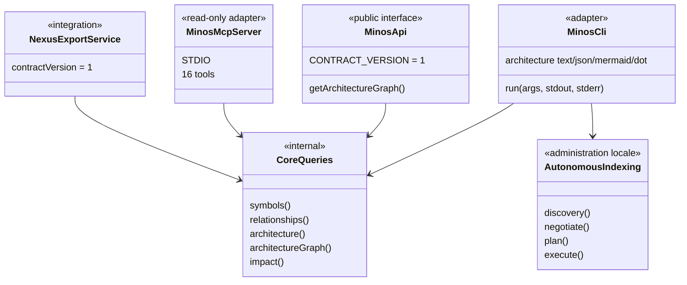
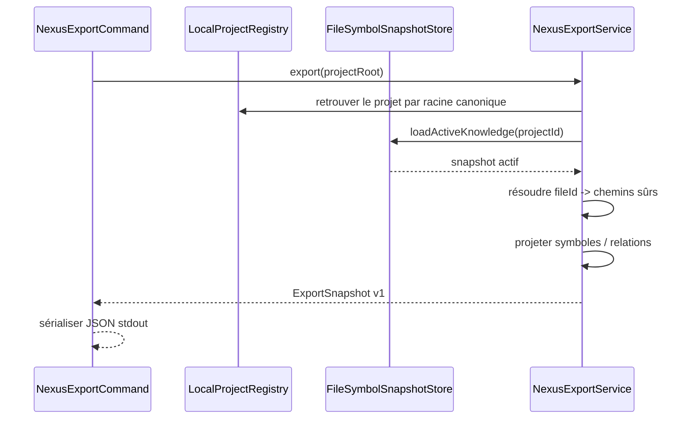

# Surfaces publiques : CLI, API Java, MCP et NEXUS

MINOS expose le même cœur métier par plusieurs adapters. Une fonctionnalité ne doit pas être réimplémentée différemment dans chaque transport.

## Relations entre surfaces



## CLI

`MinosCli` reste le dispatcher de commandes.

M14 ajoute une surface d'administration locale dédiée :

```text
doctor
tools list / install / verify
index <project>
import-scip <project> ...
```

`LocalAutonomousIndexOperations` coordonne discovery, négociation, fingerprints et lifecycle existants ; la CLI ne contient pas elle-même la logique provider.

La surface `architecture` expose désormais le graphe inter-modules réellement dérivé :

```text
architecture <project> --format json
architecture <project> --format mermaid
architecture <project> --format dot
architecture <project> --module <module> --format mermaid|dot
```

`json` conserve une vue structurée des arêtes ; Mermaid et DOT sont seulement des renderers d'exposition du même `ArchitectureDependencyGraph`.

### Bootstrap

`MinosLauncher` :

- traite `--version` sans ouvrir de store ;
- traite `--help` sans créer de home ;
- expose `mcp` comme sous-commande de lancement ;
- n'ouvre les stores/services qu'une fois une commande fonctionnelle exécutée.

### Codes de sortie

```text
0 success
1 execution failure / diagnostic action required
2 usage error
```

Un run d'indexation provider/staging/promotion en échec remonte en code `1` ; il n'est pas rendu comme un succès CLI.

Les commandes d'automatisation acceptent `--format json` lorsqu'un format machine est pertinent.

## API Java M11/M12

`MinosApi` reste le contrat public fournisseur-indépendant versionné.

Il expose notamment l'administration projet, l'import SCIP explicite et les requêtes de Code Intelligence.

Le graphe d'architecture est ajouté de manière compatible au contrat v1 par :

```java
ArchitectureGraphDto getArchitectureGraph(String projectIdentifier)
```

La méthode est `default` dans l'interface afin de préserver la compatibilité des implémentations tierces existantes ; `LocalMinosApi` retourne la vue complète. Les DTOs publics exposent modules, source/cible des arêtes, compteurs, échantillons de relations, nature et confiance sans faire fuiter `com.minos.architecture`.

M14 **n'étend pas silencieusement le contrat API v1 avec l'exécution des providers**. L'indexation autonome reste une responsabilité d'administration locale CLI/runtime.

La surface publique utilise uniquement :

- types JDK ;
- DTOs déclarés par le contrat public.

Elle ne doit pas exposer directement SCIP, MCP, les stores, Coursier, npm ou les modèles internes `com.minos.domain`.

### Erreurs publiques

```text
INVALID_REQUEST
UNAVAILABLE
IO_FAILURE
EXECUTION_FAILURE
```

## API M12 multi-repository

`MinosMultiRepositoryApi` étend `MinosApi` et hérite donc aussi de la vue de graphe du projet individuel.

Les bornes publiques existantes restent inchangées : commits, fichiers, profondeur de zone et relations restent explicitement limités.

## MCP

MCP reste **strictement read-only**.

Les tools lisent la connaissance active et ne peuvent pas :

```text
project add
tools install
index
import-scip
```

Ce choix empêche un agent MCP de déclencher implicitement une compilation, un téléchargement de provider ou une mutation administrative.

Le launcher natif fournit :

```text
minos mcp
```

Le catalogue contient désormais **16 tools**, dont :

```text
minos_architecture
minos_architecture_graph
```

`minos_architecture_graph` accepte `json`, `mermaid` ou `dot` et un module optionnel. Le handler traduit l'appel vers la CLI ; il ne duplique pas l'analyse d'architecture.

Le setup Windows peut enregistrer ce MCP natif dans Copilot JetBrains, Copilot CLI, Claude Code, Claude Desktop et Codex. Cette intégration de clients reste une responsabilité de packaging/runtime et ne modifie pas le cœur métier MCP.

Voir le [guide utilisateur MCP](../user/mcp.md).

## Export NEXUS M13

`NexusExportService` projette le snapshot actif vers un contrat JSON indépendant du modèle Java de NEXUS.



M14 change la manière de produire le snapshot (`index <project>` autonome), pas le contrat NEXUS.

## Runtime natif vs Docker

ADR-0021 sépare :

```text
runtime natif = administration + providers + CLI + MCP local
Docker MCP    = consommation read-only durcie optionnelle
```

Les deux modes ne doivent pas partager aveuglément un registre contenant des racines projet, car les chemins hôte Windows et conteneur diffèrent.

## Ajouter une nouvelle surface

Pour un futur adapter HTTP, IDE ou autre protocole :

1. réutiliser les services existants ;
2. définir des DTOs/serialisations propres au contrat externe ;
3. imposer les mêmes bornes ;
4. conserver limitations et provenance ;
5. ne pas déplacer la logique métier vers le transport ;
6. décider explicitement si la surface est read-only ou administrative ;
7. ajouter des tests de frontière empêchant les fuites de types internes.

## Tests de contrat

Les tests API vérifient l'absence de fuite des packages internes/JGit et couvrent la vue `ArchitectureGraphDto`.

Le MCP conserve ses tests de catalogue/schemas et replay STDIO, avec un appel réel de `minos_architecture_graph`.

La qualification Windows vérifie en plus le cycle installation/désinstallation des intégrations MCP natives dans des configurations temporaires avant de construire une release.
