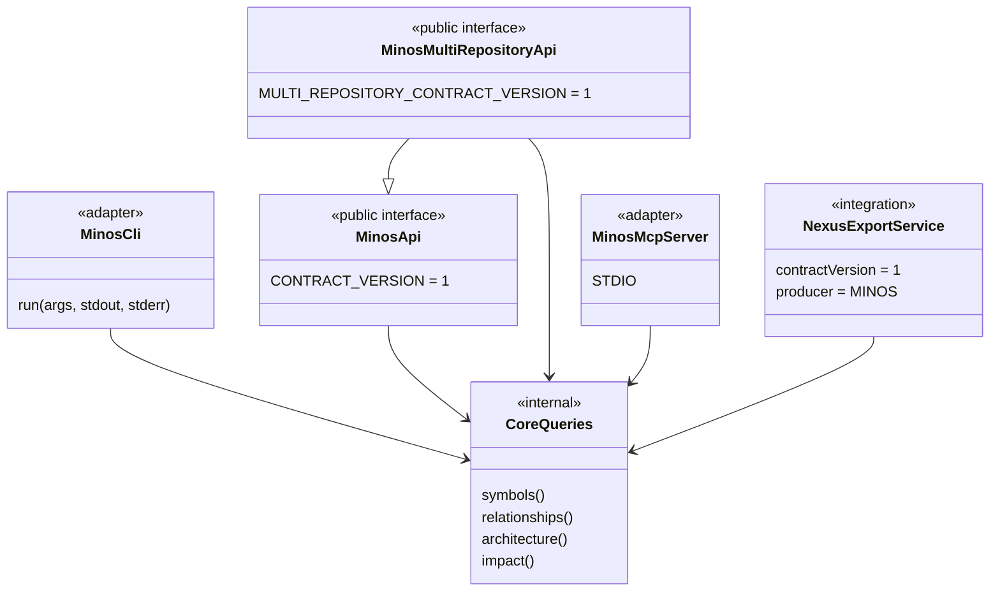
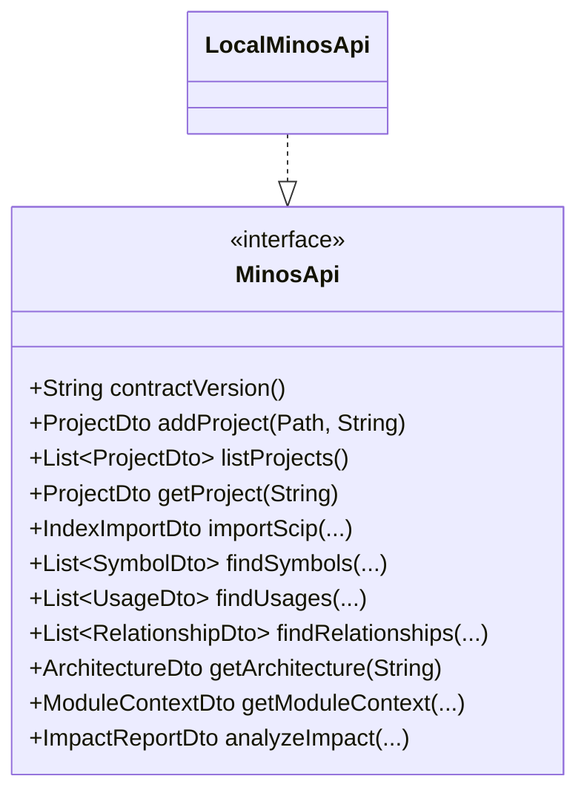
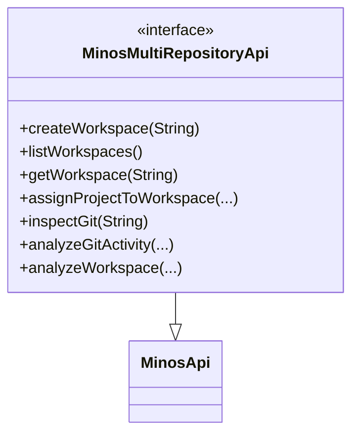
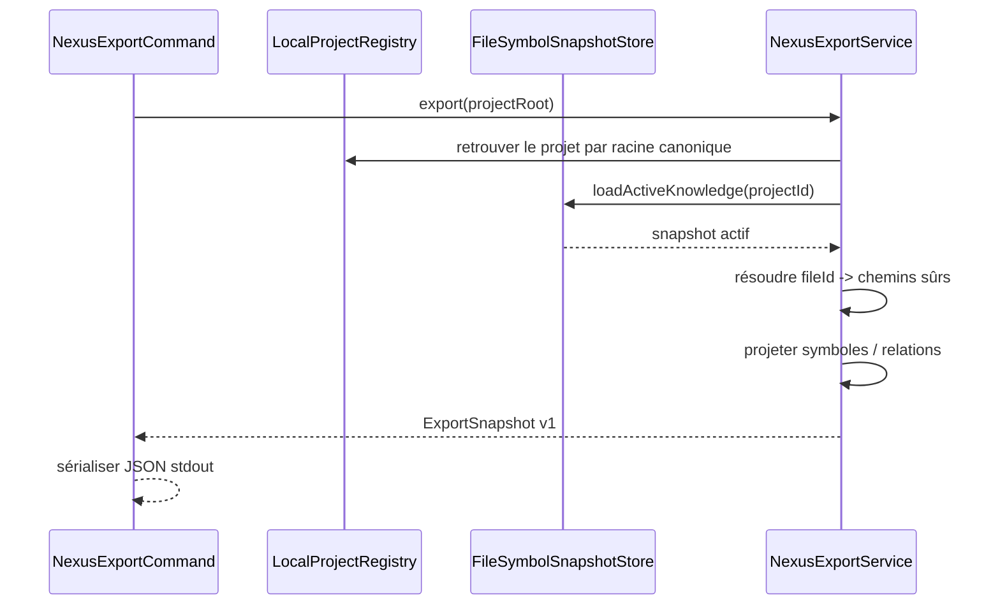

# Surfaces publiques : CLI, API Java, MCP et NEXUS

MINOS expose le même cœur métier par plusieurs adapters. Une fonctionnalité ne doit pas être réimplémentée différemment dans chaque transport.

## Relations entre surfaces



## CLI

`MinosCli` est un dispatcher. Il instancie des commandes d’exposition et délègue à `ProjectSymbolQuery`, `ProjectOperations`, `ProjectArchitectureQuery` et `ProjectImpactQuery`.

Le launcher garde les dépendances lazily ouvertes afin qu’un simple `--help` ne crée pas inutilement un home MINOS.

### Contrat stable

Codes de sortie :

```text
0 success
1 execution failure
2 usage error
```

Les commandes qui supportent l’automatisation acceptent `--format json`.

## API Java M11

`MinosApi` est le contrat public fournisseur-indépendant.



### Règle de compatibilité

La surface publique utilise uniquement :

- types JDK ;
- DTOs déclarés par `MinosApi`.

Elle ne doit pas exposer directement SCIP, MCP, les stores ou les modèles internes `com.minos.domain`.

### Erreurs publiques

```text
INVALID_REQUEST
UNAVAILABLE
IO_FAILURE
EXECUTION_FAILURE
```

Le consommateur peut donc traiter les erreurs sans dépendre des exceptions internes.

## API M12 multi-repository

`MinosMultiRepositoryApi` **étend** `MinosApi` sans modifier le contrat M11 existant.



Limites publiques :

```text
maxCommits        1..10000
maxFiles          1..10000
zoneDepth         1..8
maxRelationships  1..10000
```

## MCP

MCP est une couche read-only. Les handlers adaptent les arguments MCP vers la surface MINOS existante et restituent du JSON.

Le serveur n’ajoute pas de logique métier spécifique aux agents.

Voir le [guide utilisateur MCP](../user/mcp.md).

## Export NEXUS M13

`NexusExportService` projette le snapshot actif vers un contrat JSON indépendant du modèle Java de NEXUS.



Le contrat garde une information plus riche que ce que NEXUS est obligé de consommer. Le consommateur peut ignorer un kind non représentable, mais ne doit pas lui inventer une nouvelle signification.

## Ajouter une nouvelle surface

Pour un futur adapter HTTP, IDE ou autre protocole :

1. réutiliser les services existants ;
2. définir des DTOs/serialisations propres au contrat externe ;
3. imposer les mêmes bornes ;
4. conserver les limitations et la provenance ;
5. ne pas déplacer la logique métier vers le transport ;
6. ajouter des tests de frontière empêchant les fuites de types internes.

## Tests de contrat

Les tests `MinosApiContractTest` et `MinosMultiRepositoryApiContractTest` vérifient que la surface publique ne fuit pas les packages internes ou JGit.

Le serveur MCP possède ses tests de catalogue/schemas et un replay STDIO réel.

L’export NEXUS possède un test de version de contrat et un replay sur fixture réelle.
