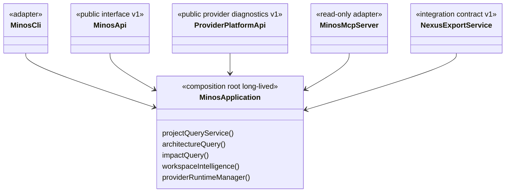

# Surfaces publiques : CLI, API Java, MCP et NEXUS

MINOS expose le même cœur métier par plusieurs adapters. Une fonctionnalité ne doit pas être réimplémentée différemment dans chaque transport.

Les faits mécaniquement calculables (versions, catalogue MCP, commandes CLI, formats et providers) sont générés depuis le code dans [`../generated/product-facts.md`](../generated/product-facts.md). La présente page reste narrative et architecturale.

## Relations entre surfaces



## Composition M15–M17

`MinosApplication` est la composition locale partagée pour un `MINOS_HOME`. CLI, API et MCP peuvent recevoir la même instance et réutilisent registry, stores, runtime provider et services applicatifs.

M17 ajoute deux compositions provider-neutral :

```text
ProjectDiscoveryService
  → ProjectDetector / BuildSystemDetector / SourceRootDetector / LanguageDetector

ProviderRuntimeManager
  → CompositeProviderRuntimeManager
      → extensions runtime indépendantes
```

Le snapshot actif possède toujours une vue de requête immuable et indexée, mise en cache par identité de snapshot actif. Les transports ne reconstruisent ni cache ni indexes.

## CLI

`MinosCli` reste le dispatcher. Il traduit arguments/formats vers les services applicatifs ; il n'est pas une couche métier consommée par les autres transports.

Administration locale :

```text
doctor
tools list / install / verify
providers [provider-id]
index <project>
import-scip <project> ...
```

`providers` est la surface M17 de diagnostic : version, langages, systèmes de build, niveau de chaque capability, score de conformance, limitations et état runtime. `tools` conserve la responsabilité d'installation et de vérification.

Les runtimes marqués `requiredByDefault` définissent la baseline `doctor/tools verify`. Un provider optionnel peut donc être visible et installable sans rendre la baseline historique rouge tant qu'il n'est pas sélectionné.

`LocalAutonomousIndexOperations` coordonne discovery, négociation, fingerprints et lifecycle existants ; la CLI ne contient pas elle-même la logique provider.

### Bootstrap et codes de sortie

`MinosLauncher` traite `--version` sans store, traite `--help` sans home, expose `mcp` et ouvre une seule `MinosApplication` pour les commandes fonctionnelles.

```text
0 success
1 execution failure / diagnostic action required
2 usage error
```

## API Java

### `MinosApi` v1

`MinosApi` reste le contrat fournisseur-indépendant M11/M12. Sa surface utilise les types JDK et DTOs publics ; elle ne fait pas fuiter SCIP, MCP, stores, Coursier, npm ou modèles `com.minos.domain`.

Le graphe d'architecture reste exposé de manière compatible au contrat v1 par `getArchitectureGraph(...)`. Les erreurs publiques restent : `INVALID_REQUEST`, `UNAVAILABLE`, `IO_FAILURE`, `EXECUTION_FAILURE`.

### `ProviderPlatformApi` v1

M17 ajoute un contrat **séparé et additif** :

```java
List<ProviderDto> listProviders()
ProviderDto getProvider(String providerId)
```

Cette séparation évite d'augmenter silencieusement `MinosApi.CONTRACT_VERSION`. Le DTO provider expose uniquement des types publics : identité/version, langages/build systems, map capability → niveau, score de conformance, limitations et diagnostics runtime.

## MCP

MCP reste **strictement read-only**. Les tools ne peuvent pas faire `project add`, `tools install`, `index` ou `import-scip`.

Depuis M15-S4, un appel MCP suit directement :

```text
MCP tool
  ↓
validation / mapping de requête
  ↓
MinosApplicationMcpBackend
  ↓
services typés de MinosApplication
  ↓
mapping de réponse MCP
```

M17 conserve volontairement le catalogue historique de **16 tools**. Les réponses de `minos_project_structure` et `minos_index_status` ajoutent `providerProfiles`, qui expose les mêmes niveaux/limitations que CLI/API sans créer un tool administratif.

Le launcher natif fournit `minos mcp`. Le catalogue exact et son nombre sont vérifiés automatiquement dans [`../generated/product-facts.md`](../generated/product-facts.md).

Voir le [guide utilisateur MCP](../user/mcp.md).

## Export NEXUS

`NexusExportService` projette le snapshot actif vers un contrat JSON indépendant du modèle Java de NEXUS. M14 change la production du snapshot, M15 sa composition/performance et M17 la plateforme provider ; aucun de ces jalons ne change le contrat NEXUS.

## Runtime natif vs Docker

ADR-0021 sépare :

```text
runtime natif = administration + providers + CLI + MCP local
Docker MCP    = consommation read-only durcie optionnelle
```

Les deux modes ne doivent pas partager aveuglément un registre de chemins hôte Windows/conteneur.

## Ajouter un nouvel écosystème M17

1. ajouter les détecteurs SPI nécessaires ;
2. déclarer un `IndexerProvider` avec un profil **exhaustif** `FULL/PARTIAL/EXPERIMENTAL/UNSUPPORTED` ;
3. ajouter un runtime derrière `ProviderRuntimeManager` si installation/exécution locale requise ;
4. exécuter `ProviderConformanceKit` ;
5. versionner une fixture représentative ;
6. qualifier discovery, négociation, runtime, snapshot et requêtes ;
7. exposer les limitations sans inventer de capacité.

Un build system peut être correctement découvert alors qu'aucun provider d'exécution n'est encore qualifié : **discovery et support runtime sont deux faits distincts**.

## Ajouter une nouvelle surface

Pour un futur adapter HTTP, IDE ou autre protocole :

1. réutiliser `MinosApplication` et les services existants ;
2. définir des DTOs/serialisations propres au contrat externe ;
3. imposer les mêmes bornes ;
4. conserver limitations et provenance ;
5. ne pas déplacer la logique métier vers le transport ;
6. décider explicitement si la surface est read-only ou administrative ;
7. ajouter des tests de frontière empêchant les fuites de types internes.

## Qualité et cohérence

- tests API : frontière du contrat public ;
- tests MCP : catalogue/schemas, profils provider et replay STDIO ;
- conformance kit : profils exhaustifs et déterministes ;
- `scripts/docs/product-facts.py --check` : facts mécaniques alignés ;
- `scripts/m17/run-final.ps1` : replay M14 + Kotlin/Python exact-head ;
- les rapports historiques ne sont pas réécrits pour refléter le présent.
