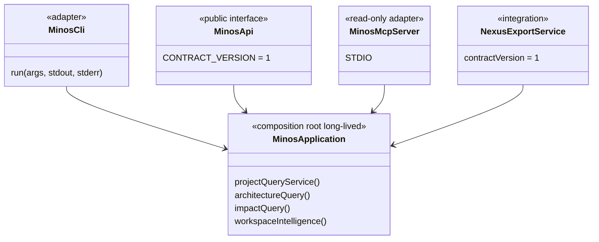
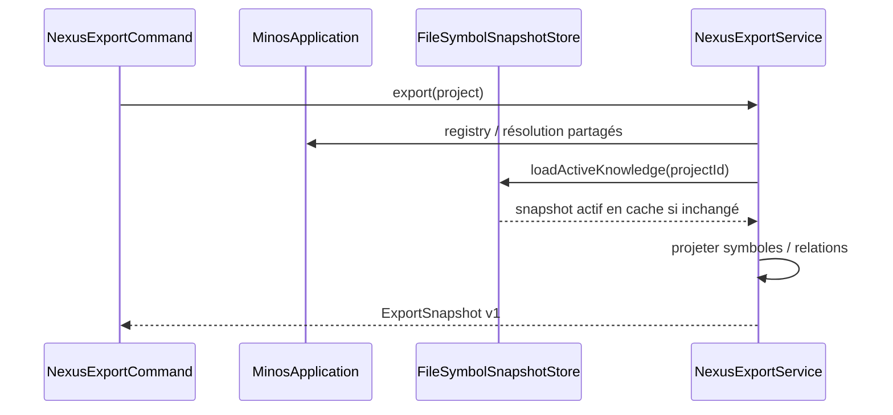

# Surfaces publiques : CLI, API Java, MCP et NEXUS

MINOS expose le même cœur métier par plusieurs adapters. Une fonctionnalité ne doit pas être réimplémentée différemment dans chaque transport.

Les faits mécaniquement calculables (versions, catalogue MCP, commandes CLI, formats et providers) sont générés depuis le code dans [`../generated/product-facts.md`](../generated/product-facts.md). La présente page reste narrative et architecturale.

## Relations entre surfaces



## Composition M15

`MinosApplication` est la composition locale partagée pour un `MINOS_HOME`. CLI, API et MCP peuvent recevoir la même instance et réutilisent le registry, les stores, le runtime provider et les services applicatifs.

Le snapshot actif possède une vue de requête immuable et indexée, mise en cache par `(projectId, snapshotId)`. Les transports ne reconstruisent pas eux-mêmes ce cache ou les indexes.

## CLI

`MinosCli` reste le dispatcher de commandes. Il traduit les arguments et formats de sortie vers les services applicatifs ; il n'est pas une couche métier consommée par les autres transports.

M14 a ajouté l'administration locale :

```text
doctor
tools list / install / verify
index <project>
import-scip <project> ...
```

`LocalAutonomousIndexOperations` coordonne discovery, négociation, fingerprints et lifecycle existants ; la CLI ne contient pas elle-même la logique provider.

La surface `architecture` expose le graphe inter-modules réellement dérivé :

```text
architecture <project> --format json
architecture <project> --format mermaid
architecture <project> --format dot
architecture <project> --module <module> --format mermaid|dot
```

### Bootstrap

`MinosLauncher` :

- traite `--version` sans ouvrir de store ;
- traite `--help` sans créer de home ;
- expose `mcp` comme sous-commande de lancement ;
- ouvre une seule `MinosApplication` pour les commandes fonctionnelles.

### Codes de sortie

```text
0 success
1 execution failure / diagnostic action required
2 usage error
```

## API Java M11/M12

`MinosApi` reste le contrat public fournisseur-indépendant versionné. Sa surface utilise uniquement les types JDK et les DTOs publics ; elle ne fait pas fuiter SCIP, MCP, les stores, Coursier, npm ou les modèles internes `com.minos.domain`.

Le graphe d'architecture est exposé de manière compatible au contrat v1 par :

```java
ArchitectureGraphDto getArchitectureGraph(String projectIdentifier)
```

La méthode reste `default` afin de préserver la compatibilité des implémentations tierces existantes ; `LocalMinosApi` retourne la vue complète.

### Erreurs publiques

```text
INVALID_REQUEST
UNAVAILABLE
IO_FAILURE
EXECUTION_FAILURE
```

`MinosMultiRepositoryApi` étend `MinosApi` et hérite de la vue de graphe du projet individuel. Les bornes publiques existantes sur commits, fichiers, profondeur et relations restent explicites.

## MCP

MCP reste **strictement read-only**. Les tools lisent la connaissance active et ne peuvent pas :

```text
project add
tools install
index
import-scip
```

Depuis M15-S4, un appel MCP suit directement :

```text
MCP tool
  ↓
validation / mapping de requête
  ↓
MinosApplicationMcpBackend
  ↓
services typés de MinosApplication
  ↓
mapping de réponse MCP
```

Il n'existe plus de routage métier MCP → CLI. `MinosMcpTools` conserve les schémas, bornes et conversions propres au protocole ; les règles de Code Intelligence restent dans les services partagés.

Le launcher natif fournit `minos mcp`. Le catalogue exact et son nombre de tools sont vérifiés automatiquement dans [`../generated/product-facts.md`](../generated/product-facts.md).

Le setup Windows peut enregistrer ce MCP natif dans Copilot JetBrains, Copilot CLI, Claude Code, Claude Desktop et Codex. Cette intégration de clients reste une responsabilité de packaging/runtime et ne modifie pas le cœur métier MCP.

Voir le [guide utilisateur MCP](../user/mcp.md).

## Export NEXUS M13

`NexusExportService` projette le snapshot actif vers un contrat JSON indépendant du modèle Java de NEXUS.



M14 change la manière de produire le snapshot (`index <project>` autonome), pas le contrat NEXUS. M15 change la composition et les performances internes, pas ce contrat d'échange.

## Runtime natif vs Docker

ADR-0021 sépare :

```text
runtime natif = administration + providers + CLI + MCP local
Docker MCP    = consommation read-only durcie optionnelle
```

Les deux modes ne doivent pas partager aveuglément un registre contenant des racines projet, car les chemins hôte Windows et conteneur diffèrent.

## Ajouter une nouvelle surface

Pour un futur adapter HTTP, IDE ou autre protocole :

1. réutiliser `MinosApplication` et les services existants ;
2. définir des DTOs/serialisations propres au contrat externe ;
3. imposer les mêmes bornes ;
4. conserver limitations et provenance ;
5. ne pas déplacer la logique métier vers le transport ;
6. décider explicitement si la surface est read-only ou administrative ;
7. ajouter des tests de frontière empêchant les fuites de types internes.

## Qualité et cohérence

- les tests API vérifient la frontière du contrat public ;
- le MCP conserve ses tests de catalogue/schemas et replay STDIO ;
- les gates de couverture ciblée sont décrites dans [`quality-gates.md`](quality-gates.md) ;
- `scripts/docs/product-facts.py --check` empêche les facts mécaniques de diverger du code ;
- les rapports sous `docs/history/milestones/` restent historiques et ne sont pas réécrits pour refléter le présent.
