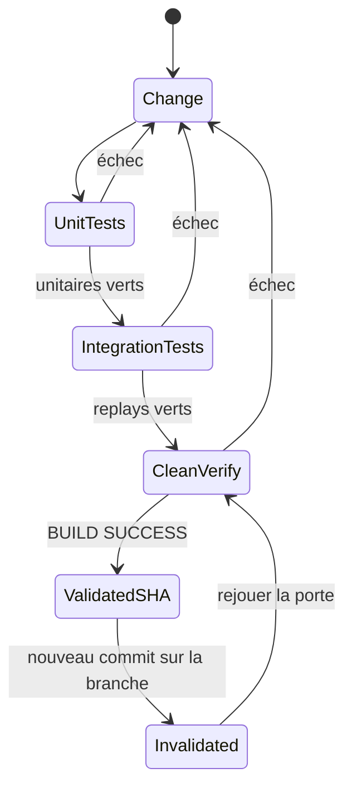

# Tests, validation et contribution

MINOS utilise une discipline de validation stricte : un résultat local n’est une preuve que pour le **SHA exact** testé.

## Porte locale

Commande de référence :

```powershell
.\mvnw.cmd clean verify
```

Avant la commande :

```powershell
git status
git rev-parse HEAD
java -version
.\mvnw.cmd -version
```

Le build doit tourner réellement sous Java 24.

## Pipeline Maven

Le build utilise notamment :

```text
maven-enforcer-plugin
maven-compiler-plugin
maven-surefire-plugin
maven-failsafe-plugin
maven-jar-plugin
maven-shade-plugin
```

`verify` exécute aussi les tests d’intégration Failsafe lorsqu’ils correspondent aux conventions configurées.

## Types de tests

### Tests unitaires de domaine

Ils verrouillent les invariants : symboles, relations, critères, normalisation, scoring et bornes.

### Tests de stores

Ils vérifient la persistance, l’historique et la promotion des snapshots.

### Tests de frontières

Exemples :

```text
NamespaceConventionTest
ProviderBoundaryTest
MinosApiContractTest
MinosMultiRepositoryApiContractTest
```

Ils empêchent notamment une fuite de types fournisseur ou de packages internes vers les contrats publics.

### Fixtures réelles

Le dépôt contient des fixtures qui servent à mesurer le comportement sur de vrais artefacts SCIP et de vrais graphes.

Les tests `*RealFixtureTest` doivent produire des mesures reproductibles, pas seulement des mocks.

### Replays d’intégration

Exemples :

```text
StableCliIntegrationTest
MinosMcpServerIntegrationTest
LocalMinosApiIntegrationTest
LocalMinosMultiRepositoryApiIntegrationTest
NexusExportIntegrationTest
```

Ils prouvent qu’une chaîne complète de composants fonctionne ensemble.

## UML du cycle de changement



## Exact-head validation

À documenter dans une PR :

```text
HEAD exact
version Java
nombre de sources main/test
nombre de tests
failures/errors/skipped
BUILD SUCCESS/FAILURE
replay significatif
```

Un commit ajouté après le `BUILD SUCCESS` invalide cette preuve et impose une nouvelle validation.

## Ajouter une fonctionnalité

Ordre recommandé :

1. identifier le package propriétaire de la responsabilité ;
2. écrire/adapter le modèle et ses invariants ;
3. ajouter le service interne ;
4. ajouter les tests unitaires ;
5. ajouter une fixture/replay si le comportement dépend d’un provider ou d’un vrai projet ;
6. exposer ensuite en CLI/API/MCP si nécessaire ;
7. documenter les limitations ;
8. lancer `clean verify`.

## Ajouter un DTO public

Vérifier :

- uniquement des types JDK ou DTOs du contrat public ;
- collections copiées en immuable ;
- bornes validées dans le constructeur lorsque nécessaire ;
- aucune dépendance `adapter.*`, `store.*`, `domain.*`, `org.eclipse.jgit` ou protocole dans la signature publique ;
- test de contrat mis à jour.

## Ajouter une relation dérivée

Une relation non factuelle doit :

```text
nature != FACTUAL
confidence != null
0 <= confidence <= 1
evidence non vide
```

Le test doit vérifier à la fois le résultat et l’explication.

## Ajouter un provider externe

Ne pas importer la bibliothèque du provider dans le domaine. Placer l’intégration dans un adapter et normaliser immédiatement vers les modèles MINOS.

Ajouter au minimum :

- tests de mapping ;
- données invalides ;
- cas unresolved/external ;
- fixture réelle si possible ;
- limites et version du provider.

## Tests MCP

Ne pas écrire de logs applicatifs sur stdout lors d’un test serveur STDIO. Le protocole utilise ce canal.

Le replay MCP doit au minimum prouver : initialisation, catalogue des tools, appel réel, erreur bornée/schema et fermeture propre.

## Tests M13 NEXUS

Le côté MINOS doit prouver :

- version du contrat ;
- projet/snapshot ;
- résolution sûre des chemins ;
- symboles/relations réels ;
- limitations explicites ;
- JSON stdout déterministe.

Le replay inter-dépôt complet appartient à la qualification conjointe MINOS/NEXUS et doit conserver les versions Java propres aux deux moteurs.

## Git et PR

Avant commit :

```powershell
git status
git diff
git diff --check
```

Ne pas mélanger une refactorisation sans rapport avec un jalon fonctionnel. Préférer des commits atomiques dont le message explique la décision.

## Documentation

Toute évolution de surface utilisateur doit mettre à jour :

- `docs/user/` ;
- les guides développeur impactés ;
- le document de jalon/ADR lorsqu’une décision d’architecture évolue.

Les diagrammes Mermaid doivent rester suffisamment abstraits pour survivre aux refactorings mineurs, tout en utilisant les vrais noms des composants structurants.
