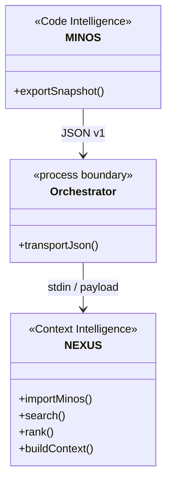

# Décision M13 — Intégration NEXUS

Date : **24 juillet 2026**

Statut : **PRÉPARÉE — décision finale après validation inter-dépôt**

## Question

NEXUS peut-il consommer la Code Intelligence normalisée de MINOS pour enrichir son contexte technique sans couplage binaire entre les deux moteurs et sans brouiller leurs responsabilités ?

## Contraintes observées

- MINOS est compilé avec Java 24 ;
- NEXUS conserve Java 21 ;
- NEXUS possède son propre ranking, sa sélection sous budget et son `ContextBuilder` ;
- MINOS possède la connaissance normalisée des symboles, relations, preuves et provenance ;
- les deux moteurs doivent rester utilisables indépendamment ;
- aucun réseau n’est nécessaire pour la frontière M13.

## Options étudiées

### A — Dépendance Maven NEXUS → MINOS

Rejetée. Elle imposerait à NEXUS le bytecode Java 24 et couplerait les modèles internes.

### B — Réimplémenter la connaissance MINOS dans NEXUS

Rejetée. Cette option dupliquerait la normalisation et créerait deux sources de vérité.

### C — Faire sélectionner le contexte final par MINOS

Rejetée. Le ranking, les sources contextuelles, les contraintes et le budget appartiennent à NEXUS.

### D — NEXUS lance directement le JAR MINOS

Écartée dans le design final. Cette option oblige NEXUS à connaître le chemin du JAR et le runtime Java 24, et introduit une orchestration de processus qui n’est pas nécessaire au cœur de Context Intelligence.

### E — Export JSON MINOS + import explicite NEXUS

Retenue.

MINOS produit un document JSON versionné en lecture seule. Un shell, un IDE, JARVIS ou un script transporte ce document vers une commande d’import NEXUS explicite.

## Décision retenue

```text
MINOS Java 24
  NexusExportContract v1
  nexus-export --root <project>
        |
        | JSON stdout
        v
NEXUS Java 21
  minos-import <project> < stdin
        |
        v
  index local -> SearchService -> ranking -> ContextBuilder
```

Le transport est local, versionné et sans couplage Java direct.

## Invariants

1. MINOS ne référence aucun type NEXUS.
2. NEXUS ne référence aucun type MINOS.
3. MINOS ne calcule ni ranking NEXUS ni budget de contexte.
4. NEXUS ne doit pas réinterpréter arbitrairement un kind MINOS non représentable.
5. La provenance `minos` reste identifiable dans NEXUS.
6. NEXUS ne lance pas MINOS depuis son cœur M13.
7. Aucun chemin de JAR MINOS ni runtime Java 24 n’appartient au contrat Java NEXUS.
8. Les données projet transitent dans le document JSON/stdin, pas comme couplage binaire.
9. Aucun accès réseau n’est nécessaire.
10. Les deux moteurs continuent à fonctionner indépendamment.

## Responsabilités

### MINOS

- produire les faits normalisés ;
- conserver origine, nature, confiance, preuves et limitations ;
- exporter le snapshot actif dans `NexusExportContract` v1 ;
- ne pas sélectionner le contexte final.

### NEXUS

- valider le contrat reçu ;
- mapper uniquement les concepts représentables ;
- persister les faits avec `sourceProvider=minos` ;
- classer, sélectionner et budgéter le contexte ;
- rester fonctionnel sans import MINOS.

### Orchestrateur externe

- exécuter MINOS avec Java 24 ;
- transporter le JSON ;
- exécuter NEXUS avec Java 21 ;
- gérer les erreurs des deux processus.

## Conséquences positives

- compatibilité Java 21 / Java 24 sans modifier les baselines ;
- aucun lien Maven privé croisé ;
- aucune orchestration de processus dans le cœur NEXUS ;
- contrat testable et versionnable ;
- réutilisation du moteur de recherche/ranking NEXUS ;
- MINOS reste une source de faits, NEXUS reste un moteur de contexte.

## Conséquences acceptées

- un orchestrateur doit relier les deux commandes ;
- le contrat NEXUS ne représente pas nécessairement toute la richesse MINOS ;
- chaque évolution incompatible du contrat impose un replay inter-dépôt ;
- les deux runtimes Java restent nécessaires pour une qualification complète.

## UML de responsabilité



## Porte

Verdict préparé :

> **OUI, via un contrat JSON local versionné et un import NEXUS explicite : MINOS reste la source de faits de Code Intelligence, tandis que NEXUS reste seul responsable du classement, de la sélection et du budget du contexte.**

Le verdict devient définitif après validation exacte des deux heads et succès du replay réel Java 24 → JSON → Java 21 décrit dans `NEXUS_INTEGRATION.md`.
