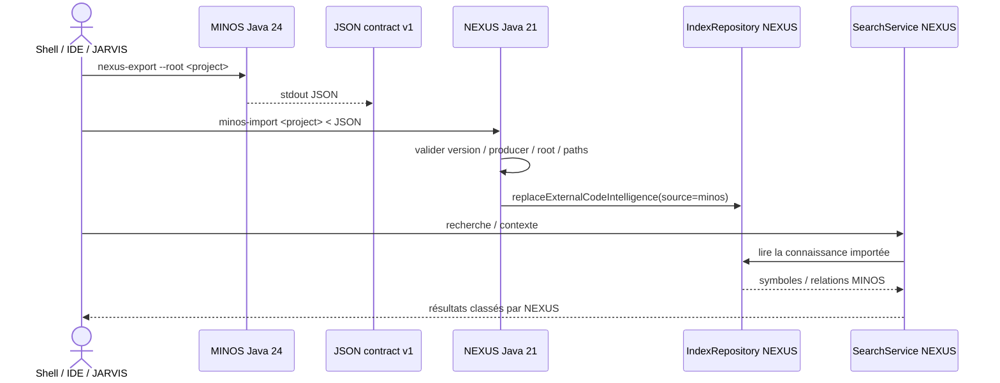

# M13 — Intégration NEXUS

Statut : **implémenté — validations finales inter-dépôts en attente**

Suivi MINOS : issue #37 / PR #38.

Compagnon NEXUS : `FTurleque/nexus-context-engine` issue #11 / PR #12.

## Objectif

Permettre à NEXUS de consommer la connaissance de code normalisée de MINOS pour enrichir sa recherche et sa construction de contexte, sans déplacer dans MINOS la responsabilité du ranking, de la sélection ou du budget de tokens.

## Frontière d’architecture

MINOS et NEXUS n’ont pas le même niveau Java et ne partagent pas leurs modèles internes :

```text
MINOS  Java 24  — Code Intelligence
NEXUS  Java 21  — Context Intelligence
```

La frontière retenue est un **contrat JSON local versionné**.



NEXUS ne doit pas lancer MINOS depuis son cœur. L’orchestration des deux JVM appartient au shell, à l’IDE, à JARVIS ou à un script de qualification.

## Contrat MINOS

```text
contractVersion = 1
producer        = MINOS
```

Commande :

```powershell
java -Dminos.home=<home> -jar minos-code-intelligence-0.1.0-SNAPSHOT-all.jar `
  nexus-export --root <project-root>
```

La commande écrit le JSON du contrat sur stdout. Les erreurs utilisent stderr et les codes de sortie stables de la CLI MINOS.

## Projet exporté

Le document identifie : UUID projet, nom, racine canonique et snapshot actif. L’export échoue si la racine n’est pas enregistrée ou si aucun snapshot actif n’existe.

## Symboles

MINOS exporte seulement les symboles locaux dotés d’une localisation et rattachables à un fichier réel sous la racine projet.

Chaque symbole conserve notamment : identité MINOS, `symbolKey`, chemin relatif, module, kind, nom, qualified name, signature, langue, lignes, statut de résolution, qualité d’identité, flag generated et origine.

## Résolution des `fileId`

Le modèle MINOS n’impose pas qu’un `fileId` soit un chemin. L’adaptateur SCIP produit notamment :

```text
file:<sha256(projectId + US + relativePath)>
```

M13 reconstruit `fileId -> relativePath` en recalculant cette identité sur les fichiers réels du projet. Un identifiant non résolu n’est jamais transformé en faux chemin.

## Relations

Le contrat transporte les relations symbol → symbol locales et résolues avec kind, identités et qualified names source/cible, résolution, nature, confiance, origine et preuves.

Le contrat peut être plus riche que le modèle NEXUS. Le consommateur peut ignorer un champ non représentable mais ne doit pas lui inventer une autre sémantique.

## Limitations explicites

```text
SYMBOLS_TRUNCATED
RELATIONS_TRUNCATED
FILE_PATH_DISCOVERY_TRUNCATED
UNRESOLVED_FILE_IDS
EXTERNAL_SYMBOLS_OMITTED
SYMBOL_WITHOUT_LOCAL_LOCATION_OMITTED
UNRESOLVED_SYMBOL_FILE_ID_OMITTED
NON_SYMBOL_RELATIONS_OMITTED
NON_LOCAL_RELATIONS_OMITTED
UNRESOLVED_RELATION_FILE_ID_OMITTED
```

Une limitation décrit une perte ou une borne de projection ; elle n’est jamais une garantie d’exhaustivité.

## Consommation NEXUS

Sur la branche compagnon M13, NEXUS fournit un import explicite :

```text
nexus minos-import <project> < minos-export.json
```

`MinosCodeIndexImporter` est un adaptateur JSON pur : il reçoit un payload déjà fourni au processus NEXUS. Il ne connaît ni le chemin du JAR MINOS ni le runtime Java 24.

### Validation de frontière

NEXUS doit valider : version et `producer`, racine du projet, taille du payload et chemins relatifs. Les traversées `..`, chemins absolus ou fichiers inconnus ne doivent pas devenir des accès I/O pilotés par le JSON.

## Mapping conservateur côté NEXUS

Symboles représentables :

```text
MINOS                         NEXUS
CLASS                         CLASS
INTERFACE / TRAIT             INTERFACE
RECORD                        RECORD
ENUM                          ENUM
ANNOTATION                    ANNOTATION
METHOD / FUNCTION             METHOD
CONSTRUCTOR                   CONSTRUCTOR
TYPE / STRUCT / TYPE_ALIAS    TYPE
```

Relations représentables :

```text
MINOS             NEXUS
IMPORTS           IMPORTS
EXTENDS           EXTENDS
IMPLEMENTS        IMPLEMENTS
CALLS             CALLS
REFERENCES        REFERENCES
TYPE_DEFINITION   TYPE_DEFINITION
DEFINITION        DEFINITION_OF
```

Les autres kinds/relations sont ignorés plutôt que reclassés arbitrairement. Seules les relations `RESOLVED` sont injectées.

## Provenance

Les faits importés dans NEXUS conservent :

```text
sourceProvider = minos
```

Le remplacement de l’intelligence externe doit rester transactionnel.

## Non-objectifs

M13 n’ajoute dans MINOS ni ranking NEXUS, ni budget de tokens, ni `ContextBundle`, ni type `com.nexus`, ni dépendance Maven vers NEXUS, ni accès réseau, ni exécution de modèle IA.

## Qualification

### MINOS

Le replay doit vérifier le contrat v1, un projet/snapshot réel, `GreetingPort`, la reconstruction des `fileId` et le JSON stdout.

```text
M13 MINOS export: contract=1, project=<uuid>, snapshot=<snapshot>, symbols=<n>, relations=<n>
```

### NEXUS

Le replay compagnon doit prouver : production d’un vrai JSON par MINOS Java 24, import par NEXUS Java 21, persistance avec `sourceProvider=minos`, présence de `GreetingPort` et retour de ce symbole par `SearchService`.

```text
M13 MINOS->NEXUS: symbols=<n>, relations=<n>, nexus-symbols=<n>, search=<n>
M13 MINOS -> NEXUS replay SUCCESS
```

## Porte finale

M13 n’est validé inter-dépôts que si le head exact MINOS passe sa validation Java 24, le head exact NEXUS passe sa validation Java 21 et le replay réel Java 24 → JSON → Java 21 passe sur ces versions qualifiées.

Toute modification d’un head après validation impose de rejouer sa porte.
