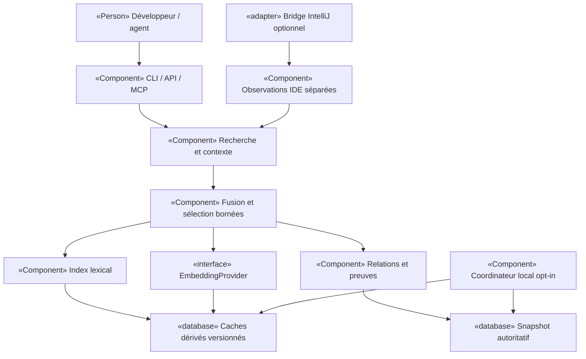

# MINOS — Étude d'évolution inspirée de Semble et Serena

Date : 4 octobre 2026. Statut : **étude proposée, aucune capacité nouvelle implémentée**.
Commanditaire : Fabrice Turleque. Audience : propriétaire, développeurs et Claude chargé de l'implémentation.

## Lecture et livrables

- [Roadmap et tâches exécutables](ROADMAP.md)
- [Protocole d'évaluation et critères de passage](EVALUATION.md)
- [Guide de reprise par Claude](CLAUDE-HANDOFF.md)
- [Sources, révisions et observations](SOURCES.md)
- ADR proposés [0048](../../adr/0048-evaluation-comparative-reproductible.md) à [0054](../../adr/0054-bridge-intellij-symbolique-optionnel.md)

Cette étude complète la roadmap produit et les audits existants ; elle ne clôt aucun constat de l'audit de septembre. L'accord sur la direction ne constitue ni une preuve de performance ni une acceptation automatique de chaque option. Les ADR restent Proposed jusqu'à leur décision documentée.

## 1. Objectifs et qualité — arc42 §1

Renforcer MINOS comme moteur de connaissance persistante, explicable et locale du code. Améliorer d'abord la recherche et le contexte fourni aux agents, puis étudier l'apport de l'IDE pour la résolution symbolique.

Les usages prioritaires sont : retrouver une implémentation à partir d'une question en français ou en anglais ; trouver précisément un symbole ; comprendre les conséquences d'un changement ; obtenir un contexte compact sans perdre les preuves ; savoir si une réponse correspond encore au code courant.

Le succès se juge par la qualité des résultats, le temps jusqu'à la première réponse utile, la fraîcheur, la mémoire totale et la réussite de tâches de développement. Les économies de tokens ne sont ni une promesse de réduction de facturation ni une métrique suffisante.

## 2. Contraintes — arc42 §2

1. MCP en lecture seule (ADR-0017) : aucune indexation, installation, mutation de code ou exécution arbitraire déclenchée par une requête MCP.
2. Snapshots structurés autoritatifs ; recherche vectorielle HEURISTIC et classement dérivé (ADR-0029).
3. Composition dans minos-bootstrap, assemblage dans minos-app (ADR-0042) ; pas de dépendance inverse depuis les adaptateurs vers minos-application.
4. Identités cross-repository exactes (ADR-0019), provenance et limites des providers conservées.
5. MINOS fonctionne sans embeddings ni IDE ; aucune clé cloud obligatoire.
6. Aucun assouplissement de l'ADR-0041 : remote index reste fermé pour le code non fiable. Une recherche de texte ne justifie pas de compiler un dépôt inconnu.
7. Formats existants lisibles ; nouveaux caches jetables et versionnés ; aucun changement V4/ANN implicite. L'ADR-0047 reste son propre chantier.
8. Windows non-admin et Linux à qualifier ; Java 24 pour le cœur, Java 21 pour le plugin selon la ligne actuelle.
9. Aucune donnée de code, requête ou télémétrie envoyée à un service tiers par défaut.
10. La licence propriétaire de MINOS reste inchangée. Aucun code tiers repris dans cette étude.

## 3. Périmètre et comparaison — arc42 §3

| Axe | MINOS observé sur develop | Semble observé | Serena observé | Orientation |
|---|---|---|---|---|
| Recherche hybride | pondération fixe lexical/graphe/vecteur | BM25, Model2Vec, fusion RRF et reclassement | navigation symbolique au premier plan | comparer BM25 et RRF, sans remplacer à l'aveugle |
| Unités de recherche | SYMBOL, FILE, CHUNK issus du snapshot | fragments syntaxiques ; code/docs/config | symboles résolus par LSP/IDE | exploiter d'abord les symboles existants ; fallback explicite |
| Fraîcheur | indexation explicite et états sémantiques | cache réactualisé à la recherche | état du backend de langage/IDE | fraîcheur visible et coordinateur hors MCP |
| Action sur code | MCP read-only | recherche | édition/refactoring | conserver read-only ; interopération externe possible |
| Connaissance | snapshots, architecture, impact, provenance | index de recherche | références et mémoires | préserver la différenciation MINOS |
| IDE | plugin client avec usage PSI local | intégration via client | IDE comme backend | spike de bridge optionnel, pas dépendance générale |
| Mesure | banc de scalabilité et tests existants | benchmark retrieval publié | évaluations de tâches agents | banc commun contrôlé et tâches end-to-end |

Les capacités des concurrents sont celles des sources consultées, pas une qualification réalisée dans cette étude. Les révisions sont figées dans SOURCES.md. Ni « support multi-langages » ni « search architecture » ne prouve une résolution exhaustive des références ou des flux.

## 4. Diagnostic du code MINOS

### 4.1 Ce qui existe déjà

Dans minos-application/com/minos/application/semantic :
- HybridSearchService combine les signaux lexical, graphe et sémantique. Le lexical mesure le recouvrement de termes et un bonus de phrase ; ce n'est pas BM25.
- Avec sémantique, les coefficients sont 0,50 / 0,35 / 0,15 ; sans sémantique, 0,70 / 0,30. Le degré du graphe apporte un signal de classement, pas une preuve de pertinence.
- Le corpus normalisé est déjà mis en cache, avec bornes de nombre et poids. **Ne pas recréer ce cache ni replanifier cette optimisation comme nouveauté.**
- SemanticDocumentFactory produit les trois granularités depuis les symboles et les sources, sous limites. Il peut générer des contenus qui se recouvrent.
- HybridContextBuilder borne les documents et leur contenu avec TokenEstimator, un coût fixe global de 32 tokens, mais n'effectue pas dans ce fichier un comptage exact de toute la réponse JSON sérialisée. C'est une piste de mesure, pas une preuve de dépassement sur tous les clients.
- EmbeddingProvider existe déjà : id, modelId, dimensions, embed et limitations. Le nouveau modèle doit réutiliser ce contrat ou le faire évoluer explicitement.

Le plugin MinosProjectService utilise déjà des éléments PSI pour résoudre le contexte éditeur avant d'interroger MINOS. Dire que MINOS n'utilise « aucun PSI » serait faux ; il n'est cependant pas, dans le code examiné, un backend complet d'analyse IDE pour les agents.

### 4.2 Opportunités à tester

| Opportunité | Hypothèse | Risque et contre-mesure |
|---|---|---|
| BM25 avec segmentation d'identifiants | améliorer les requêtes précises et les termes rares | faux rapprochements ; préserver aussi le token exact |
| RRF et routage déterministe | fusionner des scores hétérogènes sans calibration fragile | régression sur symboles ; exact-match prioritaire testé |
| Déduplication/diversification | fournir plus d'information utile par budget | retirer une preuve nécessaire ; conserver identités et raisons |
| Modèle statique local | réduire le coût d'embedding sur CPU | qualité FR/code ou port Java insuffisants ; parité et holdout |
| Actualisation opt-in hors MCP | réduire les réponses périmées | tempête d'événements, courses ; leases et publication atomique |
| Bridge IntelliJ en lecture seule | mieux résoudre surcharges et dépendances | coupling, fichiers non sauvés, auth ; contrat et origine distincts |

Ces pistes sont des hypothèses. Le niveau de confiance vient de leur correspondance avec le code et les usages, pas d'un benchmark déjà exécuté.

## 5. Stratégie — arc42 §4

Livrer progressivement trois capacités :
1. **Recherche fiable et compacte** : banc commun, unités cohérentes, BM25, classement configurable, contexte dédupliqué.
2. **Exploitation locale prévisible** : provider d'embeddings léger optionnel, fraîcheur observable, synchronisation hors MCP, diagnostics.
3. **Intelligence IDE optionnelle** : spike puis bridge borné si l'amélioration sur tâches symboliques justifie le coût.

Pas de fork de Semble ou Serena proposé. Semble sert de comparateur et de référence algorithmique ; Serena de référence pour les opérations symboliques et l'ergonomie. L'intégration de composants tiers serait une décision de réalisation distincte, avec versions, notices, dépendances et licences vérifiées. L'application Serena actuelle et SolidLSP n'ont pas la même licence.

## 6. Vue des blocs cible — arc42 §5 / C4 Component

Ce schéma représente une cible proposée. Les noms Conceptuels en italique dans le texte ne sont pas des classes existantes. Tous les services sont câblés dans minos-bootstrap ; les surfaces utilisent les contrats métier.

Ports nouveaux seulement si une frontière réelle le nécessite. Une implémentation Java sans runtime tiers peut rester dans le module déjà responsable. Un sidecar ou un adaptateur IntelliJ ne doit pas imposer de référence concrète à minos-application : déplacer le port neutre nécessaire dans minos-engine, conformément aux règles actuelles, et adapter le contrôle des frontières dans la même tâche. Pas de nouveau module « util » transversal.

La source structurée garde son autorité. Un corpus documentaire complémentaire peut être recherché, mais ses résultats ne deviennent pas des symboles ou relations SCIP. Une observation IDE non sauvegardée n'est jamais fusionnée silencieusement avec le snapshot disque.

## 7. Exécution et cohérence — arc42 §6

### Lecture

Résoudre projet et snapshot une fois pour la requête ; vérifier l'identité des caches dérivés ; sélectionner les candidats ; fusionner selon un profil versionné ; dédupliquer ; assembler sous budget ; renvoyer références, nature, fraîcheur et limitations. Si une génération change en cours de lecture, terminer sur la génération épinglée ou signaler explicitement la nécessité de réessayer. Ne jamais mélanger les générations.

### Changement de fichier

Un watcher explicitement lancé hors MCP regroupe les événements, invalide la fraîcheur et demande au lifecycle existant une synchronisation sous lease. Seuls les providers qualifiés incrémentaux utilisent un delta ; les autres conservent une reconstruction complète annoncée. Les suppressions, renommages, changements de branche et événements perdus forcent une réconciliation appropriée. Après crash, réutiliser le mécanisme de reprise existant.

### IDE

Une requête IDE porte identité de projet, fichier, version du document et capability attendue. Si le projet est fermé, en indexation ou si le document diffère du disque, retourner un état explicite. L'absence de bridge conserve le fonctionnement MINOS habituel. Pas de refactoring, shell, évaluation d'expression ni débogage dans le bridge étudié.

## 8. Déploiement — arc42 §7

Socle : MINOS natif avec stockage local ; embeddings désactivés. Options indépendantes : Ollama déjà existant, nouveau provider léger si qualifié, watcher, bridge IntelliJ. Le choix d'une option ne doit pas installer les autres.

Le modèle léger est provisionné lors d'une action utilisateur ou d'installation explicitement autorisée, avec checksum, licence et manifeste. La requête MCP ne télécharge rien. Un sidecar éventuel reste expérimental jusqu'à qualification Windows/Linux, arrêt des descendants, timeouts, quotas et isolation réseau. L'objectif préféré est une distribution autonome ; la présence d'un package Python facile à lancer n'est pas une justification suffisante pour l'imposer.

Docker conserve son contrat actuel ; ne pas y déplacer implicitement l'exécution de providers. L'IDE n'est requis que pour son option dédiée. Le stockage PostgreSQL réutilise les contrats existants.

## 9. Concepts transverses — arc42 §8

- Identité de cache proposée : projet + snapshot + empreinte du contenu + version découpage/tokenisation/classement + digest modèle + dimensions. Adapter selon le cache, sans mélanger clé documentaire stable et identité de génération.
- Source de réponse : snapshot, contenu documentaire ou observation IDE ; champ de nature et provenance obligatoire.
- Rendu compact : citations fichier/lignes/symbole, troncature visible, pas de preuve coupée sans indication.
- Confidentialité : logs de métriques agrégées par défaut ; texte/source/chemins privés absents. Export de traces uniquement explicite, avec rétention.
- Contenus du dépôt et mémoires externes sont des données non fiables, jamais des instructions d'agent prioritaires.
- Configuration : profils versionnés ; valeurs inconnues refusées ; mode existant disponible pour rollback.
- Compatibilité : contrats CLI/API/MCP caractérisés avant changement ; ne pas changer silencieusement la signification de minimumScore après RRF.
- Observabilité : états READY/STALE/MISSING/DISABLED existants réutilisés ; raisons de fallback, couverture, latence par phase et génération consultables sans effet de bord.

## 10. Décisions — arc42 §9

| ADR proposé | Sujet | Point de décision |
|---|---|---|
| 0048 | Évaluation commune avant optimisation | corpus, protocole et seuils figés avant implémentation |
| 0049 | Retrieval hybride explicable | BM25/RRF opt-in puis promotion mesurée |
| 0050 | Unités, contexte et budget | complément documentaire distinct des faits |
| 0051 | Embeddings CPU optionnels | choix natif/sidecar/abandon après spike |
| 0052 | Fraîcheur et synchronisation hors MCP | aucune mutation dans une lecture |
| 0053 | Ergonomie MCP progressive | profils au démarrage, pas de REPL arbitraire |
| 0054 | Bridge IntelliJ optionnel | qualification du spike avant produit |

Aucun ADR Accepted existant n'est remplacé par cette PR documentaire. Toute incompatibilité découverte doit être exposée avant de poursuivre.

## 11. Qualité et risques — arc42 §10–11

Les cibles chiffrées sont **proposées et non mesurées** ; EVALUATION.md précise les populations et conditions.

| Risque | Gravité | Réponse |
|---|---|---|
| Optimiser contre un benchmark favorable | Haute | corpus gelé, holdout séparé, ablations et baselines fortes |
| Snapshot et texte de générations différentes | Haute | identité de révision, lecture épinglée, tests de courses |
| Ressources excessives en Java/Python/IDE | Haute | RSS total, pics, CPU, temps froid ; go/no-go sur poste cible |
| Licence ou modèle mal distribuable | Haute | manifeste et vérification par composant/version avant incorporation |
| Régression API avec nouveau score | Haute | v1 conservée, profil/contrat v2 explicite si nécessaire |
| Watcher contournant sandbox | Critique | chemin d'indexation existant obligatoire, aucune commande projet directe |
| Bridge exposé ou document non sauvegardé confondu | Haute | transport local authentifié, identité et version explicites |
| Roadmap dupliquant l'audit | Moyenne | inventaire U0 et liens de dépendance avant chaque lot |
| Trop d'outils MCP / résultats redondants | Moyenne | profils mesurés, budget complet et règles de choix |
| Biais contre tests ou legacy | Moyenne | pas de pénalité universelle ; corpus métier et requêtes ciblant les tests |

Le problème Windows Java AppContainer et la qualification hors ligne physique mentionnés dans S23-SUIVI restent des prérequis de qualification des parcours concernés. Aucune tâche de cette étude ne doit déclarer ces problèmes résolus sans preuve.

## 12. Glossaire — arc42 §12

- Retrieval : sélection des éléments à fournir à l'agent.
- BM25 : classement lexical fondé sur les fréquences et la longueur documentaire.
- RRF : fusion par rang, indépendante de l'échelle initiale des scores.
- Embedding statique : représentation calculée sans passe de transformer contextuel à chaque texte ; qualité à mesurer selon le modèle.
- Holdout : jeu réservé à la décision finale, non utilisé pour régler les paramètres.
- Freshness : concordance vérifiable entre réponse, index et état des sources.
- Observation IDE : résultat daté/versionné du backend IDE, distinct du snapshot persistant.

## Recommandation de décision

Autoriser en premier U0 puis U1–U3 : mesures, classement et contexte. U4 est une expérimentation de provider, U5–U6 un chantier d'exploitation et d'ergonomie. U7 reste conditionnel et peut se conclure par un no-go documenté. U8 qualifie les seules options retenues. Aucun calendrier de release ni gain commercial n'est promis par l'étude.
