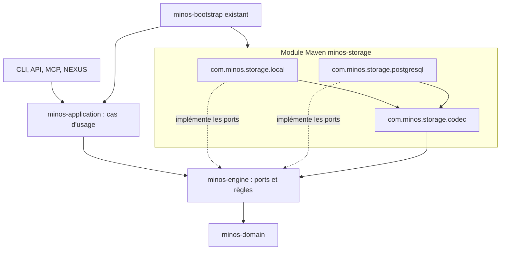

# Backlog — consolidation storage et frontières hexagonales

Date : 2026-10-05. **Décisions acceptées, implémentation non commencée par ce dossier.**

## Commencer maintenant

1. Partir de la tête à jour de `develop`, pas de `main`. Ouvrir une branche d'implémentation distincte.
2. Lire les ADR [0055](../../adr/0055-unifier-les-adaptateurs-de-stockage.md), [0056](../../adr/0056-ports-de-lecture-des-snapshots.md), [0057](../../adr/0057-finaliser-les-frontieres-hexagonales.md), puis [TASKS.md](TASKS.md).
3. Commencer par **SH-01** ; préparer les gardes **SH-11**. Première livraison fonctionnelle : **SH-02 + SH-03** (fusion et codec, en commits séparés, ou deux PR chacune verte).
4. Traiter **SH-04 puis SH-05**, puis les résidus selon leurs dépendances. SH-11 accompagne chaque PR ; ce n'est pas une permission de différer les tests à la fin.
5. Utiliser [START-WITH-CLAUDE.md](START-WITH-CLAUDE.md). Les issues GitHub servent au suivi quotidien ; ce dossier porte le plan versionné. Synchroniser leurs états dans chaque PR.

## Écart entre main et develop : travaux déjà faits

L'analyse de conversation portait sur `main@730b760`. L'inspection de préparation utilise `develop@c9a339088f81b6b31c65c7ad12bc718be2a98a7b`. La PR de promotion #322 est ouverte lors de la préparation : les changements develop ne sont pas supposés intégrés à main.

| Décision ou constat | État sur develop | Suite |
|---|---|---|
| Bootstrap réutilisable | minos-bootstrap existe, ADR 0042/0045 | Conserver et tester, ne pas recréer |
| Application sans dépendance Maven vers adaptateurs | Déjà contrôlé | Protéger contre les régressions |
| Ports de snapshots dans le cœur | Déjà dans minos-engine | SH-04 traite le type concret exposé, pas un déplacement déjà fait |
| Un package par module | ADR 0044 et checker en place | Maintenir pendant la fusion |
| Stockage local/PostgreSQL | Deux modules, codec local utilisé par PostgreSQL | SH-02/03 |
| Workflow d'indexation en CLI | LocalAutonomousIndexOperations existe encore | SH-05 |
| Ollama dans application | Adaptateur et construction encore présents | SH-07 |
| I/O dans engine | Mécanismes concrets, protections existantes | SH-08, relié à A5 |
| Chargement SPI contextuel | Résidu signalé ADR 0042 / ARCHI-SUIVI | SH-10, relié à A8 |

Le chantier ne clôture aucun audit global. Les PR #331/#332 sur les résultats partiels ne doivent pas être écrasées. La PR #333 propose les ADR 0048–0054 : les numéros 0055–0057 sont utilisés ici pour éviter une collision ; leur absence dans develop ne signifie pas qu'ils sont libres. Les améliorations Semble/Serena restent un chantier distinct.

## Backlog ordonné

| ID | Travail | Priorité | Prérequis |
|---|---|---|---|
| SH-01 | Établir la baseline et la cartographie de migration | P1 | — |
| SH-02 | Fusionner les artefacts local et PostgreSQL dans minos-storage | P1 | SH-01 |
| SH-03 | Extraire le codec commun et interdire les dépendances entre backends | P1 | SH-02 |
| SH-04 | Introduire un port de lecture neutre pour SnapshotQueryView | P1 | SH-01 |
| SH-05 | Déplacer le workflow d'indexation de la CLI dans un cas d'usage | P1 | SH-01 |
| SH-06 | Découpler le cycle SCIP de la persistance locale concrète | P2 | SH-03, SH-05 |
| SH-07 | Isoler l'adaptateur Ollama de la configuration applicative | P2 | SH-01 |
| SH-08 | Séparer progressivement politiques et mécanismes I/O du moteur | P2 | SH-01 |
| SH-09 | Clarifier les capacités applicatives et les façades publiques | P2 | SH-04, SH-05 |
| SH-10 | Aligner la découverte SPI dans les hôtes Java embarqués | P2 | SH-02 |
| SH-11 | Renforcer les règles d'architecture et intégrer les nouveaux chemins CI | P1 | SH-01 |
| SH-12 | Qualifier la migration complète et livrer le guide de reprise | P1 | SH-02, SH-03, SH-04, SH-05, SH-06, SH-07, SH-08, SH-09, SH-10, SH-11 |

Chaque tâche possède actions, fichiers, critères et vérifications dans [TASKS.md](TASKS.md). La clôture SH-11 nécessite les contrôles des lots exécutés, même si sa préparation démarre après SH-01. SH-12 ferme le chantier seulement quand les lots ont leurs preuves ; un lot différé reste explicitement ouvert.

## Architecture cible — dépendances de code

Vue partielle volontaire : les autres adaptateurs restent câblés par bootstrap. Les packages racines `com.minos.storage` et `com.minos.store` existants du cœur restent leur propriété. Le diagramme généré actuel dans `docs/architecture/diagrams` n'est pas modifié avant le code : il décrit l'existant, pas cette cible.

## Couverture des modules

| Modules | Action |
|---|---|
| domain | Préserver le modèle ; aucune dépendance technique ajoutée |
| engine | SH-04 lecture, SH-08 I/O, SH-10 chargeur |
| application | SH-05 orchestration, SH-07 adaptateur, SH-09 façades |
| storage-local / storage-postgresql | SH-02/03 consolidation |
| provider-scip | SH-06 ports de staging |
| runtime-local / integration-git | Préserver les frontières et qualifier les consommateurs après déplacements |
| bootstrap | Adapter le câblage existant dans chaque lot, SH-10 SPI |
| cli / api / mcp / nexus | SH-05/09 et tests de compatibilité |
| app | Mise à jour packaging/SPI/JaCoCo et smoke SH-02/12 |
| intellij | Client externe maintenu ; protocole, annulation et tâches de fond protégés |

## Règles de livraison et non-objectifs

- Une PR par lot cohérent, vers develop ; aucune promotion main ou release dans ce chantier documentaire.
- Ne pas changer les formats disque, le schéma PostgreSQL, les IDs backend, la licence, les capacités MCP ou les scores hybrides pour réaliser un déplacement.
- Ne pas régénérer les golden pour rendre un test vert. Chaque incompatibilité doit être expliquée et décidée avant modification du contrat.
- Préserver ADR 0041 (remote non fiable fermé), les primitives I/O durcies, la portée des baux, la récupération après interruption et les résultats partiels.
- Le module storage unique embarque les dépendances PostgreSQL : mesurer taille et SBOM ; serveur PostgreSQL facultatif pour le mode local.
- Pas de microservices, Event Sourcing, broker, nouveau framework ou fragmentation systématique des modules.
- Aucun délai chiffré garanti : SH-01 permet d'estimer les lots sur la tête réellement utilisée.

## Validation et retour arrière

Les commandes de TASKS sont des prescriptions futures, pas des résultats annoncés. Utiliser le wrapper et la toolchain du dépôt (Java 24/Maven 3.9 selon politique courante), puis la matrice Windows/Linux pour les garanties OS. La qualification PostgreSQL s'exécute avec Docker et `-Dminos.postgresql.tests.required=true` ; ne pas assimiler des tests sautés à un succès PostgreSQL.

Après implémentation, consigner dans `VALIDATION.md` : SHA, environnement, commandes, sorties synthétiques, preuves de compatibilité, écarts et rollback. Aucun rapport d'implémentation n'est créé comme réussi à l'avance. Le rollback d'une PR de déplacement doit préserver les données grâce à l'absence de changement de format. Examiner séparément la compatibilité des coordonnées Maven et des records publics.

## Suivi GitHub

Chantier parent : [#334](https://github.com/FTurleque/minos-code-intelligence/issues/334).

| Tâche | Issue | État initial |
|---|---|---|
| SH-01 | [#335](https://github.com/FTurleque/minos-code-intelligence/issues/335) | À faire |
| SH-02 | [#336](https://github.com/FTurleque/minos-code-intelligence/issues/336) | À faire |
| SH-03 | [#337](https://github.com/FTurleque/minos-code-intelligence/issues/337) | À faire |
| SH-04 | [#338](https://github.com/FTurleque/minos-code-intelligence/issues/338) | À faire |
| SH-05 | [#339](https://github.com/FTurleque/minos-code-intelligence/issues/339) | À faire |
| SH-06 | [#340](https://github.com/FTurleque/minos-code-intelligence/issues/340) | À faire |
| SH-07 | [#341](https://github.com/FTurleque/minos-code-intelligence/issues/341) | À faire |
| SH-08 | [#342](https://github.com/FTurleque/minos-code-intelligence/issues/342) | À faire |
| SH-09 | [#343](https://github.com/FTurleque/minos-code-intelligence/issues/343) | À faire |
| SH-10 | [#344](https://github.com/FTurleque/minos-code-intelligence/issues/344) | À faire |
| SH-11 | [#345](https://github.com/FTurleque/minos-code-intelligence/issues/345) | À faire |
| SH-12 | [#346](https://github.com/FTurleque/minos-code-intelligence/issues/346) | À faire |

Les états ci-dessus sont ceux de la création du plan ; consulter les issues pour l'avancement puis synchroniser ce tableau dans les PR d'implémentation.
